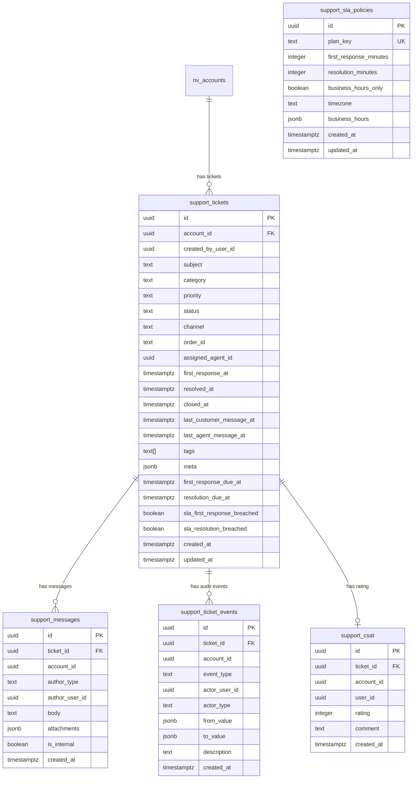

# SUPPORT_TICKETS_SPEC.md — Especificación completa

> **Fecha:** 2026-02-16  
> **Autor:** agente-copilot  
> **Pre-requisito:** [SUPPORT_TICKETS_AUDIT.md](./SUPPORT_TICKETS_AUDIT.md)

---

## 1. Resumen ejecutivo

Sistema de tickets de soporte exclusivo para clientes Growth y Enterprise. Permite a admins de tienda crear tickets con contexto completo, mantener conversaciones con el equipo de soporte NovaVision, y al super admin gestionar un inbox cross-tenant con SLA, asignación y métricas.

**Plan gating:** Starter → upsell. Growth/Enterprise → acceso completo.  
**DB destino:** Admin DB (control plane).  
**Capa de API:** NestJS module `src/support/`.

---

## 2. ERD (Entity Relationship Diagram)



---

## 3. Data Model detallado

### 3.1 `support_tickets`

| Columna | Tipo | Nullable | Default | Descripción |
|---|---|---|---|---|
| `id` | `uuid` PK | NO | `gen_random_uuid()` | |
| `account_id` | `uuid` NOT NULL | NO | | FK a `nv_accounts.id` |
| `created_by_user_id` | `uuid` NOT NULL | NO | | Supabase auth.uid() del creador |
| `subject` | `text` NOT NULL | NO | | Asunto (max 500 chars) |
| `category` | `text` NOT NULL | NO | `'other'` | Enum: billing, tech, onboarding, bugs, feature_request, other |
| `priority` | `text` NOT NULL | NO | `'normal'` | Enum: low, normal, high, urgent |
| `status` | `text` NOT NULL | NO | `'open'` | Enum: open, triaged, in_progress, waiting_customer, resolved, closed |
| `channel` | `text` NOT NULL | NO | `'dashboard'` | Enum: dashboard, email |
| `order_id` | `text` | SÍ | | Referencia a orden (si aplica) |
| `assigned_agent_id` | `uuid` | SÍ | | Super admin asignado |
| `first_response_at` | `timestamptz` | SÍ | | Primer msg de agente |
| `resolved_at` | `timestamptz` | SÍ | | Cambio a resolved |
| `closed_at` | `timestamptz` | SÍ | | Cambio a closed |
| `last_customer_message_at` | `timestamptz` | SÍ | | Último msg del cliente |
| `last_agent_message_at` | `timestamptz` | SÍ | | Último msg del agente |
| `tags` | `text[]` | SÍ | `'{}'` | Etiquetas libres |
| `meta` | `jsonb` | SÍ | `'{}'` | Contexto: browser, url, build_version, etc. |
| `first_response_due_at` | `timestamptz` | SÍ | | SLA deadline primer response |
| `resolution_due_at` | `timestamptz` | SÍ | | SLA deadline resolución |
| `sla_first_response_breached` | `boolean` | NO | `false` | |
| `sla_resolution_breached` | `boolean` | NO | `false` | |
| `created_at` | `timestamptz` | NO | `now()` | |
| `updated_at` | `timestamptz` | NO | `now()` | |

### 3.2 `support_messages`

| Columna | Tipo | Nullable | Default | Descripción |
|---|---|---|---|---|
| `id` | `uuid` PK | NO | `gen_random_uuid()` | |
| `ticket_id` | `uuid` NOT NULL | NO | | FK a `support_tickets.id` |
| `account_id` | `uuid` NOT NULL | NO | | Denormalizado para RLS |
| `author_type` | `text` NOT NULL | NO | | Enum: customer, agent, system |
| `author_user_id` | `uuid` NOT NULL | NO | | |
| `body` | `text` NOT NULL | NO | | Contenido del mensaje |
| `attachments` | `jsonb` | SÍ | `'[]'` | Array de `{ name, url, size, type }` |
| `is_internal` | `boolean` | NO | `false` | Solo visible para agentes |
| `created_at` | `timestamptz` | NO | `now()` | |

### 3.3 `support_ticket_events` (audit trail)

| Columna | Tipo | Nullable | Default | Descripción |
|---|---|---|---|---|
| `id` | `uuid` PK | NO | `gen_random_uuid()` | |
| `ticket_id` | `uuid` NOT NULL | NO | | FK |
| `account_id` | `uuid` NOT NULL | NO | | Denormalizado |
| `event_type` | `text` NOT NULL | NO | | created, status_changed, assigned, priority_changed, tag_added, tag_removed, reopened, closed, message_added, note_added, sla_breached |
| `actor_user_id` | `uuid` | SÍ | | Quién hizo la acción |
| `actor_type` | `text` | SÍ | | customer, agent, system |
| `from_value` | `jsonb` | SÍ | | Valor anterior |
| `to_value` | `jsonb` | SÍ | | Valor nuevo |
| `description` | `text` | SÍ | | Descripción libre |
| `created_at` | `timestamptz` | NO | `now()` | |

### 3.4 `support_csat`

| Columna | Tipo | Nullable | Default |
|---|---|---|---|
| `id` | `uuid` PK | NO | `gen_random_uuid()` |
| `ticket_id` | `uuid` UNIQUE | NO | FK |
| `account_id` | `uuid` | NO | |
| `user_id` | `uuid` | NO | |
| `rating` | `integer` | NO | | CHECK: 1-5 |
| `comment` | `text` | SÍ | |
| `created_at` | `timestamptz` | NO | `now()` |

### 3.5 `support_sla_policies`

| Columna | Tipo | Nullable | Default |
|---|---|---|---|
| `id` | `uuid` PK | NO | `gen_random_uuid()` |
| `plan_key` | `text` UNIQUE | NO | |
| `first_response_minutes` | `integer` | NO | |
| `resolution_minutes` | `integer` | NO | |
| `business_hours_only` | `boolean` | NO | `true` |
| `timezone` | `text` | NO | `'America/Argentina/Buenos_Aires'` |
| `business_hours` | `jsonb` | SÍ | `'{"start":"09:00","end":"18:00","days":[1,2,3,4,5]}'` |
| `created_at` | `timestamptz` | NO | `now()` |
| `updated_at` | `timestamptz` | NO | `now()` |

**Defaults SLA:**
| Plan | First Response | Resolution |
|---|---|---|
| growth | 480 min (8h) | 2880 min (48h) |
| enterprise | 120 min (2h) | 1440 min (24h) |

---

## 4. Índices

```sql
-- Búsqueda por tenant + recientes
CREATE INDEX idx_support_tickets_account_created ON support_tickets(account_id, created_at DESC);
-- Inbox soporte: estado + prioridad + recientes
CREATE INDEX idx_support_tickets_status_priority ON support_tickets(status, priority, updated_at DESC);
-- Filtro por agente asignado
CREATE INDEX idx_support_tickets_agent ON support_tickets(assigned_agent_id) WHERE assigned_agent_id IS NOT NULL;
-- SLA breach pendiente
CREATE INDEX idx_support_tickets_sla ON support_tickets(status, first_response_due_at) WHERE status NOT IN ('resolved','closed');
-- Messages por ticket
CREATE INDEX idx_support_messages_ticket ON support_messages(ticket_id, created_at);
-- Events por ticket
CREATE INDEX idx_support_events_ticket ON support_ticket_events(ticket_id, created_at);
-- CSAT por ticket
CREATE UNIQUE INDEX idx_support_csat_ticket ON support_csat(ticket_id);
```

---

## 5. RLS Policies

> **NOTA:** Backend usa `SUPABASE_ADMIN_SERVICE_ROLE_KEY` (service_role) → bypasea RLS. Las policies son defensa en profundidad.

```sql
-- Policy: service_role bypass (como todas las tablas admin)
CREATE POLICY "server_bypass" ON support_tickets FOR ALL
  USING (auth.role() = 'service_role')
  WITH CHECK (auth.role() = 'service_role');

-- Policy: tenant lee sus tickets
CREATE POLICY "tickets_select_tenant" ON support_tickets FOR SELECT
  USING (account_id = current_nv_account_id());

-- Policy: tenant crea tickets en su cuenta
CREATE POLICY "tickets_insert_tenant" ON support_tickets FOR INSERT
  WITH CHECK (account_id = current_nv_account_id() AND created_by_user_id = auth.uid());

-- Messages: tenant ve solo mensajes no internos de sus tickets
CREATE POLICY "messages_select_tenant" ON support_messages FOR SELECT
  USING (account_id = current_nv_account_id() AND is_internal = false);

-- Messages: tenant puede insertar mensajes de tipo customer
CREATE POLICY "messages_insert_tenant" ON support_messages FOR INSERT
  WITH CHECK (account_id = current_nv_account_id() AND author_type = 'customer' AND author_user_id = auth.uid());

-- Events: tenant puede ver eventos de sus tickets
CREATE POLICY "events_select_tenant" ON support_ticket_events FOR SELECT
  USING (account_id = current_nv_account_id());

-- CSAT: tenant puede insertar/leer su rating
CREATE POLICY "csat_tenant" ON support_csat FOR ALL
  USING (account_id = current_nv_account_id())
  WITH CHECK (account_id = current_nv_account_id() AND user_id = auth.uid());
```

---

## 6. Endpoints API (NestJS)

### 6.1 Tenant endpoints (Growth/Enterprise)

| Method | Path | Guard | Descripción |
|---|---|---|---|
| `GET` | `/support/tickets` | ClientDashboard + PlanFeature + Subscription | Listar tickets del tenant |
| `POST` | `/support/tickets` | ClientDashboard + PlanFeature + Subscription | Crear ticket |
| `GET` | `/support/tickets/:id` | ClientDashboard + PlanFeature | Detalle de ticket |
| `GET` | `/support/tickets/:id/messages` | ClientDashboard + PlanFeature | Mensajes del ticket (sin is_internal) |
| `POST` | `/support/tickets/:id/messages` | ClientDashboard + PlanFeature | Agregar mensaje |
| `POST` | `/support/tickets/:id/close` | ClientDashboard + PlanFeature | Cerrar ticket + CSAT opcional |
| `POST` | `/support/tickets/:id/reopen` | ClientDashboard + PlanFeature | Reabrir ticket |

### 6.2 Super Admin endpoints

| Method | Path | Guard | Descripción |
|---|---|---|---|
| `GET` | `/support/admin/tickets` | SuperAdmin | Listar todos los tickets (filtros) |
| `GET` | `/support/admin/tickets/:id` | SuperAdmin | Detalle completo (con internals) |
| `PATCH` | `/support/admin/tickets/:id` | SuperAdmin | Update status/priority/agent/tags |
| `POST` | `/support/admin/tickets/:id/messages` | SuperAdmin | Responder (puede ser is_internal) |
| `POST` | `/support/admin/tickets/:id/assign` | SuperAdmin | Asignar agente |
| `GET` | `/support/admin/tickets/:id/events` | SuperAdmin | Audit log del ticket |
| `GET` | `/support/admin/metrics` | SuperAdmin | Métricas agregadas |

### 6.3 Payloads

**POST /support/tickets (crear)**
```json
{
  "subject": "No puedo procesar pagos",
  "category": "tech",
  "priority": "high",
  "body": "Descripción detallada del problema...",
  "order_id": "uuid-opcional",
  "attachments": [
    { "name": "screenshot.png", "url": "https://...storage.../support/acct/ticket/file.png", "size": 123456, "type": "image/png" }
  ],
  "meta": {
    "browser": "Chrome 120",
    "url": "https://mitienda.novavision.lat/admin/orders",
    "device": "desktop"
  }
}
```
→ Response: `201 { ticket }` con SLA due dates calculadas.

**POST /support/tickets/:id/messages**
```json
{
  "body": "Adjunto captura del error...",
  "attachments": []
}
```

**POST /support/tickets/:id/close**
```json
{
  "csat_rating": 4,
  "csat_comment": "Resolvieron rápido, gracias"
}
```

**PATCH /support/admin/tickets/:id (super admin)**
```json
{
  "status": "in_progress",
  "priority": "urgent",
  "assigned_agent_id": "uuid-agent",
  "tags": ["payments", "mp-integration"]
}
```

---

## 7. Flujos UX

### 7.1 Tenant Admin (Growth/Enterprise)

```
Sidebar "Soporte" → Lista de tickets
  ├─ Filtros: estado, prioridad, fecha
  ├─ Búsqueda por subject
  └─ CTA: "Crear ticket" → Modal
       ├─ Asunto (input)
       ├─ Categoría (select)
       ├─ Prioridad (select, default: normal)
       ├─ Descripción (textarea rico)
       ├─ Pasos para reproducir (optional textarea)
       ├─ Order ID (optional input)
       ├─ Adjuntos (drag & drop)
       └─ Submit → ticket creado, redirect a detalle

Detalle de ticket:
  ├─ Header: subject, status badge, priority badge, SLA indicator
  ├─ Timeline: mensajes intercalados (customer / agent / system)
  ├─ Input: "Responder" (textarea + adjuntos)
  ├─ Acciones: "Cerrar ticket" → Modal CSAT (rating 1-5 + comment)
  └─ Info lateral: categoría, creado, orden vinculada
```

### 7.2 Tenant Admin (Starter) — Upsell

```
Sidebar "Soporte" → Página estática:
  "El soporte premium está disponible en Growth y Enterprise"
  [Ver planes] → link a billing/upgrade
```

### 7.3 Super Admin — Support Console

```
Dashboard Nav → "Soporte" → Inbox cross-tenant
  ├─ Filtros: status, priority, plan, client, category, agent, SLA breach
  ├─ Columnas: ID, Cliente, Asunto, Prioridad, Estado, Agente, SLA, Última actividad
  ├─ Quick actions: Asignar, Cambiar prioridad
  └─ Click → Detalle completo

Detalle completo:
  ├─ Header: subject, client info banner (name, plan, account_id)
  ├─ Timeline: todos los mensajes (incluyendo is_internal highlight)
  ├─ Input: "Responder al cliente" o "Nota interna" (toggle)
  ├─ Acciones: Asignar, Cambiar status, Cambiar prioridad, Tags
  ├─ Panel lateral: historial de eventos (audit), SLA timers
  └─ CSAT visible si existe

Métricas:
  ├─ Tickets abiertos (total + por prioridad)
  ├─ Backlog (sin asignar)
  ├─ Tiempo promedio a primer respuesta
  ├─ % SLA breach
  └─ CSAT promedio
```

---

## 8. Downgrade behavior

Si un cliente baja de Growth/Enterprise → Starter:
1. **Backend:** `@PlanFeature('support.tickets')` bloquea CREATE/POST.
2. **GET endpoints siguen funcionando** (read-only): el cliente puede ver sus tickets históricos.
3. **Frontend:** Muestra banner "Tu plan actual no incluye soporte. Tus tickets anteriores están disponibles en modo lectura."
4. **No se cierran forzosamente** los tickets abiertos. Se deja un evento automático `system: plan_downgraded` y soporte decide si cerrarlos.

---

## 9. Notificaciones

| Evento | Destinatario | Canal |
|---|---|---|
| Ticket creado | Super admin / soporte | Email + (futuro) Slack |
| Cliente responde en `waiting_customer` | Agente asignado | Email |
| Soporte responde | Cliente (creador) | Email |
| Ticket resolved | Cliente | Email |
| SLA breach inminente (últimos 30 min) | Agente asignado + super admin | Email |
| SLA breached | Super admin | Email |

---

## 10. Estado machine de tickets

```
open ─────────────────────────────────────────────────┐
  │                                                    │
  ├─→ triaged ─→ in_progress ─→ resolved ─→ closed    │
  │       │           │             │          │       │
  │       │           ├─→ waiting_customer ─┘  │       │
  │       │           │         │              │       │
  │       │           │         └──→ in_progress       │
  │       │           │                                │
  │       └───────────┘                                │
  │                                                    │
  └─────── closed (by customer) ◄───── reopen ─────────┘
```

**Transiciones permitidas:**

| Desde | Hacia | Quién |
|---|---|---|
| open | triaged | agent |
| open | in_progress | agent |
| open | closed | customer, agent |
| triaged | in_progress | agent |
| triaged | closed | agent |
| in_progress | waiting_customer | agent |
| in_progress | resolved | agent |
| in_progress | closed | customer, agent |
| waiting_customer | in_progress | agent, system (auto on customer reply) |
| waiting_customer | closed | agent |
| resolved | closed | customer, agent, system (auto after 7 days) |
| resolved | open | customer (reopen) |
| closed | open | customer (reopen) |

---

## 11. Archivos a crear/modificar

### Nuevos (API)
```
src/support/
├── support.module.ts
├── support.controller.ts          (tenant endpoints)
├── support-admin.controller.ts    (super admin endpoints)
├── support.service.ts             (lógica de negocio)
├── support-sla.service.ts         (cálculo SLA)
├── support-notification.service.ts (emails)
├── dto/
│   ├── create-ticket.dto.ts
│   ├── create-message.dto.ts
│   ├── update-ticket.dto.ts
│   ├── close-ticket.dto.ts
│   ├── ticket-filters.dto.ts
│   └── index.ts
├── types/
│   ├── ticket.types.ts
│   └── index.ts
└── __tests__/
    ├── support.service.spec.ts
    └── support-sla.service.spec.ts
```

### Nuevos (Migraciones)
```
migrations/admin/
└── 20260216_support_tickets.sql
```

### Modificar (API)
```
src/plans/featureCatalog.ts        → agregar 'support.tickets'
src/app.module.ts                  → importar SupportModule
```

### Nuevos (Admin Frontend)
```
src/pages/AdminDashboard/SupportConsoleView.jsx    (super admin inbox)
src/pages/Support/
├── SupportPage.jsx                 (tenant: lista de tickets)
├── SupportTicketDetail.jsx         (tenant: detalle + chat)
├── SupportCreateModal.jsx          (tenant: crear ticket)
├── SupportUpsell.jsx               (starter: upsell page)
└── components/
    ├── TicketList.jsx
    ├── TicketStatusBadge.jsx
    ├── TicketPriorityBadge.jsx
    ├── SLAIndicator.jsx
    ├── TicketTimeline.jsx
    ├── MessageComposer.jsx
    ├── CSATModal.jsx
    └── TicketFilters.jsx
```

### Modificar (Admin Frontend)
```
src/App.jsx                        → agregar rutas /support/*
src/pages/AdminDashboard/index.jsx → agregar item "Soporte" en NAV_ITEMS
```

---

*Fin de spec. Proceder a implementación.*
