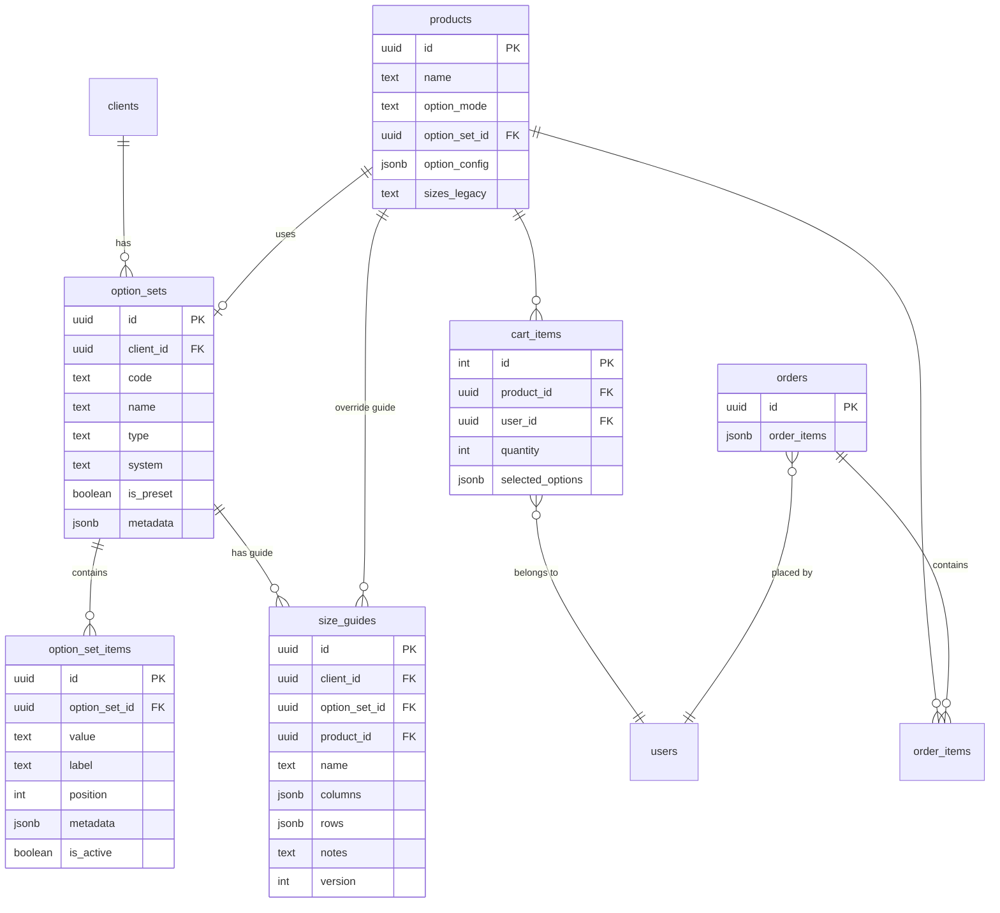

# Rediseño Sistema "Talles y Opciones" — NovaVision (Polirrubro)

> **Versión:** 1.0 — 2026-02-16  
> **Autor:** Copilot Agent (Product Architect + Data Architect)  
> **Rama objetivo:** `feature/automatic-multiclient-onboarding`  
> **Estado:** Propuesta técnica para revisión TL

---

## Índice

1. [FASE 0 — Diagnóstico Actual](#fase-0--diagnóstico-actual)
2. [FASE 1 — Modelo Objetivo](#fase-1--modelo-objetivo)
3. [FASE 2 — Biblioteca de Presets](#fase-2--biblioteca-de-presets)
4. [FASE 3 — Carrito, Checkout y Órdenes (Snapshot Inmutable)](#fase-3--carrito-checkout-y-órdenes)
5. [FASE 4 — UX Admin y Storefront](#fase-4--ux-admin-y-storefront)
6. [FASE 5 — Migración, Backfill, Rollout](#fase-5--migración-backfill-rollout)
7. [FASE 6 — Tests y Definition of Done](#fase-6--tests-y-definition-of-done)
8. [SQL Migraciones](#sql-migraciones)
9. [Plan de PRs](#plan-de-prs)
10. [Edge Cases (25+)](#edge-cases)
11. [Análisis de Impacto en Búsqueda y Filtrado](#análisis-de-impacto-en-búsqueda-y-filtrado-search--filter)

---

## FASE 0 — Diagnóstico Actual

### 0.1 Estado de la Base de Datos

#### Tabla `products` (relevante)
| Columna | Tipo | Uso actual |
|---------|------|------------|
| `sizes` | `text` | CSV libre: `"S, M, L, XL"` |
| `colors` | `text` | CSV libre: `"negro, blanco, rojo"` |
| `material` | `text` | CSV o texto libre |
| `quantity` | `bigint` | Stock **global** del producto (no por variante) |
| `sku` | `text` | SKU único por `(client_id, sku)` |
| `originalPrice` | `numeric` | Precio base |
| `discountedPrice` | `numeric` | Precio con descuento |

**No existen tablas:** `product_variants`, `variant_attributes`, `product_options`, `option_sets`, `size_guides`.

#### Tabla `cart_items`
| Columna | Tipo | Nota |
|---------|------|------|
| `id` | `integer` | Autoincremental |
| `user_id` | `uuid` | FK auth.users |
| `product_id` | `uuid` | FK products |
| `quantity` | `integer` | Cantidad |
| `client_id` | `uuid` | Tenant scope |
| `created_at` | `timestamp` | |

**Faltan:** `variant_id`, `selected_options`, `selected_size`, `selected_color`.

#### Tabla `order_items` (relacional, NO usada como fuente de verdad)
| Columna | Tipo | Nota |
|---------|------|------|
| `id` | `uuid` | PK |
| `order_id` | `uuid` | FK orders |
| `product_id` | `uuid` | FK products (ON DELETE SET NULL) |
| `quantity` | `integer` | |
| `unit_price` | `numeric` | Precio unitario |
| `total_price` | `numeric` | = qty × unit_price |

**Nota crítica:** La tabla `order_items` existe pero la fuente de verdad REAL es el campo JSONB `orders.order_items`.

#### Tabla `orders` (campo `order_items` JSONB)
| Columna | Tipo | Nota |
|---------|------|------|
| `order_items` | `jsonb` | **Fuente de verdad** del snapshot |

Estructura actual del JSONB:
```json
[
  {
    "product_id": "uuid",
    "name": "Nombre del producto",
    "quantity": 2,
    "unit_price": 1500.00,
    "picture_url": "https://..."
  }
]
```

**No hay:** `sku`, `variant_id`, `selected_options`, `color`, `size`.

### 0.2 Estado del Código

#### API (NestJS)

| Archivo | Rol | Estado talles/opciones |
|---------|-----|----------------------|
| `products.service.ts` | CRUD productos | `sizes`/`colors` en `ALLOWED_FIELDS` como texto plano |
| `cart.service.ts` | Gestión carrito | Solo `product_id` + `quantity`, sin opciones |
| `mercadopago.service.ts` | Checkout + pagos | `NormalizedCartItem` solo tiene `product_id/name/qty/price` |
| `orders.service.ts` | Lectura de órdenes | Parsea JSONB sin campos de variante |
| DTO `AddCartItemDto` | Input carrito | Solo `productId`, `quantity`, `expectedPrice` |

#### Admin UI (React/apps/web)

| Componente | Rol | Estado |
|------------|-----|--------|
| `SizesSelect.jsx` | Multi-select de talles | Catálogo fijo: `XS,S,M,L,XL,XXL,34..48` |
| `ColorsSelect.jsx` | Multi-select de colores | 15 colores con hex + dots |
| `catalogOptions.js` | Constantes | `SIZE_OPTIONS` y `COLOR_OPTIONS` hardcodeados |
| `ProductModal` | Formulario producto | Guarda `sizes`/`colors` como CSV |
| `ProductDashboard` | Lista productos | Muestra columnas "Tamaños" y "Colores" |

#### Storefront UI (React/apps/web)

| Componente | Rol | Estado |
|------------|-----|--------|
| `ProductPage` | Detalle producto | Helper `parseSizes(str)`, `parseColors(str)` → UI de botones |
| `ProductPage` | Selección | `selectedColor`, `selectedSize` como estado local |
| `ProductPage` | Agregar | `handleAddToCart({ ...product, color, size, quantity })` |
| `CartProvider` | Contexto carrito | Recibe `product` con `size`/`color` pero los **ignora al enviar al backend** |
| `useCartItems.js` | Hook HTTP | `POST { productId, quantity, expectedPrice }` — **pierde size/color** |
| `CartStep` | Vista carrito checkout | No muestra talle ni color |
| `OrderDetail` | Historial orden | No muestra talle ni color |

### 0.3 Mapa de Flujo de Datos (Diagnóstico)

```
┌─────────────────────────────────────────────────────────────────────┐
│ ADMIN crea producto: sizes="S,M,L", colors="negro,rojo"           │
│   → INSERT products SET sizes='S,M,L', colors='negro,rojo'        │
│   → Stock: quantity=50 (global, no por variante) ✅                │
└───────────────────────────┬─────────────────────────────────────────┘
                            │
┌───────────────────────────▼─────────────────────────────────────────┐
│ STOREFRONT: ProductPage parsea CSV → muestra botones ✅            │
│   Usuario selecciona: size="M", color="negro" ✅                   │
│   handleAddToCart({ ...product, size:"M", color:"negro" }) ✅      │
└───────────────────────────┬─────────────────────────────────────────┘
                            │
                  🔴 PÉRDIDA DE DATOS 🔴
                            │
┌───────────────────────────▼─────────────────────────────────────────┐
│ useCartItems → POST /cart { productId, quantity, expectedPrice }   │
│   → size y color NO se envían                                      │
│   → INSERT cart_items (product_id, quantity) — sin columns para    │
│     size/color/variant                                             │
└───────────────────────────┬─────────────────────────────────────────┘
                            │
┌───────────────────────────▼─────────────────────────────────────────┐
│ CHECKOUT → createPreferenceUnified()                               │
│   NormalizedCartItem = { product_id, name, qty, unit_price }       │
│   → INSERT orders SET order_items = [{product_id,name,qty,price}]  │
│   → SIN size/color/variant en el snapshot                          │
└───────────────────────────┬─────────────────────────────────────────┘
                            │
┌───────────────────────────▼─────────────────────────────────────────┐
│ HISTORIAL: OrderDetail muestra "Producto X - Cant: 1 - $999"      │
│   → Vendedor NO sabe qué talle/color pidió el comprador ❌         │
└─────────────────────────────────────────────────────────────────────┘
```

### 0.4 Riesgos del Estado Actual

| # | Riesgo | Gravedad |
|---|--------|----------|
| R1 | Vendedor no sabe qué talle/color pidió el comprador | **CRÍTICO** |
| R2 | No hay stock por variante (1 producto con 5 talles = 1 stock) | Alto |
| R3 | No se puede tener precio diferente por talle | Alto |
| R4 | Datos históricos sin snapshot de opciones seleccionadas | **CRÍTICO** |
| R5 | Catálogo de talles hardcodeado en constantes JS | Medio |
| R6 | No hay guía de talles / tabla de medidas | Medio |
| R7 | "sizes" es un campo texto — no sirve para búsqueda/filtrado estructurado | Medio |

---

## FASE 1 — Modelo Objetivo

### 1.1 Alternativas Evaluadas

#### Alternativa A: "Flat Attributes" (mínimo cambio)
- Agregar `selected_options JSONB` a `cart_items` y al JSONB de `orders.order_items`.
- No crear tablas de catálogo; mantener CSV en `products.sizes/colors`.
- **Pro:** mínimo esfuerzo. **Contra:** no resuelve polirrubro, no hay reutilización, no hay guía.

#### Alternativa B: "Option Sets Reusables" (RECOMENDADA ✅)
- 3 tablas nuevas: `option_sets`, `option_set_items`, `size_guides`.
- 2 columnas nuevas en `products`: `option_mode`, `option_set_id`.
- 1 columna nueva en `cart_items`: `selected_options JSONB`.
- Ampliar JSONB de `orders.order_items` con campos de snapshot.
- **Pro:** polirrubro real, reutilizable, con guía, mínimo schema. **Contra:** moderado esfuerzo.

#### Alternativa C: "Product Variants Full" (máximo cambio)
- Tabla `product_variants` con `sku`, `price`, `stock` por combinación.
- Tabla `variant_attributes` + `variant_attribute_values`.
- Vista materializada `products_with_variants`.
- **Pro:** manejo real de inventario por variante. **Contra:** alto esfuerzo, cambio grande, no necesario para V1.

### 1.2 Decisión: Alternativa B + preparación para C

Se implementa la **Alternativa B** como base sólida y polirrubro que resuelve el 95% de casos. Se prepara el schema para que en el futuro (cuando un tenant necesite stock por variante) se pueda agregar Alternativa C como "nivel premium" encima de B, sin romper nada.

### 1.3 Conceptos del Modelo

```
option_mode (por producto):
  ├── "none"           → No tiene opciones (ej: un cuadro, un servicio)
  ├── "simple"         → Opciones informativas, sin impacto en stock/precio
  │                      (ej: "Talle: S/M/L" pero 1 stock global)
  └── "variant_linked" → (FUTURO) Cada combinación tiene su stock/precio/SKU
```

```
option_set (reusable por tenant):
  ├── Preset global    → "apparel-alpha", "footwear-eu", "ring-us", etc.
  ├── Custom tenant    → El admin crea su propio set
  └── Legacy           → Migrado de products.sizes existentes
```

### 1.4 Diagrama de Datos (Modelo Objetivo)

```
┌─────────────────────────────────────────────────────────────────────┐
│                        CATÁLOGO (config)                            │
│                                                                     │
│  ┌──────────────────────┐    ┌──────────────────────┐              │
│  │   option_sets         │    │  option_set_items     │              │
│  ├──────────────────────┤    ├──────────────────────┤              │
│  │ id          UUID PK  │    │ id          UUID PK  │              │
│  │ client_id   UUID FK  │◄───│ option_set_id UUID FK│              │
│  │ code        TEXT UQ  │    │ value       TEXT     │              │
│  │ name        TEXT     │    │ label       TEXT     │              │
│  │ type        TEXT     │    │ position    INT     │              │
│  │ system      TEXT     │    │ metadata    JSONB   │              │
│  │ is_preset   BOOL    │    │ is_active   BOOL    │              │
│  │ metadata    JSONB   │    └──────────────────────┘              │
│  │ created_at  TIMESTZ │                                          │
│  └──────────────────────┘                                          │
│                                                                     │
│  ┌──────────────────────┐                                          │
│  │   size_guides         │                                          │
│  ├──────────────────────┤                                          │
│  │ id          UUID PK  │                                          │
│  │ client_id   UUID FK  │                                          │
│  │ option_set_id UUID FK│ (nullable, si aplica a un set)           │
│  │ product_id  UUID FK  │ (nullable, override por producto)        │
│  │ name        TEXT     │                                          │
│  │ columns     JSONB    │ ["Medida","S","M","L","XL"]              │
│  │ rows        JSONB    │ [{"Pecho":"88-92","94-98",...}]          │
│  │ notes       TEXT     │ "Calce regular. Si dudás, elegí..."      │
│  │ version     INT      │                                          │
│  │ created_at  TIMESTZ  │                                          │
│  └──────────────────────┘                                          │
└─────────────────────────────────────────────────────────────────────┘

┌─────────────────────────────────────────────────────────────────────┐
│                     PRODUCTO (uso)                                  │
│                                                                     │
│  products (columnas nuevas):                                        │
│  ┌─────────────────────────┐                                        │
│  │ option_mode  TEXT       │  "none" | "simple" | "variant_linked" │
│  │ option_set_id UUID FK   │  → option_sets.id (nullable)           │
│  │ option_config JSONB     │  Config inline/override (nullable)     │
│  │                         │  {custom_items:[...], color_enabled:t} │
│  └─────────────────────────┘                                        │
│                                                                     │
│  (FUTURO: tabla product_variants con sku/price/stock por combo)     │
└─────────────────────────────────────────────────────────────────────┘

┌─────────────────────────────────────────────────────────────────────┐
│                   CARRITO + ORDEN (persistencia)                    │
│                                                                     │
│  cart_items (columna nueva):                                        │
│  ┌────────────────────────────┐                                     │
│  │ selected_options  JSONB    │ [{"key":"size","label":"Talle",     │
│  │                            │   "value":"42","system":"EU"}]     │
│  └────────────────────────────┘                                     │
│                                                                     │
│  orders.order_items JSONB (items extendidos):                       │
│  ┌────────────────────────────────────┐                              │
│  │ product_id          UUID          │                              │
│  │ name                TEXT          │ (snapshot)                   │
│  │ sku_snapshot         TEXT          │ (nuevo)                     │
│  │ quantity             INT          │                              │
│  │ unit_price           NUMERIC      │                              │
│  │ picture_url          TEXT          │ (existente)                 │
│  │ selected_options     JSON[]       │ (nuevo, snapshot)            │
│  │ option_set_code      TEXT          │ (nuevo, snapshot)            │
│  │ guide_version        INT           │ (nuevo, nullable)           │
│  └────────────────────────────────────┘                              │
└─────────────────────────────────────────────────────────────────────┘
```

### 1.5 Reglas del Modelo

| Regla | Descripción |
|-------|-------------|
| R1 | `option_sets` son tenant-scoped (`client_id NOT NULL`) excepto presets globales (`client_id IS NULL, is_preset = true`) |
| R2 | Un producto puede tener `option_mode = "none"` (sin opciones) |
| R3 | `option_mode = "simple"`: el producto referencia un `option_set_id` o usa `option_config.custom_items[]` inline |
| R4 | El comprador DEBE seleccionar una opción si `option_mode != "none"` |
| R5 | `selected_options` en `cart_items` es obligatorio si el producto tiene `option_mode != "none"` |
| R6 | Al crear una orden, `selected_options` se copia como snapshot inmutable en `orders.order_items[].selected_options` |
| R7 | Si un producto tiene `size_guide`, el storefront muestra el botón "Guía de talles" |
| R8 | Los presets globales se pueden "duplicar" al tenant para personalización |
| R9 | Compatibilidad: productos con `sizes` CSV heredados se leen como `option_mode = "simple"` + set inline |
| R10 | La tabla `order_items` relacional se mantiene por compatibilidad pero la fuente de verdad sigue siendo `orders.order_items` JSONB |

---

## FASE 2 — Biblioteca de Presets

### 2.1 Presets de Indumentaria (Letras)

| # | code | name | type | system | options |
|---|------|------|------|--------|---------|
| 1 | `apparel-alpha-xs-xl` | Ropa XS–XL | apparel | none | `XS, S, M, L, XL` |
| 2 | `apparel-alpha-xxs-6xl` | Ropa XXS–6XL | apparel | none | `XXS, XS, S, M, L, XL, XXL, 3XL, 4XL, 5XL, 6XL` |
| 3 | `apparel-unisex-basic` | Unisex S–XXL | apparel | none | `S, M, L, XL, XXL` |
| 4 | `apparel-kids` | Niños 2–16 | apparel | none | `2, 4, 6, 8, 10, 12, 14, 16` |
| 5 | `apparel-baby-months` | Bebés (meses) | apparel | none | `0-3m, 3-6m, 6-9m, 9-12m, 12-18m, 18-24m` |
| 6 | `apparel-baby-years` | Bebés/Toddler (años) | apparel | none | `1, 2, 3, 4, 5` |

### 2.2 Presets de Indumentaria (Numérico)

| # | code | name | type | system | options |
|---|------|------|------|--------|---------|
| 7 | `apparel-num-eu-34-60` | Ropa EU 34–60 | apparel | EU | `34,36,38,40,42,44,46,48,50,52,54,56,58,60` |
| 8 | `apparel-num-34-48` | Ropa 34–48 | apparel | none | `34,36,38,40,42,44,46,48` |
| 9 | `apparel-num-ar-38-54` | Ropa AR 38–54 | apparel | AR | `38,40,42,44,46,48,50,52,54` |

### 2.3 Presets de Jeans

| # | code | name | type | system | options |
|---|------|------|------|--------|---------|
| 10 | `jeans-waist-us` | Jeans cintura US 28–44 | apparel | US | `28,29,30,31,32,33,34,36,38,40,42,44` |
| 11 | `jeans-waist-x-length` | Jeans cintura × largo | apparel | US | `28x30,28x32,30x30,30x32,30x34,32x30,32x32,32x34,34x30,34x32,34x34,36x32,36x34,38x32,38x34,40x32,40x34` |

### 2.4 Presets de Calzado

| # | code | name | type | system | options |
|---|------|------|------|--------|---------|
| 12 | `footwear-eu-35-48` | Calzado EU 35–48 (entero) | footwear | EU | `35,36,37,38,39,40,41,42,43,44,45,46,47,48` |
| 13 | `footwear-eu-35-48-half` | Calzado EU 35–48 (medios) | footwear | EU | `35,35.5,36,36.5,...,47,47.5,48` |
| 14 | `footwear-us-men` | Calzado US Hombre 7–15 | footwear | US | `7,7.5,8,8.5,9,9.5,10,10.5,11,11.5,12,13,14,15` |
| 15 | `footwear-us-women` | Calzado US Mujer 5–12 | footwear | US | `5,5.5,6,6.5,7,7.5,8,8.5,9,9.5,10,10.5,11,11.5,12` |
| 16 | `footwear-uk` | Calzado UK 3–13 | footwear | UK | `3,3.5,4,4.5,5,5.5,6,6.5,7,7.5,8,8.5,9,9.5,10,10.5,11,12,13` |
| 17 | `footwear-cm-mondo` | Calzado CM (Mondopoint) | footwear | cm | `22,22.5,23,23.5,...,31,31.5,32` |
| 18 | `footwear-kids-eu` | Calzado Niños EU 20–35 | footwear | EU | `20,21,22,23,24,25,26,27,28,29,30,31,32,33,34,35` |

### 2.5 Presets de Accesorios

| # | code | name | type | system | options |
|---|------|------|------|--------|---------|
| 19 | `belt-cm-80-130` | Cinturones 80–130cm | accessory | cm | `80,85,90,95,100,105,110,115,120,125,130` |
| 20 | `cap-cm-52-62` | Gorras 52–62cm | accessory | cm | `52,54,56,58,60,62` |
| 21 | `gloves-letter` | Guantes XS–XL | accessory | none | `XS,S,M,L,XL` |
| 22 | `gloves-numeric` | Guantes 6–11 | accessory | none | `6,6.5,7,7.5,8,8.5,9,9.5,10,10.5,11` |
| 23 | `ring-us` | Anillos US 4–13 | accessory | US | `4,4.5,5,5.5,6,6.5,7,7.5,8,8.5,9,9.5,10,10.5,11,11.5,12,12.5,13` |
| 24 | `ring-eu` | Anillos EU 44–68 | accessory | EU | `44,46,48,50,52,54,56,58,60,62,64,66,68` |
| 25 | `bracelet-cm` | Pulseras 14–22cm | accessory | cm | `14,15,16,17,18,19,20,21,22` |

### 2.6 Presets Polirrubro (Genéricos)

| # | code | name | type | system | options |
|---|------|------|------|--------|---------|
| 26 | `generic-sml` | Chico/Mediano/Grande | generic | none | `Chico,Mediano,Grande` |
| 27 | `generic-sml-xl` | S/M/L/XL | generic | none | `S,M,L,XL` |
| 28 | `capacity-ml` | Capacidad (ml) | generic | ml | `100,150,200,250,300,350,400,500,600,750,1000` |
| 29 | `capacity-l` | Capacidad (litros) | generic | L | `0.5,1,1.5,2,3,5,10,20` |
| 30 | `weight-g` | Peso (gramos) | generic | g | `50,100,150,200,250,300,500,750,1000` |
| 31 | `weight-kg` | Peso (kg) | generic | kg | `0.5,1,2,3,5,10,15,20,25,50` |
| 32 | `storage-gb` | Almacenamiento (GB/TB) | generic | GB | `32,64,128,256,512,1TB,2TB,4TB` |
| 33 | `power-w` | Potencia (W) | generic | W | `5,10,20,40,60,75,100,150,200,300,500,1000` |
| 34 | `dimension-bed` | Dimensiones Colchón | generic | cm | `1 Plaza,1½ Plaza,2 Plazas,Queen,King` |
| 35 | `voltage` | Voltaje | generic | V | `110V,220V,Bivolt` |
| 36 | `length-cm` | Largo (cm) | generic | cm | `30,40,50,60,70,80,90,100,120,150,180,200` |
| 37 | `age-range` | Rango de edad | generic | none | `0-3 años,3-6 años,6-9 años,9-12 años,12+ años,Adulto` |

### 2.7 Presets con Guía de Talles (Ejemplo)

**Preset `apparel-alpha-xs-xl` con guía:**
```json
{
  "columns": ["Medida", "XS", "S", "M", "L", "XL"],
  "rows": [
    { "label": "Pecho (cm)", "values": ["82-86", "86-90", "90-96", "96-102", "102-108"] },
    { "label": "Cintura (cm)", "values": ["66-70", "70-76", "76-82", "82-88", "88-94"] },
    { "label": "Cadera (cm)", "values": ["88-92", "92-96", "96-102", "102-108", "108-114"] },
    { "label": "Largo manga (cm)", "values": ["59", "60", "61", "62.5", "64"] }
  ],
  "notes": "Calce regular. Si estás entre dos talles, recomendamos elegir el más grande."
}
```

**Preset `footwear-eu-35-48` con guía de conversión:**
```json
{
  "columns": ["EU", "US M", "US W", "UK", "cm"],
  "rows": [
    { "label": "35", "values": ["4", "5.5", "2.5", "22"] },
    { "label": "36", "values": ["4.5", "6", "3", "22.5"] },
    { "label": "37", "values": ["5", "6.5", "3.5", "23"] },
    { "label": "38", "values": ["5.5", "7", "4", "23.5"] },
    { "label": "39", "values": ["6", "7.5", "4.5", "24"] },
    { "label": "40", "values": ["7", "8.5", "5.5", "25"] },
    { "label": "41", "values": ["8", "9.5", "6.5", "26"] },
    { "label": "42", "values": ["8.5", "10", "7", "26.5"] },
    { "label": "43", "values": ["9.5", "11", "8", "27.5"] },
    { "label": "44", "values": ["10", "11.5", "8.5", "28"] },
    { "label": "45", "values": ["11", "12.5", "9.5", "29"] }
  ],
  "notes": "Medí tu pie en cm y buscá el valor más cercano en la última columna."
}
```

---

## FASE 3 — Carrito, Checkout y Órdenes

### 3.1 Contrato de Selección: `selected_options`

Estructura estándar (JSONB array), independiente del modo:

```typescript
type SelectedOption = {
  key: string;      // "size" | "color" | "capacity" | "weight" | ...
  label: string;    // "Talle" | "Color" | "Capacidad" | ...
  value: string;    // "42" | "Negro" | "500ml" | ...
  system?: string;  // "EU" | "US" | "cm" | null
};

// Ejemplo completo:
const selected_options: SelectedOption[] = [
  { key: "size", label: "Talle", value: "42", system: "EU" },
  { key: "color", label: "Color", value: "Negro" }
];
```

### 3.2 Payload: Add to Cart (Input)

**DTO extendido:**
```typescript
// POST /cart/items
interface AddCartItemRequest {
  productId: string;          // UUID
  quantity: number;           // >= 1
  expectedPrice: number;      // Para validación server-side
  selectedOptions?: SelectedOption[];  // NUEVO — obligatorio si product.option_mode != "none"
}
```

**Validación backend:**
- Si el producto tiene `option_mode = "simple"`, `selectedOptions` DEBE estar presente.
- Cada `selectedOption.value` debe existir en el `option_set` del producto (o en `option_config.custom_items`).
- Si `option_mode = "none"`, `selectedOptions` se ignora / se guarda como `[]`.
- Unicidad en carrito: `(product_id, selected_options_hash)` — un producto con talle "M" y otro con "L" son ítems distintos.

### 3.3 Payload: Checkout (Request a MercadoPago)

**Extensión de `NormalizedCartItem`:**
```typescript
type NormalizedCartItem = {
  product_id: string | null;
  name: string;
  quantity: number;
  unit_price: number;
  picture_url?: string;
  // --- NUEVOS ---
  sku_snapshot?: string;
  selected_options?: SelectedOption[];
  option_set_code?: string;
  metadata?: Record<string, any>;
};
```

**En la preferencia de MercadoPago**, el `title` del item se enriquece:
```typescript
// Antes: "Zapatilla Running"
// Después: "Zapatilla Running - Talle: 42 EU, Color: Negro"
const title = buildItemTitle(item.name, item.selected_options);
```

### 3.4 Snapshot en `orders.order_items` (Persistencia Inmutable)

```typescript
// Cada item en el array JSONB de orders.order_items:
interface OrderItemSnapshot {
  product_id: string | null;
  name: string;                     // product title snapshot
  sku_snapshot: string | null;      // NUEVO: SKU al momento de compra
  quantity: number;
  unit_price: number;
  picture_url?: string;             // existente
  // --- NUEVOS (snapshot de opciones) ---
  selected_options: SelectedOption[];  // SIEMPRE presente ([] si none)
  option_set_code: string | null;     // código del preset usado (nullable)
  guide_version: number | null;       // versión de la guía al momento (nullable)
}
```

**Regla de inmutabilidad:** Una vez que la orden está creada (status `pending` o `paid`), el campo `order_items` NO se modifica para alterar snapshots. Si hay un error, se crea una nota/comentario, no se edita el snapshot.

### 3.5 Persistencia en `cart_items` (DB)

**Nueva columna:**
```sql
ALTER TABLE cart_items
  ADD COLUMN selected_options JSONB DEFAULT '[]'::jsonb;
```

**Constraint de unicidad lógica:** Un usuario no puede tener dos cart_items con el mismo `(product_id, selected_options)`. Se resuelve en la lógica de negocio (upsert por hash de opciones).

### 3.6 Validaciones de Checkout (Backend)

| # | Validación | Acción |
|---|-----------|--------|
| V1 | Producto existe y está available | Rechazar si no |
| V2 | `option_mode = "simple"` → `selectedOptions` no vacío | Rechazar si faltan |
| V3 | Cada valor en `selectedOptions` es válido (existe en option_set o config) | Rechazar si inválido |
| V4 | Precio actual del producto vs `expectedPrice` | Usar precio de DB como verdad |
| V5 | Stock suficiente (global por ahora) | Rechazar si `quantity > product.quantity` |
| V6 | Generar snapshot completo en `order_items` | Siempre |
| V7 | Si existe `size_guide`, guardar `guide_version` | Para referencia futura |

### 3.7 Cambios Mínimos al Schema de `orders`

**No se agrega columna a `orders`.** El JSONB `order_items` simplemente tendrá items con más campos. Es backward-compatible porque los items existentes sin `selected_options` se leen como `selected_options: []`.

---

## FASE 4 — UX Admin y Storefront

### 4.1 Admin: Option Sets

#### Vista "Talles y Opciones" (nueva sección)

```
┌─────────────────────────────────────────────────┐
│ Talles y Opciones                        [+ Crear] │
│                                                     │
│ 🔍 Buscar...                                       │
│                                                     │
│ ┌────────┬──────────────────┬──────┬──────┬──────┐ │
│ │ Tipo   │ Nombre           │ #Opts│ Guía │      │ │
│ ├────────┼──────────────────┼──────┼──────┼──────┤ │
│ │ 👕     │ Ropa XS–XL       │ 5    │ ✅   │ ⋯    │ │
│ │ 👟     │ Calzado EU 35–48 │ 14   │ ✅   │ ⋯    │ │
│ │ 🎒     │ Custom Mochilas  │ 3    │ ❌   │ ⋯    │ │
│ │ 📦     │ Peso (kg)        │ 10   │ ❌   │ ⋯    │ │
│ └────────┴──────────────────┴──────┴──────┴──────┘ │
│                                                     │
│ Presets disponibles:                                │
│ [+ Agregar "Calzado US Mujer"] [+ Agregar "Anillos"]│
└─────────────────────────────────────────────────────┘
```

**Acciones:** Crear, Duplicar (de preset o existente), Editar, Eliminar (si 0 productos lo usan).

#### Editor de Option Set

```
┌──────────────────────────────────────────────────────────┐
│ Editar: Calzado EU 35–48                                 │
│                                                           │
│ Nombre: [Calzado EU 35–48          ]                      │
│ Tipo:   [Calzado ▼]   Sistema: [EU ▼]                    │
│                                                           │
│ Modo de carga:                                            │
│  ○ Lista (pegar valores)   ● Rango (desde–hasta step)    │
│                                                           │
│ Desde: [35]  Hasta: [48]  Step: [1]                      │
│ [Generar]                                                 │
│                                                           │
│ Opciones:                                                 │
│  35 ✕ │ 36 ✕ │ 37 ✕ │ 38 ✕ │ 39 ✕ │ 40 ✕ │ 41 ✕ │     │
│  42 ✕ │ 43 ✕ │ 44 ✕ │ 45 ✕ │ 46 ✕ │ 47 ✕ │ 48 ✕ │     │
│                                                           │
│ Guía de talles: [Editar guía]                             │
│                                                           │
│               [Cancelar]  [Guardar]                       │
└──────────────────────────────────────────────────────────┘
```

#### En ProductDashboard (editar producto)

```
┌──────────────────────────────────────────────────────┐
│ ⚙️ Opciones del producto                             │
│                                                       │
│ ¿Este producto tiene talles u opciones?               │
│  ○ No tiene    ● Sí, de un preset    ○ Sí, custom    │
│                                                       │
│ Preset: [Calzado EU 35–48 ▼]                         │
│                                                       │
│ Preview: 35│36│37│38│39│40│41│42│43│44│45│46│47│48   │
│                                                       │
│ [Ver guía de talles]                                  │
│                                                       │
│ Colores:                                              │
│ ☑ Habilitar colores   [Configurar colores ▼]          │
└──────────────────────────────────────────────────────┘
```

### 4.2 Storefront: Detalle de Producto

```
┌──────────────────────────────────────────────────────┐
│                    ┌──────────────┐                   │
│    [🖼️ Imagen]     │  ZAPATILLA   │                   │
│                    │  RUNNING PRO │                   │
│                    │              │                   │
│                    │  $89.990     │                   │
│                    │              │                   │
│                    │  Talle:      │                   │
│                    │  ┌──┐┌──┐┌──┐│                   │
│                    │  │38││39││40││  ← botones        │
│                    │  └──┘└──┘└──┘│                   │
│                    │  ┌──┐┌──┐┌──┐│                   │
│                    │  │41││42││43││                   │
│                    │  └──┘└──┘└──┘│                   │
│                    │  📏 Guía de  │                   │
│                    │     talles   │  ← link/modal     │
│                    │              │                   │
│                    │  Color:      │                   │
│                    │  ⚫ 🔵 🔴    │  ← dots           │
│                    │              │                   │
│                    │  Cantidad:   │                   │
│                    │  [- 1 +]     │                   │
│                    │              │                   │
│                    │ [Agregar al  │                   │
│                    │   carrito]   │  ← disabled si    │
│                    │              │    no eligió talle│
│                    └──────────────┘                   │
└──────────────────────────────────────────────────────┘
```

**Modal "Guía de talles":**
```
┌──────────────────────────────────────────────┐
│ 📏 Guía de talles                      [✕]   │
│                                               │
│ ┌───────────┬────┬────┬────┬────┬─────┐      │
│ │ Medida    │ 38 │ 39 │ 40 │ 41 │ 42  │      │
│ ├───────────┼────┼────┼────┼────┼─────┤      │
│ │ Largo(cm) │ 24 │24.5│ 25 │25.5│ 26  │      │
│ │ Ancho(cm) │  9 │ 9.5│ 10 │10.2│10.5 │      │
│ └───────────┴────┴────┴────┴────┴─────┘      │
│                                               │
│ ℹ️ Medí tu pie en cm y buscá el valor más    │
│   cercano. Si dudás, elegí medio número más.  │
└──────────────────────────────────────────────┘
```

### 4.3 Storefront: Carrito y Checkout

```
┌──────────────────────────────────────────────────────┐
│ 🛒 Tu carrito                                        │
│                                                       │
│ ┌────────────────────────────────────────────────┐   │
│ │ 🖼️ Zapatilla Running Pro                       │   │
│ │    Talle: 42 EU · Color: Negro                 │   │ ← NUEVO
│ │    Cant: [- 1 +]              $89.990          │   │
│ │                                     [🗑️]       │   │
│ └────────────────────────────────────────────────┘   │
│                                                       │
│ ┌────────────────────────────────────────────────┐   │
│ │ 🖼️ Remera Básica                               │   │
│ │    Talle: L · Color: Blanco                    │   │ ← NUEVO
│ │    Cant: [- 2 +]              $5.990           │   │
│ └────────────────────────────────────────────────┘   │
└──────────────────────────────────────────────────────┘
```

### 4.4 Storefront: Historial de Órdenes

```
┌──────────────────────────────────────────────────────┐
│ Pedido #A2F8K - 15/02/2026 - Pagado ✅               │
│                                                       │
│ ┌────────────────────────────────────────────────┐   │
│ │ Zapatilla Running Pro                          │   │
│ │ Talle: 42 EU · Color: Negro                    │   │ ← snapshot
│ │ SKU: ZRP-42-BLK                                │   │ ← snapshot
│ │ 1 × $89.990                                    │   │
│ └────────────────────────────────────────────────┘   │
│                                                       │
│ Subtotal: $95.980                                    │
│ Costo de servicio: $2.879                            │
│ Total: $98.859                                       │
└──────────────────────────────────────────────────────┘
```

---

## FASE 5 — Migración, Backfill, Rollout

### 5.1 Secuencia de Migración

```
Paso 1: Crear tablas nuevas (option_sets, option_set_items, size_guides)
Paso 2: Agregar columnas a products (option_mode, option_set_id, option_config)
Paso 3: Agregar columna a cart_items (selected_options)
Paso 4: Seed de presets globales
Paso 5: Backfill productos existentes
Paso 6: Deploy backend con lectura dual
Paso 7: Deploy frontend con nueva UI
Paso 8: Migrar storefront
```

### 5.2 Backfill de Productos Existentes

```sql
-- Productos CON sizes → option_mode = 'simple', option_config inline
UPDATE products
SET
  option_mode = 'simple',
  option_config = jsonb_build_object(
    'source', 'legacy',
    'custom_items', (
      SELECT jsonb_agg(jsonb_build_object(
        'value', trim(val),
        'label', trim(val),
        'position', rn
      ))
      FROM unnest(string_to_array(sizes, ',')) WITH ORDINALITY AS t(val, rn)
    )
  )
WHERE sizes IS NOT NULL AND trim(sizes) != ''
  AND option_mode IS NULL;  -- solo no migrados

-- Productos SIN sizes → option_mode = 'none'
UPDATE products
SET option_mode = 'none'
WHERE (sizes IS NULL OR trim(sizes) = '')
  AND option_mode IS NULL;
```

### 5.3 Lectura Dual (Compatibilidad)

Durante la transición, el backend resuelve opciones así:

```typescript
function resolveProductOptions(product: Product): ResolvedOptions {
  // 1. Modelo nuevo: si tiene option_mode configurado
  if (product.option_mode && product.option_mode !== 'none') {
    if (product.option_set_id) {
      return loadFromOptionSet(product.option_set_id);
    }
    if (product.option_config?.custom_items) {
      return { items: product.option_config.custom_items, source: 'custom' };
    }
  }

  // 2. Legacy: parsear CSV de sizes
  if (product.sizes && product.sizes.trim()) {
    return {
      items: product.sizes.split(',').map((s, i) => ({
        value: s.trim(), label: s.trim(), position: i
      })),
      source: 'legacy'
    };
  }

  // 3. Sin opciones
  return { items: [], source: 'none' };
}
```

### 5.4 Feature Flag

```typescript
// En la config del tenant o como flag global
const FEATURE_FLAGS = {
  'option_sets.enabled': true,      // Habilita la nueva UI admin
  'option_sets.storefront': true,   // Habilita selector nuevo en storefront
  'option_sets.require_selection': true,  // Obliga a elegir opción para checkout
};
```

### 5.5 Rollback Plan

| Paso | Rollback |
|------|----------|
| Tablas nuevas | DROP CASCADE (no afecta nada existente) |
| Columnas products | Ignorar columnas nuevas (lectura legacy sigue funcionando) |
| Columna cart_items | NULL/default `[]` — transparente |
| JSONB order_items | Items sin `selected_options` se leen como `[]` |
| Feature flag | Desactivar → UI y lógica vuelven a legacy |

### 5.6 Observabilidad

```typescript
// Log productos sin config resuelta
logger.warn(`Product ${id} has no option_mode configured`, { clientId, productId: id });

// Métrica de órdenes con snapshot incompleto (debe ser 0 post-deploy)
if (!orderItem.selected_options && product.option_mode !== 'none') {
  metrics.increment('orders.missing_option_snapshot', { clientId });
}
```

---

## FASE 6 — Tests y Definition of Done

### 6.1 Tests Mínimos

#### Unit Tests (API)
| Test | Descripción |
|------|-------------|
| U1 | `resolveProductOptions()` con legacy CSV → devuelve items parsed |
| U2 | `resolveProductOptions()` con `option_set_id` → carga items del set |
| U3 | `resolveProductOptions()` con `option_config.custom_items` → devuelve inline |
| U4 | `resolveProductOptions()` con `option_mode = "none"` → devuelve `[]` |
| U5 | `validateSelectedOptions()` acepta opción válida existente en set |
| U6 | `validateSelectedOptions()` rechaza opción inexistente |
| U7 | `buildItemTitle()` genera "Producto - Talle: 42 EU, Color: Negro" |
| U8 | `buildOrderItemSnapshot()` incluye todos los campos de snapshot |

#### Integration Tests (API + DB)
| Test | Descripción |
|------|-------------|
| I1 | CRUD option_sets: crear, leer, actualizar, eliminar (tenant A) |
| I2 | Aislamiento: tenant A no ve option_sets de tenant B |
| I3 | Presets globales son visibles por todos los tenants |
| I4 | Duplicar preset → crea copia tenant-scoped editable |
| I5 | Agregar item a carrito con `selected_options` → persiste en `cart_items` |
| I6 | Checkout → `order_items` JSONB tiene snapshot completo |
| I7 | Producto con `option_mode = "simple"` sin selección → rechaza en checkout |

#### E2E Tests (Storefront)
| Test | Descripción |
|------|-------------|
| E1 | Producto con opciones → muestra selector → elegir → agregar al carrito |
| E2 | Carrito muestra "Talle: M, Color: Negro" |
| E3 | Checkout completo → orden tiene snapshot |
| E4 | Historial de orden muestra opciones del snapshot (no del producto actual) |
| E5 | Cambiar opciones del producto después → orden histórica sigue mostrando snapshot original |

#### Regression Tests
| Test | Descripción |
|------|-------------|
| R1 | Producto existente (legacy CSV) → sigue mostrando correctamente en storefront |
| R2 | Producto sin talles → no muestra selector, agregar funciona normal |
| R3 | Checkout de producto existente sin migrar → funciona con snapshot mínimo |
| R4 | Admin legacy: formulario con SizesSelect sigue funcionando hasta migración UI |

### 6.2 Definition of Done

- [ ] 0 breaking changes para productos existentes (lectura dual operativa).
- [ ] Polirrubro real: ≥37 presets + custom por lista/rango.
- [ ] Órdenes inmutables: `orders.order_items` JSONB guarda snapshot completo y UI lo usa.
- [ ] Multi-tenant: `client_id NOT NULL` en tablas nuevas + RLS + índices.
- [ ] Datos seleccionados por el comprador visibles en: carrito, checkout, orden admin, orden usuario.
- [ ] Guía de talles funcional (modal con tabla + notas).
- [ ] Feature flags operativos para rollout gradual.
- [ ] Build pipeline verde (lint + typecheck + build).

---

## SQL Migraciones

### Migración 001: Tablas nuevas

```sql
-- ================================================================
-- MIGRACIÓN 001: option_sets + option_set_items + size_guides
-- ================================================================

-- 1. option_sets
CREATE TABLE IF NOT EXISTS option_sets (
  id            UUID PRIMARY KEY DEFAULT gen_random_uuid(),
  client_id     UUID REFERENCES clients(id) ON DELETE CASCADE,
  -- NULL client_id = preset global
  code          TEXT NOT NULL,
  name          TEXT NOT NULL,
  type          TEXT NOT NULL DEFAULT 'generic',
  -- valores: apparel, footwear, accessory, generic
  system        TEXT,
  -- valores: EU, US, UK, cm, ml, L, g, kg, GB, W, V, none/NULL
  is_preset     BOOLEAN NOT NULL DEFAULT false,
  metadata      JSONB DEFAULT '{}'::jsonb,
  -- puede contener: {color_palette: [...], notes: "..."}
  created_at    TIMESTAMPTZ NOT NULL DEFAULT now(),
  updated_at    TIMESTAMPTZ NOT NULL DEFAULT now(),

  CONSTRAINT uq_option_sets_client_code UNIQUE (client_id, code),
  CONSTRAINT ck_option_sets_type CHECK (
    type IN ('apparel','footwear','accessory','generic')
  )
);

CREATE INDEX idx_option_sets_client ON option_sets (client_id);
CREATE INDEX idx_option_sets_preset ON option_sets (is_preset) WHERE is_preset = true;
CREATE INDEX idx_option_sets_type ON option_sets (type);

-- 2. option_set_items
CREATE TABLE IF NOT EXISTS option_set_items (
  id             UUID PRIMARY KEY DEFAULT gen_random_uuid(),
  option_set_id  UUID NOT NULL REFERENCES option_sets(id) ON DELETE CASCADE,
  value          TEXT NOT NULL,
  label          TEXT NOT NULL,
  position       INTEGER NOT NULL DEFAULT 0,
  metadata       JSONB DEFAULT '{}'::jsonb,
  -- puede contener: {hex: "#222", equivalent: {US: "8", UK: "7"}}
  is_active      BOOLEAN NOT NULL DEFAULT true,

  CONSTRAINT uq_option_set_items_value UNIQUE (option_set_id, value)
);

CREATE INDEX idx_option_set_items_set ON option_set_items (option_set_id);
CREATE INDEX idx_option_set_items_pos ON option_set_items (option_set_id, position);

-- 3. size_guides
CREATE TABLE IF NOT EXISTS size_guides (
  id             UUID PRIMARY KEY DEFAULT gen_random_uuid(),
  client_id      UUID REFERENCES clients(id) ON DELETE CASCADE,
  option_set_id  UUID REFERENCES option_sets(id) ON DELETE SET NULL,
  product_id     UUID REFERENCES products(id) ON DELETE CASCADE,
  -- Si option_set_id != NULL → guía asociada al preset
  -- Si product_id != NULL → override por producto
  -- Al menos uno debe ser NOT NULL
  name           TEXT NOT NULL DEFAULT 'Guía de talles',
  columns        JSONB NOT NULL DEFAULT '[]'::jsonb,
  -- ["Medida","XS","S","M","L","XL"]
  rows           JSONB NOT NULL DEFAULT '[]'::jsonb,
  -- [{"label":"Pecho","values":["82","86","90","96","102"]}]
  notes          TEXT,
  version        INTEGER NOT NULL DEFAULT 1,
  created_at     TIMESTAMPTZ NOT NULL DEFAULT now(),
  updated_at     TIMESTAMPTZ NOT NULL DEFAULT now()
);

CREATE INDEX idx_size_guides_client ON size_guides (client_id);
CREATE INDEX idx_size_guides_option_set ON size_guides (option_set_id);
CREATE INDEX idx_size_guides_product ON size_guides (product_id);

-- Trigger updated_at
CREATE TRIGGER set_option_sets_updated_at
  BEFORE UPDATE ON option_sets
  FOR EACH ROW EXECUTE FUNCTION trigger_set_timestamp();

CREATE TRIGGER set_size_guides_updated_at
  BEFORE UPDATE ON size_guides
  FOR EACH ROW EXECUTE FUNCTION trigger_set_timestamp();
```

### Migración 002: Columnas en products y cart_items

```sql
-- ================================================================
-- MIGRACIÓN 002: columnas nuevas en products + cart_items
-- ================================================================

-- En products
ALTER TABLE products
  ADD COLUMN IF NOT EXISTS option_mode TEXT DEFAULT 'none',
  ADD COLUMN IF NOT EXISTS option_set_id UUID REFERENCES option_sets(id) ON DELETE SET NULL,
  ADD COLUMN IF NOT EXISTS option_config JSONB DEFAULT NULL;

ALTER TABLE products
  ADD CONSTRAINT ck_products_option_mode CHECK (
    option_mode IN ('none', 'simple', 'variant_linked')
  );

CREATE INDEX idx_products_option_set ON products (option_set_id) WHERE option_set_id IS NOT NULL;
CREATE INDEX idx_products_option_mode ON products (client_id, option_mode);

-- En cart_items
ALTER TABLE cart_items
  ADD COLUMN IF NOT EXISTS selected_options JSONB DEFAULT '[]'::jsonb;
```

### Migración 003: RLS para tablas nuevas

```sql
-- ================================================================
-- MIGRACIÓN 003: RLS policies
-- ================================================================

-- === option_sets ===
ALTER TABLE option_sets ENABLE ROW LEVEL SECURITY;

-- Server bypass
CREATE POLICY "server_bypass" ON option_sets
  FOR ALL
  USING (auth.role() = 'service_role')
  WITH CHECK (auth.role() = 'service_role');

-- Select: tenant puede ver sus sets + presets globales
CREATE POLICY "option_sets_select_tenant" ON option_sets
  FOR SELECT
  USING (client_id = current_client_id() OR (client_id IS NULL AND is_preset = true));

-- Write: solo admin de su tenant
CREATE POLICY "option_sets_write_admin" ON option_sets
  FOR ALL
  USING (client_id = current_client_id() AND is_admin())
  WITH CHECK (client_id = current_client_id() AND is_admin());

-- === option_set_items ===
ALTER TABLE option_set_items ENABLE ROW LEVEL SECURITY;

CREATE POLICY "server_bypass" ON option_set_items
  FOR ALL
  USING (auth.role() = 'service_role')
  WITH CHECK (auth.role() = 'service_role');

CREATE POLICY "option_set_items_select_tenant" ON option_set_items
  FOR SELECT
  USING (
    EXISTS (
      SELECT 1 FROM option_sets os
      WHERE os.id = option_set_items.option_set_id
        AND (os.client_id = current_client_id() OR (os.client_id IS NULL AND os.is_preset = true))
    )
  );

CREATE POLICY "option_set_items_write_admin" ON option_set_items
  FOR ALL
  USING (
    EXISTS (
      SELECT 1 FROM option_sets os
      WHERE os.id = option_set_items.option_set_id
        AND os.client_id = current_client_id()
        AND is_admin()
    )
  )
  WITH CHECK (
    EXISTS (
      SELECT 1 FROM option_sets os
      WHERE os.id = option_set_items.option_set_id
        AND os.client_id = current_client_id()
        AND is_admin()
    )
  );

-- === size_guides ===
ALTER TABLE size_guides ENABLE ROW LEVEL SECURITY;

CREATE POLICY "server_bypass" ON size_guides
  FOR ALL
  USING (auth.role() = 'service_role')
  WITH CHECK (auth.role() = 'service_role');

CREATE POLICY "size_guides_select_tenant" ON size_guides
  FOR SELECT
  USING (client_id = current_client_id() OR client_id IS NULL);

CREATE POLICY "size_guides_write_admin" ON size_guides
  FOR ALL
  USING (client_id = current_client_id() AND is_admin())
  WITH CHECK (client_id = current_client_id() AND is_admin());
```

---

## Plan de PRs

### Orden recomendado (sin downtime)

| PR | Título | Scope | Depende de | Riesgo |
|----|--------|-------|-----------|--------|
| **PR1** | `feat(api): option_sets schema + migrations` | BE (DB) | — | Bajo (solo CREATE TABLE) |
| **PR2** | `feat(api): option_sets CRUD service + controller` | BE | PR1 | Bajo |
| **PR3** | `feat(api): seed presets globales (37+)` | BE (DB) | PR1 | Bajo |
| **PR4** | `feat(api): products option_mode + lectura dual` | BE | PR1,PR2 | Medio (backfill) |
| **PR5** | `feat(api): cart selected_options + validación` | BE | PR4 | Medio |
| **PR6** | `feat(api): checkout + orders snapshot inmutable` | BE | PR5 | **Alto** (flujo de pago) |
| **PR7** | `feat(admin): option sets manager UI` | FE Admin | PR2 | Bajo |
| **PR8** | `feat(admin): product option_mode selector UI` | FE Admin | PR4,PR7 | Medio |
| **PR9** | `feat(web): storefront option selector + guía` | FE Web | PR4,PR5 | Medio |
| **PR10** | `feat(web): cart + checkout muestra opciones` | FE Web | PR5,PR6 | Medio |
| **PR11** | `feat(web): order history muestra snapshot` | FE Web | PR6 | Bajo |
| **PR12** | `chore: backfill productos existentes` | BE (DB) | PR4 | Medio (idempotente) |
| **PR13** | `test: e2e selección → carrito → orden → historial` | E2E | PR10,PR11 | Bajo |

**Tiempo estimado:** 4–6 sprints (2 semanas c/u).

---

## Edge Cases

| # | Escenario | Comportamiento esperado |
|---|-----------|------------------------|
| 1 | Producto sin opciones → comprador agrega al carrito | `selected_options: []`, funciona normal |
| 2 | Producto con talle requerido → comprador NO selecciona | Botón "Agregar" deshabilitado, tooltip "Seleccioná un talle" |
| 3 | Producto con talle seleccionado → comprador cambia de talle antes de agregar | Se actualiza `selectedSize` en estado local y va al carrito con la nueva selección |
| 4 | Mismo producto, mismo talle → agregar dos veces | Incrementa quantity del cart_item existente (upsert) |
| 5 | Mismo producto, talle diferente → agregar | Crea cart_item nuevo (distinto `selected_options`) |
| 6 | Admin elimina un talle del option_set después de que alguien lo tiene en carrito | Al hacer checkout, validar que la opción sigue existiendo; si no → error claro "El talle 42 ya no está disponible" |
| 7 | Admin elimina un option_set | No se puede si hay productos usándolo (soft check); si se forza, los productos quedan con `option_set_id = NULL` (ON DELETE SET NULL) y se usa `option_config` como fallback |
| 8 | Preset global se actualiza (se agrega talle 49 a calzado EU) | Los tenants que duplicaron el preset no se ven afectados (tienen su copia). Los que usan directo el preset ven el nuevo talle |
| 9 | Producto migrado (legacy CSV) sin `option_set_id` | Lectura dual: se parsea `products.sizes` como fallback → funciona transparente |
| 10 | Orden histórica con `selected_options: [{key:"size", value:"42"}]` y luego se elimina el producto | Orden sigue mostrando "Talle: 42" del snapshot (no depende del producto) |
| 11 | Cart_item con `selected_options` que referencia un producto que cambió de `option_mode = "simple"` a `"none"` | Al hacer checkout: validar coherencia. Si el producto ya no tiene opciones, mostrar warning y pedir que elimine y re-agregue |
| 12 | Admin crea option_set con valores duplicados (ej: "M" dos veces) | UNIQUE constraint `(option_set_id, value)` → error de DB → "Valor duplicado" |
| 13 | Comprador agrega producto con talle "42" y color "Negro" → checkout → webhook | Preferencia de MP muestra "Zapatilla Running - Talle: 42 EU, Color: Negro" |
| 14 | Stockout global → comprador intenta comprar con talle seleccionado | Rechazar: "Sin stock disponible" (independiente del talle, stock es global en V1) |
| 15 | Admin crea custom option_set con modo "rango": desde 100, hasta 500, step 50 | Genera: 100, 150, 200, 250, 300, 350, 400, 450, 500 automáticamente |
| 16 | Admin crea custom option_set con modo "lista": pega "negro,blanco,rojo" | Parsea CSV → 3 items ordenados |
| 17 | Admin duplica preset "Calzado EU 35-48" → lo personaliza quitando talles 47-48 | Crea copia tenant-scoped, editable, sin afectar el preset original |
| 18 | Admin edita un option_set que tiene productos asociados | Permitido: agregar items OK, eliminar items muestra warning "X productos usan este talle" |
| 19 | Tenant A intenta acceder a option_set de Tenant B | RLS bloquea: invisble |
| 20 | Guía de talles asociada a un preset → admin edita notas | Se incrementa `version` → futuras órdenes guardan `guide_version` actualizado |
| 21 | Producto con guía por producto (override) + guía por preset | Se muestra la guía del producto (más específica) |
| 22 | Checkout con múltiples items: algunos con opciones, otros sin | Cada item tiene su `selected_options` independiente; los sin opciones tienen `[]` |
| 23 | Admin intenta eliminar option_set que tiene 0 productos pero 1 guía asociada | Permitido: la guía se elimina en cascada (ON DELETE CASCADE del FK) |
| 24 | Mi producto tiene colores como "opciones" (no como talle) | Funciona: se crea option_set tipo "generic" con colores, o se usa campo `colors` legacy + la nueva `selected_options` |
| 25 | Producto tiene tanto opciones (talle) como colores habilitados | `selected_options` puede tener múltiples entries: `[{key:"size",...}, {key:"color",...}]` — la UI muestra ambos selectores |
| 26 | Comprador en mobile con 50 talles (calzado con medios) | UI con scroll horizontal o wrap; botones compactos; UX mobile-first con chips/pills |
| 27 | Orden de 2023 (antes del feature) se consulta en historial | `selected_options` es `undefined`/`null` → UI muestra "—" o no muestra sección de opciones |
| 28 | Super admin accede a option_sets de cualquier tenant | RLS `server_bypass` + validación de rol en controller |

---

## Diagrama Mermaid — Modelo de Datos



---

## Análisis de Impacto en Búsqueda y Filtrado (Search & Filter)

> **Fecha:** 2026-02-16  
> **Contexto:** Evaluación de cómo el rediseño de Option Sets impacta el sistema de búsqueda y filtrado de productos en API, Storefront y Admin.

---

### Estado Actual del Sistema de Búsqueda/Filtrado

#### API — Endpoints y Flujo

| Endpoint | Propósito | Filtros que acepta |
|----------|-----------|-------------------|
| `GET /products` | Listado paginado simple | `page`, `limit`, `includeUnavailable` |
| `GET /products/search` | Búsqueda con filtros | `q`, `sort`, `priceMin`, `priceMax`, `categoryIds`, `page`, `pageSize` |

**DTO `SearchProductsDto`** (actual):
```typescript
class SearchProductsDto {
  clientId?: string;
  q?: string;                    // texto de búsqueda
  sort?: 'relevance' | 'price_asc' | 'price_desc' | 'best_selling';
  priceMin?: number;
  priceMax?: number;
  page?: number;                 // default 1
  pageSize?: number;             // default 24
  // ❌ NO tiene: sizes, colors, materials, onSale, optionValues
}
```

**Dos caminos de búsqueda en el backend:**

| Camino | Condición | Método | Busca en columnas |
|--------|-----------|--------|-------------------|
| A — Con categorías | `categoryIds.length > 0` | `searchProducts()` (inline query) | `name`, `description`, `tags` vía `ilike` |
| B — Sin categorías | `categoryIds.length === 0` | `searchProductsRpc()` → RPC `search_products` | Depende del RPC en Supabase (no visible en repo) |

**🚨 BUG ACTUAL CRÍTICO:** El frontend envía `colors`, `sizes` y `onSale` como query params, pero el backend los **ignora completamente**:

```
Frontend envía:  GET /products/search?q=remera&colors=rojo,azul&sizes=M,L&onSale=1
Backend procesa: q=remera (ignora colors, sizes, onSale)
```

- `SearchProductsDto` no tiene campos para `colors`, `sizes`, `onSale`
- `searchProducts()` no tiene cláusulas WHERE para estos campos
- `searchProductsRpc()` no pasa estos params al RPC
- Los resultados NO están filtrados por talle/color — el usuario ve todos los productos

---

#### Storefront — UI de Filtros

**`SearchPage/FilterSidebar.jsx`** muestra 5 secciones de filtros:

| Filtro | UI | Fuente de opciones | Estado actual |
|--------|----|--------------------|---------------|
| Categorías | Checkboxes | API `GET /categories` | ✅ Funciona — se envía como `categoryIds` |
| Precio (min/max) | Inputs numéricos | — | ✅ Funciona — se envía como `priceMin`/`priceMax` |
| Colores | Botones de color con hex | Dinámico: extrae de `products[].colors` (CSV) | ⚠️ Se envía pero backend ignora |
| Talles | Botones | Dinámico: extrae de `products[].sizes` (CSV) + fallback `["XS","S","M","L","XL","XXL"]` | ⚠️ Se envía pero backend ignora |
| Solo ofertas | Checkbox | — | ⚠️ Se envía como `onSale=1` pero backend ignora |

**Las opciones de filtro se calculan en el frontend** desde los productos de la página actual:
```jsx
const productColors = React.useMemo(() => {
  return Array.from(new Set(
    products.flatMap(p => typeof p.colors === "string"
      ? p.colors.split(",") : Array.isArray(p.colors) ? p.colors : [])
    .map(c => c.trim()).filter(Boolean)
  ));
}, [products]);
```

**Problemas derivados:**
1. Las opciones de filtro cambian al paginar (se recalculan por página)
2. Al seleccionar un color, como el backend no filtra, la UI muestra los mismos resultados
3. Fallback de talles hardcodeado: `["XS","S","M","L","XL","XXL"]` — no es polirrubro

**URL con filtros:**
```
/search?q=remera&categories=ropa&min=1000&max=5000&colors=rojo,azul&sizes=M,L&sale=1&sort=price_asc&page=2
```

---

#### Template "Fourth" — Sistema Alternativo (client-side)

`templates/fourth/components/FiltersPanel.jsx` implementa filtrado **en memoria** (no llama al API):
- Filtra por `product.colors`, `product.sizes`, `product.material`
- Las opciones se extraen dinámicamente con `extractFilterOptions(products)`
- Este sistema funciona porque filtra sobre TODOS los productos precargados

---

#### Admin — ProductDashboard

Solo tiene búsqueda por texto libre. No tiene filtros de talle/color/categoría. No impactará directamente.

---

### Impacto del Rediseño en el Sistema de Búsqueda/Filtrado

Con el modelo de **Option Sets** propuesto (tablas `option_sets` + `option_set_items`), el filtrado cambia fundamentalmente:

| Aspecto | Antes (CSV en `products`) | Después (Option Sets) |
|---------|---------------------------|----------------------|
| Datos de talle | `products.sizes = "S,M,L"` | `products.option_set_id → option_set_items[]` |
| Datos de color | `products.colors = "rojo,azul"` | `products.option_config.color_items[]` (JSONB) |
| Filtrado DB | No implementado (`ilike` solo en name/desc/tags) | Requiere JOIN a `option_set_items` o query JSONB |
| Opciones de filtro UI | Extraídas de CSV por página | Deben obtenerse de todos los `option_set_items` del tenant |
| Universalidad | Solo ropa (XS-XXL + colores) | Polirrubro (calzado, electro, gastro, etc.) |

---

### Cambios Necesarios por Capa

#### 1. API — Backend (Prioridad Alta)

##### 1.1 Nuevo DTO: Agregar campos de filtrado

```typescript
// search-products.dto.ts — PROPUESTA
class SearchProductsDto {
  // ... campos existentes ...

  @IsOptional()
  optionValues?: string;       // comma-separated: "M,L,42,43"
  // Filtra productos cuyo option_set contenga AL MENOS uno de estos items

  @IsOptional()
  optionSetId?: string;        // UUID de un option_set específico
  // Filtra productos vinculados a este set (ej: "Talles Calzado Adulto")

  @IsOptional()
  @Transform(({ value }) => value === '1' || value === 'true')
  onSale?: boolean;            // Filtrar solo productos en oferta
}
```

##### 1.2 Nuevo método: `searchProductsWithOptions()`

```typescript
// products.service.ts — PROPUESTA
async searchProductsWithOptions(params: {
  clientId: string;
  q?: string;
  sort?: string;
  priceMin?: number;
  priceMax?: number;
  categoryIds?: string[];
  optionValues?: string[];     // ["M", "L", "42"]
  optionSetId?: string;        // UUID
  onSale?: boolean;
  limit: number;
  offset: number;
  onlyAvailable: boolean;
}): Promise<{ products: any[]; totalItems: number; availableFilters: AvailableFilters }> {

  let queryBuilder = client
    .from('products')
    .select('*, option_sets!inner(id, name, option_set_items(label, value))', { count: 'exact' })
    .eq('client_id', clientId);

  // Filtro por option_values: productos cuyo option_set tenga items que coincidan
  if (optionValues?.length) {
    // Opción A: JOIN directo
    queryBuilder = queryBuilder
      .in('option_sets.option_set_items.value', optionValues);

    // Opción B: RPC con unnest + intersect (más eficiente para multi-valor)
    // Ver sección RPC más abajo
  }

  // Filtro onSale
  if (onSale) {
    queryBuilder = queryBuilder
      .gt('discountedPrice', 0)
      .not('discountedPrice', 'is', null);
  }

  // ... otros filtros existentes (text, price, categories) ...
}
```

##### 1.3 Nueva RPC: `search_products_v2` (recomendado)

```sql
-- Supabase RPC — PROPUESTA
CREATE OR REPLACE FUNCTION search_products_v2(
  p_client_id    uuid,
  p_query        text        DEFAULT NULL,
  p_sort         text        DEFAULT 'relevance',
  p_price_min    numeric     DEFAULT NULL,
  p_price_max    numeric     DEFAULT NULL,
  p_category_ids uuid[]      DEFAULT NULL,
  p_option_values text[]     DEFAULT NULL,    -- NUEVO: ["M", "L", "42"]
  p_option_set_id uuid       DEFAULT NULL,    -- NUEVO: filtrar por set específico
  p_on_sale      boolean     DEFAULT FALSE,   -- NUEVO
  p_limit        int         DEFAULT 24,
  p_offset       int         DEFAULT 0,
  p_only_available boolean   DEFAULT TRUE
)
RETURNS TABLE (
  id uuid,
  total_count bigint
)
LANGUAGE plpgsql AS $$
BEGIN
  RETURN QUERY
  SELECT DISTINCT p.id, count(*) OVER() AS total_count
  FROM products p
  LEFT JOIN option_sets os ON os.id = p.option_set_id
  LEFT JOIN option_set_items osi ON osi.option_set_id = os.id
  WHERE p.client_id = p_client_id
    AND (NOT p_only_available OR p.available = true)
    AND (p_query IS NULL OR (
      p.name ILIKE '%' || p_query || '%' OR
      p.description ILIKE '%' || p_query || '%' OR
      p.tags ILIKE '%' || p_query || '%'
    ))
    AND (p_price_min IS NULL OR p."originalPrice" >= p_price_min)
    AND (p_price_max IS NULL OR p."originalPrice" <= p_price_max)
    AND (p_category_ids IS NULL OR p.id IN (
      SELECT pc.product_id FROM product_categories pc
      WHERE pc.category_id = ANY(p_category_ids)
    ))
    -- Filtro por option values
    AND (p_option_values IS NULL OR osi.value = ANY(p_option_values))
    -- Filtro por option_set_id específico
    AND (p_option_set_id IS NULL OR p.option_set_id = p_option_set_id)
    -- Filtro onSale
    AND (NOT p_on_sale OR (p."discountedPrice" IS NOT NULL AND p."discountedPrice" > 0))
  ORDER BY
    CASE WHEN p_sort = 'price_asc' THEN p."originalPrice" END ASC,
    CASE WHEN p_sort = 'price_desc' THEN p."originalPrice" END DESC,
    CASE WHEN p_sort = 'relevance' THEN
      CASE WHEN p.featured THEN 0 ELSE 1 END
    END ASC,
    p.created_at DESC
  LIMIT p_limit OFFSET p_offset;
END;
$$;
```

##### 1.4 Nuevo endpoint: Obtener filtros disponibles (aggregation)

```typescript
// products.controller.ts — PROPUESTA
@Get('search/filters')
async getAvailableFilters(@Req() req: Request, @Res() res: Response) {
  const clientId = getClientId(req);
  // Retorna opciones de filtro disponibles para el tenant
  // Esto resuelve el problema de calcular opciones dinámicamente por página

  const filters = await this.productsService.getAvailableFilters(clientId);
  return res.json(filters);
}
```

```typescript
// products.service.ts — PROPUESTA
async getAvailableFilters(clientId: string): Promise<AvailableFilters> {
  // 1. Obtener todos los option_sets que tienen productos asignados
  const { data: sets } = await this.supabase
    .from('option_sets')
    .select('id, name, category, option_set_items(label, value, hex)')
    .eq('client_id', clientId)
    .order('name');

  // 2. Contar productos por option_set para saber cuáles son relevantes
  const { data: counts } = await this.supabase
    .from('products')
    .select('option_set_id, id.count()')
    .eq('client_id', clientId)
    .eq('available', true)
    .not('option_set_id', 'is', null)
    .group('option_set_id');  // Nota: group no existe en PostgREST,
                               // usar RPC para esta agregación

  return {
    optionSets: sets,
    productCountBySet: counts,
    // Para filtro rápido de colores (cross-set):
    allColors: extractUniqueColors(sets),
    allSizes: extractUniqueSizes(sets),
  };
}
```

**Tipo de respuesta:**
```typescript
interface AvailableFilters {
  optionSets: Array<{
    id: string;
    name: string;           // "Talles Ropa Adulto", "Talles Calzado Niño"
    category: string;       // "ropa", "calzado", "gastronomia"
    items: Array<{ label: string; value: string; hex?: string }>;
    productCount: number;   // cuántos productos usan este set
  }>;
  allColors: Array<{ label: string; value: string; hex: string }>;
  priceRange: { min: number; max: number };
}
```

##### 1.5 Índices necesarios

```sql
-- Índice para filtrado por option_set_id en productos
CREATE INDEX idx_products_option_set ON products (client_id, option_set_id)
  WHERE option_set_id IS NOT NULL;

-- Índice para búsqueda de items dentro de un set
CREATE INDEX idx_osi_value ON option_set_items (option_set_id, value);

-- Índice para buscar sets por tenant
CREATE INDEX idx_os_client ON option_sets (client_id);
```

---

#### 2. Storefront — Frontend (Prioridad Alta)

##### 2.1 Cambios en `SearchPage/FilterSidebar.jsx`

**Problema actual:** Las opciones de filtro se calculan de los productos de la página actual (CSV parsing). Con Option Sets, esto cambia a un fetch dedicado.

**Propuesta:**

```jsx
// SearchPage/index.jsx — PROPUESTA
// Nuevo: cargar filtros disponibles UNA vez (no por página)
useEffect(() => {
  async function loadFilters() {
    const { data } = await axios.get("/products/search/filters");
    setAvailableFilters(data);
  }
  loadFilters();
}, []);

// Pasar a FilterSidebar como props
<FilterSidebar
  categories={categories}
  availableFilters={availableFilters}  // NUEVO: option sets del tenant
  filters={filters}
  onFilterChange={handleFilterChange}
/>
```

```jsx
// SearchPage/FilterSidebar.jsx — PROPUESTA
// Reemplazar secciones hardcodeadas de "Colores" y "Talles" por secciones
// dinámicas basadas en option_sets

// ANTES:
// <SidebarSection title="Talles"> → botones XS,S,M,L,XL,XXL
// <SidebarSection title="Colores"> → botones con hex

// DESPUÉS:
{availableFilters?.optionSets?.map(set => (
  <SidebarSection key={set.id}>
    <SidebarCollapseHeader>
      <span>{set.name}</span>  {/* "Talles Ropa", "Talles Calzado", "Colores" */}
    </SidebarCollapseHeader>
    <div style={{ display: "flex", flexWrap: "wrap", gap: "0.4rem" }}>
      {set.items.map(item => (
        <FilterBtn
          key={item.value}
          $active={filters.optionValues?.includes(item.value)}
          onClick={() => handleOptionValue(item.value)}
          style={item.hex ? { background: item.hex } : undefined}
        >
          {item.label}
        </FilterBtn>
      ))}
    </div>
  </SidebarSection>
))}
```

##### 2.2 Cambios en la llamada a la API

```jsx
// SearchPage/index.jsx — fetchProducts
const params = {
  q: filters.query,
  categoryIds: categoryIds.join(","),
  priceMin: filters.price.min,
  priceMax: filters.price.max,
  optionValues: filters.optionValues?.join(","),  // NUEVO: reemplaza colors+sizes
  onSale: filters.onSale ? 1 : 0,                // AHORA sí funciona en backend
  sort: sortBy,
  page: currentPage,
  pageSize: PRODUCTS_PER_PAGE,
};
const { data } = await axios.get("/products/search", { params });
```

##### 2.3 Cambios en URL query params

```
// ANTES:
/search?colors=rojo,azul&sizes=M,L

// DESPUÉS (opción A — valores planos):
/search?options=M,L,42,rojo,azul

// DESPUÉS (opción B — agrupados por set, más semántico):
/search?options=talle:M,L&options=color:rojo,azul

// Recomendación: Opción A por simplicidad. La desambiguación la resuelve
// el backend al buscar en option_set_items.value
```

##### 2.4 Template "Fourth" — Adaptación

`FiltersPanel.jsx` necesita actualizar `extractFilterOptions()`:

```jsx
// ANTES: extrae de product.colors (CSV string)
// DESPUÉS: extrae de product.option_set.option_set_items[]

function extractFilterOptions(products) {
  const optionValues = new Set();
  products.forEach(p => {
    if (p.option_set?.option_set_items) {
      p.option_set.option_set_items.forEach(item => {
        optionValues.add(item.value);
      });
    }
  });
  return { optionValues: [...optionValues] };
}
```

---

#### 3. Admin — Cambios Menores

| Componente | Cambio | Prioridad |
|-----------|--------|-----------|
| `ProductDashboard` | Sin cambios — solo busca por texto | Ninguna |
| `ProductModal` | Ya cubierto en FASE 4 (cambiar selects CSV por option_set picker) | Alta (otro PR) |
| `catalogOptions.js` | Deprecar `SIZE_OPTIONS`/`COLOR_OPTIONS` para filtrado; mantener solo como fallback migration | Baja |

---

### Plan de PRs para Search/Filter

| # | PR | Scope | Depende de |
|---|-----|-------|-----------|
| S1 | `feat(api): agregar filtros optionValues/onSale a SearchProductsDto` | API: DTO + controller | PR 1 (tablas option_sets) |
| S2 | `feat(api): implementar search_products_v2 RPC con soporte option values` | DB RPC + service | S1 |
| S3 | `feat(api): endpoint GET /products/search/filters para opciones disponibles` | API: nuevo endpoint | PR 1 |
| S4 | `feat(web): refactor FilterSidebar a option sets dinámicos` | Storefront UI | S2, S3 |
| S5 | `fix(api): implementar filtro onSale en backend (bug actual)` | API: fix bug existente | Puede ir antes, es independiente |

**Estos PRs se integran DESPUÉS de PR 1 (tablas) y PR 3 (migraciones) del plan original.**

---

### Resumen de Impacto

```
┌─────────────────────────────────────────────────────────────────────────┐
│ IMPACTO DEL REDISEÑO EN SEARCH/FILTER                                   │
├──────────┬──────────────────────────────────────────────────────────────┤
│ Capa     │ Cambios                                                      │
├──────────┼──────────────────────────────────────────────────────────────┤
│ DB       │ + RPC search_products_v2 con p_option_values/p_on_sale      │
│          │ + 3 índices nuevos (option_set, osi_value, os_client)       │
├──────────┼──────────────────────────────────────────────────────────────┤
│ API DTO  │ + campos optionValues, optionSetId, onSale en SearchDto     │
├──────────┼──────────────────────────────────────────────────────────────┤
│ API Svc  │ + searchProductsWithOptions() o adaptar searchProductsRpc() │
│          │ + getAvailableFilters() para endpoint de filtros            │
├──────────┼──────────────────────────────────────────────────────────────┤
│ API Ctrl │ + GET /products/search/filters (nuevo)                      │
│          │ + wiring de nuevos params en searchProducts()               │
├──────────┼──────────────────────────────────────────────────────────────┤
│ Web UI   │ FilterSidebar: de botones hardcoded a option sets dinámicos │
│          │ SearchPage: fetch de availableFilters + param optionValues  │
│          │ URL params: colors+sizes → options (unificado)             │
│          │ Template Fourth: adaptar extractFilterOptions()             │
├──────────┼──────────────────────────────────────────────────────────────┤
│ Admin    │ Sin impacto directo (búsqueda solo por texto)              │
├──────────┼──────────────────────────────────────────────────────────────┤
│ Bug fix  │ Resolver filtros colors/sizes/onSale que hoy se ignoran    │
│          │ (se resuelve como parte de este rediseño)                   │
└──────────┴──────────────────────────────────────────────────────────────┘
```

### Riesgo: Retrocompatibilidad de la URL

Los users actuales pueden tener bookmarks/links con `?colors=rojo&sizes=M`. **Estrategia:**
1. En `parseParams()` de `SearchPage`, agregar **fallback**: si hay `colors`/`sizes` legacy en la URL, convertirlos a `optionValues` internamente
2. Deprecar los params `colors`/`sizes` en el backend pero NO romperlos (ignorarlos como hoy, o redirigir a optionValues)
3. Transición gradual: mantener ambos params por 2 releases

---

*Documento generado como parte de FASE 0–6 del rediseño de talles y opciones.*  
*Pendiente: aprobación del TL para comenzar implementación por PRs.*
