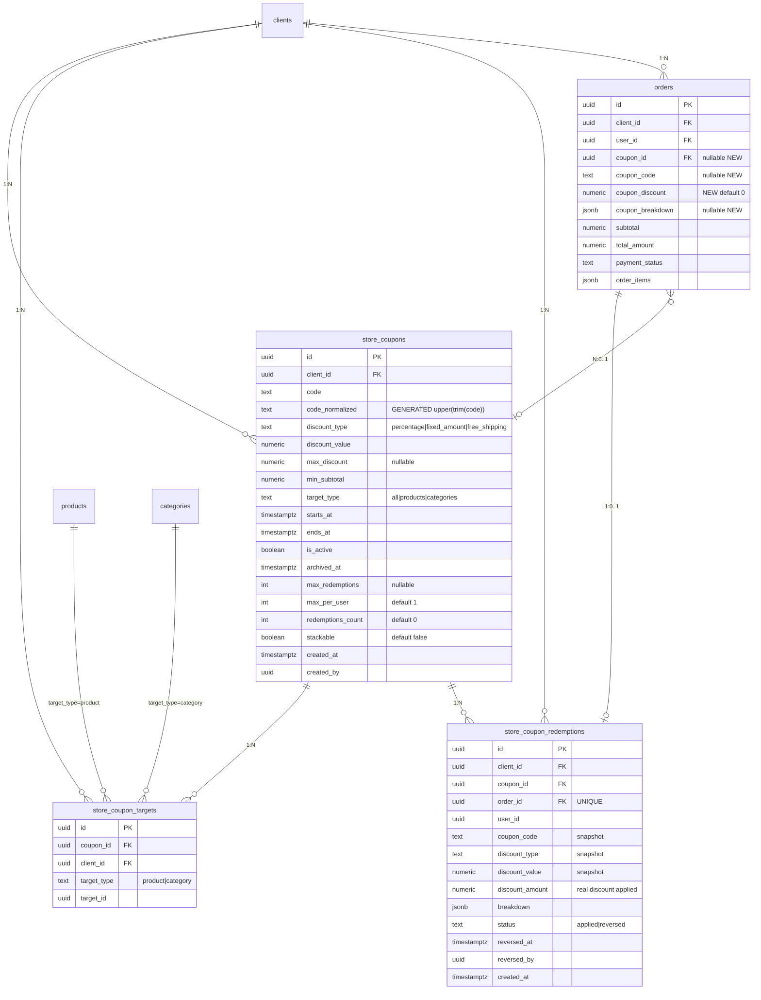
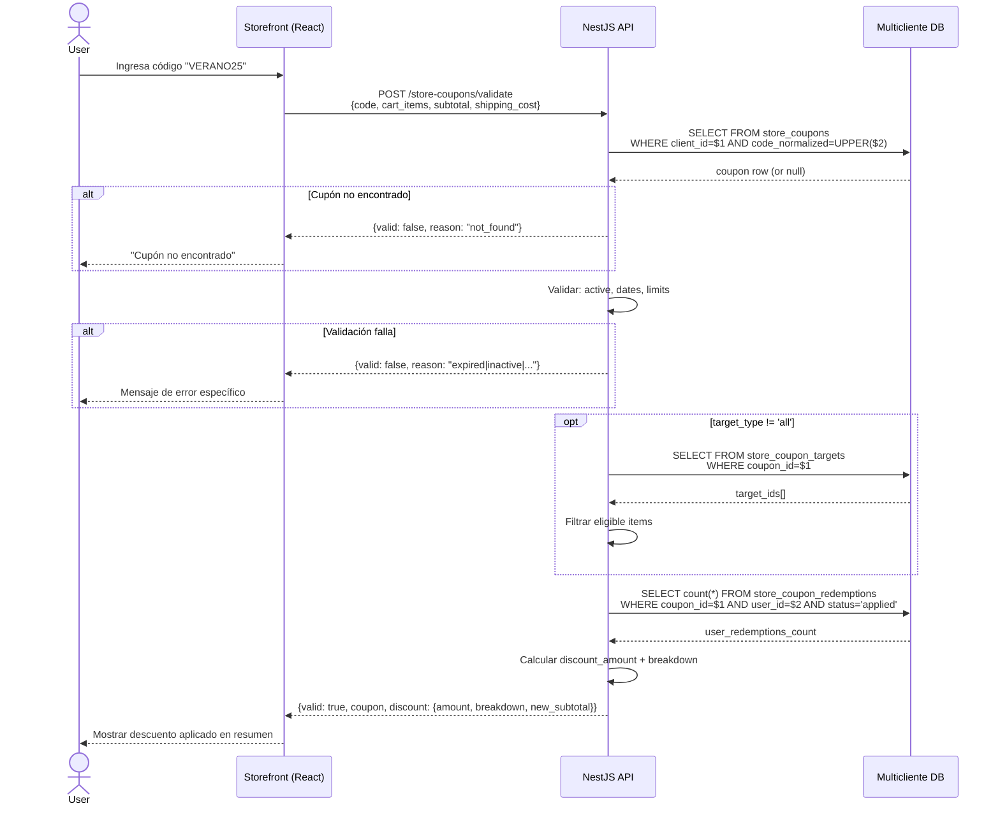
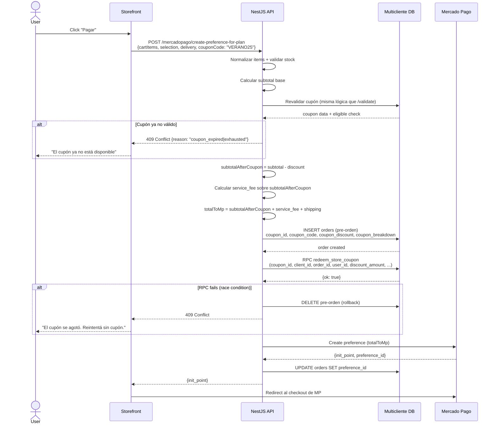
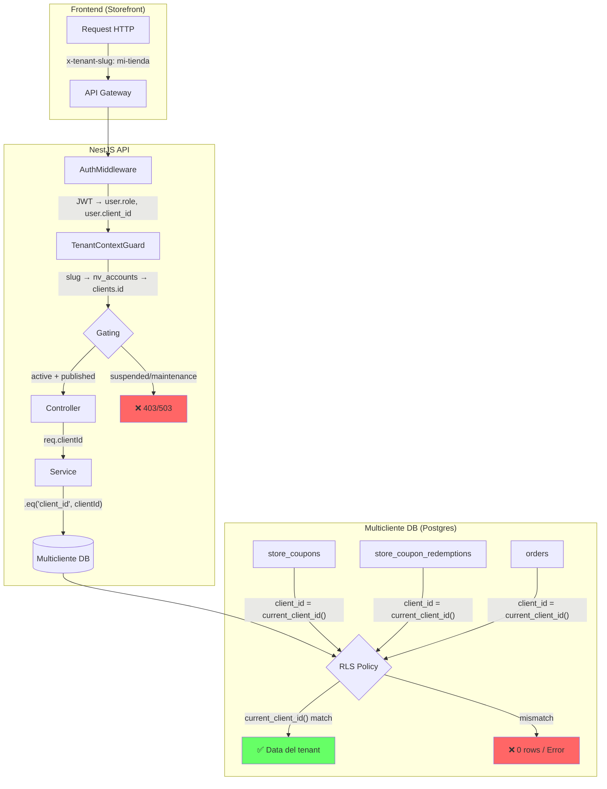

# 🎟️ Sistema de Cupones por Tenant — Diseño Completo

> **Fecha:** 2026-02-12  
> **Autor:** Copilot Agent (Principal Architect)  
> **Rama:** `feature/automatic-multiclient-onboarding`  
> **Estado:** Diseño aprobado, pendiente de implementación  
> **DB scope:** Solo Multicliente DB (data plane)

---

## Índice

1. [FASE A — Hallazgos de Investigación](#fase-a--hallazgos-de-investigación)
2. [FASE B — Requerimientos del Sistema de Cupones](#fase-b--requerimientos-del-sistema-de-cupones)
3. [FASE C — Diseño de Datos + RLS + Performance](#fase-c--diseño-de-datos--rls--performance)
4. [FASE D — Flujos Funcionales + Contratos](#fase-d--flujos-funcionales--contratos)
5. [FASE E — Admin Dashboard de Tienda](#fase-e--admin-dashboard-de-tienda)
6. [FASE F — Diagramas Mermaid](#fase-f--diagramas-mermaid)
7. [FASE G — Plan de Implementación por PRs](#fase-g--plan-de-implementación-por-prs)

---

# FASE A — Hallazgos de Investigación

## A.1 — Cómo funciona hoy

### Resolución de tenant (client_id) end-to-end

| Capa | Componente | Mecanismo |
|------|-----------|-----------|
| **Storefront** | Headers HTTP | `x-tenant-slug` / `x-store-slug` / Host header (subdominio) |
| **API Middleware** | `AuthMiddleware` | Extrae JWT + resuelve user/role contra Multicliente DB y Admin DB |
| **API Guard** | `TenantContextGuard` | Slug → `nv_accounts` (Admin DB) → `clients.id` (Backend DB). Gating: `is_active`, `publication_status`, `maintenance_mode` |
| **Services** | Manual | Cada service usa `req.clientId` para filtrar queries con `.eq('client_id', clientId)` |
| **DB (RLS)** | `current_client_id()` | Prioriza header `x-client-id` → JWT claim `user_metadata.client_id` |
| **DB (RLS)** | `is_admin()` | `role IN ('admin','super_admin')` de tabla `users` |

**Nota P0:** El header `x-client-id` directo fue **deshabilitado** en `TenantContextGuard`. La resolución de tenant es siempre por slug/dominio.

### Autenticación: admin de tienda vs usuario final

| Aspecto | Admin de tienda | Usuario final (comprador) |
|---------|----------------|--------------------------|
| **JWT project** | Multicliente DB | Multicliente DB |
| **`user_metadata.role`** | `'admin'` | `'user'` |
| **Guard** | `RolesGuard(['admin'])` | Sin guard de rol (o `auth` guard básico) |
| **Acceso dashboard** | `/admin-dashboard` con `PrivateRoute` + `StorefrontAdminGuard` | No |
| **Feature gating** | `featureCatalog` + `usePlanLimits` basado en `planKey` | N/A |
| **Escritura en DB** | Policies RLS: `is_admin() AND client_id = current_client_id()` | Solo sus propios recursos (`user_id = auth.uid()`) |

### Cálculo del total en checkout

**Flujo actual en `createPreferenceUnified()`** ([mercadopago.service.ts](../apps/api/src/tenant-payments/mercadopago.service.ts)):

```
1. Normalizar cartItems → unit_price por item
2. validateStock() → solo stock, NO valida precios contra DB
3. orderTotalBase = Σ(unit_price × quantity)
4. Si paymentMode === 'partial' → apply partial_percent
5. quote() → calcular service_fee (base en MP fees + config)
6. Agregar shipping_cost si delivery
7. totalToMp = Σ(all items including fees)
8. INSERT orders (pre-orden con payment_status: 'pending')
9. Crear preferencia en MP → redirect
```

**⚠️ Hallazgo crítico:** Los precios se toman del payload del frontend (`discountedPrice || originalPrice`). No se revalidan contra DB. Un futuro PR debería agregar validación server-side de precios, pero eso queda fuera de scope de cupones.

### Snapshot de orden (columnas clave)

| Columna | Tipo | Descripción |
|---------|------|-------------|
| `order_items` | JSONB | `[{product_id, name, quantity, unit_price}]` |
| `subtotal` | numeric(14,2) | Suma de productos sin fees |
| `service_fee` | numeric(14,2) | Fee de servicio |
| `shipping_cost` | numeric(14,2) | Costo de envío |
| `total_amount` | numeric | Total cobrado en MP |
| `customer_total` | numeric(14,2) | Total visible al cliente |
| `merchant_net` | numeric(14,2) | Neto vendedor |

**No existen columnas de cupón/descuento** en `orders` actualmente.

### Descuentos existentes (solo en producto)

- `products.original_price` y `products.discounted_price` (nullable)
- El storefront muestra `discountedPrice` tachando `originalPrice`
- En checkout se usa `discountedPrice || originalPrice` como `unit_price`
- **No hay descuentos a nivel de carrito, por código, ni promos temporales**

## A.2 — Tablas/infra existentes que ya tocan cupones

### Tabla `coupons` en Backend DB (Multicliente) — **EXISTE PERO INACTIVA**

```sql
CREATE TABLE public.coupons (
  id uuid PK,
  code text NOT NULL,
  discount_type discount_type_enum NOT NULL, -- 'percentage' | 'fixed'
  discount_value numeric NOT NULL,
  min_purchase_amount numeric DEFAULT 0,
  max_discount_amount numeric,
  start_date timestamptz, end_date timestamptz,
  usage_limit int, usage_count int DEFAULT 0,
  is_active boolean DEFAULT true,
  client_id uuid NOT NULL REFERENCES clients(id),
  UNIQUE(code, client_id)
);
```

**Estado:** Migración aplicada. Sin service, sin controller, sin RLS útil (solo `service_role` bypass). **Ningún flujo del ecommerce la usa.**

### Tabla `coupons` en Admin DB — **ACTIVA, para suscripciones/onboarding**

Tabla separada, NO tiene `client_id`. Cupones globales de la plataforma (ej: `WELCOME20`). Usada por el wizard de onboarding para descuentos en el setup fee. **Completamente separada del ecommerce.**

**Naming collision:** Ambas DBs tienen tabla `coupons`. Para el ecommerce, vamos a renombrar a `store_coupons` para evitar confusión.

## A.3 — Plan entitlements y feature gating

### Modelo actual

```
Admin DB: plans.entitlements (JSONB)
  ↓ via subscriptions.plan_key
Admin DB: nv_accounts.slug
  ↓ via outbox worker
Backend DB: clients.entitlements (JSONB cache)
```

**Entitlements actuales** (`plans.entitlements`):
```json
{
  "products_limit": 300,
  "images_per_product": 1,
  "banners_active_limit": 3,
  "storage_gb_quota": 2,
  "egress_gb_quota": 50,
  "max_monthly_orders": 200,
  "custom_domain": false,
  "is_dedicated": false
}
```

**No existe:** `coupons_enabled`, `max_active_coupons`, ni similar.

### Feature catalog (estático, code-level)

22 features definidos en `featureCatalog.ts`. El gating se hace en el frontend:
```
allowed = featureCatalog.features.filter(f => f.plans[planKey])
```

**No existe** un feature `dashboard.coupons` ni `commerce.coupons`.

## A.4 — Namespaces de rutas (resumen)

| Prefijo | Dominio | Guard |
|---------|---------|-------|
| `admin/*` | **Super Admin** NovaVision | `SuperAdminGuard` (email en `super_admins` + `x-internal-key`) |
| `orders`, `products`, `categories`, etc. | **Tenant** (storefront + admin de tienda) | `TenantContextGuard` + `RolesGuard` para escritura |
| `mercadopago/*` | **Tenant** (checkout + webhooks) | Mixto: auth para preferencias, sin auth para webhooks |
| `client-dashboard/*` | **Admin de tienda** (billing, domains) | `ClientDashboardGuard` |
| `settings/*` | **Admin de tienda** (config) | `TenantContextGuard` + `RolesGuard(['admin'])` |
| `coupons/*` | **Super Admin** (onboarding coupons) | `BuilderOrSupabaseGuard` / `SuperAdminGuard` |

**Para cupones de ecommerce:** El namespace debe ser algo como `store-coupons/*` bajo el contexto de tenant, NO bajo `admin/*` ni `coupons/*` (ya ocupados).

## A.5 — Riesgos P0/P1

| Riesgo | Severidad | Descripción | Mitigación |
|--------|-----------|-------------|------------|
| **Cross-tenant leak** | P0 | Sin RLS adecuado en `coupons` actual, solo `service_role` bypass. Un admin podría (con query directa) ver cupones de otro tenant | Nuevas policies RLS estrictas: `client_id = current_client_id()` |
| **Race condition en consumo** | P0 | `usage_count` increment sin lock → dos checkouts podrían consumir el "último uso" | Usar `UPDATE ... SET usage_count = usage_count + 1 WHERE usage_count < usage_limit` atómico |
| **Precios no validados server-side** | P1 | Checkout toma precios del frontend. Un cupón podría combinarse con precios manipulados | Fuera de scope de este diseño, pero documentado como deuda |
| **Tabla `coupons` ya existe** | P1 | Renombrar requiere migración careful (ALTER TABLE RENAME) | Migración con IF EXISTS + renombrado atómico |
| **Stacking con `discounted_price`** | P1 | Producto con precio oferta + cupón porcentual → ¿sobre qué base se aplica? | Definir: cupón aplica sobre precio efectivo (ya con descuento de producto) |
| **Idempotencia webhook** | P1 | Si el webhook reintenta, ¿puede duplicar la redención del cupón? | Redención vinculada a `order_id` con UNIQUE constraint |

## A.6 — Decisiones abiertas (con recomendación)

| # | Decisión | Opciones | Recomendación |
|---|----------|----------|---------------|
| D1 | Tabla existente `coupons` → ¿renombrar o crear nueva? | (a) ALTER TABLE RENAME a `store_coupons` (b) DROP + CREATE `store_coupons` (c) Mantener `coupons` | **(a) RENAME** — Preserva datos de desarrollo, evita colisión semántica |
| D2 | Quota de cupones activos → ¿dónde vive el límite? | (a) En `plans.entitlements` JSONB (b) En tabla `store_coupon_config` por tenant (c) Hardcoded por plan en código | **(a) entitlements** — Ya hay patrón establecido, agregar `max_active_coupons` |
| D3 | Feature gate → ¿todos los planes o solo growth+? | (a) Todos (b) Growth+ (c) Configurable | **(a) Todos** — Es feature core de ecommerce. Quota diferenciada por plan |
| D4 | Envío gratis → ¿existe shipping en checkout? | Sí, shipping V2 con `delivery_method` + `shipping_cost` | Soportar `free_shipping` como tipo de descuento |
| D5 | Cancel/refund → ¿devolver el uso del cupón? | (a) Sí, siempre (b) Solo si admin lo hace manual (c) Nunca | **(b) Manual** — Evita gaming. El admin decide desde el dashboard |
| D6 | Usuarios anónimos → ¿pueden usar cupones? | El checkout requiere auth actualmente | **No aplica** — Solo usuarios autenticados |
| D7 | Code case-sensitivity | (a) Case-insensitive (b) Case-sensitive | **(a) Insensitive** — Mejor UX. Guardar `code_normalized = UPPER(code)` |

---

# FASE B — Requerimientos del Sistema de Cupones

## B.1 — Tipos de cupón (MVP)

| Tipo | `discount_type` | Valor | Ejemplo |
|------|----------------|-------|---------|
| Porcentaje | `percentage` | 0.01 – 100.00 | 15% off |
| Monto fijo | `fixed_amount` | > 0 (en moneda del tenant, ARS) | $2000 off |
| Envío gratis | `free_shipping` | N/A (descuenta `shipping_cost`) | Envío gratis |

## B.2 — Reglas de negocio (MVP)

### Vigencia y estados

| Campo | Descripción |
|-------|-------------|
| `starts_at` | Fecha/hora de inicio (nullable = ya activo) |
| `ends_at` | Fecha/hora de fin (nullable = sin vencimiento) |
| `is_active` | Toggle manual del admin |
| `archived_at` | Soft-delete (archivado, no se puede reactivar) |

**Estado derivado** (calculado, no columna):
```
if archived_at IS NOT NULL → 'archived'
if NOT is_active → 'inactive'
if starts_at > NOW() → 'scheduled'
if ends_at IS NOT NULL AND ends_at < NOW() → 'expired'
else → 'active'
```

### Límites de uso

| Campo | Descripción |
|-------|-------------|
| `max_redemptions` | Máximo de usos totales (NULL = ilimitado) |
| `max_per_user` | Máximo de usos por usuario (NULL = ilimitado, default 1) |
| `redemptions_count` | Contador materializado (actualizado atómicamente) |

### Condiciones de aplicación

| Campo | Descripción |
|-------|-------------|
| `min_subtotal` | Mínimo de compra requerido (en moneda, default 0) |
| `max_discount` | Techo del descuento (para `percentage`; NULL = sin tope) |
| `stackable` | Boolean. `false` por defecto. Si `true`, puede combinarse con otro cupón |

### Elegibilidad por productos/categorías (MVP)

| Modo | `target_type` | Efecto |
|------|--------------|--------|
| Todos los productos | `all` | Aplica al subtotal completo |
| Productos específicos | `products` | Solo descuenta los items elegibles |
| Categorías específicas | `categories` | Solo descuenta items de esas categorías |

### Orden de aplicación de descuentos

```
1. Precio de producto: discounted_price || original_price → unit_price
2. Subtotal = Σ(unit_price × quantity)
3. Cupón aplica sobre subtotal (o subtotal filtrado por targets)
4. Service fee se calcula sobre el subtotal POST-cupón
5. Shipping se agrega después (salvo free_shipping)
6. Total = subtotal - coupon_discount + service_fee + shipping_cost
```

### Interacción con `discounted_price` (oferta de producto)

El cupón **aplica sobre el precio efectivo** (ya con descuento de producto). Es decir:
- Producto con `original_price: 10000`, `discounted_price: 8000`
- Cupón 10% → descuenta 10% de 8000 = 800
- **No** se aplica sobre el precio original

Esto es el comportamiento estándar de ecommerce (stack: product discount + cart discount).

## B.3 — Quotas por tenant

| Plan | `max_active_coupons` | Notas |
|------|---------------------|-------|
| `starter` | 5 | Suficiente para MVP |
| `growth` | 25 | Campañas más complejas |
| `enterprise` | 100 | Ilimitado en práctica |

**Implementación:** Agregar `"max_active_coupons": N` al JSONB `plans.entitlements` (Admin DB) + sincronizar via outbox a `clients.entitlements` (Backend DB).

**Validación:** Al crear/activar un cupón, contar `SELECT count(*) FROM store_coupons WHERE client_id = $1 AND is_active = true AND archived_at IS NULL` y comparar contra el límite.

---

# FASE C — Diseño de Datos + RLS + Performance

## C.1 — Modelo de datos

### Tabla `store_coupons`

> Renombramos la tabla existente `coupons` → `store_coupons` y extendemos.

```sql
-- Migración: renombrar + extender
ALTER TABLE IF EXISTS public.coupons RENAME TO store_coupons;

-- Tipo enum extendido
ALTER TYPE discount_type_enum ADD VALUE IF NOT EXISTS 'free_shipping';
ALTER TYPE discount_type_enum ADD VALUE IF NOT EXISTS 'fixed_amount';

-- Estructura final
CREATE TABLE IF NOT EXISTS public.store_coupons (
  -- Identidad
  id              uuid PRIMARY KEY DEFAULT gen_random_uuid(),
  client_id       uuid NOT NULL REFERENCES public.clients(id) ON DELETE CASCADE,
  
  -- Código (case-insensitive unique por tenant)
  code            text NOT NULL,
  code_normalized text NOT NULL GENERATED ALWAYS AS (upper(trim(code))) STORED,
  description     text,
  
  -- Tipo y valor
  discount_type   text NOT NULL CHECK (discount_type IN ('percentage', 'fixed_amount', 'free_shipping')),
  discount_value  numeric NOT NULL DEFAULT 0 CHECK (discount_value >= 0),
  max_discount    numeric,            -- Tope para porcentual (NULL = sin tope)
  currency        text NOT NULL DEFAULT 'ARS',
  
  -- Condiciones
  min_subtotal    numeric NOT NULL DEFAULT 0,
  
  -- Elegibilidad
  target_type     text NOT NULL DEFAULT 'all' CHECK (target_type IN ('all', 'products', 'categories')),
  
  -- Vigencia
  starts_at       timestamptz,
  ends_at         timestamptz,
  is_active       boolean NOT NULL DEFAULT true,
  archived_at     timestamptz,
  
  -- Límites de uso
  max_redemptions   int,                -- NULL = ilimitado
  max_per_user      int DEFAULT 1,      -- NULL = ilimitado, default 1
  redemptions_count int NOT NULL DEFAULT 0,
  
  -- Stacking
  stackable       boolean NOT NULL DEFAULT false,
  
  -- Audit
  created_at      timestamptz NOT NULL DEFAULT now(),
  updated_at      timestamptz NOT NULL DEFAULT now(),
  created_by      uuid,               -- user_id del admin que lo creó
  
  -- Constraints
  CONSTRAINT store_coupons_code_client_unique UNIQUE (client_id, code_normalized),
  CONSTRAINT store_coupons_percentage_max CHECK (
    discount_type != 'percentage' OR (discount_value > 0 AND discount_value <= 100)
  ),
  CONSTRAINT store_coupons_fixed_positive CHECK (
    discount_type != 'fixed_amount' OR discount_value > 0
  ),
  CONSTRAINT store_coupons_dates_valid CHECK (
    ends_at IS NULL OR starts_at IS NULL OR ends_at > starts_at
  )
);

-- Índices
CREATE INDEX idx_store_coupons_client_id ON public.store_coupons(client_id);
CREATE INDEX idx_store_coupons_client_active ON public.store_coupons(client_id, is_active) 
  WHERE archived_at IS NULL;
CREATE INDEX idx_store_coupons_lookup ON public.store_coupons(client_id, code_normalized) 
  WHERE is_active = true AND archived_at IS NULL;
```

### Tabla `store_coupon_targets`

```sql
CREATE TABLE public.store_coupon_targets (
  id          uuid PRIMARY KEY DEFAULT gen_random_uuid(),
  coupon_id   uuid NOT NULL REFERENCES public.store_coupons(id) ON DELETE CASCADE,
  client_id   uuid NOT NULL REFERENCES public.clients(id) ON DELETE CASCADE,
  target_type text NOT NULL CHECK (target_type IN ('product', 'category')),
  target_id   uuid NOT NULL,          -- product_id o category_id según target_type
  created_at  timestamptz NOT NULL DEFAULT now(),
  
  CONSTRAINT store_coupon_targets_unique UNIQUE (coupon_id, target_type, target_id)
);

CREATE INDEX idx_store_coupon_targets_coupon ON public.store_coupon_targets(coupon_id);
CREATE INDEX idx_store_coupon_targets_client ON public.store_coupon_targets(client_id);
```

### Tabla `store_coupon_redemptions`

```sql
CREATE TABLE public.store_coupon_redemptions (
  id              uuid PRIMARY KEY DEFAULT gen_random_uuid(),
  client_id       uuid NOT NULL REFERENCES public.clients(id) ON DELETE CASCADE,
  coupon_id       uuid NOT NULL REFERENCES public.store_coupons(id) ON DELETE RESTRICT,
  order_id        uuid NOT NULL REFERENCES public.orders(id) ON DELETE RESTRICT,
  user_id         uuid NOT NULL,
  
  -- Snapshot del descuento aplicado
  coupon_code     text NOT NULL,       -- Snapshot del código usado
  discount_type   text NOT NULL,
  discount_value  numeric NOT NULL,
  discount_amount numeric NOT NULL,    -- Monto real descontado
  
  -- Breakdown (para auditoría detallada)
  breakdown       jsonb NOT NULL DEFAULT '{}',
  -- Ejemplo: {"eligible_subtotal": 15000, "discount_raw": 2250, "discount_capped": 2000, "items": [...]}
  
  -- Estado
  status          text NOT NULL DEFAULT 'applied' CHECK (status IN ('applied', 'reversed')),
  reversed_at     timestamptz,
  reversed_by     uuid,               -- admin que revirtió
  
  -- Audit
  created_at      timestamptz NOT NULL DEFAULT now(),
  
  -- Idempotencia: una redención por orden
  CONSTRAINT store_coupon_redemptions_order_unique UNIQUE (order_id)
);

CREATE INDEX idx_store_coupon_redemptions_client ON public.store_coupon_redemptions(client_id);
CREATE INDEX idx_store_coupon_redemptions_coupon ON public.store_coupon_redemptions(coupon_id);
CREATE INDEX idx_store_coupon_redemptions_user ON public.store_coupon_redemptions(user_id, coupon_id);
```

### Columnas nuevas en `orders`

```sql
ALTER TABLE public.orders
  ADD COLUMN IF NOT EXISTS coupon_id uuid REFERENCES public.store_coupons(id),
  ADD COLUMN IF NOT EXISTS coupon_code text,
  ADD COLUMN IF NOT EXISTS coupon_discount numeric(14,2) DEFAULT 0,
  ADD COLUMN IF NOT EXISTS coupon_breakdown jsonb;

-- Índice para consultas de órdenes con cupón
CREATE INDEX idx_orders_coupon_id ON public.orders(coupon_id) WHERE coupon_id IS NOT NULL;
```

## C.2 — RLS Policies

### `store_coupons`

```sql
ALTER TABLE public.store_coupons ENABLE ROW LEVEL SECURITY;

-- Bypass para service_role (backend)
CREATE POLICY "server_bypass" ON public.store_coupons
  FOR ALL USING (auth.role() = 'service_role')
  WITH CHECK (auth.role() = 'service_role');

-- Lectura por tenant (admin de tienda ve sus cupones)
CREATE POLICY "store_coupons_select_admin" ON public.store_coupons
  FOR SELECT USING (
    client_id = current_client_id() AND is_admin()
  );

-- Escritura solo admin del tenant
CREATE POLICY "store_coupons_insert_admin" ON public.store_coupons
  FOR INSERT WITH CHECK (
    client_id = current_client_id() AND is_admin()
  );

CREATE POLICY "store_coupons_update_admin" ON public.store_coupons
  FOR UPDATE USING (
    client_id = current_client_id() AND is_admin()
  ) WITH CHECK (
    client_id = current_client_id() AND is_admin()
  );

CREATE POLICY "store_coupons_delete_admin" ON public.store_coupons
  FOR DELETE USING (
    client_id = current_client_id() AND is_admin()
  );
```

> **Nota:** Los usuarios finales **NO tienen policy de SELECT** sobre `store_coupons`. La validación de cupón se hace vía backend (service_role) en el endpoint de validación.

### `store_coupon_targets`

```sql
ALTER TABLE public.store_coupon_targets ENABLE ROW LEVEL SECURITY;

CREATE POLICY "server_bypass" ON public.store_coupon_targets
  FOR ALL USING (auth.role() = 'service_role')
  WITH CHECK (auth.role() = 'service_role');

CREATE POLICY "store_coupon_targets_select_admin" ON public.store_coupon_targets
  FOR SELECT USING (client_id = current_client_id() AND is_admin());

CREATE POLICY "store_coupon_targets_write_admin" ON public.store_coupon_targets
  FOR ALL USING (client_id = current_client_id() AND is_admin())
  WITH CHECK (client_id = current_client_id() AND is_admin());
```

### `store_coupon_redemptions`

```sql
ALTER TABLE public.store_coupon_redemptions ENABLE ROW LEVEL SECURITY;

CREATE POLICY "server_bypass" ON public.store_coupon_redemptions
  FOR ALL USING (auth.role() = 'service_role')
  WITH CHECK (auth.role() = 'service_role');

-- Admin puede ver todas las redenciones de su tenant
CREATE POLICY "store_coupon_redemptions_select_admin" ON public.store_coupon_redemptions
  FOR SELECT USING (client_id = current_client_id() AND is_admin());

-- User solo ve sus propias redenciones
CREATE POLICY "store_coupon_redemptions_select_owner" ON public.store_coupon_redemptions
  FOR SELECT USING (
    client_id = current_client_id() AND user_id = auth.uid()
  );

-- Solo service_role escribe redenciones (el backend controla consumo atómico)
-- NO hay policy de INSERT/UPDATE/DELETE para usuarios normales
```

## C.3 — Mecanismo de concurrencia

### Consumo atómico vía `UPDATE ... WHERE` (sin SELECT FOR UPDATE)

La estrategia más simple y eficiente para Supabase (sin transacciones explícitas en JS SDK):

```sql
-- RPC: redeem_store_coupon
CREATE OR REPLACE FUNCTION public.redeem_store_coupon(
  p_coupon_id    uuid,
  p_client_id    uuid,
  p_order_id     uuid,
  p_user_id      uuid,
  p_discount_amount numeric,
  p_coupon_code  text,
  p_discount_type text,
  p_discount_value numeric,
  p_breakdown    jsonb DEFAULT '{}'
) RETURNS jsonb LANGUAGE plpgsql SECURITY DEFINER SET search_path = public AS $$
DECLARE
  v_updated int;
  v_user_count int;
  v_max_per_user int;
BEGIN
  -- 1. Idempotencia: si ya existe redención para esta orden, retornar ok
  IF EXISTS (
    SELECT 1 FROM store_coupon_redemptions 
    WHERE order_id = p_order_id AND client_id = p_client_id
  ) THEN
    RETURN jsonb_build_object('ok', true, 'idempotent', true);
  END IF;

  -- 2. Verificar max_per_user
  SELECT max_per_user INTO v_max_per_user
  FROM store_coupons WHERE id = p_coupon_id AND client_id = p_client_id;
  
  IF v_max_per_user IS NOT NULL THEN
    SELECT count(*) INTO v_user_count
    FROM store_coupon_redemptions
    WHERE coupon_id = p_coupon_id AND user_id = p_user_id AND status = 'applied';
    
    IF v_user_count >= v_max_per_user THEN
      RETURN jsonb_build_object('ok', false, 'reason', 'max_per_user_reached');
    END IF;
  END IF;

  -- 3. Incrementar contador atómicamente (CAS operation)
  UPDATE store_coupons
  SET redemptions_count = redemptions_count + 1,
      updated_at = now()
  WHERE id = p_coupon_id
    AND client_id = p_client_id
    AND is_active = true
    AND archived_at IS NULL
    AND (starts_at IS NULL OR starts_at <= now())
    AND (ends_at IS NULL OR ends_at > now())
    AND (max_redemptions IS NULL OR redemptions_count < max_redemptions);
  
  GET DIAGNOSTICS v_updated = ROW_COUNT;
  
  IF v_updated = 0 THEN
    RETURN jsonb_build_object('ok', false, 'reason', 'coupon_not_available');
  END IF;

  -- 4. Insertar redención
  INSERT INTO store_coupon_redemptions (
    client_id, coupon_id, order_id, user_id,
    coupon_code, discount_type, discount_value, discount_amount, breakdown
  ) VALUES (
    p_client_id, p_coupon_id, p_order_id, p_user_id,
    p_coupon_code, p_discount_type, p_discount_value, p_discount_amount, p_breakdown
  );

  RETURN jsonb_build_object('ok', true, 'idempotent', false);
END;
$$;
```

**¿Por qué este approach?**
- El `UPDATE ... WHERE redemptions_count < max_redemptions` es un **compare-and-swap atómico** a nivel de fila en Postgres
- Dos transacciones concurrentes: la segunda esperará el row lock del UPDATE, y al re-evaluar `WHERE` fallará si el límite se alcanzó
- Idempotencia por `order_id` vía check al inicio
- No requiere `SET TRANSACTION ISOLATION LEVEL SERIALIZABLE`
- Compatible con Supabase RPC (`supabase.rpc('redeem_store_coupon', ...)`)

### Reversión (cancel/refund)

```sql
CREATE OR REPLACE FUNCTION public.reverse_store_coupon_redemption(
  p_order_id   uuid,
  p_client_id  uuid,
  p_reversed_by uuid
) RETURNS jsonb LANGUAGE plpgsql SECURITY DEFINER SET search_path = public AS $$
DECLARE
  v_redemption record;
BEGIN
  -- Buscar redención activa para esta orden
  SELECT * INTO v_redemption
  FROM store_coupon_redemptions
  WHERE order_id = p_order_id AND client_id = p_client_id AND status = 'applied'
  FOR UPDATE;
  
  IF NOT FOUND THEN
    RETURN jsonb_build_object('ok', false, 'reason', 'no_active_redemption');
  END IF;

  -- Marcar como reversed
  UPDATE store_coupon_redemptions
  SET status = 'reversed', reversed_at = now(), reversed_by = p_reversed_by
  WHERE id = v_redemption.id;

  -- Decrementar contador del cupón
  UPDATE store_coupons
  SET redemptions_count = GREATEST(0, redemptions_count - 1), updated_at = now()
  WHERE id = v_redemption.coupon_id AND client_id = p_client_id;

  RETURN jsonb_build_object('ok', true, 'coupon_code', v_redemption.coupon_code);
END;
$$;
```

## C.4 — Checklist de verificación anti-leakage

| # | Verificación | Cómo probar |
|---|-------------|-------------|
| 1 | Admin tenant A no puede listar cupones de tenant B | `SELECT * FROM store_coupons` con JWT de tenant A → no ve registros de B |
| 2 | User final no puede listar cupones | `SELECT * FROM store_coupons` con JWT de user → 0 filas |
| 3 | Validación vía API siempre filtra por client_id | Enviar code de tenant B en request de tenant A → `invalid_coupon` |
| 4 | RPC `redeem_store_coupon` valida client_id en WHERE | Intentar redimir cupón de otro tenant → `coupon_not_available` |
| 5 | Redemptions no cross-tenant | `SELECT * FROM store_coupon_redemptions` con JWT de tenant A → solo sus registros |
| 6 | Index `store_coupons_lookup` incluye client_id | EXPLAIN del query de validación → usa index |
| 7 | Un user no puede fabricar `client_id` en insert | RLS `WITH CHECK` valida `client_id = current_client_id()` |

---

# FASE D — Flujos Funcionales + Contratos

## D.1 — Endpoint: Validar cupón (preview)

### Contrato

```
POST /store-coupons/validate
Headers: Authorization: Bearer <jwt>, x-tenant-slug: <slug>
```

**Request:**
```json
{
  "code": "VERANO25",
  "cart_items": [
    { "product_id": "uuid", "quantity": 2, "unit_price": 5000, "category_ids": ["uuid1"] },
    { "product_id": "uuid", "quantity": 1, "unit_price": 3000, "category_ids": ["uuid2"] }
  ],
  "subtotal": 13000,
  "shipping_cost": 1500,
  "user_id": "uuid"
}
```

**Response éxito (200):**
```json
{
  "valid": true,
  "coupon": {
    "id": "uuid",
    "code": "VERANO25",
    "discount_type": "percentage",
    "discount_value": 25,
    "description": "25% OFF verano"
  },
  "discount": {
    "amount": 3250,
    "eligible_subtotal": 13000,
    "new_subtotal": 9750,
    "shipping_discount": 0,
    "breakdown": {
      "items": [
        { "product_id": "uuid", "original": 10000, "discount": 2500 },
        { "product_id": "uuid", "original": 3000, "discount": 750 }
      ]
    }
  }
}
```

**Response error (200 con valid=false):**
```json
{
  "valid": false,
  "reason": "expired",
  "message": "Este cupón ha expirado"
}
```

**Razones posibles de invalidez:**

| `reason` | Mensaje | Cuándo |
|----------|---------|--------|
| `not_found` | Cupón no encontrado | Code no existe para este tenant |
| `inactive` | Cupón desactivado | `is_active = false` |
| `expired` | Cupón expirado | `ends_at < now()` |
| `not_started` | Cupón aún no disponible | `starts_at > now()` |
| `archived` | Cupón archivado | `archived_at IS NOT NULL` |
| `max_redemptions_reached` | Cupón agotado | `redemptions_count >= max_redemptions` |
| `max_per_user_reached` | Ya usaste este cupón | Redenciones activas del user >= `max_per_user` |
| `min_subtotal_not_met` | Mínimo de compra no alcanzado ($X) | `subtotal < min_subtotal` |
| `no_eligible_items` | Ningún producto del carrito es elegible | Target por products/categories pero ningún item califica |
| `zero_discount` | El descuento resultante es $0 | Edge case: free_shipping con shipping ya = 0 |

### Lógica de validación (motor de reglas)

```
1. Buscar cupón: SELECT FROM store_coupons WHERE client_id = $clientId AND code_normalized = UPPER(TRIM($code))
2. Validar existencia → not_found
3. Validar archived_at → archived  
4. Validar is_active → inactive
5. Validar starts_at/ends_at → not_started / expired
6. Validar max_redemptions → max_redemptions_reached
7. Validar max_per_user (contar en redemptions) → max_per_user_reached
8. Filtrar eligible items (si target_type != 'all', cruzar con store_coupon_targets)
9. Calcular eligible_subtotal = Σ(unit_price × quantity) de items elegibles
10. Validar min_subtotal sobre subtotal completo → min_subtotal_not_met
11. Calcular descuento:
    - percentage: eligible_subtotal × (discount_value / 100), cap por max_discount
    - fixed_amount: min(discount_value, eligible_subtotal)
    - free_shipping: shipping_cost
12. Validar descuento > 0 → zero_discount
13. Retornar breakdown
```

## D.2 — Consumo real (en creación de orden)

### Integración en `createPreferenceUnified()`

**Nuevo parámetro en body:** `couponCode?: string`

**Flujo modificado:**
```
1-2. (sin cambios) Normalizar items + validar stock
3.   orderTotalBase = Σ(unit_price × quantity)
3.5  ── NUEVO: Si couponCode:
     │  a) Revalidar cupón con valores reales
     │  b) Calcular discount_amount
     │  c) subtotalAfterCoupon = subtotalBase - discount_amount
     │  d) Preparar coupon snapshot para la orden
4.   Si paymentMode === 'partial' → apply partial_percent sobre subtotalAfterCoupon
5.   quote() → service fee sobre subtotalAfterCoupon
...
8.   INSERT orders incluye:
     │  coupon_id, coupon_code, coupon_discount, coupon_breakdown
9.   ── NUEVO: Llamar RPC redeem_store_coupon (consumo atómico)
10.  Crear preferencia en MP con total correcto
```

**Si `redeem_store_coupon` falla** (race condition, expiró, etc.):
- Responder `409 Conflict` con razón
- No crear preferencia ni pre-orden
- Frontend muestra: "El cupón ya no está disponible. Tu carrito no fue modificado."

### Idempotencia

- Si el usuario reintenta el checkout (ej: error de red), el `order_id` se re-genera
- Pero si la pre-orden ya existe con ese `external_reference`, se actualiza en vez de crear (patrón upsert existente)
- La redención está vinculada al `order_id` con UNIQUE → si se reintenta con el mismo order_id, el RPC retorna `idempotent: true`

## D.3 — Casos edge y resolución

| Escenario | Resolución |
|-----------|------------|
| **Expira entre preview y confirmación** | Se revalida en `createPreferenceUnified`. Si expiró → 409 Conflict |
| **Límite alcanzado entre preview y confirm** | CAS atómico en RPC. Si falla → 409 |
| **Carrito cambió** | Los items se validan de nuevo. Si el subtotal cambió, el descuento se recalcula |
| **Descuento > subtotal** | `discount_amount = min(calculated_discount, eligible_subtotal)` — nunca negativo |
| **Free shipping con envío = 0** | `zero_discount` → cupón no aplica (o aplica con discount = 0, UX decide) |
| **Free shipping con retiro en tienda** | No hay `shipping_cost` → `zero_discount` |
| **Stacking con price discount** | El cupón aplica sobre `discounted_price` (el precio efectivo) |
| **Moneda/precisión** | `ROUND(amount, 2)` consistente. Usar `numeric(14,2)` |
| **Cancel/refund** | Admin usa función `reverse_store_coupon_redemption` desde el dashboard. No automático |
| **Webhook retry** | Si el webhook reintenta y encuentra la orden ya pagada, es idempotente (skip). La redención ya está |
| **Partial payment + coupon** | El descuento se aplica al total, y luego el partial_percent se calcula sobre el total con descuento |

## D.4 — Endpoints CRUD (admin de tienda)

### Namespace: `store-coupons/`

| Método | Ruta | Guard | Descripción |
|--------|------|-------|-------------|
| `GET` | `/store-coupons` | `TenantAuth + Roles(['admin'])` | Listar cupones del tenant (paginado) |
| `GET` | `/store-coupons/:id` | `TenantAuth + Roles(['admin'])` | Detalle de un cupón + stats |
| `POST` | `/store-coupons` | `TenantAuth + Roles(['admin'])` | Crear cupón (valida quota) |
| `PATCH` | `/store-coupons/:id` | `TenantAuth + Roles(['admin'])` | Editar cupón (no editable si tiene redenciones para ciertos campos) |
| `POST` | `/store-coupons/:id/toggle` | `TenantAuth + Roles(['admin'])` | Activar/desactivar |
| `POST` | `/store-coupons/:id/archive` | `TenantAuth + Roles(['admin'])` | Archivar (soft delete) |
| `POST` | `/store-coupons/:id/duplicate` | `TenantAuth + Roles(['admin'])` | Duplicar (nuevo code, misma config) |
| `GET` | `/store-coupons/:id/redemptions` | `TenantAuth + Roles(['admin'])` | Historial de redenciones |
| `POST` | `/store-coupons/validate` | `TenantAuth` (user o admin) | Validar cupón (preview checkout) |

### Query params para listado

```
GET /store-coupons?page=0&pageSize=20&status=active&search=VER&sortBy=created_at&sortDir=desc
```

| Param | Tipo | Descripción |
|-------|------|-------------|
| `page` | int | Página (0-based) |
| `pageSize` | int | Items por página (max 50) |
| `status` | enum | `active`, `inactive`, `scheduled`, `expired`, `archived` |
| `search` | string | Busca en `code` y `description` |
| `sortBy` | string | `created_at`, `code`, `redemptions_count`, `ends_at` |
| `sortDir` | string | `asc` o `desc` |

---

# FASE E — Admin Dashboard de Tienda

## E.1 — Ubicación y gating

- **Ruta:** `/admin-dashboard?coupons` (sección dentro del dashboard existente)
- **Feature gate:** Agregar `commerce.coupons` a `featureCatalog.ts` con `starter: true, growth: true, enterprise: true`
- **Section mapping:** `SECTION_FEATURES.coupons = 'commerce.coupons'`
- **Componente:** `<CouponsDashboard />` (lazy-loaded)

## E.2 — Pantallas

### Listado de cupones

```
┌──────────────────────────────────────────────────────━━━━━━━━━━━━━━━┐
│ 🎟️ Cupones de descuento                     [+ Crear cupón]       │
├─────────────────────────────────────────────────────────────────────┤
│ Buscar: [________________]  Estado: [Todos ▾]  Quota: 3/5 activos  │
├──────┬──────────┬────────┬──────────┬───────┬───────┬──────────────┤
│ Code │ Tipo     │ Valor  │ Vigencia │ Usos  │Estado │ Acciones     │
├──────┼──────────┼────────┼──────────┼───────┼───────┼──────────────┤
│ VER25│ %        │ 25%    │ 01/02-28/02│ 12/50│🟢 Act│ ✏️ 👁 📋 ⏸️  │
│ BIENVENIDO│$fijo│ $2000  │ Sin venc │ 3/∞  │🟢 Act│ ✏️ 👁 📋 ⏸️  │
│ ENVIO│ Env.gratis│  -    │ Vencido  │ 8/10 │🔴 Exp│ 👁 📋        │
└──────┴──────────┴────────┴──────────┴───────┴───────┴──────────────┘
```

**Componentes:**
- `CouponsList.jsx` — Tabla principal
- `CouponStatusBadge.jsx` — Badge con estado derivado
- `CouponQuotaIndicator.jsx` — Indicador de quota vs límite del plan

### Crear/Editar cupón

```
┌─────────────────────────────────────────────────────┐
│ Crear cupón                               [Guardar] │
├─────────────────────────────────────────────────────┤
│ Código: [VERANO2026________] (auto-uppercased)      │
│ Descripción: [25% de descuento en verano__________] │
│                                                      │
│ Tipo de descuento:                                   │
│ (●) Porcentaje  ( ) Monto fijo  ( ) Envío gratis    │
│                                                      │
│ Valor: [25] %   Tope máximo: [$5000] (opcional)     │
│                                                      │
│ ─── Condiciones ───                                  │
│ Mínimo de compra: [$0_____]                         │
│ Apilable con otros cupones: [ ]                     │
│                                                      │
│ ─── Vigencia ───                                     │
│ Desde: [01/02/2026]  Hasta: [28/02/2026]            │
│                                                      │
│ ─── Límites ───                                      │
│ Usos totales: [50___] (vacío = ilimitado)           │
│ Usos por usuario: [1___]                            │
│                                                      │
│ ─── Elegibilidad ───                                 │
│ (●) Todos los productos                             │
│ ( ) Productos específicos → [Select products]       │
│ ( ) Categorías → [Select categories]                │
└─────────────────────────────────────────────────────┘
```

**Validaciones UX:**
- Code: requerido, solo alfanumérico + guiones, max 30 chars, auto-uppercase
- No superar quota del plan al crear/activar
- Valor % entre 0.01 y 100
- Valor fijo > 0
- Fecha fin > fecha inicio
- Confirmar si code ya existe (async validation)

### Detalle / Stats

```
┌─────────────────────────────────────────────────────┐
│ Cupón: VERANO25                    [Editar] [⏸️/▶️] │
├─────────────────────────────────────────────────────┤
│ Estado: 🟢 Activo                                    │
│ Tipo: 25% de descuento (tope $5000)                 │
│ Vigencia: 01/02/2026 - 28/02/2026                   │
│ Redenciones: 12 / 50 (24%)  ████░░░░░░░░░░░░░      │
│ Descuento total otorgado: $36,400                   │
│                                                      │
│ ─── Últimas redenciones ───                          │
│ 12/02 14:30 – Juan P. – Orden #NV-2602-0042 – $3200│
│ 11/02 09:15 – María L. – Orden #NV-2602-0038 – $2800│
│ ...                                                  │
└─────────────────────────────────────────────────────┘
```

## E.3 — Tokens de tema

Seguir los tokens existentes del theme system. **NO hardcodear colores.** Usar:
- `var(--nv-primary)` para botones de acción
- `var(--nv-success)` para badges activos
- `var(--nv-error)` para badges expirados/inactivos
- `var(--nv-text)` para texto principal
- `var(--nv-muted)` para texto secundario
- `var(--nv-surface)` para backgrounds de cards
- `var(--nv-border)` para bordes

---

# FASE F — Diagramas Mermaid

## F.1 — ERD: Modelo de datos



## F.2 — Sequence: Aplicar cupón (preview)



## F.3 — Sequence: Confirmar orden (consumo atómico)



## F.4 — Data-flow multi-tenant: enforcement de client_id



---

# FASE G — Plan de Implementación por PRs

## PR 1 — Schema + Índices + RLS + Migración

**Scope:** Solo DB. Sin código de aplicación.

**Archivos:**
- `migrations/backend/BACKEND_XXX_store_coupons_schema.sql`
  - `ALTER TABLE coupons RENAME TO store_coupons`
  - Agregar columnas nuevas (`code_normalized`, `target_type`, `starts_at`, `ends_at`, `archived_at`, `max_per_user`, `stackable`, `created_by`)
  - Crear `store_coupon_targets`
  - Crear `store_coupon_redemptions`
  - Agregar columnas a `orders` (`coupon_id`, `coupon_code`, `coupon_discount`, `coupon_breakdown`)
  - Todos los índices
  - Todas las RLS policies
  - RPCs: `redeem_store_coupon`, `reverse_store_coupon_redemption`
- `migrations/admin/ADMIN_XXX_add_coupons_entitlement.sql`
  - UPDATE `plans.entitlements` para agregar `max_active_coupons` por plan

**Migración reversible:**
```sql
-- DOWN:
ALTER TABLE store_coupons RENAME TO coupons;
DROP TABLE store_coupon_targets;
DROP TABLE store_coupon_redemptions;
ALTER TABLE orders DROP COLUMN coupon_id, DROP COLUMN coupon_code, ...;
```

**Tests:**
- Verificar RLS con JWT de diferentes tenants/roles
- Verificar que `redeem_store_coupon` RPC funciona con concurrencia

**Riesgo:** Renombrar tabla `coupons` → si hay queries directas a `coupons` por nombre, romperían. Verificar que no existan.

---

## PR 2 — Service + Endpoint validate + Motor de reglas

**Scope:** Backend NestJS. Sin cambios en frontend.

**Archivos:**
- `src/store-coupons/store-coupons.module.ts`
- `src/store-coupons/store-coupons.service.ts` — Motor de reglas + validate
- `src/store-coupons/store-coupons.controller.ts` — Endpoint `/store-coupons/validate`
- `src/store-coupons/dto/validate-coupon.dto.ts`
- `src/store-coupons/dto/coupon-response.dto.ts`
- `src/store-coupons/store-coupons.service.spec.ts` — Unit tests

**Feature catalog update:**
- `src/plans/featureCatalog.ts` — Agregar `commerce.coupons`

**Tests obligatorios (unit):**
- Cupón válido → cálculo correcto (%, fijo, free_shipping)
- Cupón expirado → `expired`
- Cupón inactivo → `inactive`
- Max redemptions alcanzado → `max_redemptions_reached`
- Max per user alcanzado → `max_per_user_reached`
- Min subtotal no alcanzado → `min_subtotal_not_met`
- Target por productos → solo calcula sobre elegibles
- Target por categorías → solo calcula sobre elegibles
- Descuento > subtotal → capped
- Porcentaje con max_discount → capped
- free_shipping con shipping = 0 → `zero_discount`
- Redondeo correcto (decimales)

---

## PR 3 — Integración order creation + idempotencia + snapshot

**Scope:** Backend. Modificar `createPreferenceUnified()`.

**Archivos:**
- `src/tenant-payments/mercadopago.service.ts` — Inyectar lógica de cupón
- `src/store-coupons/store-coupons.service.ts` — Método `applyCouponToOrder()`
- `src/tenant-payments/mercadopago.controller.ts` — Agregar `couponCode` al body
- Tests de integración

**Tests obligatorios:**
- Crear orden con cupón → pre-orden tiene `coupon_id`, `coupon_discount`
- Crear orden sin cupón → comportamiento sin cambios (regresión)
- Race condition: 2 órdenes simultáneas con último uso → solo 1 gana
- Reintento con mismo order_id → idempotente
- Cupón expiró entre validate y create → 409

---

## PR 4 — Admin dashboard de tienda (CRUD + quota)

**Scope:** Frontend (web) + Backend CRUD endpoints.

**Backend:**
- `src/store-coupons/store-coupons.controller.ts` — CRUD endpoints
- `src/store-coupons/dto/create-coupon.dto.ts`
- `src/store-coupons/dto/update-coupon.dto.ts`

**Frontend:**
- `apps/web/src/pages/AdminDashboard/sections/CouponsDashboard/`
  - `index.jsx` — Container principal
  - `CouponsList.jsx` — Tabla
  - `CouponForm.jsx` — Crear/Editar
  - `CouponDetail.jsx` — Detalle + stats
  - `CouponStatusBadge.jsx` — Badge de estado
  - `CouponQuotaIndicator.jsx` — Indicator de quota
- `apps/web/src/hooks/admin/useCoupons.js` — Hook para API calls
- `apps/web/src/pages/AdminDashboard/index.jsx` — Agregar sección `coupons`

**Tests:**
- Crear cupón → aparece en listado
- Editar cupón → cambios persistidos
- Activar/desactivar toggle
- Archivar → no aparece en listado activo
- Duplicar → nuevo code, misma config
- Superar quota → error visible

---

## PR 5 — Storefront checkout UI (apply/remove)

**Scope:** Frontend (web) únicamente.

**Archivos:**
- `apps/web/src/components/checkout/CouponInput/`
  - `index.jsx` — Campo + botón aplicar
  - `CouponApplied.jsx` — Badge con descuento y botón remover
  - `styles.js` — Styled-components
- `apps/web/src/hooks/cart/useCoupon.js` — Hook para validar/aplicar/remover
- `apps/web/src/components/checkout/CheckoutStepper/` — Integrar en CartStep o ConfirmationStep
- `apps/web/src/hooks/cart/useCheckout.js` — Pasar `couponCode` al `generatePreference()`

**UX Flow:**
```
CartStep:
  [Tenés un cupón? ▾]
    → Input: [VERANO25___] [Aplicar]
    → Spinner mientras valida
    → Éxito: "VERANO25 aplicado: -$3,250"  [✕ Quitar]
    → Error: "Cupón expirado" (rojo, desaparece en 3s)

ConfirmationStep:
  Subtotal:           $13,000
  Cupón (VERANO25):   -$3,250
  Costo de servicio:   $1,200
  Envío:               $1,500
  Total:              $12,450
```

**Tests:**
- Aplicar cupón válido → descuento se muestra
- Aplicar cupón inválido → mensaje de error
- Remover cupón → vuelve al total original
- Cambiar carrito con cupón aplicado → revalidar automáticamente

---

## PR 6 — E2E + Seguridad + Observabilidad

**Scope:** Tests E2E + logging + métricas.

**Archivos:**
- `novavision-e2e/tests/store-coupons/`
  - `coupon-crud.spec.ts` — Admin crea, edita, archiva
  - `coupon-checkout.spec.ts` — Comprador aplica y compra con cupón
  - `coupon-security.spec.ts` — Cross-tenant tests
  - `coupon-edge-cases.spec.ts` — Expirado, agotado, carrito cambia

**Tests de seguridad obligatorios:**
- Comprador de tenant A intenta validar cupón de tenant B → `not_found`
- Admin de tenant A intenta listar cupones de tenant B → 0 resultados
- Comprador intenta acceder a `GET /store-coupons` (CRUD) → 403
- Request sin auth a `/store-coupons/validate` → 401
- Fabricar `client_id` en headers → rechazado por TenantContextGuard

**Logging:**
```typescript
this.logger.log({
  event: 'store_coupon_redeemed',
  clientId, userId, orderId, couponId, couponCode, discountAmount,
  requestId: req.requestId,
});
```

**Observabilidad:**
- Contar redenciones por tenant (para métricas de uso)
- Log de intentos fallidos (para detectar abuso)
- Alert si un tenant supera 100 validaciones/hora (posible scraping de codes)

---

## Checklist final de verificación pre-merge

- [ ] RLS: Admin tenant A no ve cupones de tenant B
- [ ] RLS: User final no puede SELECT de `store_coupons`
- [ ] RLS: User final no puede INSERT en `store_coupon_redemptions` directo (solo via RPC/service_role)
- [ ] Concurrencia: 2 checkouts simultáneos con último uso → solo 1 éxito
- [ ] Idempotencia: retry de `redeem_store_coupon` con mismo order_id → ok
- [ ] Snapshot: orden guardada tiene `coupon_code`, `coupon_discount`, `coupon_breakdown`
- [ ] Webhook: confirmPayment no duplica redención
- [ ] Quota: crear cupón #6 en plan starter → error claro
- [ ] Feature gate: sección "Cupones" visible en dashboard según plan
- [ ] UX: cupón expirado entre preview y confirm → mensaje claro, no error genérico
- [ ] Precio: descuento nunca genera total negativo
- [ ] Redondeo: todas las operaciones con `ROUND(x, 2)`
- [ ] Naming: sin colisión con `admin/coupons` (onboarding)
- [ ] Migración reversible documentada
- [ ] Tests verdes: unit + integration + security + E2E

---

## Apéndice: Referencia rápida de archivos a tocar

### Backend (apps/api)
| Archivo | Cambio |
|---------|--------|
| `migrations/backend/BACKEND_XXX_*.sql` | Schema, RLS, RPCs |
| `migrations/admin/ADMIN_XXX_*.sql` | Entitlements update |
| `src/store-coupons/` (NUEVO) | Module, Service, Controller, DTOs |
| `src/plans/featureCatalog.ts` | Agregar `commerce.coupons` |
| `src/tenant-payments/mercadopago.service.ts` | Inyectar cupón en checkout |
| `src/tenant-payments/mercadopago.controller.ts` | `couponCode` en body |

### Frontend Web (apps/web)
| Archivo | Cambio |
|---------|--------|
| `src/pages/AdminDashboard/sections/CouponsDashboard/` (NUEVO) | UI admin |
| `src/pages/AdminDashboard/index.jsx` | Registrar sección |
| `src/components/checkout/CouponInput/` (NUEVO) | UI checkout |
| `src/hooks/cart/useCoupon.js` (NUEVO) | Hook validación |
| `src/hooks/cart/useCheckout.js` | Pasar couponCode |
| `src/hooks/admin/useCoupons.js` (NUEVO) | Hook CRUD |
| `src/pages/PaymentResultPage/index.jsx` | Mostrar descuento en resumen |

### E2E (novavision-e2e)
| Archivo | Cambio |
|---------|--------|
| `tests/store-coupons/` (NUEVO) | Todos los specs E2E |
