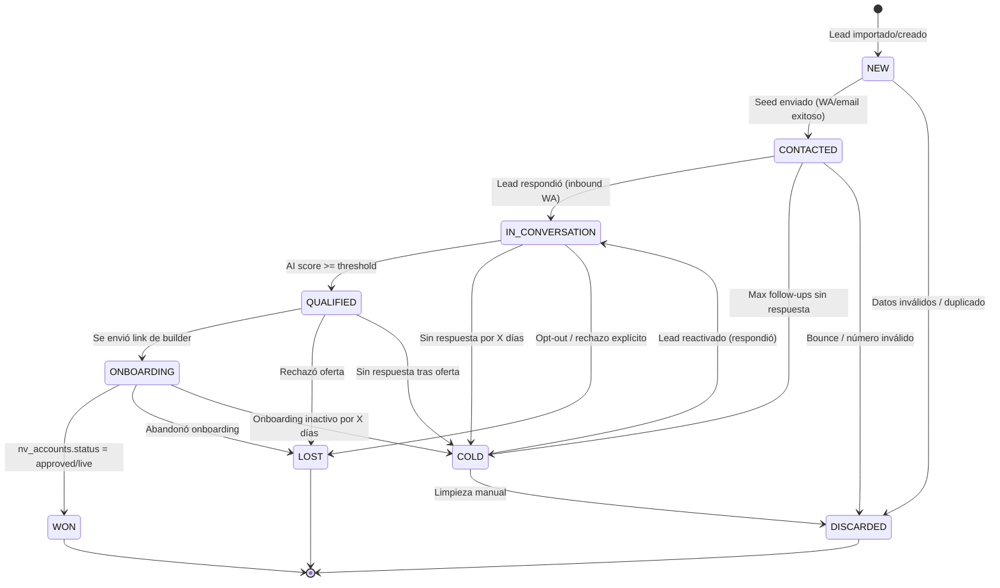
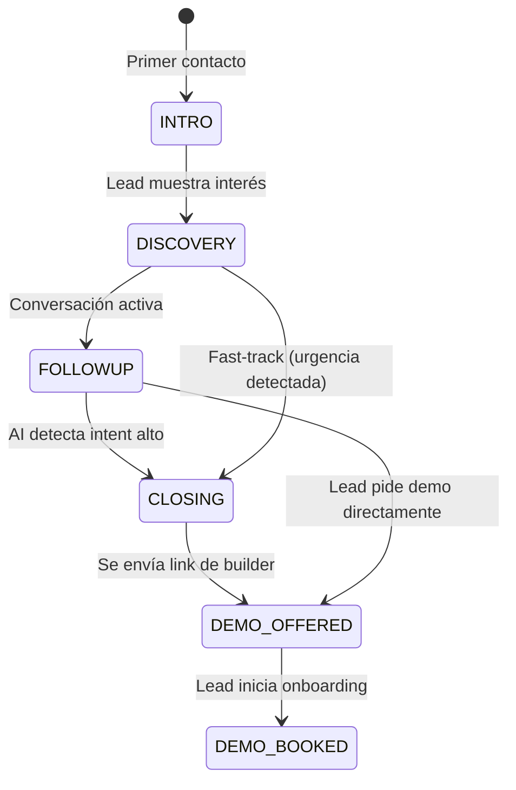

# n8n Outreach System v2 — Auditoría, Rediseño e Implementación

> **Fecha:** 2025-07-23  
> **Autor:** Copilot Agent  
> **Estado:** Propuesta para revisión  
> **Repo afectado:** n8n (Railway) + Admin DB (Supabase)

---

## Índice

- [Block A — Auditoría Brutal](#block-a--auditoría-brutal)
- [Block B — Máquina de Estados Unificada](#block-b--máquina-de-estados-unificada)
- [Block C — Cambios de DB + Migraciones SQL](#block-c--cambios-de-db--migraciones-sql)
- [Block D — Arquitectura Workflow v2](#block-d--arquitectura-workflow-v2)
- [Block E — Checklist de Setup + JSONs Importables](#block-e--checklist-de-setup--jsons-importables)

---

## Block A — Auditoría Brutal

### Contexto de datos actual

| Tabla | Registros | Observación |
|-------|-----------|-------------|
| `outreach_leads` | 47,299 | **100% en status NEW**, stage INTRO, source EXCEL_2025_11 |
| `outreach_logs` | 0 | **Vacía** — ningún mensaje fue enviado jamás |
| `nv_playbook` | 0 | **Vacía** — el AI Closer no tiene playbook |
| `nv_onboarding` | 1 | 1 registro en `submitted_for_review` |
| `nv_accounts` | 1 | 1 registro en `approved` |

> **Conclusión global:** Los 3 workflows nunca se ejecutaron en producción contra estos datos. El sistema está "virgen" con 47K leads importados sin procesar.

---

### Workflow A — Seed Diario (WA + Gmail)

**Propósito declarado:** Cron diario que toma leads NEW y envía primer contacto por WhatsApp + Email.

#### 🔴 Bugs críticos (5)

| # | Severidad | Hallazgo | Impacto |
|---|-----------|----------|---------|
| A1 | 🔴 CRÍTICO | `phone_number_id` hardcodeado como `859363390593864` en nodo "Send WA Template" | Si la línea de WA cambia, el workflow se rompe silenciosamente (continueOnFail). No usa `$env.WHATSAPP_PHONE_NUMBER_ID` como B y C |
| A2 | 🔴 CRÍTICO | `continueOnFail: true` en nodos "Send WA Template" Y "Update Lead (WA)" | El lead pasa a `CONTACTED` incluso si el envío de WA **falló**. Corrompe el estado y evita reintentos |
| A3 | 🔴 CRÍTICO | `attempt_count` se resetea a `0` en el update post-seed | El valor debería ser `1` (primer intento). Workflow B usa `attempt_count \|\| 1` como fallback, lo que enmascara el bug pero genera FU1 donde debería ser FU2 |
| A4 | 🟠 ALTO | Branches de WA y email corren en **paralelo** desde el mismo lead | Ambos branches hacen UPDATE al mismo lead. Race condition: si WA actualiza `status=CONTACTED` y email actualiza después, `last_channel` queda inconsistente |
| A5 | 🟠 ALTO | Log se ejecuta **después** del update, no atómicamente | Si el update falla (ej: constraint violation), el log nunca se escribe. Se pierde trazabilidad del intento fallido |

#### 🟡 Problemas de diseño (4)

| # | Hallazgo | Riesgo |
|---|----------|--------|
| A6 | `next_followup_at` hardcodeado a `+5 días` sin importar resultado | Lead con envío fallido igual recibe follow-up en 5 días. Debería ser condicional: solo si envío exitoso |
| A7 | Limit fijo de 50 leads por ejecución | Sin paginación ni offset. Si hay 47K NEW leads, tomará las mismas 50 cada vez (depende del ORDER BY, que no está especificado) |
| A8 | No valida formato de teléfono antes de enviar | Números inválidos consumen cuota de WA API y generan errores silenciosos |
| A9 | Template `novavision_seed` con locale `es_AR` vs B que usa `es` | Inconsistencia. Si Meta no aprobó el template en `es_AR`, falla silenciosamente |

#### 🟢 Lo que está bien

- Estructura básica correcta: cron → fetch → send → update → log
- Usa Supabase REST API con `apikey` + `Authorization` headers correctamente
- HTML del email tiene diseño profesional con CTA claro
- Condiciones de bifurcación (has phone / has email) son correctas

---

### Workflow B — Follow-ups

**Propósito declarado:** Cron 2x/día que sigue contactando leads CONTACTED según su `attempt_count`.

#### 🔴 Bugs críticos (4)

| # | Severidad | Hallazgo | Impacto |
|---|-----------|----------|---------|
| B1 | 🔴 CRÍTICO | `attempt_count` dispatch usa `$json["attempt_count"] \|\| 1` | Debido al bug A3 (attempt_count=0 del seed), `0 \|\| 1 = 1` → se ejecuta FU1 en vez de FU2. El lead recibe el mismo mensaje de FU1 indefinidamente hasta que attempt_count se incrementa por primera vez |
| B2 | 🔴 CRÍTICO | `continueOnFail: true` en TODOS los nodos de envío | Igual que A2: lead se marca como contactado exitosamente aunque el envío falló |
| B3 | 🟠 ALTO | Update y Log corren en **paralelo** (misma salida del nodo Send) | Race condition: ambos hacen referencia a `$json` del lead. Si el update falla, el log podría registrar datos inconsistentes |
| B4 | 🟠 ALTO | No hay backoff entre FU1, FU2, FU3 | Todos usan `next_followup_at = +5 días`. Un lead puede recibir 3 mensajes en 15 días sin variación de timing. Anti-spam: WhatsApp puede penalizar patrones repetitivos |

#### 🟡 Problemas de diseño (3)

| # | Hallazgo | Riesgo |
|---|----------|--------|
| B5 | 3 follow-ups hardcodeados, sin configurabilidad | No se puede A/B testear ni ajustar cadencia sin editar el workflow |
| B6 | Después de FU3 → status=COLD, next_followup_at=null | Correcto, pero `COLD` no está en el CHECK constraint de `outreach_leads.status` → **INSERT/UPDATE fallará** |
| B7 | Usa `$env.WHATSAPP_PHONE_NUMBER_ID` (correcto) pero templates `es` vs A's `es_AR` | Inconsistencia de locale entre workflows |

#### 🟢 Lo que está bien

- Dispatcher por `attempt_count` es el patrón correcto
- 3 templates diferentes (FU1, FU2, FU3) muestran evolución del mensaje
- Cron 2x/día (11am + 5pm) es buena cadencia
- Query filtra correctamente: status=CONTACTED AND next_followup_at <= now

---

### Workflow C — WhatsApp Inbound & AI Closer

**Propósito declarado:** Webhook que recibe mensajes WA entrantes, procesa con AI, y responde automáticamente.

#### 🔴 Bugs críticos (7)

| # | Severidad | Hallazgo | Impacto |
|---|-----------|----------|---------|
| C1 | 🔴 CRÍTICO | **NO hay verificación de firma** `x-hub-signature-256` en el webhook | Cualquiera que conozca la URL puede inyectar mensajes falsos. Permite: phishing, manipulación de leads, spam, ataques de DoS |
| C2 | 🔴 CRÍTICO | **NO hay deduplicación por `wamid`** | Meta puede reintentar el webhook. Sin dedup, el mismo mensaje genera múltiples replies del bot, duplica logs, y puede triggerear notificaciones de hot lead múltiples veces |
| C3 | 🔴 CRÍTICO | **PII real en `pinData`** del export | Nombre "Belén Lauría", teléfono "5491131181802" están hardcodeados en los datos de prueba del JSON exportado. Si este JSON se comparte o commitea, viola privacidad |
| C4 | 🔴 CRÍTICO | `continueOnFail: true` en "Send WA Reply" | Si el envío falla, el bot "piensa" que respondió exitosamente. El lead queda sin respuesta pero el log registra la interacción como completa |
| C5 | 🔴 CRÍTICO | `nv_playbook` está **vacía** (0 rows) | El nodo "Get NV Playbook" no recupera nada. El AI Closer opera sin playbook, usando solo el system prompt estático. Respuestas genéricas, sin información real del producto |
| C6 | 🟠 ALTO | System prompt del AI Closer es un string de ~17K+ caracteres embebido directamente en el nodo | Imposible de mantener, versionar, o A/B testear. Cualquier cambio requiere editar el workflow |
| C7 | 🟠 ALTO | Función "Normalize AI Output" tiene ~500 líneas de JavaScript inline | Incluye: anti-loop detection, price guardrails, USD filtering, CTA management, scheduling detection. Si falla alguna guardrail, `continueOnFail` la swallowea |

#### 🟡 Problemas de diseño (6)

| # | Hallazgo | Riesgo |
|---|----------|--------|
| C8 | Audio transcription (Whisper) no tiene manejo de archivos grandes | WA puede mandar audios de hasta 16MB. Sin limit check, la transcripción puede fallar o ser muy costosa |
| C9 | Config cache usa `$getWorkflowStaticData('global')` con TTLs (playbook/pricing: 12h, FX: 10min) | Correcto conceptualmente, pero si el workflow se redeploya, el cache se pierde. Además, playbook está vacío |
| C10 | `Patch Phone For Sandbox` modifica el teléfono con lógica de sandbox | Código de debug que no debería estar en producción. `continueOnFail: true` enmascara si falla |
| C11 | Create Inbound Lead usa `on_conflict=phone` para upsert | Correcto para dedup por teléfono, pero si dos leads comparten teléfono con diferentes emails, se pierden datos |
| C12 | Hot lead notification envía WA a `$env.SALES_ALERT_PHONE` | Correcto, pero no hay throttling. Si 10 leads se califican como HOT en 1 minuto, el vendedor recibe 10 mensajes |
| C13 | Humanize delay de 7 segundos fijo | Debería ser variable (3-12s random) para parecer más humano. Valor fijo es detectable |

#### 🟢 Lo que está bien

- Arquitectura general del closer brain es sofisticada
- Manejo de múltiples tipos de mensaje (text, audio, image, video)
- Detección de opt-out con keywords configurables
- Sistema de scoring (engagement_score, hot_lead flag)
- Logging bidireccional (INBOUND + BOT)
- Caching de configuración para reducir queries
- Upsert por teléfono para leads inbound (idempotente en caso base)
- Lead intelligence updates (ai_state JSONB) preservan contexto entre interacciones

---

### Tabla resumen de hallazgos

| Categoría | WF-A | WF-B | WF-C | Total |
|-----------|------|------|------|-------|
| 🔴 Bugs críticos | 5 | 4 | 7 | **16** |
| 🟠 Problemas altos | — | — | — | contados arriba |
| 🟡 Problemas de diseño | 4 | 3 | 6 | **13** |
| Total hallazgos | 9 | 7 | 13 | **29** |

---

## Block B — Máquina de Estados Unificada

### Lead Lifecycle State Machine



### Conversation Stage Machine (dentro de IN_CONVERSATION)



### Tabla de Transiciones — Lead Status

| Estado origen | Evento/Trigger | Estado destino | Acción colateral |
|--------------|----------------|----------------|------------------|
| `NEW` | Seed WA/email exitoso | `CONTACTED` | Log attempt, set attempt_count=1, next_followup_at=+3d |
| `NEW` | Datos inválidos detectados | `DISCARDED` | Log reason="invalid_data" |
| `CONTACTED` | Inbound WA recibido | `IN_CONVERSATION` | Log inbound, start AI context |
| `CONTACTED` | FU enviado OK (count < max) | `CONTACTED` | Increment attempt_count, recalc next_followup_at |
| `CONTACTED` | attempt_count >= max_attempts | `COLD` | Log reason="max_followups", next_followup_at=null |
| `CONTACTED` | WA number invalid (error 131026) | `DISCARDED` | Log reason="invalid_whatsapp" |
| `IN_CONVERSATION` | AI engagement_score >= 70 | `QUALIFIED` | Log qualification, qualified_at=now |
| `IN_CONVERSATION` | Opt-out keyword detectado | `LOST` | Log reason="opt_out", lost_at=now |
| `IN_CONVERSATION` | Sin respuesta > 7 días | `COLD` | Cron job, log reason="inactive" |
| `QUALIFIED` | Builder link enviado y abierto | `ONBOARDING` | Set account_id, onboarding_id, builder_url |
| `QUALIFIED` | Rechazo explícito | `LOST` | Log reason="rejected_offer", lost_at=now |
| `QUALIFIED` | Sin respuesta > 5 días | `COLD` | Log reason="no_response_post_qualification" |
| `ONBOARDING` | nv_onboarding.state → approved/provisioned/active | `WON` | won_at=now, party 🎉 |
| `ONBOARDING` | Inactividad > 14 días | `COLD` | Log reason="onboarding_abandoned" |
| `COLD` | Lead responde por WA | `IN_CONVERSATION` | Re-engage, reset context, log reactivation |
| `COLD` | Admin marca como discarded | `DISCARDED` | Manual action |

### Follow-up Cadencia (configurable)

| Attempt | Delay desde anterior | Canal | Template |
|---------|---------------------|-------|----------|
| Seed (0→1) | Inmediato (cron) | WA + Email | `novavision_seed` + email HTML |
| FU1 (1→2) | +3 días | WA | `novavision_followup1` |
| FU2 (2→3) | +5 días | WA | `novavision_followup2` |
| FU3 (3→4) | +7 días | WA + Email | `novavision_followup3` + email |
| Max reached | — | — | Status → COLD |

> **Nota:** La cadencia debería ser configurable via environment variables o una tabla de configuración, no hardcodeada.

---

## Block C — Cambios de DB + Migraciones SQL

### Resumen de cambios

| Tabla | Tipo de cambio | Detalle |
|-------|---------------|---------|
| `outreach_leads` | ALTER (10 columnas nuevas + 2 constraints) | Nuevos estados, link a onboarding, AI scoring |
| `outreach_logs` | ALTER (2 columnas + 1 index) | wamid dedup, processing_status |
| `nv_playbook` | SEED DATA | Insertar contenido de playbook inicial |
| `outreach_config` | CREATE TABLE (nueva) | Configuración dinámica del sistema de outreach |

### Migración SQL completa

Ver archivo: [`migrations/outreach-v2-migration.sql`](../migrations/outreach-v2-migration.sql)

### Detalle de cambios por tabla

#### `outreach_leads` — Nuevas columnas

| Columna | Tipo | Default | Propósito |
|---------|------|---------|-----------|
| `account_id` | UUID | null | FK a nv_accounts — se llena cuando lead inicia onboarding |
| `onboarding_id` | UUID | null | FK a nv_onboarding — tracking del proceso |
| `store_slug` | TEXT | null | Slug asignado a la tienda del lead |
| `builder_url` | TEXT | null | URL completa del builder para este lead |
| `onboarding_status` | TEXT | null | Espejo de nv_onboarding.state para consultas rápidas |
| `qualified_at` | TIMESTAMPTZ | null | Momento en que AI calificó al lead |
| `won_at` | TIMESTAMPTZ | null | Momento en que se convirtió en cliente |
| `lost_at` | TIMESTAMPTZ | null | Momento en que se perdió |
| `lost_reason` | TEXT | null | Razón de pérdida (opt_out, rejected, inactive, etc.) |
| `ai_engagement_score` | INTEGER | 0 | Score 0-100 calculado por el AI Closer |

#### `outreach_leads` — CHECK constraint actualizado

```sql
-- Viejo
CHECK (status = ANY (ARRAY['NEW','CONTACTED','IN_CONVERSATION','CLIENT','DISCARDED','WORKING']))

-- Nuevo
CHECK (status = ANY (ARRAY[
  'NEW','CONTACTED','IN_CONVERSATION','QUALIFIED',
  'ONBOARDING','WON','COLD','LOST','DISCARDED'
]))
```

Cambios:
- ✅ Agregados: `QUALIFIED`, `ONBOARDING`, `WON`, `COLD`, `LOST`
- ❌ Eliminados: `CLIENT` (reemplazado por `WON`), `WORKING` (no se usa)
- ⚠️ Migración de datos: UPDATE leads con status=CLIENT → WON, status=WORKING → IN_CONVERSATION

#### `outreach_logs` — Nuevas columnas

| Columna | Tipo | Default | Propósito |
|---------|------|---------|-----------|
| `wamid` | TEXT | null | Message ID de WhatsApp para deduplicación |
| `processing_status` | TEXT | 'pending' | Estado interno: pending/processed/skipped/error |

#### `outreach_logs` — Nuevo índice

```sql
CREATE UNIQUE INDEX idx_outreach_logs_wamid
ON outreach_logs (wamid)
WHERE wamid IS NOT NULL;
```

---

## Block D — Arquitectura Workflow v2

### Vista general

```
┌─────────────────────────────────────────────────────────────────────┐
│                        n8n Workflows v2                              │
│                                                                      │
│  ┌──────────────┐  ┌──────────────┐  ┌────────────────────────────┐ │
│  │  WF-SEED-V2  │  │  WF-FU-V2    │  │  WF-INBOUND-V2            │ │
│  │              │  │              │  │                            │ │
│  │  Cron daily  │  │  Cron 2x/d   │  │  Webhook /whatsapp-inbound│ │
│  │  Batch NEW   │  │  Batch FU    │  │                            │ │
│  │  → WA+Email  │  │  → WA/Email  │  │  Parse → Dedup → Route    │ │
│  │  → Update    │  │  → Update    │  │  → AI Closer → Reply      │ │
│  │  → Log       │  │  → Log       │  │  → Onboarding Bridge      │ │
│  └──────────────┘  └──────────────┘  └────────────────────────────┘ │
│                                                                      │
│  Shared: env vars, Supabase creds, WA creds, Gmail OAuth2           │
└─────────────────────────────────────────────────────────────────────┘
```

### Decisión arquitectónica: 3 workflows separados (no subworkflows)

**Razón:** n8n community edition tiene limitaciones con subworkflows (requiere plan de pago para Execute Workflow node en algunas versiones). Mantenemos 3 workflows independientes que comparten credenciales pero son autónomos. Esto también permite:
- Activar/desactivar cada workflow independientemente
- Diferentes schedules sin acoplamiento
- Logs y ejecuciones separadas para debugging
- Deploy gradual (seed primero, luego FU, luego inbound)

---

### WF-SEED-V2 — Seed Diario (Nodo por nodo)

#### Flujo visual

```
[1. Cron] → [2. Fetch NEW] → [3. Loop Items] → [4. Validate Contact]
    → [5. Has Valid Phone?]
        → YES → [6. Rate Limit Check] → [7. Send WA Seed] → [8. WA Result?]
            → OK → [9. Update Lead Success] → [10. Log Success]
            → FAIL → [11. Log WA Failure]
        → NO → skip WA
    → [12. Has Valid Email?]
        → YES → [13. Send Email Seed] → [14. Email Result?]
            → OK → [15. Update Lead Email] → [16. Log Email Success]
            → FAIL → [17. Log Email Failure]
        → NO → skip Email
    → [18. Batch Summary]
```

#### Nodo 1: Cron Trigger

```
Tipo: Schedule Trigger
Configuración:
  - Rule: Cron expression
  - Expression: 0 10 * * 1-5  (10am, lunes a viernes)
  - Timezone: America/Argentina/Buenos_Aires
```

#### Nodo 2: Fetch NEW Leads

```
Tipo: HTTP Request (Supabase REST)
Método: GET
URL: {{$env.SUPABASE_URL}}/rest/v1/outreach_leads
Query params:
  - select: id,name,email,phone,company,source,notes
  - status: eq.NEW
  - order: created_at.asc
  - limit: {{$env.SEED_BATCH_SIZE || 50}}
Headers:
  - apikey: {{$env.SUPABASE_SERVICE_ROLE}}
  - Authorization: Bearer {{$env.SUPABASE_SERVICE_ROLE}}
  - Content-Type: application/json
  - Prefer: return=representation
continueOnFail: FALSE  ← CAMBIO CRÍTICO
```

#### Nodo 3: Loop Over Items (Split In Batches)

```
Tipo: SplitInBatches
Batch Size: 1 (proceso secuencial para respetar rate limits)
```

#### Nodo 4: Validate Contact Info

```
Tipo: Code (JavaScript)
Código:
  const item = $input.first().json;
  const phone = (item.phone || '').replace(/[^0-9+]/g, '');
  const email = (item.email || '').trim().toLowerCase();

  // Validar teléfono argentino (o internacional)
  const validPhone = /^\+?[1-9]\d{7,14}$/.test(phone);

  // Validar email básico
  const validEmail = /^[^\s@]+@[^\s@]+\.[^\s@]+$/.test(email);

  return [{
    json: {
      ...item,
      phone_clean: validPhone ? phone : null,
      email_clean: validEmail ? email : null,
      has_valid_phone: validPhone,
      has_valid_email: validEmail,
      skip_reason: (!validPhone && !validEmail) ? 'no_valid_contact' : null
    }
  }];
```

#### Nodo 5: Has Valid Phone? (IF)

```
Tipo: IF
Condición: {{$json.has_valid_phone}} equals true
```

#### Nodo 6: Rate Limit Check

```
Tipo: Code (JavaScript)
Código:
  // Usar workflow static data para tracking de rate limits
  const staticData = $getWorkflowStaticData('global');
  const today = new Date().toISOString().split('T')[0];

  if (staticData.rate_limit_date !== today) {
    staticData.rate_limit_date = today;
    staticData.wa_sent_today = 0;
    staticData.email_sent_today = 0;
  }

  const WA_DAILY_LIMIT = parseInt($env.WA_DAILY_LIMIT || '200');
  const canSendWA = staticData.wa_sent_today < WA_DAILY_LIMIT;

  return [{ json: { ...$input.first().json, can_send_wa: canSendWA } }];
```

#### Nodo 7: Send WA Seed Template

```
Tipo: HTTP Request
Método: POST
URL: https://graph.facebook.com/v22.0/{{$env.WHATSAPP_PHONE_NUMBER_ID}}/messages
Headers:
  - Authorization: Bearer {{$env.WHATSAPP_TOKEN}}
  - Content-Type: application/json
Body (JSON):
{
  "messaging_product": "whatsapp",
  "to": "{{$json.phone_clean}}",
  "type": "template",
  "template": {
    "name": "novavision_seed",
    "language": { "code": "es" },
    "components": [
      {
        "type": "body",
        "parameters": [
          { "type": "text", "text": "{{$json.name || 'emprendedor/a'}}" }
        ]
      }
    ]
  }
}
continueOnFail: FALSE  ← CAMBIO CRÍTICO
Error Output: conectar a nodo "Log WA Failure"
```

#### Nodo 8: WA Result Check (IF)

```
Tipo: IF
Condición: {{$json.messages[0].id}} is not empty
True → Nodo 9 (Update Lead Success)
False → Nodo 11 (Log WA Failure)
```

#### Nodo 9: Update Lead Success

```
Tipo: HTTP Request (Supabase REST)
Método: PATCH
URL: {{$env.SUPABASE_URL}}/rest/v1/outreach_leads?id=eq.{{$json.id}}
Headers: (mismos que GET + Prefer: return=minimal)
Body:
{
  "status": "CONTACTED",
  "last_channel": "WHATSAPP",
  "last_contacted_at": "{{$now.toISO()}}",
  "attempt_count": 1,
  "next_followup_at": "{{$now.plus(3, 'days').toISO()}}",
  "updated_at": "{{$now.toISO()}}"
}
continueOnFail: FALSE
```

#### Nodo 10: Log Success

```
Tipo: HTTP Request (Supabase REST)
Método: POST
URL: {{$env.SUPABASE_URL}}/rest/v1/outreach_logs
Body:
{
  "lead_id": {{$json.id}},
  "channel": "WHATSAPP",
  "action": "SEED_SENT",
  "direction": "OUTBOUND",
  "attempt": 1,
  "wamid": "{{$json.messages[0].id}}",
  "message_text": "[TEMPLATE] novavision_seed",
  "processing_status": "processed",
  "raw": {{JSON.stringify({ template: "novavision_seed", phone: $json.phone_clean })}}
}
continueOnFail: TRUE  ← Log puede fallar sin afectar flujo principal
```

#### Nodo 11: Log WA Failure

```
Tipo: HTTP Request (Supabase REST)
Método: POST
URL: {{$env.SUPABASE_URL}}/rest/v1/outreach_logs
Body:
{
  "lead_id": {{$json.id}},
  "channel": "WHATSAPP",
  "action": "SEED_FAILED",
  "direction": "OUTBOUND",
  "attempt": 1,
  "error_message": "{{$json.error?.message || 'WA send failed'}}",
  "processing_status": "error",
  "raw": {{JSON.stringify($json)}}
}
```

> **NOTA:** NO se actualiza el status del lead cuando falla. El lead permanece en `NEW` y será reintentado en la próxima ejecución del seed.

#### Nodos 12-17: Branch de Email (análogo)

Misma estructura que WA pero:
- Nodo 13: Usa Gmail OAuth2 (credential ID del repo)
- Solo actualiza `last_channel=EMAIL` si WA no fue exitoso
- Template HTML del email actual se mantiene
- Log con `channel=EMAIL`, `action=SEED_SENT`

#### Nodo 18: Batch Summary (opcional)

```
Tipo: Code (JavaScript)
Código:
  const staticData = $getWorkflowStaticData('global');
  const summary = {
    date: new Date().toISOString(),
    wa_sent: staticData.wa_sent_today,
    email_sent: staticData.email_sent_today,
    errors: staticData.errors_today || 0
  };
  // Opcionalmente enviar summary por WA/email al admin
  return [{ json: summary }];
```

---

### WF-FU-V2 — Follow-ups (Nodo por nodo)

#### Flujo visual

```
[1. Cron 2x/d] → [2. Fetch FU Leads] → [3. Loop Items] → [4. Compute FU Number]
    → [5. Switch by FU#]
        → FU1 → [6a. Send WA FU1] → [7. Result?] → OK/FAIL
        → FU2 → [6b. Send WA FU2] → [7. Result?] → OK/FAIL
        → FU3 → [6c. Send WA FU3 + Email] → [7. Result?] → OK/FAIL
        → MAX → [8. Mark COLD]
    → OK → [9. Update Lead FU OK] → [10. Log FU]
    → FAIL → [11. Log FU Failure]
```

#### Nodo 1: Cron Trigger

```
Tipo: Schedule Trigger
Rules:
  - Cron: 0 11 * * 1-5  (11am L-V)
  - Cron: 0 17 * * 1-5  (5pm L-V)
Timezone: America/Argentina/Buenos_Aires
```

#### Nodo 2: Fetch Follow-up Leads

```
Tipo: HTTP Request (Supabase REST)
Método: GET
URL: {{$env.SUPABASE_URL}}/rest/v1/outreach_leads
Query params:
  - select: id,name,email,phone,company,status,attempt_count,last_channel,conversation_stage,ai_state,source
  - status: eq.CONTACTED
  - next_followup_at: lte.{{$now.toISO()}}
  - attempt_count: lt.{{$env.MAX_FOLLOWUP_ATTEMPTS || 4}}
  - order: next_followup_at.asc
  - limit: {{$env.FU_BATCH_SIZE || 100}}
```

#### Nodo 4: Compute Follow-up Number

```
Tipo: Code (JavaScript)
Código:
  const item = $input.first().json;
  const fuNumber = (item.attempt_count || 0) + 1;
  // Cadencia progresiva (en días)
  const DELAYS = [3, 5, 7]; // FU1: +3d, FU2: +5d, FU3: +7d
  const maxAttempts = parseInt($env.MAX_FOLLOWUP_ATTEMPTS || '4');
  const isMaxReached = fuNumber >= maxAttempts;
  const nextDelay = DELAYS[Math.min(fuNumber - 2, DELAYS.length - 1)] || 7;

  return [{
    json: {
      ...item,
      fu_number: fuNumber,
      is_max_reached: isMaxReached,
      next_delay_days: nextDelay,
      template_name: isMaxReached ? null : `novavision_followup${Math.min(fuNumber - 1, 3)}`
    }
  }];
```

#### Nodo 5: Switch by FU Number

```
Tipo: Switch
Campo: {{$json.fu_number}}
Reglas:
  - 2 → Output 0 (FU1)
  - 3 → Output 1 (FU2)
  - 4 → Output 2 (FU3 + email last attempt)
  - ≥5 → Output 3 (MAX → Mark COLD)
Fallback: Output 3 (MAX)
```

#### Nodo 8: Mark COLD

```
Tipo: HTTP Request (Supabase REST)
Método: PATCH
URL: {{$env.SUPABASE_URL}}/rest/v1/outreach_leads?id=eq.{{$json.id}}
Body:
{
  "status": "COLD",
  "next_followup_at": null,
  "lost_reason": "max_followups_exhausted",
  "updated_at": "{{$now.toISO()}}"
}
```

#### Nodo 9: Update Lead FU OK

```
Tipo: HTTP Request (Supabase REST)
Método: PATCH
Body:
{
  "attempt_count": {{$json.fu_number}},
  "last_channel": "WHATSAPP",
  "last_contacted_at": "{{$now.toISO()}}",
  "next_followup_at": "{{$now.plus($json.next_delay_days, 'days').toISO()}}",
  "updated_at": "{{$now.toISO()}}"
}
```

> **IMPORTANTE:** Update se ejecuta SOLO si el envío fue exitoso (nodo 7 → OK). Si falló, el lead mantiene su estado actual y será reintentado en la próxima ejecución.

---

### WF-INBOUND-V2 — WhatsApp Inbound + AI Closer (Nodo por nodo)

#### Flujo visual

```
[1. Webhook] → [2. Verify Signature] → [3. Parse Message] → [4. Dedup by WAMID]
    → [5. Is Status Update?] → YES → [END]
    → NO → [6. Route by Type]
        → text → [7. Normalize Text]
        → audio → [8. Get Media → Download → Transcribe] → [7]
        → image/video → [7. Caption only]
    → [9. Check Opt-out] → OPT-OUT → [10. Mark LOST + Reply Bye] → [END]
    → [11. Find Lead by Phone] → [12. Lead Found?]
        → YES → [13. Update Lead IN_CONVERSATION]
        → NO → [14. Create Inbound Lead]
    → [15. Get Conversation History] → [16. Load Config (Playbook + Pricing)]
    → [17. Bot Enabled?] → NO → [18. Log Inbound Only] → [END]
    → YES → [19. AI Closer Brain] → [20. Post-process AI Response]
    → [21. Update Lead Intelligence] → [22. Is Hot Lead?]
        → YES → [23. Notify Sales] → [24. Is Qualified for Onboarding?]
            → YES → [25. Bridge to Onboarding] → [26. Update Lead ONBOARDING]
        → NO → skip
    → [27. Humanize Delay] → [28. Send WA Reply] → [29. Log Reply]
```

#### Nodo 1: Webhook Trigger

```
Tipo: Webhook
Método: POST
Path: /whatsapp-inbound
Response Mode: Immediately (200 OK)
  ← CAMBIO: responder 200 inmediatamente, procesar async.
    Meta requiere 200 en < 20 segundos.
```

#### Nodo 2: Verify Signature ← NUEVO (fix C1)

```
Tipo: Code (JavaScript)
Código:
  const crypto = require('crypto');
  const APP_SECRET = $env.WHATSAPP_APP_SECRET;

  if (!APP_SECRET) {
    throw new Error('WHATSAPP_APP_SECRET not configured');
  }

  // n8n webhook da acceso al body raw via headers
  // Si n8n no expone raw body, fallback: recalcular desde JSON
  const body = JSON.stringify($input.first().json);
  const signature = $input.first().headers?.['x-hub-signature-256'];

  if (!signature) {
    console.log('WARNING: No x-hub-signature-256 header. Allowing in dev.');
    if ($env.NODE_ENV === 'production') {
      throw new Error('Missing webhook signature');
    }
    return $input.all();
  }

  const expectedSig = 'sha256=' + crypto
    .createHmac('sha256', APP_SECRET)
    .update(body, 'utf8')
    .digest('hex');

  if (signature !== expectedSig) {
    throw new Error('Invalid webhook signature');
  }

  return $input.all();

continueOnFail: FALSE  ← Si la firma no valida, CORTAR
```

> **⚠️ Limitación de n8n:** El nodo Webhook no siempre expone el raw body byte-for-byte. Si la verificación falla por diferencias de serialización JSON, se puede:
> 1. Usar un Custom Webhook con `rawBody: true`
> 2. O confiar en la IP allowlist de Meta (143.204.0.0/16, etc.)

#### Nodo 4: Dedup by WAMID ← NUEVO (fix C2)

```
Tipo: Code (JavaScript)
Código:
  const msg = $input.first().json;
  const entries = msg.entry || [];
  const changes = entries[0]?.changes || [];
  const value = changes[0]?.value || {};
  const messages = value.messages || [];

  if (!messages.length) {
    // Status update, not a message
    return [{ json: { is_status_update: true } }];
  }

  const wamid = messages[0].id;
  if (!wamid) {
    return [{ json: { is_status_update: true } }];
  }

  // Check dedup in outreach_logs via Supabase
  // This will be done in a separate HTTP node for cleanliness
  return [{
    json: {
      is_status_update: false,
      wamid: wamid,
      message: messages[0],
      contact: (value.contacts || [])[0] || {},
      phone_number_id: value.metadata?.phone_number_id,
      from: messages[0].from,
      timestamp: messages[0].timestamp,
      msg_type: messages[0].type,
      text: messages[0].text?.body || messages[0].caption || '',
    }
  }];
```

Después un HTTP Request a Supabase:
```
GET {{$env.SUPABASE_URL}}/rest/v1/outreach_logs?wamid=eq.{{$json.wamid}}&select=id&limit=1
```
Si devuelve datos → skip (ya procesado). Si vacío → continuar.

#### Nodo 9: Check Opt-out

```
Tipo: Code (JavaScript)
Código:
  const text = ($input.first().json.text || '').toLowerCase().trim();
  const OPT_OUT_KEYWORDS = ['stop', 'parar', 'basta', 'no más', 'cancelar suscripción',
    'dejar de recibir', 'no me escriban', 'borrame', 'eliminarme', 'desuscribirme'];

  const isOptOut = OPT_OUT_KEYWORDS.some(kw => text.includes(kw));

  return [{ json: { ...$input.first().json, is_opt_out: isOptOut } }];
```

#### Nodo 16: Load Config (Playbook + Pricing)

```
Tipo: Code (JavaScript)
Código:
  // Config caching con TTLs
  const cache = $getWorkflowStaticData('global');
  const now = Date.now();
  const PLAYBOOK_TTL = 12 * 60 * 60 * 1000; // 12h
  const PRICING_TTL = 12 * 60 * 60 * 1000;  // 12h
  const FX_TTL = 10 * 60 * 1000;            // 10min

  let needsPlaybook = !cache.playbook || (now - (cache.playbook_ts || 0) > PLAYBOOK_TTL);
  let needsPricing = !cache.pricing || (now - (cache.pricing_ts || 0) > PRICING_TTL);
  let needsFX = !cache.fx || (now - (cache.fx_ts || 0) > FX_TTL);

  return [{
    json: {
      needs_playbook: needsPlaybook,
      needs_pricing: needsPricing,
      needs_fx: needsFX,
      cached_playbook: cache.playbook || null,
      cached_pricing: cache.pricing || null,
      cached_fx: cache.fx || null
    }
  }];
```

Luego 3 HTTP Requests condicionales:
- Get NV Playbook: `GET /rest/v1/nv_playbook?active=eq.true&select=*`
- Get Pricing/Plans: `GET /rest/v1/nv_plans?active=eq.true&select=*` (o fuente equivalente)
- Get FX Blue: `GET https://api.bluelytics.com.ar/v2/latest` (cotización blue USD)

#### Nodo 19: AI Closer Brain

```
Tipo: OpenAI (Chat Completion)
Modelo: gpt-4.1-mini
Temperature: 0.7
Max tokens: 500

System Prompt: (ver sección "System Prompt v2" abajo)

User Message (template):
  LEAD: {{$json.lead_name}} ({{$json.lead_company || 'sin empresa'}})
  STATUS: {{$json.lead_status}} | STAGE: {{$json.conversation_stage}}
  ENGAGEMENT: {{$json.ai_engagement_score}}/100
  HISTORIAL RECIENTE:
  {{$json.conversation_history}}
  ---
  MENSAJE ACTUAL: {{$json.input_text}}
  ---
  PLAYBOOK: {{$json.playbook_summary}}
  PRICING: {{$json.pricing_summary}}
  COTIZACIÓN USD/ARS: {{$json.fx_blue_rate}}
```

#### System Prompt v2 (externalizado a nv_playbook)

En vez de embeber 17K caracteres en el nodo, el system prompt se construye dinámicamente:

```
Tipo: Code (JavaScript)
Código:
  const playbook = $json.playbook_data || [];
  const BASE_PROMPT = `Sos NovaBot, asistente de ventas de NovaVision.
NovaVision ofrece tiendas online llave en mano para pymes argentinas.

REGLAS ABSOLUTAS:
1. NUNCA inventar precios. Usar SOLO los del PRICING recibido.
2. NUNCA mencionar montos en USD al lead. Solo ARS.
3. Máximo 3 mensajes seguidos del bot sin respuesta del lead → dejar de insistir.
4. Si el lead dice "no" claramente → respetar y despedirse amablemente.
5. Si el lead pide hablar con un humano → decir que un asesor se comunicará pronto.
6. Responder SIEMPRE en español argentino informal pero profesional.
7. Mensajes cortos (máx 300 chars) para WhatsApp. Usar emojis con moderación.

OBJETIVO: Llevar al lead a iniciar su tienda gratuita en el builder.
URL del builder: https://novavision.com.ar/builder

FORMATO DE RESPUESTA (JSON):
{
  "reply": "texto del mensaje para el lead",
  "engagement_delta": -10 a +20,
  "conversation_stage": "INTRO|DISCOVERY|FOLLOWUP|CLOSING|DEMO_OFFERED",
  "intent": "interested|curious|objection|not_interested|spam|human_request",
  "should_notify_sales": true/false,
  "reasoning": "breve explicación interna (no enviada al lead)"
}`;

  // Agregar secciones del playbook
  const sections = playbook
    .sort((a, b) => a.priority - b.priority)
    .map(p => `### ${p.title}\n${p.content}`)
    .join('\n\n');

  const fullPrompt = BASE_PROMPT + '\n\n## PLAYBOOK DE VENTAS\n' + (sections || '(sin playbook configurado)');

  return [{ json: { system_prompt: fullPrompt, ...$input.first().json } }];
```

#### Nodo 20: Post-process AI Response ← Simplificado (fix C7)

```
Tipo: Code (JavaScript)
Código:
  // En vez de 500 líneas, usar validación estructurada
  const raw = $input.first().json;
  let aiOutput;

  try {
    // Intentar parsear JSON del AI
    const content = raw.message?.content || raw.choices?.[0]?.message?.content || '';
    // Limpiar markdown code blocks si los hay
    const cleaned = content.replace(/```json\n?/g, '').replace(/```\n?/g, '').trim();
    aiOutput = JSON.parse(cleaned);
  } catch (e) {
    // Fallback: tratar como texto plano
    aiOutput = {
      reply: raw.message?.content || 'Hola! Gracias por escribirnos. Un asesor te va a contactar pronto 🙌',
      engagement_delta: 0,
      conversation_stage: null,
      intent: 'unknown',
      should_notify_sales: false,
      reasoning: 'Failed to parse AI JSON output: ' + e.message
    };
  }

  // Guardrails
  const reply = (aiOutput.reply || '').substring(0, 1000); // Max 1000 chars
  const engagementDelta = Math.max(-10, Math.min(20, parseInt(aiOutput.engagement_delta) || 0));
  const validStages = ['INTRO','DISCOVERY','FOLLOWUP','CLOSING','DEMO_OFFERED','DEMO_BOOKED'];
  const stage = validStages.includes(aiOutput.conversation_stage) ? aiOutput.conversation_stage : null;

  // Anti-loop: check last 3 bot replies
  const history = $json.conversation_history || '';
  const lastReplies = history.split('\n')
    .filter(l => l.startsWith('BOT:'))
    .slice(-3)
    .map(l => l.substring(4).trim());

  let finalReply = reply;
  if (lastReplies.length >= 3 && lastReplies.every(r => r.length > 0)) {
    // Bot ha enviado 3 mensajes seguidos sin respuesta → parar
    finalReply = null; // No enviar
  }

  // Price guardrail: no mention USD amounts
  if (finalReply && /\bU[S$]{1,2}D?\s*\d/i.test(finalReply)) {
    finalReply = finalReply.replace(/U[S$]{1,2}D?\s*[\d.,]+/gi, '[precio en ARS disponible]');
  }

  return [{
    json: {
      reply: finalReply,
      engagement_delta: engagementDelta,
      new_stage: stage,
      intent: aiOutput.intent || 'unknown',
      should_notify_sales: !!aiOutput.should_notify_sales,
      reasoning: aiOutput.reasoning || '',
      raw_ai_output: aiOutput
    }
  }];
```

#### Nodo 25: Bridge to Onboarding ← NUEVO

```
Tipo: Code (JavaScript)
Propósito: Cuando un lead está QUALIFIED y el AI detecta alta intención,
invocar POST /onboarding/builder/start para generar un link de builder.

Código:
  const lead = $input.first().json;

  // Solo bridgear si:
  // 1. Lead está QUALIFIED o IN_CONVERSATION con score alto
  // 2. AI intent es "interested" y stage es "CLOSING" o "DEMO_OFFERED"
  // 3. Lead no tiene ya un account_id

  if (lead.account_id) {
    // Ya tiene onboarding, no crear otro
    return [{ json: { ...lead, bridge_action: 'already_onboarding' } }];
  }

  const shouldBridge = (
    lead.intent === 'interested' &&
    (lead.new_stage === 'CLOSING' || lead.new_stage === 'DEMO_OFFERED') &&
    (lead.ai_engagement_score || 0) >= 70
  );

  if (!shouldBridge) {
    return [{ json: { ...lead, bridge_action: 'not_ready' } }];
  }

  // Generar slug candidato desde nombre/empresa del lead
  const slugBase = (lead.company || lead.name || 'tienda')
    .toLowerCase()
    .replace(/[^a-z0-9]/g, '-')
    .replace(/-+/g, '-')
    .substring(0, 30);
  const slug = slugBase + '-' + Date.now().toString(36);

  return [{
    json: {
      ...lead,
      bridge_action: 'create_onboarding',
      onboarding_email: lead.email,
      onboarding_slug: slug
    }
  }];

Luego un HTTP Request condicional:
  Método: POST
  URL: {{$env.API_BASE_URL}}/onboarding/builder/start
  Body: { "email": "{{$json.onboarding_email}}", "slug": "{{$json.onboarding_slug}}" }
  → Si exitoso: extraer account_id y builder_token de la respuesta
  → Update outreach_leads: account_id, builder_url, onboarding_status='draft_builder', status='ONBOARDING'
  → En el reply del bot, incluir el link al builder
```

#### Nodo 27: Humanize Delay

```
Tipo: Wait
Duración: Variable — calculada como random entre 3 y 12 segundos

Alternativa si Wait no soporta expresiones:
  Tipo: Code
  Código:
    const delay = Math.floor(Math.random() * 9000) + 3000; // 3-12 segundos
    await new Promise(r => setTimeout(r, delay));
    return $input.all();
```

#### Nodo 28: Send WA Reply

```
Tipo: HTTP Request
Método: POST
URL: https://graph.facebook.com/v22.0/{{$env.WHATSAPP_PHONE_NUMBER_ID}}/messages
Headers:
  - Authorization: Bearer {{$env.WHATSAPP_TOKEN}}
Body:
{
  "messaging_product": "whatsapp",
  "to": "{{$json.from}}",
  "type": "text",
  "text": { "body": "{{$json.reply}}" }
}
continueOnFail: FALSE  ← Si falla, queremos saberlo
Error Output: → Log Send Failure
```

---

## Block E — Checklist de Setup + JSONs Importables

### Variables de entorno requeridas en n8n

| Variable | Obligatoria | Valor ejemplo | Dónde se usa |
|----------|-------------|---------------|-------------|
| `SUPABASE_URL` | ✅ | `https://erbfzlsznqsmwmjugspo.supabase.co` | Todos |
| `SUPABASE_SERVICE_ROLE` | ✅ | `eyJ...` | Todos |
| `WHATSAPP_TOKEN` | ✅ | `EAA...` | Seed, FU, Inbound |
| `WHATSAPP_PHONE_NUMBER_ID` | ✅ | `859363390593864` | Seed, FU, Inbound |
| `WHATSAPP_APP_SECRET` | ✅ | `abc123...` | Inbound (verificación firma) |
| `SALES_ALERT_PHONE` | ✅ | `5491134567890` | Inbound (notif hot lead) |
| `OPENAI_API_KEY` | ✅ | `sk-...` | Inbound (AI Closer) |
| `API_BASE_URL` | ✅ | `https://api.novavision.com.ar` | Inbound (onboarding bridge) |
| `NODE_ENV` | ⚠️ | `production` / `staging` | Inbound (firma validation) |
| `SEED_BATCH_SIZE` | ❌ (default: 50) | `50` | Seed |
| `FU_BATCH_SIZE` | ❌ (default: 100) | `100` | FU |
| `MAX_FOLLOWUP_ATTEMPTS` | ❌ (default: 4) | `4` | FU |
| `WA_DAILY_LIMIT` | ❌ (default: 200) | `200` | Seed |

### Credenciales requeridas en n8n

| Credencial | Tipo | ID actual | Workflows |
|------------|------|-----------|-----------|
| Gmail OAuth2 | Google OAuth2 | `yWIgAG6zWIonR54e` | Seed, FU |
| OpenAI | OpenAI API | (configurar) | Inbound |

### Templates de WhatsApp requeridos (aprobados en Meta)

| Template name | Locale | Usado en | Parámetros |
|---------------|--------|----------|------------|
| `novavision_seed` | `es` | Seed | body[0]: nombre del lead |
| `novavision_followup1` | `es` | FU1 | body[0]: nombre del lead |
| `novavision_followup2` | `es` | FU2 | body[0]: nombre del lead |
| `novavision_followup3` | `es` | FU3 | body[0]: nombre del lead |

### Checklist de deploy

#### Pre-deploy
- [ ] Ejecutar migración SQL en Admin DB (staging primero)
- [ ] Verificar que los 4 templates WA están aprobados en Meta Business
- [ ] Configurar todas las env vars en n8n Railway
- [ ] Configurar credenciales (Gmail OAuth2, OpenAI)
- [ ] Poblar `nv_playbook` con contenido de ventas
- [ ] Verificar que el endpoint `/onboarding/builder/start` funciona

#### Deploy (en orden)
1. [ ] Importar WF-INBOUND-V2 → activar webhook → configurar URL en Meta Webhooks
2. [ ] Importar WF-SEED-V2 → NO activar todavía
3. [ ] Importar WF-FU-V2 → NO activar todavía

#### Prueba en staging
- [ ] Enviar WA de prueba al webhook y verificar:
  - [ ] Firma verificada (o warning en staging)
  - [ ] Lead creado/encontrado en outreach_leads
  - [ ] AI responde con JSON válido
  - [ ] Reply enviado por WA
  - [ ] Logs en outreach_logs con wamid
- [ ] Ejecutar seed manual con batch_size=5 y verificar:
  - [ ] Solo leads NEW seleccionados
  - [ ] WA enviado exitosamente
  - [ ] Status → CONTACTED, attempt_count=1
  - [ ] Log con wamid registrado
  - [ ] Email enviado (si tiene email)
- [ ] Ejecutar FU manual y verificar:
  - [ ] Solo leads CONTACTED con next_followup_at <= now
  - [ ] Template correcto según fu_number
  - [ ] attempt_count incrementado
  - [ ] Después de max attempts → COLD

#### Post-deploy
- [ ] Activar WF-SEED-V2 con batch_size=10 (incremental)
- [ ] Monitorear logs durante 48h
- [ ] Verificar deduplicación de wamid
- [ ] Verificar que leads no reciben mensajes duplicados
- [ ] Subir batch_size gradualmente (10 → 50 → 200)

### Archivos JSON importables

Los JSONs de workflows están en:
- [`n8n-workflows/wf-seed-v2.json`](../n8n-workflows/wf-seed-v2.json)
- [`n8n-workflows/wf-followup-v2.json`](../n8n-workflows/wf-followup-v2.json)
- [`n8n-workflows/wf-inbound-v2.json`](../n8n-workflows/wf-inbound-v2.json)

---

## Apéndice A: Diferencias clave v1 → v2

| Aspecto | v1 (actual) | v2 (propuesto) |
|---------|-------------|----------------|
| continueOnFail en sends | ✅ Activo (enmascara errores) | ❌ Desactivado (fallas visibles) |
| phone_number_id | Hardcodeado (WF-A) | Siempre `$env.WHATSAPP_PHONE_NUMBER_ID` |
| Webhook signature | No verificada | HMAC SHA256 verificada |
| WAMID dedup | No existe | Unique index + check antes de procesar |
| attempt_count seed | Reset a 0 | Set a 1 |
| Status values | 6 (sin COLD, LOST, WON) | 9 (estado completo) |
| FU cadencia | Fija 5 días | Progresiva 3/5/7 días |
| AI system prompt | 17K chars inline | Dinámico desde nv_playbook |
| Post-process AI | 500 líneas inline | ~80 líneas con guardrails claros |
| WA/Email paralelo | Sí (race condition) | Secuencial (WA primero, email después) |
| Onboarding bridge | No existe | Auto-genera builder link para qualified leads |
| Rate limiting | No existe | Rate limit daily configurable |
| Error handling | continueOnFail everywhere | Error outputs explícitos + logging |
| PII en export | Presente | Removida |
| Locale consistency | es_AR (A) vs es (B,C) | `es` uniforme |

## Apéndice B: Contenido sugerido para nv_playbook (seed data)

```sql
INSERT INTO nv_playbook (id, key, segment, stage, type, title, content, priority, active, topic) VALUES
(gen_random_uuid(), 'intro_what_is_nv', 'general', 'INTRO', 'pitch', 'Qué es NovaVision',
 'NovaVision es una plataforma que te permite crear tu tienda online en minutos, sin necesidad de conocimientos técnicos. Incluye catálogo de productos, carrito, pagos con Mercado Pago, y panel de administración.', 1, true, 'producto'),

(gen_random_uuid(), 'pricing_basic', 'general', 'DISCOVERY', 'pricing', 'Plan Básico',
 'El plan básico incluye: tienda online completa, hasta 100 productos, SSL, dominio .novavision.com.ar gratuito, soporte por email. Precio promocional de lanzamiento (consultar).', 2, true, 'pricing'),

(gen_random_uuid(), 'objection_price', 'general', 'CLOSING', 'objection', 'Objeción: "Es caro"',
 'Comparado con una tienda custom ($500K+) o Tiendanube ($15K/mes), NovaVision es una fracción del costo. Además podés empezar gratis con el builder y pagar solo cuando decidas publicar.', 3, true, 'objeciones'),

(gen_random_uuid(), 'objection_time', 'general', 'CLOSING', 'objection', 'Objeción: "No tengo tiempo"',
 'El builder tarda menos de 15 minutos. Elegís un template, subís tus productos, y listo. Si ya tenés fotos de productos, en 10 minutos tenés tu tienda.', 4, true, 'objeciones'),

(gen_random_uuid(), 'cta_builder', 'general', 'CLOSING', 'cta', 'CTA: Link al builder',
 'Podés empezar ahora mismo, gratis y sin compromiso: https://novavision.com.ar/builder — Creá tu tienda en 15 minutos.', 5, true, 'conversion'),

(gen_random_uuid(), 'benefit_mp', 'general', 'DISCOVERY', 'benefit', 'Integración Mercado Pago',
 'La tienda viene con Mercado Pago integrado. Tus clientes pueden pagar con tarjeta, transferencia, QR. Vos recibís la plata directo en tu cuenta de MP.', 2, true, 'producto'),

(gen_random_uuid(), 'benefit_admin', 'general', 'DISCOVERY', 'benefit', 'Panel de administración',
 'Desde el panel admin podés gestionar productos, ver pedidos, cambiar diseños, configurar banners y más. Todo desde el celular o la compu.', 2, true, 'producto');
```

---

## Apéndice C: Monitoreo y alertas recomendadas

### Métricas a trackear

| Métrica | Query | Alerta si |
|---------|-------|-----------|
| Seeds enviados/día | `SELECT COUNT(*) FROM outreach_logs WHERE action='SEED_SENT' AND created_at > now() - interval '1 day'` | < 10 (workflow posiblemente roto) |
| Tasa de error WA | `SELECT COUNT(*) FILTER (WHERE action LIKE '%FAILED%') * 100.0 / COUNT(*) FROM outreach_logs WHERE created_at > now() - interval '1 day'` | > 20% |
| Leads en COLD | `SELECT COUNT(*) FROM outreach_leads WHERE status='COLD'` | Crecimiento > 500/semana |
| Hot leads/día | `SELECT COUNT(*) FROM outreach_leads WHERE hot_lead=true AND updated_at > now() - interval '1 day'` | < 1 (AI posiblemente no generando hot leads) |
| Conversión → ONBOARDING | `SELECT COUNT(*) FROM outreach_leads WHERE status='ONBOARDING' AND updated_at > now() - interval '7 days'` | Tracking semanal |
| AI response errors | `SELECT COUNT(*) FROM outreach_logs WHERE action='AI_ERROR' AND created_at > now() - interval '1 day'` | > 5 |

### Dashboard sugerido (Supabase SQL)

```sql
-- Funnel overview
SELECT
  status,
  COUNT(*) as total,
  ROUND(COUNT(*) * 100.0 / SUM(COUNT(*)) OVER (), 1) as pct
FROM outreach_leads
GROUP BY status
ORDER BY
  CASE status
    WHEN 'NEW' THEN 1
    WHEN 'CONTACTED' THEN 2
    WHEN 'IN_CONVERSATION' THEN 3
    WHEN 'QUALIFIED' THEN 4
    WHEN 'ONBOARDING' THEN 5
    WHEN 'WON' THEN 6
    WHEN 'COLD' THEN 7
    WHEN 'LOST' THEN 8
    WHEN 'DISCARDED' THEN 9
  END;
```
