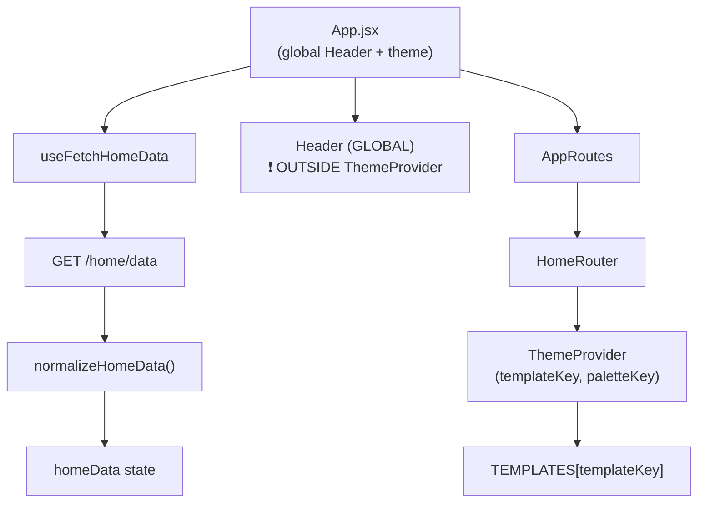

# Store Render Flow

Complete reference for debugging and understanding how NovaVision storefronts render.

## Quick Debug Checklist (30s)

1. ✅ `/home/data` returns 200 with payload?
2. ✅ `homeData.config.templateKey` exists and is valid key?
3. ✅ Console shows `[HomeRouter] Rendering template: xxx`?
4. ✅ No `Unknown templateKey` warning in console?
5. ✅ No duplicate Header in DOM?
6. ✅ Check for `opacity: 0` / `transform` stuck from animations
7. ✅ If 304 → check cache + retry log

---

## Architecture



> [!CAUTION]
> **Header is OUTSIDE ThemeProvider** (rendered in App.jsx before HomeRouter). Theme tokens for Header come from `novaVisionThemeFifth/Dark` hardcoded in App.jsx, NOT from HomeRouter's dynamic ThemeProvider.

---

## Payload Contract

### Minimum Viable Payload

```json
{
  "products": [],
  "totalItems": 0,
  "services": [],
  "banners": { "desktop": [], "mobile": [] },
  "faqs": [],
  "logo": null,
  "contactInfo": [],
  "socialLinks": null,
  "config": {
    "templateKey": "template_1"
  }
}
```

### Full Payload (with config)

```json
{
  "products": [...],
  "totalItems": 40,
  "services": [...],
  "banners": { "desktop": [...], "mobile": [...] },
  "faqs": [...],
  "logo": { "url": "...", "show_logo": true },
  "contactInfo": [...],
  "socialLinks": { "whatsApp": "...", "instagram": "..." },
  "config": {
    "templateKey": "template_1",
    "paletteKey": "starter_default",
    "themeConfig": null,
    "sections": [],
    "identity_config": { "banners": [...] }
  }
}
```

### Required Fields for Render

| Field                | Type                      | Required | Notes                             |
| -------------------- | ------------------------- | -------- | --------------------------------- |
| `products`           | array                     | ✅       | Empty array OK                    |
| `services`           | array                     | ✅       | Empty array OK                    |
| `banners`            | `{desktop:[], mobile:[]}` | ✅       | Both arrays required              |
| `config.templateKey` | string                    | ❌       | Defaults to `template_1`          |
| `config.sections`    | array                     | ❌       | If present, uses dynamic renderer |

---

## Render States

| State     | Trigger                          | UI                  |
| --------- | -------------------------------- | ------------------- |
| `loading` | `!homeData && !error`            | "Cargando datos..." |
| `success` | `homeData && !error`             | Normal render       |
| `error`   | `error` exists                   | Error message       |
| `empty`   | `homeData.products.length === 0` | Depends on template |

### Fetch Behavior

- **Mount**: Fetches once on mount
- **Cache**: 2 min local storage cache
- **304 Retry**: If 304 without cache → retries without ETag
- **Re-fetch**: Does NOT re-fetch on tenant change (user must refresh)

---

## Template Selection

```javascript
// HomeRouter.jsx - Defensive with logging
const FALLBACK_TEMPLATE = "template_1";
const SelectedHome = TEMPLATES[templateKey];

if (!SelectedHome) {
  console.warn(
    `[HomeRouter] Unknown templateKey="${templateKey}", falling back to "${FALLBACK_TEMPLATE}"`,
  );
}

const FinalHome = SelectedHome || TEMPLATES[FALLBACK_TEMPLATE];
```

### Valid Template Keys

| Key                     | Component     |
| ----------------------- | ------------- |
| `template_1` / `first`  | HomePageFirst |
| `template_2` / `second` | HomePage      |
| `template_3` / `third`  | HomePageThird |
| `template_4` / `fourth` | Home          |
| `template_5` / `fifth`  | Home          |

---

## Theme Provider Scope

```
App.jsx
├── ThemeProvider (App-level, hardcoded fifth theme)
│   ├── GlobalStyle
│   ├── Header  ← Uses App-level theme
│   └── AppRoutes
│       └── HomeRouter
│           └── ThemeProvider (template-specific)  ← Dynamic theme
│               └── SelectedHome
```

> [!IMPORTANT]
> **Two ThemeProviders exist**:
>
> 1. App.jsx: Uses `novaVisionThemeFifth/Dark` (light/dark toggle)
> 2. HomeRouter: Uses dynamic `templateKey + paletteKey`
>
> Components inside templates get HomeRouter's theme. Header gets App's theme.

---

## Template Responsibilities

| ✅ Templates DO                           | ❌ Templates DON'T             |
| ----------------------------------------- | ------------------------------ |
| Consume `homeData` prop                   | Fetch `/home/data`             |
| Render sections/products                  | Render Header                  |
| Use theme from provider                   | Define their own ThemeProvider |
| Handle `sections.length > 0` dynamic mode | Handle loading/error states    |

---

## Common Issues

### 1. Invisible Sections (Animations)

**Symptom**: Content in DOM but `opacity: 0`
**Cause**: `whileInView` + `initial="hidden"` never triggers
**Fix**: Use `animate="visible"` + `initial={false}`

### 2. Duplicate Header

**Symptom**: Two headers visible
**Cause**: Header in both App.jsx AND template
**Fix**: Templates must NOT render Header

### 3. 304 Without Cache

**Symptom**: Empty page after 304
**Cause**: Backend 304 but no local cache
**Fix**: Already handled with retry in homeService.jsx

### 4. Unknown Template Key

**Symptom**: Console warning + wrong template
**Cause**: Backend sends invalid `templateKey`
**Fix**: Check `config.templateKey` in payload

### 5. Theme Mismatch Header

**Symptom**: Header colors wrong vs content
**Cause**: Header outside dynamic ThemeProvider
**Fix**: Known limitation - Header uses App-level theme

---

## Files Reference

| File                                | Purpose                               |
| ----------------------------------- | ------------------------------------- |
| `App.jsx`                           | Entry, global Header, app-level theme |
| `routes/AppRoutes.jsx`              | Routes `/` → HomeRouter               |
| `routes/HomeRouter.jsx`             | Template selection, ThemeProvider     |
| `registry/templatesMap.ts`          | Key → Component map                   |
| `services/homeData/homeService.jsx` | API fetch + normalize                 |
| `utils/normalizeHomeData.js`        | Dedup + array normalization           |
| `core/schemas/homeData.schema.ts`   | Zod validation schema                 |
