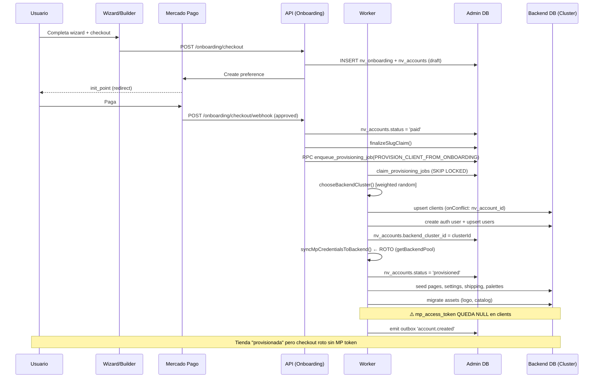

# Auditoría Crítica: Consistencia Cross-DB + Clusters (Data-Plane) + Provisioning E2E

- **Autor:** agente-copilot (Principal Data Architect + QA Lead + SRE)
- **Fecha:** 2026-02-27
- **Rama:** `feature/automatic-multiclient-onboarding`
- **Alcance:** Admin DB ↔ Backend DB ↔ Clusters ↔ Provisioning ↔ MP Credentials

---

## Executive Summary

| # | Hallazgo | Severidad | Estado |
|---|----------|-----------|--------|
| 1 | **`syncMpCredentialsToBackend()` está completamente roto** — usa `getBackendPool().query()` que lanza excepción; catch silencioso enmascara el fallo. Ninguna tienda nueva recibe `mp_access_token` en Backend DB. | **P0** | Sin fix |
| 2 | **Fallback de credenciales MP (`getClientCredentials`)` también roto** — depende de `getAccountForClient()` que usa `getBackendPool()`. El checkout falla para toda tienda nueva. | **P0** | Sin fix |
| 3 | **40 servicios usan token estático** (`SUPABASE_ADMIN_CLIENT`) que apunta al cluster default, ignorando `backend_cluster_id`. Incluye orders, cart, products, payments, shipping. | **P0** (latente) | Funciona solo con 1 cluster |
| 4 | **6 hardcodeos de `cluster_shared_01`** en `mp-oauth.service.ts`: sync, refresh, revoke de tokens MP siempre operan en cluster default. | **P0** (latente) | Funciona solo con 1 cluster |
| 5 | **`PROVISION_CLIENT_FROM_ONBOARDING` no escribe `plan_key`, `billing_period`, `locale`, `timezone`, `publication_status`** a Backend DB. | **P1** | Campos faltantes |
| 6 | **Outbox `account.updated` sincroniza solo 5 campos** (name, email, slug, is_active, plan). No incluye legal, billing_email, phone, country. | **P1** | Sync parcial |
| 7 | **No hay cron automático de reconciliación** — `getAccount360` detecta drift pero no repara nada y solo se ejecuta on-demand. | **P1** | Sin auto-fix |
| 8 | **Sin rollback/compensación en saga** — si provisioning falla a mitad, queda en estado parcial irreversible. | **P1** | Sin compensación |
| 9 | **`chooseBackendCluster()` no valida `status`** del cluster — puede asignar un cluster en error/maintenance. | **P2** | Sin validación |
| 10 | **`PROVISION_CLIENT` (legacy) es código muerto pero ejecutable** si alguien inserta un job manual en la tabla. | **P2** | Código zombie |

---

## 1) Arquitectura Confirmada (con evidencia)

### 1.1 Bases de Datos

| DB | Propósito | Acceso |
|----|-----------|--------|
| **Admin DB** | Onboarding, cuentas (`nv_accounts`), billing, suscripciones, credenciales MP (cifradas), plans, clusters | `SUPABASE_ADMIN_URL` + `SUPABASE_ADMIN_SERVICE_ROLE_KEY` vía `DbRouterService.getAdminClient()` |
| **Backend DB (clusters)** | Runtime de tiendas: `clients`, `products`, `orders`, `cart_items`, `users`, etc. | Resuelto dinámicamente por `DbRouterService.getBackendClient(clusterId)` o estáticamente por `SUPABASE_ADMIN_CLIENT` (legacy) |

### 1.2 Cluster Infrastructure

**Tabla `backend_clusters`** (Admin DB):
- Columnas: `cluster_id` (PK text), `supabase_url`, `service_role_key` (cifrada PGP), `db_url_encrypted`, `weight`, `is_active`, `status`, `last_error`, `display_name`, `last_cloned_from`, `last_cloned_at`, timestamps.
- Cifrado: `service_role_key` y `db_url` se almacenan con PGP vía RPCs (`set_backend_cluster_credentials`, `list_backend_clusters`).

**Evidencia:**
- [admin.service.ts L3513-3520](apps/api/src/admin/admin.service.ts#L3513): `listBackendClusters()` — SELECT de `backend_clusters`
- [admin.service.ts L3648](apps/api/src/admin/admin.service.ts#L3648): `upsertBackendCluster()` — RPC `set_backend_cluster_credentials`
- [admin.controller.ts L76-135](apps/api/src/admin/admin.controller.ts#L76): Endpoints CRUD (`GET/POST /admin/backend-clusters`)

**Admin UI:**
- [BackendClustersView.jsx](apps/admin/src/pages/AdminDashboard/BackendClustersView.jsx): Página Super Admin con tabla de clusters, formulario crear/editar, configurar DB URL, clonar schema.
- [adminApi.js L55](apps/admin/src/services/adminApi.js#L55): Service calls.

### 1.3 Routing Layer

**`DbRouterService`** ([db-router.service.ts](apps/api/src/db/db-router.service.ts)):

| Método | Descripción |
|--------|-------------|
| `onModuleInit()` | Carga clusters activos vía RPC `list_backend_clusters` (PGP decrypt). Fatal si no hay clusters. |
| `getBackendClient(clusterId?)` | Resuelve `SupabaseClient` por cluster. Cache lazy en `Map<string, SupabaseClient>`. Default: env `DEFAULT_BACKEND_CLUSTER_ID` o `cluster_shared_01`. |
| `chooseBackendCluster()` | Weighted random entre clusters activos en memoria. |
| `getClientBackendCluster(clientId)` | `clients.nv_account_id` → `nv_accounts.backend_cluster_id` → `getBackendClient(clusterId)`. Fallback a default. |
| `getBackendPool(clusterId)` | **ROTO** — retorna stub que lanza `throw new Error('Direct SQL queries not supported...')`. |

**`TenantContextGuard`** ([tenant-context.guard.ts](apps/api/src/guards/tenant-context.guard.ts)):
- Resuelve slug/domain → `nv_accounts { id, backend_cluster_id }` → `clients` en el cluster correcto.
- **NO propaga `backendClient`** al request. Solo setea `req.clientId`.
- Los services **no reciben** el cluster resuelto del guard → cada service debe resolver por su cuenta o usar el token legacy estático.

### 1.4 Dual Track: DbRouter vs Legacy Token

| Aspecto | DbRouterService (correcto) | `SUPABASE_ADMIN_CLIENT` (legacy) |
|---------|---------------------------|----------------------------------|
| **Resolución** | Dinámico por `backend_cluster_id` | Estático: env vars `SUPABASE_URL`+`SUPABASE_SERVICE_ROLE_KEY` |
| **Servicios** | 72+ archivos (guards, admin, billing, onboarding, worker, outbox) | **40 archivos** (orders, cart, products, payments, shipping, categories, etc.) |
| **Impacto** | Correcto con multi-cluster | **Ignora clusters**: siempre opera en cluster default |
| **Funciona hoy** | Sí | Sí (mientras haya 1 solo cluster) |

---

## 2) Mapa SoT + Invariantes

### 2.1 Source of Truth por campo

| Campo | Admin DB (`nv_accounts`) | Backend DB (`clients`) | SoT | Escritura | Sync mecanismo | Gap |
|-------|-------------------------|----------------------|-----|-----------|----------------|-----|
| `plan_key` / `plan` | `plan_key` | `plan`, `plan_key` | Admin | Onboarding, Subscriptions | Provisioning upsert + Outbox `plan.changed` | **FROM_ONBOARDING no escribe `plan_key`**, solo `plan` |
| `monthly_fee` | `plans.monthly_fee` | `monthly_fee` | Admin (`plans`) | Provisioning | Provisioning lee de `plans` y copia | OK |
| `billing_period` | `subscriptions` | `billing_period` | Admin | Provisioning | Outbox `plan.changed` (si payload incluye) | **FROM_ONBOARDING no lo escribe** |
| `status` / `is_active` | `status` (rich states) | `is_active`, `publication_status` | Admin | Admin, Subscriptions | Outbox `account.updated/suspended`, Cron D1-D2 (no auto-fix) | OK concepto, pero sin auto-fix |
| `mp_access_token` | `mp_access_token_encrypted` (cifrado) | `mp_access_token` (plain) | Admin | MpOauthService | `syncMpCredentialsToBackend()` | **ROTO**: `getBackendPool().query()` lanza error |
| `mp_public_key` | `mp_public_key` | `mp_public_key` | Admin | MpOauthService | Idem | **ROTO** |
| `slug` | `slug` | `slug` | Admin | Onboarding | Provisioning + Outbox `account.updated` + Cron D3 | OK |
| `entitlements` | Calculado (`plans` + `account_addons`) | `entitlements` JSONB | Admin | Provisioning, Subscriptions | Provisioning snapshot + Outbox `entitlements.synced` | **FROM_ONBOARDING ignora addons** |
| `country` | `country` | `country` | Admin | Onboarding | Provisioning copia | **Sin outbox sync post-provisioning** |
| `locale` / `timezone` | — (no existe) | `locale`, `timezone` | Backend (derivado) | Provisioning | Mapa `country→{locale,tz}` | **FROM_ONBOARDING no los escribe** |
| `publication_status` | — (no existe) | `publication_status` | Backend | Admin (`approveClient`), Subscriptions | Directo a Backend | **FROM_ONBOARDING no lo setea** |
| `email` / `email_admin` | `email` | `email_admin` | Admin | Onboarding | Provisioning + Outbox `account.updated` | OK |
| `phone` / `phone_full` | `phone`, `phone_full` | `phone`, `phone_full` | Admin | Onboarding | Provisioning copia | **Sin outbox sync post-provisioning** |
| `billing_email` | `billing_email` | `billing_email` | Admin | Onboarding | Provisioning copia | **Sin outbox sync post-provisioning** |
| `business_name` / `name` | `business_name` | `name` | Admin | Onboarding | Provisioning + Outbox `account.updated` | OK |
| Legal fields | Todos en `nv_accounts` | Replicados 1:1 | Admin | Onboarding | Provisioning copia | **Sin outbox sync post-provisioning** |
| `custom_domain` | `custom_domain` | `custom_domain` | Admin | ManagedDomainService | Sync manual | OK |

### 2.2 Invariantes que DEBEN cumplirse

| ID | Invariante | Estado | Evidencia |
|----|-----------|--------|-----------|
| **I1** | Un account `active/published` DEBE tener `backend_cluster_id` resuelto. | **CUMPLE parcialmente** | El provisioning siempre asigna cluster, pero no hay constraint DB que lo impida ser null. |
| **I2** | Asignación de cluster es estable e idempotente. | **CUMPLE** | `provisionClientFromOnboarding` reutiliza `account.backend_cluster_id` existente. |
| **I3** | Si cluster está `inactive`/error, NO se debe asignar nuevos tenants. | **NO CUMPLE** | `chooseBackendCluster()` opera sobre metadata en cache; `list_backend_clusters` RPC filtra `is_active=true` pero no `status`. |
| **I4** | `mp_access_token` DEBE existir en Backend DB si `mp_connected=true` en Admin. | **NO CUMPLE** | `syncMpCredentialsToBackend()` está roto (P0). |
| **I5** | `plan_key` en Backend DEBE coincidir con Admin. | **PARCIAL** | FROM_ONBOARDING no escribe `plan_key`. Outbox `plan.changed` sí lo sincroniza. |
| **I6** | Campos contractuales deben estar sincronizados cross-DB. | **NO CUMPLE** | 6+ campos sin outbox sync (legal, billing_email, phone, country). |
| **I7** | Provisioning no debe dejar tenant en estado "a medias". | **NO CUMPLE** | Sin rollback/compensación en saga. |

---

## 3) Auditoría de Clusters + Routing

### 3.1 Cómo se guarda un cluster

1. Super Admin → UI "Backend Clusters" → POST `/admin/backend-clusters`
2. [admin.service.ts L3648](apps/api/src/admin/admin.service.ts#L3648): `upsertBackendCluster()` → RPC `set_backend_cluster_credentials` (cifra PGP)
3. → `dbRouter.refreshBackendClusters()` recarga en memoria

### 3.2 Cómo se selecciona cluster para un nuevo tenant

1. `provisionClientFromOnboarding()` → `chooseBackendCluster()` (weighted random entre clusters activos en cache)
2. Se persiste en `nv_accounts.backend_cluster_id`
3. **No hay UI** para asignar cluster manualmente a un tenant
4. **No hay validación** de capacidad, salud, o status del cluster seleccionado

### 3.3 Cómo se hace routing en runtime

1. `TenantContextGuard` → `resolveAccountBySlug(slug)` → lee `backend_cluster_id` de `nv_accounts`
2. → `resolveClientByAccount(accountId, clusterId)` → `dbRouter.getBackendClient(clusterId)`
3. → Busca `clients` row en el cluster correcto → setea `req.clientId`

**PERO:** El guard **NO propaga `backendClient`** al request. Los servicios downstream (40 archivos) usan `SUPABASE_ADMIN_CLIENT` (estático, cluster default). Esto significa:

> **El routing del guard es correcto, pero los servicios ignoran esa resolución y operan siempre contra el cluster default.**

### 3.4 Gaps del routing

| Gap | Severidad | Detalle |
|-----|-----------|---------|
| Services legacy no usan cluster routing | **P0** (latente) | 40 archivos con `SUPABASE_ADMIN_CLIENT` estático. Funcionan solo con 1 cluster. |
| Guard no propaga `backendClient` | **P1** | Cada service re-resuelve o no resuelve. DX deficiente. |
| `getBackendPool()` es stub roto | **P0** | Cualquier código que use SQL directo falla silenciosamente. Afecta MP sync. |
| No hay fallback policy si cluster falla | **P2** | Si un cluster no responde, la request falla sin retry ni failover. |
| No hay TTL ni invalidación de cache de clusters | **P2** | Si se desactiva un cluster en Admin, el API sigue usándolo hasta un restart o `refreshBackendClusters()`. |

---

## 4) Auditoría de Provisioning Paths

### 4.1 Paths de provisioning

| Path | Handler | Trigger | Estado |
|------|---------|---------|--------|
| `PROVISION_CLIENT` | `provisionClient()` [L535](apps/api/src/worker/provisioning-worker.service.ts#L535) | **NINGUNO** (código muerto) | Legacy, pero ejecutable via insert manual |
| `PROVISION_CLIENT_FROM_ONBOARDING` | `provisionClientFromOnboarding()` [L710](apps/api/src/worker/provisioning-worker.service.ts#L710) | `handleCheckoutWebhook()` via RPC `enqueue_provisioning_job` | **ACTIVO** — path canónico |
| `SEED_TEMPLATE` | `seedTemplate()` [L187](apps/api/src/worker/provisioning-worker.service.ts#L187) | Sin trigger activo encontrado | Inactivo |
| `SYNC_ENTITLEMENTS` | `syncEntitlements()` [L1839](apps/api/src/worker/provisioning-worker.service.ts#L1839) | Sin trigger activo encontrado (probablemente via admin action) | Bajo demanda |
| `CLUSTER_CLONE_SCHEMA` | `cloneClusterSchema()` [L332](apps/api/src/worker/provisioning-worker.service.ts#L332) | Admin UI "Duplicar estructura" | Bajo demanda |

### 4.2 Flujo E2E: Builder → Tienda Live



### 4.3 Side effects por path

| Step | `PROVISION_CLIENT` (legacy) | `PROVISION_CLIENT_FROM_ONBOARDING` (activo) |
|------|---------------------------|----------------------------------------------|
| Upsert `clients` | `onConflict: 'slug'` | `onConflict: 'nv_account_id'` |
| Escribe `plan_key` | ✅ Sí | ❌ No (solo `plan`) |
| Escribe `billing_period` | ✅ `'monthly'` | ❌ No |
| Escribe `publication_status` | ✅ `'draft'` | ❌ No |
| Escribe `locale` / `timezone` | ✅ Derivado de country | ❌ No |
| Escribe `connection_type` | `'manual'` | `'mercadopago'` |
| Crea auth user en Multicliente | ❌ No | ✅ Sí |
| Migra assets (logo, catálogo) | ❌ No | ✅ Sí |
| Sync MP credentials | ✅ Intenta (pero roto) | ✅ Intenta (pero roto) |
| Emite outbox `account.created` | ✅ Sí | ❌ No |
| Notifications | ❌ No | ✅ Sí |
| Saga/resume (idempotente) | ❌ No | ✅ Sí (provisioning_job_steps) |
| Entitlements con addons | ✅ `calculateEntitlements()` | ❌ Solo `plans.entitlements` |

---

## 5) Inconsistencias Detectadas

### P0 — Bloquean funcionalidad core

| ID | Inconsistencia | Impacto | Evidencia |
|----|----------------|---------|-----------|
| **C1** | `syncMpCredentialsToBackend()` usa `getBackendPool().query()` que lanza error. Catch silencioso retorna `false`. | **Todo checkout de tienda nueva falla** — `clients.mp_access_token` queda null. | [mp-oauth.service.ts L961-964](apps/api/src/mp-oauth/mp-oauth.service.ts#L961) usa `getBackendPool('cluster_shared_01')`. [db-router.service.ts L156-164](apps/api/src/db/db-router.service.ts#L156) retorna stub que throws. |
| **C2** | Fallback `getClientCredentials()` → `getAccountForClient()` también usa `getBackendPool().query()`. | **Fallback de credenciales MP también falla** — el checkout no tiene ninguna vía para obtener tokens. | [mp-oauth.service.ts L832-835](apps/api/src/mp-oauth/mp-oauth.service.ts#L832) |
| **C3** | `refreshTokenForAccount()` sync a Backend DB usa `getBackendPool().query()`. | **Token refresh no se propaga** a Backend DB. Si se implementara el fix de C1, tokens expirarían sin actualización. | [mp-oauth.service.ts L601](apps/api/src/mp-oauth/mp-oauth.service.ts#L601) |
| **C4** | `revokeConnection()` backend cleanup usa `getBackendPool().query()`. | **Al desconectar MP, no se limpia `clients.mp_access_token`** — queda token stale. | [mp-oauth.service.ts L721](apps/api/src/mp-oauth/mp-oauth.service.ts#L721) |

### P0 (Latente) — Explotan al agregar segundo cluster

| ID | Inconsistencia | Impacto | Evidencia |
|----|----------------|---------|-----------|
| **C5** | 40 servicios core (orders, cart, products, payments, shipping) usan `SUPABASE_ADMIN_CLIENT` estático. | Operaciones de tienda irán al cluster equivocado para tenants fuera del default. | Ver tabla completa en sección 3. |
| **C6** | 6 hardcodeos de `cluster_shared_01` en `mp-oauth.service.ts`. | MP sync, refresh, revoke siempre operan en cluster default. | Líneas 601, 721, 832, 961 de mp-oauth.service.ts |

### P1 — Datos incompletos/inconsistentes

| ID | Inconsistencia | Impacto | Evidencia |
|----|----------------|---------|-----------|
| **C7** | `PROVISION_CLIENT_FROM_ONBOARDING` no escribe `plan_key`, `billing_period`, `locale`, `timezone`, `publication_status` a Backend DB. | Campos null o en column default; admin/storefront dependen de ellos. | Comparación de upserts en sección 4.3 |
| **C8** | Outbox `account.updated` solo mapea 5 campos (name, email, slug, is_active, plan). | Cambios post-provisioning en legal fields, billing_email, phone, country **no se sincronizan**. | [outbox-worker.service.ts L143-175](apps/api/src/outbox/outbox-worker.service.ts#L143) |
| **C9** | Outbox `mp_credentials.synced` es placeholder — solo verifica, no sincroniza. | Depende de `syncMpCredentialsToBackend()` que está roto (C1). | [outbox-worker.service.ts L335-365](apps/api/src/outbox/outbox-worker.service.ts#L335) |
| **C10** | Entitlements en FROM_ONBOARDING ignoran `account_addons`. | Si un account tiene addons al provisionar, no se reflejan.| Solo `calculateEntitlements()` (legacy + syncEntitlements) los aplica. |
| **C11** | `account.created` outbox escribe subset mínimo a clients (sin entitlements, template, country, billing_period). | Si fuera el único mecanismo de sync, los datos serían incompletos. | [outbox-worker.service.ts L110-140](apps/api/src/outbox/outbox-worker.service.ts#L110) |

### P1 — Gaps de reconciliación

| ID | Inconsistencia | Impacto | Evidencia |
|----|----------------|---------|-----------|
| **C12** | No hay cron automático de reconciliación — solo on-demand sin auto-fix. | Drift no se detecta proactivamente. | [admin.service.ts L3047](apps/api/src/admin/admin.service.ts#L3047): `getAccount360` no tiene cron wrapper. |
| **C13** | Reconciliación no verifica `mp_access_token` sync. | No hay check D5 para credenciales MP. Tiendas pueden estar funcionando sin tokens. | No existe check en `getAccount360`. |
| **C14** | Reconciliación no verifica `plan_key` mismatch. | No hay check D7 para plan correcto cross-DB. | No existe check en `getAccount360`. |

### P2 — Robustez

| ID | Inconsistencia | Impacto | Evidencia |
|----|----------------|---------|-----------|
| **C15** | Sin rollback/compensación en saga. | Provisioning partial deja tenant en estado irrecuperable sin intervención manual. | `runStep()` en [provisioning-worker.service.ts L1625](apps/api/src/worker/provisioning-worker.service.ts#L1625) solo tiene `running/done/failed`, sin compensating actions. |
| **C16** | `chooseBackendCluster()` no valida `status` del cluster. | Puede asignar cluster en `error`/`maintenance`. | [db-router.service.ts L191-203](apps/api/src/db/db-router.service.ts#L191) |
| **C17** | `PROVISION_CLIENT` es código zombie ejecutable. | Insert manual en `provisioning_jobs` con `job_type='PROVISION_CLIENT'` lo activa. | Handler en [provisioning-worker.service.ts L365](apps/api/src/worker/provisioning-worker.service.ts#L365) |
| **C18** | `syncEntitlements()` busca client por `slug` vs provisioning usa `nv_account_id`. | Si slug cambia post-provisioning, sync de entitlements falla silenciosamente. | [provisioning-worker.service.ts L1852-1855](apps/api/src/worker/provisioning-worker.service.ts#L1852) |

---

## 6) Root Cause Analysis

### RCA-1: `getBackendPool` fue invalidado sin migrar los consumers

**Root cause:** Se migró la capa de DB de `pg Pool` a `Supabase JS client`, y `getBackendPool()` fue reemplazado por un stub que lanza error. Pero **6 callers en `mp-oauth.service.ts`** no fueron migrados. El catch silencioso (`return false`) enmascara completamente el fallo.

**Cadena de impacto:**
```
getBackendPool() retorna stub → .query() throws → catch → return false
  → provisionClient/FromOnboarding warn "Failed to sync MP credentials"
  → clients.mp_access_token = null
  → checkout intenta fast path (clients table) → null
  → checkout intenta fallback (getClientCredentials) → getAccountForClient → getBackendPool → throws → null
  → checkout throws MP_NOT_CONFIGURED
  → Usuario ve "Este comercio no tiene Mercado Pago configurado"
```

### RCA-2: Dos paths de provisioning divergentes

El path legacy (`PROVISION_CLIENT`) y el nuevo (`PROVISION_CLIENT_FROM_ONBOARDING`) escriben campos diferentes. El legacy fue parcheado con campos que el nuevo nunca recibió (`plan_key`, `billing_period`, `locale`, `timezone`, `publication_status`). Aunque el legacy está "muerto", los fixes aplicados ahí no se reflejaron en el path activo.

### RCA-3: Guard correcto, services ignore el routing

`TenantContextGuard` resuelve correctamente el cluster por tenant, pero **no propaga** el `backendClient` resuelto. Los 40 servicios legacy inyectan `SUPABASE_ADMIN_CLIENT` estático. No hay un patrón architectural que fuerce el uso del cluster correcto en la capa de servicio.

### RCA-4: Outbox sync incompleto

El mecanismo outbox fue diseñado para sync incremental, pero el handler `account.updated` solo mapea 5 campos. 15+ campos (legal, billing, phone, country) no tienen vía de sincronización post-provisioning. La tabla `account_sync_outbox` tiene la infraestructura correcta, pero los handlers son incompletos.

### RCA-5: No hay test que valide el flujo E2E de provisioning + checkout

No existe test de integración que ejecute el flujo completo: pago → provisioning → checkout. Si existiera, el fallo de MP credentials se habría detectado.

---

## 7) Fix Plan por Fases

### Fase 0 — Stop the Bleed (P0) — Inmediato

| # | Fix | Esfuerzo | Riesgo |
|---|-----|----------|--------|
| **F0.1** | **Migrar `syncMpCredentialsToBackend()` de `getBackendPool().query()` a `dbRouter.getBackendClient().from().update()`**. Aceptar `accountId` + `clientId` + `clusterId` opcional. Resolver cluster de `nv_accounts.backend_cluster_id`. | 2h | Bajo |
| **F0.2** | **Migrar `getAccountForClient()` a Supabase JS** — usar `dbRouter.getBackendClient(account.backend_cluster_id).from('clients')`. | 1h | Bajo |
| **F0.3** | **Migrar `refreshTokenForAccount()` sync** a Supabase JS. | 1h | Bajo |
| **F0.4** | **Migrar `revokeConnection()` cleanup** a Supabase JS. | 1h | Bajo |
| **F0.5** | **Eliminar `getBackendPool()`** — hacer que lance error con mensaje claro sobre qué usar en su lugar. O mejor: remover y compilar para encontrar callers no migrados. | 30min | Bajo |
| **F0.6** | **Script de reconciliación MP** — para todos los accounts con `mp_connected=true`, verificar que `clients.mp_access_token` no sea null. Si lo es, ejecutar el sync correcto. | 1h | Medio (requiere acceso a ambas DBs) |
| **F0.7** | **Agregar campos faltantes en `PROVISION_CLIENT_FROM_ONBOARDING`**: `plan_key`, `billing_period: 'monthly'`, `publication_status: 'draft'`, `locale`, `timezone`. | 1h | Bajo |
| **F0.8** | **Deshabilitar `PROVISION_CLIENT` legacy** — remover del switch/case o hacer que redirija al path FROM_ONBOARDING. | 30min | Bajo |

### Fase 1 — Outbox + Reconciliación (P1) — Semana 1-2

| # | Fix | Esfuerzo |
|---|-----|----------|
| **F1.1** | **Ampliar `account.updated` handler** para incluir: `billing_email`, `phone`, `phone_full`, `country`, `persona_type`, `legal_name`, `fiscal_id`, `fiscal_id_type`, `fiscal_category`, `fiscal_address`, `subdivision_code`. | 3h |
| **F1.2** | **Implementar `mp_credentials.synced` handler real** — que descifre y escriba tokens al cluster correcto (usando `dbRouter.getBackendClient()'). | 2h |
| **F1.3** | **Crear cron automático de reconciliación** — cada 6h, ejecutar checks D1-D7 con auto-fix para P0 checks (D1, D2) y alertas para el resto. | 4h |
| **F1.4** | **Agregar check D5 (MP credentials)** — verificar que accounts con `mp_connected=true` tengan `clients.mp_access_token` non-null. | 1h |
| **F1.5** | **Agregar check D7 (plan_key mismatch)** — comparar plan_key cross-DB. | 1h |
| **F1.6** | **Agregar addons a entitlements en FROM_ONBOARDING** — usar `calculateEntitlements()` en vez de `plans.entitlements` directo. | 2h |

### Fase 2 — Routing Real + Hardening (P0 latente) — Semana 2-4

| # | Fix | Esfuerzo |
|---|-----|----------|
| **F2.1** | **Propagar `backendClient` desde TenantContextGuard** — setear `req.backendClient = resolvedClient` y crear decorador `@BackendClient()` para inyectarlo en controllers/services. | 4h |
| **F2.2** | **Migrar servicios P0** (orders, cart, products, payments, shipping, MercadoPago) de `SUPABASE_ADMIN_CLIENT` a `req.backendClient`. | 16h (6 servicios × 2-3h) |
| **F2.3** | **Migrar servicios P1** (categories, users, favorites, banners, etc.) — misma migración. | 12h |
| **F2.4** | **Eliminar `SUPABASE_ADMIN_CLIENT` del SupabaseModule** una vez migrados todos los consumers. | 2h |
| **F2.5** | **Validar `status` en `chooseBackendCluster()`** — filtrar clusters con `status !== 'ready'` o `status === 'error'`. | 1h |
| **F2.6** | **Cache invalidation para clusters** — TTL de 5min o webhooks de admin para hot-reload cuando un cluster cambia. | 2h |

### Fase 3 — Compensación + Observabilidad — Semana 4-6

| # | Fix | Esfuerzo |
|---|-----|----------|
| **F3.1** | **Agregar compensating actions a la saga** — si step N falla, revertir steps N-1..1 donde sea posible (ej: si upsert client OK pero auth user falla → marcar client para cleanup). | 8h |
| **F3.2** | **Dashboard de health por cluster** — métricas: tenants asignados, tasa de error, latencia. | 6h |
| **F3.3** | **Alertas** — PagerDuty/Slack para: provisioning fallo, MP sync fallo, drift detectado, cluster unhealthy. | 3h |
| **F3.4** | **Dead letter queue visible** — UI admin para ver y reintentar jobs fallidos. | 4h |
| **F3.5** | **Audit log para cambios de cluster** — lifecycle_events al mover tenant entre clusters. | 2h |

---

## 8) Plan de Pruebas

### 8.1 Smoke Test Manual (Staging) — 20 pasos

| # | Paso | Verificación |
|---|------|-------------|
| 1 | Abrir builder/wizard | Carga sin errores |
| 2 | Completar datos de negocio (nombre, legal, país) | Se guardan en `nv_accounts` |
| 3 | Seleccionar plan | `plan_key` correcto en `nv_accounts` |
| 4 | Conectar Mercado Pago | `mp_connected=true`, `mp_access_token_encrypted` non-null |
| 5 | Continuar a checkout | Preferencia de MP creada |
| 6 | Pagar (sandbox) | Webhook recibido, `status=paid` en `nv_accounts` |
| 7 | Verificar slug claim | `slug_reservations` → claimed permanente |
| 8 | Esperar provisioning (≤30s) | `provisioning_jobs.status='completed'` |
| 9 | Verificar `nv_accounts.backend_cluster_id` | Non-null, cluster válido |
| 10 | Verificar `clients` row en Backend DB | Existe, con `nv_account_id` correcto |
| 11 | Verificar `clients.plan_key` | Coincide con `nv_accounts.plan_key` |
| 12 | Verificar `clients.monthly_fee` | Coincide con `plans.monthly_fee` para ese plan |
| 13 | Verificar `clients.mp_access_token` | **Non-null** (hoy falla — C1) |
| 14 | Verificar `clients.mp_public_key` | Non-null |
| 15 | Verificar `clients.locale` / `timezone` | Derivados de country |
| 16 | Verificar auth user en Multicliente Auth | Existe con email correcto |
| 17 | Verificar `users` row en Backend DB | Role=admin, client_id correcto |
| 18 | Abrir tienda por slug (`{slug}.novavision.lat`) | Resuelve correctamente |
| 19 | Agregar producto al carrito y checkout | **Checkout crea preferencia MP** (hoy falla — C1) |
| 20 | Pagar producto (sandbox) | Webhook confirma orden, stock actualizado |

### 8.2 Tests Automáticos Sugeridos

#### Integration Tests (no requieren MP real)

```typescript
// 1. Provisioning idempotente
describe('PROVISION_CLIENT_FROM_ONBOARDING', () => {
  it('should assign cluster and persist backend_cluster_id', async () => { ... });
  it('should be idempotent on retry (same cluster, same client)', async () => { ... });
  it('should write plan_key, billing_period, locale, timezone', async () => { ... });
  it('should sync MP credentials from Admin to Backend DB', async () => { ... });
  it('should NOT assign inactive cluster', async () => { ... });
});

// 2. Cluster selection
describe('chooseBackendCluster', () => {
  it('should select single cluster deterministically', async () => { ... });
  it('should respect weights (1000 samples, χ² test)', async () => { ... });
  it('should skip clusters with status=error', async () => { ... }); // FALLA hoy
});

// 3. MP credential sync
describe('syncMpCredentialsToBackend', () => {
  it('should write plain-text token to clients table', async () => { ... }); // FALLA hoy
  it('should use correct cluster (not hardcoded)', async () => { ... }); // FALLA hoy
  it('should handle missing encrypted token gracefully', async () => { ... });
});

// 4. Outbox sync
describe('OutboxWorker account.updated', () => {
  it('should sync ALL contractual fields', async () => { ... }); // FALLA hoy para 10+ campos
  it('should route to correct cluster', async () => { ... });
});

// 5. Routing: 2 tenants en 2 clusters
describe('Multi-cluster routing', () => {
  it('same operation on tenant A and B should hit different clusters', async () => { ... });
});
```

#### E2E Test (requiere staging con MP sandbox)

```typescript
describe('Provisioning → Checkout E2E', () => {
  it('full flow: wizard → pay → provision → store live → checkout', async () => {
    // 1. Create account via onboarding API
    // 2. Simulate MP payment webhook (approved)
    // 3. Wait for provisioning job to complete
    // 4. Verify all fields in Backend DB
    // 5. Hit store endpoint + create preference
    // 6. Simulate buyer checkout webhook
    // 7. Verify order confirmed
  });
});
```

---

## 9) Queries/Scripts de Drift Detection (no destructivos)

### 9.1 Drift: MP credentials (C1)

```sql
-- Admin DB: accounts con MP conectado
SELECT a.id, a.slug, a.mp_connected, a.backend_cluster_id,
       CASE WHEN a.mp_access_token_encrypted IS NOT NULL THEN 'HAS_TOKEN' ELSE 'NO_TOKEN' END as admin_token
FROM nv_accounts a
WHERE a.mp_connected = true AND a.status IN ('provisioned', 'approved', 'live')
ORDER BY a.slug;

-- Backend DB: clients con MP token
SELECT c.id, c.slug, c.nv_account_id,
       CASE WHEN c.mp_access_token IS NOT NULL THEN 'HAS_TOKEN' ELSE 'NULL_TOKEN' END as backend_token,
       CASE WHEN c.mp_public_key IS NOT NULL THEN 'HAS_KEY' ELSE 'NULL_KEY' END as backend_key
FROM clients c
WHERE c.nv_account_id IN (
  SELECT id FROM nv_accounts WHERE mp_connected = true
)
ORDER BY c.slug;

-- DRIFT: accounts con MP connected pero sin token en Backend
-- Ejecutar en Backend DB comparando con resultado de query 1
SELECT c.slug, c.nv_account_id
FROM clients c
WHERE c.mp_access_token IS NULL
  AND c.nv_account_id IS NOT NULL;
```

### 9.2 Drift: plan_key mismatch

```sql
-- Requiere acceso a ambas DBs
-- Admin DB:
SELECT id, slug, plan_key FROM nv_accounts WHERE status IN ('provisioned','approved','live');

-- Backend DB:
SELECT nv_account_id, slug, plan, plan_key FROM clients WHERE nv_account_id IS NOT NULL;

-- Comparar: donde admin.plan_key != backend.plan_key OR backend.plan_key IS NULL
```

### 9.3 Drift: campos contractuales

```sql
-- Backend DB: campos que deberían tener valor pero son null
SELECT slug, nv_account_id,
  CASE WHEN plan_key IS NULL THEN 'MISSING' ELSE 'OK' END as plan_key_check,
  CASE WHEN billing_period IS NULL THEN 'MISSING' ELSE 'OK' END as billing_period_check,
  CASE WHEN locale IS NULL THEN 'MISSING' ELSE 'OK' END as locale_check,
  CASE WHEN timezone IS NULL THEN 'MISSING' ELSE 'OK' END as timezone_check,
  CASE WHEN publication_status IS NULL THEN 'MISSING' ELSE 'OK' END as pub_status_check,
  CASE WHEN country IS NULL THEN 'MISSING' ELSE 'OK' END as country_check
FROM clients
WHERE nv_account_id IS NOT NULL
ORDER BY slug;
```

### 9.4 Drift: accounts sin cluster

```sql
-- Admin DB: accounts provisionados sin cluster
SELECT id, slug, status, backend_cluster_id
FROM nv_accounts
WHERE status IN ('provisioned', 'approved', 'live')
  AND (backend_cluster_id IS NULL OR backend_cluster_id = '');
```

### 9.5 Health por cluster

```sql
-- Admin DB: distribución de tenants por cluster
SELECT a.backend_cluster_id, bc.is_active, bc.status,
       COUNT(*) as tenant_count,
       COUNT(*) FILTER (WHERE a.status = 'live') as live_count
FROM nv_accounts a
LEFT JOIN backend_clusters bc ON bc.cluster_id = a.backend_cluster_id
WHERE a.status IN ('provisioned', 'approved', 'live')
GROUP BY a.backend_cluster_id, bc.is_active, bc.status;

-- Admin DB: últimos errores de provisioning (últimas 24h)
SELECT job_type, status, error_message, created_at, completed_at
FROM provisioning_jobs
WHERE status = 'failed' AND created_at > NOW() - INTERVAL '24 hours'
ORDER BY created_at DESC;

-- Admin DB: outbox fallidos
SELECT event_type, status, error_message, attempt_count, created_at
FROM account_sync_outbox
WHERE status = 'failed'
ORDER BY created_at DESC
LIMIT 20;
```

### 9.6 Script de reconciliación MP (fix, usar con precaución)

```sql
-- ⚠️ SOLO EJECUTAR DESPUÉS DE CORREGIR syncMpCredentialsToBackend (F0.1)
-- Este script identifica accounts que necesitan re-sync
SELECT a.id as account_id, a.slug, a.backend_cluster_id
FROM nv_accounts a
WHERE a.mp_connected = true
  AND a.mp_access_token_encrypted IS NOT NULL
  AND a.status IN ('provisioned', 'approved', 'live')
  AND a.backend_cluster_id IS NOT NULL
  AND NOT EXISTS (
    SELECT 1 FROM clients c 
    WHERE c.nv_account_id = a.id 
      AND c.mp_access_token IS NOT NULL
  );
-- Para cada resultado, invocar syncMpCredentialsToBackend(account_id, client_id)
```

---

## 10) Guardrails Anti-Regresión

### 10.1 Validaciones "Fail Fast"

| Guardrail | Dónde | Implementar |
|-----------|-------|-------------|
| `getBackendPool()` debe ser eliminado o lanzar error descriptivo | `db-router.service.ts` | Ya lanza error, pero los callers lo silencian. **Remover el método completamente** y compilar para encontrar callers. |
| Provisioning debe validar cluster `status=ready` antes de asignar | `chooseBackendCluster()` | Filtrar entries con `status !== 'ready'` (o meta que no incluya status). |
| `clients.mp_access_token` debe ser non-null post-sync | `syncMpCredentialsToBackend()` | Verificar con SELECT después del UPDATE; lanzar error si sigue null. |
| Provisioning job debe tener max_retries con DLQ | `processJobs()` | Ya tiene (check), pero verificar que DLQ genere alerta. |

### 10.2 Constraints DB sugeridos

```sql
-- Backend DB: plan_key NOT NULL (con default para migración)
ALTER TABLE clients ALTER COLUMN plan_key SET NOT NULL DEFAULT 'starter';

-- Backend DB: nv_account_id UNIQUE (ya debería existir por onConflict)
-- Verificar: 
SELECT nv_account_id, COUNT(*) FROM clients GROUP BY nv_account_id HAVING COUNT(*) > 1;

-- Admin DB: backend_cluster_id FK a backend_clusters
-- ALTER TABLE nv_accounts ADD CONSTRAINT fk_backend_cluster 
--   FOREIGN KEY (backend_cluster_id) REFERENCES backend_clusters(cluster_id);
-- ⚠️ Requiere verificar que todos los valores existentes sean válidos primero.
```

### 10.3 Observabilidad

| Métrica | Fuente | Alerta si... |
|---------|--------|-------------|
| `provisioning.job.failed` | provisioning_jobs con status=failed | > 0 en últimas 2h |
| `provisioning.mp_sync.failed` | log `[syncMpToBackend] Failed` | > 0 |
| `outbox.event.failed` | account_sync_outbox con status=failed | > 5 en últimas 6h |
| `drift.mp_token_null` | Query 9.1 | > 0 accounts con mp_connected pero token null |
| `drift.plan_mismatch` | Query 9.2 | > 0 |
| `cluster.error_rate` | Query 9.5 + provisioning failures por cluster | > 10% |
| `checkout.mp_not_configured` | log `MP_NOT_CONFIGURED` | > 0 |

---

## 11) MISSING / Información Bloqueante

| # | Missing | Why It Matters | How to Confirm |
|---|---------|----------------|----------------|
| M1 | **¿Cuántos clusters activos existen hoy?** | Si solo hay 1, los P0 latentes (C5-C6) no impactan aún. | `SELECT * FROM backend_clusters;` en Admin DB |
| M2 | **¿Hay tiendas con checkout funcional hoy?** | Si C1 es correcto, ninguna tienda nueva debería poder hacer checkout. ¿Todas fueron arregladas manualmente? | `SELECT slug, mp_access_token IS NOT NULL as has_token FROM clients WHERE nv_account_id IS NOT NULL;` |
| M3 | **¿El RPC `list_backend_clusters` filtra por `is_active`?** | Si no filtra, clusters inactivos podrían ser seleccionados. | Ver definición de la función RPC en Admin DB |
| M4 | **¿Existe `client.nv_account_id` UNIQUE constraint?** | Si no, provisioning podría crear duplicados (legacy usa `onConflict: slug`, nuevo usa `onConflict: nv_account_id`). | `\d clients` en Backend DB |
| M5 | **¿Los logs de producción muestran `[syncMpToBackend] Failed`?** | Confirmaría que C1 está ocurriendo en producción. | Buscar en logs de Railway: `"Failed to sync MP credentials"` |
| M6 | **¿Existe un refund automático si provisioning falla completamente?** | Si no, el usuario pagó pero no tiene tienda. | Buscar `refund` en onboarding/provisioning code |

---

## 12) Priorización Final

```
URGENTE (esta semana):
├─ F0.1: Fix syncMpCredentialsToBackend → Supabase JS        ← DESBLOQUEA CHECKOUT
├─ F0.2: Fix getAccountForClient → Supabase JS               ← DESBLOQUEA FALLBACK
├─ F0.3-F0.4: Fix refresh/revoke → Supabase JS               ← COMPLETA MP LIFECYCLE
├─ F0.5: Eliminar getBackendPool                              ← PREVIENE REGRESIÓN
├─ F0.6: Script reconciliación MP para tiendas existentes     ← FIX DATOS PRODUCCIÓN
├─ F0.7: Campos faltantes en FROM_ONBOARDING                  ← DATOS COMPLETOS
└─ F0.8: Deshabilitar PROVISION_CLIENT legacy                  ← REDUCE SURFACE

SEMANA 1-2:
├─ F1.1-F1.2: Ampliar outbox handlers                         ← SYNC COMPLETO
├─ F1.3-F1.5: Cron reconciliación + checks nuevos             ← DETECCIÓN PROACTIVA
└─ F1.6: Addons en entitlements                                ← CORRECTITUD

SEMANA 2-4:
├─ F2.1: Propagar backendClient desde guard                    ← ARQUITECTURA
├─ F2.2-F2.3: Migrar 40 servicios legacy                      ← MULTI-CLUSTER READY
└─ F2.5-F2.6: Cluster health validation + cache               ← ROBUSTEZ

SEMANA 4-6:
├─ F3.1: Compensating actions en saga                          ← RESILIENCIA
├─ F3.2-F3.3: Dashboard + alertas                              ← OBSERVABILIDAD
└─ F3.4-F3.5: DLQ UI + audit log clusters                     ← OPERABILIDAD
```
