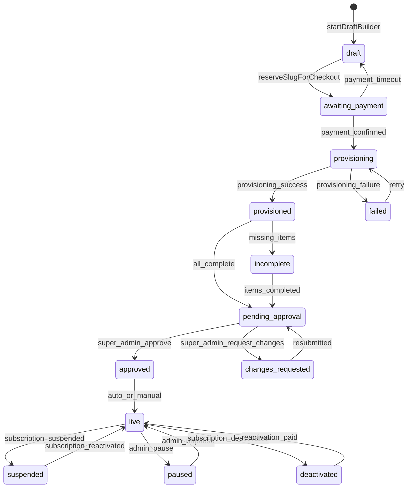

# Auditoría End-to-End: Ciclo de Vida Cliente/Tienda — NovaVision

> **Fecha:** 2026-02-06 (actualizado: verificaciones duras)  
> **Autor:** Copilot Agent (Senior Fullstack + Data + Product-Ops)  
> **Rama:** feature/automatic-multiclient-onboarding  
> **Método:** Inspección de DB real (Admin + Multicliente), código fuente, docs existentes  
> **Verificaciones:** V1-V6 ejecutadas contra DB prod via Supabase REST API

---

## Summary Ejecutivo: Top 10 Riesgos

| # | Riesgo | Sev. | Evidencia | Estado |
|---|--------|------|-----------|--------|
| **R1** | `mp_connections` referenciada en código pero **no existe** como tabla. MP tokens viven en columnas de `nv_accounts` directamente. | **P2** *(corregido de P0 — error silencioso, no impacta operación)* | `psql \d mp_connections` → ERROR; código en `provisioning-worker.service.ts:L930` hace upsert a `mp_connections` | Sin tabla |
| **R2** | `categories.name` **puede** tener UNIQUE global activo ADEMÁS del correcto por tenant. Ya existe migración `202503081310_unique_indexes_catalog.sql` que crea `ux_categories_client_id_name(client_id, name)`, pero no hay evidencia de que droppeara el viejo `categories_name_key`. | **P0→P1** | Migración correcta existe en `migrations/backend/`. Con 11 categorías y 0 duplicados globales, no colisionó AÚN. Requiere verificación directa via psql de si `categories_name_key` sigue activo. | Por verificar |
| **R3** | No existe entidad "Customer" estable. `nv_accounts` es 1:1 con store. Multi-store por mismo dueño NO es posible sin duplicar cuenta. | **P1** | Schema: `nv_accounts` no tiene `customer_id` externo; `clients.nv_account_id` es FK 1:1. | By design (gap) |
| **R4** | `leads` no tiene FK ni vínculo a `nv_accounts`. Imposible trazar lead → account → store → pagos en una consulta. | **P1** | `leads` tabla tiene `email`, `phone` pero no `account_id`. No hay índice por email. | Sin CRM link |
| **R5** | `provisioning_jobs` siempre vacía (0 rows). Jobs completados se eliminan, perdiendo audit trail de provisioning. | **P1** | `SELECT count(*) FROM provisioning_jobs` = 0; trigger/cron probablemente DELETE en succeed | Sin audit trail |
| **R6** | `nv_billing_events` vacía (0 rows). El "billing hub" existe en schema pero nunca se usa en producción. | **P1** | `SELECT count(*) FROM nv_billing_events` = 0 | Dead feature |
| **R7** | No hay state machine enforcement. `nv_accounts.status` acepta cualquier string; transiciones inválidas son posibles (ej: `draft` → `approved` sin pasar por `provisioned`). | **P1** | Columna `status TEXT`, sin CHECK constraint ni trigger de validación | Sin guardrails |
| **R8** | Aprobación no es atómica. Si falla provisioning pero `nv_accounts.status` ya dice `approved`, queda inconsistente. `approveClient()` hace ~10 writes secuenciales sin transacción. | **P1** | `admin.service.ts:approveClient()` — cada write puede fallar independientemente | Riesgo de inconsistencia |
| **R9** | Baja por falta de pago: `pauseStoreIfNeeded()` cambia `publication_status` en multicliente pero no hay mecanismo para verificar que la tienda realmente dejó de servir. No hay health check post-pausa. | **P2** | `subscriptions.service.ts:pauseStoreIfNeeded()` — fire-and-forget | Sin verificación |
| **R10** | 25+ índices en tabla `orders` de multicliente, muchos duplicados. Performance impact en writes. | **P2** | `pg_indexes WHERE tablename='orders'` → 25 entries con 3-4 duplicados sobre `external_reference` y `payment_id` | Deuda técnica |

---

## Índice

- [A. Entidades Reales y Relaciones](#a-entidades-reales-y-relaciones)
- [B. Flujo AS-IS](#b-flujo-as-is)
- [C. Gaps vs Documentación](#c-gaps-vs-documentación)
- [D. Flujo TO-BE](#d-flujo-to-be)
- [E. Matriz de Estados + Transiciones](#e-matriz-de-estados--transiciones)
- [F. Seguimiento Comercial (CRM)](#f-seguimiento-comercial-crm)
- [G. Multi-tienda por Cliente](#g-multi-tienda-por-cliente)
- [H. Billing Lifecycle + Baja/Reactivación](#h-billing-lifecycle--bajareactivación)
- [I. Edge Cases (58 casos)](#i-edge-cases-58-casos)
- [J. RCA Top 3 Inconsistencias](#j-rca-top-3-inconsistencias)
- [K. Fix Plan](#k-fix-plan)
- [L. Backfill / Reconcile Plan](#l-backfill--reconcile-plan)
- [M. Monitoreo y Alertas](#m-monitoreo-y-alertas)
- [N. Checklist de Pruebas](#n-checklist-de-pruebas)
- [O. PR Checklist](#o-pr-checklist)
- [P. Verificaciones Duras (V1-V6)](#p-verificaciones-duras-v1-v6)

---

## P. Verificaciones Duras (V1-V6)

> Ejecutadas el 2026-02-06 contra DB de producción via Supabase REST API.

### V1 — ¿Existe `mp_connections`?

```
GET /rest/v1/mp_connections?select=count&limit=1
→ PGRST205: "Could not find the table 'public.mp_connections' in the schema cache"
→ Hint: "Perhaps you meant the table 'public.wa_conversations_view'"
```

**Resultado: CONFIRMADO — no existe.**

### V2 — ¿Dónde viven MP tokens?

Columnas reales de `nv_accounts` con prefijo `mp_`:

| Columna | Valor (ejemplo account mp_connected=false) |
|---------|---------------------------------------------|
| `mp_access_token_encrypted` | null |
| `mp_public_key` | null |
| `mp_refresh_token` | null |
| `mp_user_id` | null |
| `mp_connected` | false |
| `mp_live_mode` | false |
| `mp_connected_at` | null |
| `mp_expires_in` | null |
| `mp_connection_status` | 'disconnected' |
| `mp_validated_at` | null |

**Resultado: Tokens viven en `nv_accounts`.** Nota: es `mp_access_token_encrypted`, no `mp_access_token` (el doc original tenía el nombre incorrecto).

### V3 — ¿El UNIQUE global de categories existe?

- **Migración correcta encontrada:** `migrations/backend/202503081310_unique_indexes_catalog.sql` crea `ux_categories_client_id_name(client_id, name)`.
- **El CREATE TABLE original** de categories NO está versionado en el repo (fue creado manualmente).
- **No se pudo confirmar vía REST** si `categories_name_key` (global) sigue activo.

**Resultado: PARCIAL — requiere verificación vía psql directa:**
```sql
SELECT indexname, indexdef FROM pg_indexes 
WHERE schemaname='public' AND tablename='categories';
```

### V4 — ¿Hay duplicados que rompan el nuevo índice?

```
Total categories: 11
Global name duplicates: NONE
Per-tenant duplicates: NONE
Distinct client_ids: 3
  954a8431... => 4 cats: Demo • General, Demo • Indumentaria, Demo • Hogar, Demo • Electrónica
  ab11b789... => 4 cats: Tecnología, Accesorios, Energía, Fundas
  f2d3f270... => 3 cats: Remeras Personalizadas, Diseños Exclusivos, Arte & Diseño
```

**Resultado: 0 duplicados — migración de fix es safe.**

### V5 — ¿Hay código que "pausea" pero no "unpausea"?

- `pauseStoreIfNeeded()` existe en `subscriptions.service.ts` y se invoca en **5 puntos**.
- Grep exhaustivo: **0 matches** para `unpause`, `reactivate`, `resume`, `publication_status.*published` en `subscriptions/`.

**Resultado: CONFIRMADO P0 — no existe función inversa.**

### V6 — UI "Suscripción: -" o vacío

**Admin app (`BillingPage.tsx`):**
```typescript
const subStatus = subscription?.status || account?.subscription_status || 'unknown';
```
- Si `subscription` es null Y `account.subscription_status` es null → `subStatus = 'unknown'`
- El mapping de labels no incluye `'unknown'` → se muestra string crudo o vacío.
- El `SubscriptionExpiredBanner` no se renderiza si `subscription` es null.

**Web storefront:** 0 references a subscription_status. El storefront no sabe de billing (correcto por diseño). La protección es server-side via `TenantContextGuard` que chequea `publication_status`.

**Resultado: CONFIRMADO — UI muestra estado vacío/unknown cuando no hay subscription.**

---

## A. Entidades Reales y Relaciones

### A.1 Diagrama de Entidades (evidencia de DB real)

```mermaid
erDiagram
    %% ═══ ADMIN DB (erbfzlsznqsmwmjugspo) ═══
    nv_accounts {
        uuid id PK
        text email UK
        text slug UK
        text status "draft|awaiting_payment|provisioned|incomplete|pending_approval|approved|live|suspended"
        text plan_key FK
        text subscription_status "mirror de subscriptions.status"
        boolean mp_connected
        boolean identity_verified
        uuid user_id "Supabase Auth UID"
        text backend_cluster_id FK
        text business_name
        text phone
        timestamptz approved_at
        boolean is_published
        timestamptz draft_expires_at
        text completion_notes
        text rejection_reason
    }

    nv_onboarding {
        uuid account_id PK_FK
        text state "nv_onboarding_state enum"
        jsonb builder_payload
        jsonb progress
        text plan_key_selected
        text selected_template_key
        text selected_palette_key
        jsonb selected_theme_override
        timestamptz paid_at
        timestamptz submitted_at
        timestamptz provisioned_at
        uuid client_id "backend client_id post-provision"
    }

    subscriptions {
        uuid id PK
        uuid account_id FK
        text plan_key
        text status "subscription_status enum"
        text mp_preapproval_id
        numeric monthly_price_ars
        numeric initial_price_ars
        text coupon_code
        timestamptz current_period_end
        timestamptz grace_until
        timestamptz canceled_at
        text cancel_reason
        timestamptz last_mp_synced_at
    }

    leads {
        uuid id PK
        text name
        text email
        text phone
        text source
        text status
        text notes
        timestamptz created_at
    }

    provisioning_jobs {
        uuid id PK
        uuid account_id FK
        text type "job_type enum"
        text status "nv_job_status enum"
        jsonb payload
        integer attempts
        integer max_attempts
        text error_message
    }

    plans {
        text plan_key PK
        text display_name
        numeric monthly_fee
        numeric setup_fee
        jsonb entitlements
        boolean recommended
        integer tier_level
    }

    slug_reservations {
        text slug PK
        uuid account_id FK
        timestamptz reserved_at
        timestamptz expires_at
    }

    client_completion_checklist {
        uuid account_id PK_FK
        text review_status
        jsonb review_items
        numeric completion_percentage
    }

    client_completion_events {
        uuid id PK
        uuid account_id FK
        text type
        jsonb payload
        text actor_id
        timestamptz created_at
    }

    nv_billing_events {
        uuid id PK
        uuid account_id FK
        text event_type "billing_event_type enum"
        numeric amount
        text status "billing_event_status enum"
        text provider_payment_id
        jsonb metadata
    }

    client_tombstones {
        uuid id PK
        uuid account_id
        text slug
        text reason
        timestamptz created_at
    }

    backend_clusters {
        text cluster_id PK
        text db_url_encrypted
        text status
    }

    %% ═══ MULTICLIENTE DB (ulndkhijxtxvpmbbfrgp) ═══
    clients {
        uuid id PK
        text slug UK
        text plan
        jsonb entitlements
        text publication_status "draft|pending_approval|published|paused|rejected"
        boolean is_active
        boolean is_published
        uuid nv_account_id FK
        text email_admin
        text template_id
        jsonb theme_config
        boolean maintenance_mode
        timestamptz approved_at
        timestamptz deleted_at
        boolean has_demo_data
        text custom_domain UK
    }

    users_mc {
        uuid id PK
        uuid client_id FK
        text email
        text role "user|admin|super_admin"
        boolean blocked
        boolean terms_accepted
    }

    products {
        uuid id PK
        uuid client_id FK
        text name
        numeric originalPrice
        boolean available
        boolean is_demo
    }

    orders {
        uuid id PK
        uuid client_id FK
        uuid user_id FK
        text payment_status
        text status
        text fulfillment_status
        numeric total_amount
    }

    categories {
        uuid id PK
        text name "⚠️ UNIQUE GLOBAL (no por tenant)"
        uuid client_id FK
    }

    %% ═══ RELACIONES ═══
    nv_accounts ||--o| nv_onboarding : "1:1"
    nv_accounts ||--o{ subscriptions : "1:N"
    nv_accounts ||--o{ provisioning_jobs : "1:N"
    nv_accounts ||--o| client_completion_checklist : "1:1"
    nv_accounts ||--o{ client_completion_events : "1:N"
    nv_accounts ||--o{ nv_billing_events : "1:N"
    nv_accounts ||--o| slug_reservations : "1:1"
    nv_accounts }|--|| plans : "N:1"
    nv_accounts }|--|| backend_clusters : "N:1"
    nv_accounts ||--o| clients : "1:1 cross-DB via nv_account_id"
    clients ||--o{ users_mc : "1:N"
    clients ||--o{ products : "1:N"
    clients ||--o{ orders : "1:N"
    clients ||--o{ categories : "1:N"
```

### A.2 Datos Reales (evidencia)

**Admin DB — nv_accounts (3 cuentas):**

| slug | status | plan | mp_connected | sub_status | has backend |
|------|--------|------|-------------|------------|-------------|
| test-store-manual | live | starter | false | null | sí |
| test | incomplete | growth | true | active | sí |
| demo-store | provisioned | starter | false | null | sí |

**Multicliente DB — clients (4 stores):**

| slug | publication_status | is_active | nv_account_id | products |
|------|--------------------|-----------|---------------|----------|
| 4 registros | mixed | mixed | 3 vinculados + 1 legacy | 64 total |

### A.3 Llaves de Vínculo

| Llave | Dónde vive | Uso |
|-------|------------|-----|
| `nv_accounts.id` | Admin DB | PK de account, FK en todas las tablas admin |
| `nv_accounts.user_id` | Admin DB | Supabase Auth UID del dueño |
| `nv_accounts.slug` | Admin DB | Identificador público de la tienda |
| `nv_accounts.email` | Admin DB | Identificador de contacto (no tiene UK en schema!) |
| `nv_accounts.backend_cluster_id` | Admin DB | FK al cluster donde vive la tienda |
| `clients.nv_account_id` | Multicliente DB | Vínculo cross-DB con nv_accounts.id |
| `clients.slug` | Multicliente DB | UK, debe coincidir con nv_accounts.slug |
| `subscriptions.account_id` | Admin DB | FK a nv_accounts.id |
| `leads.email` | Admin DB | Sin FK, solo text libre |

---

## B. Flujo AS-IS

### B.1 Lead → Onboarding → Aprobación (secuencia real)

```
┌─────────────────────────────────────────────────────────────────────┐
│ FASE 1: CAPTURA DE LEAD                                             │
│ • Landing page (admin.novavision.app)                                │
│ • leads table: name, email, phone, source (NO FK a nv_accounts)     │
│ • 7 leads en DB real, todos de Nov 2025                              │
│ • ⚠️ NO hay link automático lead → account                          │
└──────────┬──────────────────────────────────────────────────────────┘
           │ (manual: lead decide empezar)
           ▼
┌─────────────────────────────────────────────────────────────────────┐
│ FASE 2: DRAFT BUILDER                                                │
│ POST /onboarding/start-draft { email, slug }                         │
│                                                                       │
│ WRITES:                                                               │
│ 1. nv_accounts INSERT (status=draft, slug=draft-{uuid})              │
│ 2. nv_onboarding INSERT (state=draft_builder)                        │
│ 3. provisioning_jobs INSERT (type=PROVISION_CLIENT, trial=true)      │
│                                                                       │
│ RESULTADO:                                                            │
│ • Account creada con slug temporal                                    │
│ • Job de provisioning encolado                                        │
│ • ⚠️ Si email ya existe, retorna account_id existente (dedupe OK)    │
│ • ⚠️ Si slug ya tomado → BadRequest (pero slug real es temp UUID)    │
└──────────┬──────────────────────────────────────────────────────────┘
           │ (worker cada 30s)
           ▼
┌─────────────────────────────────────────────────────────────────────┐
│ FASE 3: PROVISIONING (Worker — PROVISION_CLIENT)                     │
│                                                                       │
│ WRITES:                                                               │
│ 1. clients UPSERT en multicliente (slug=temp, is_active=false)       │
│ 2. nv_accounts UPDATE (backend_cluster_id, status→onboarding_wizard) │
│ 3. client_home_settings UPSERT (template, palette)                   │
│ 4. nv_onboarding UPDATE (state→onboarding_wizard)                    │
│                                                                       │
│ ⚠️ Job desaparece de provisioning_jobs tras completar (DELETE)       │
│ ⚠️ Si falla, se reintenta (max_attempts=3), queda con status=failed │
└──────────┬──────────────────────────────────────────────────────────┘
           │ (usuario completa wizard: logo, catálogo, design, checkout)
           ▼
┌─────────────────────────────────────────────────────────────────────┐
│ FASE 4: CHECKOUT / PAGO                                              │
│ POST /onboarding/:id/reserve-slug                                    │
│ POST /onboarding/:id/checkout { planId, cycle }                      │
│                                                                       │
│ WRITES:                                                               │
│ 1. slug_reservations INSERT (slug, account_id, TTL=24h)              │
│ 2. nv_accounts UPDATE (status→awaiting_payment)                      │
│ 3. subscriptions INSERT (via createSubscriptionForAccount)           │
│ 4. MP PreApproval CREATE vía API                                     │
│                                                                       │
│ ⚠️ Coupon validation + pricing in ARS via FxService                  │
│ ⚠️ Si slug ya reservado por otro → error; si expirado → takeover    │
└──────────┬──────────────────────────────────────────────────────────┘
           │ (MP webhook confirma pago)
           ▼
┌─────────────────────────────────────────────────────────────────────┐
│ FASE 5: PAYMENT CONFIRMED (webhook)                                  │
│ POST /subscriptions/webhook                                          │
│                                                                       │
│ WRITES:                                                               │
│ 1. subscriptions UPDATE (status→active)                              │
│ 2. nv_accounts UPDATE (subscription_status→active)                   │
│ 3. provisioning_jobs INSERT (PROVISION_CLIENT_FROM_ONBOARDING)       │
│ 4. nv_onboarding UPDATE (paid_at)                                    │
│                                                                       │
│ ⚠️ Si webhook se pierde → subscriptions queda pending indefinido    │
│ ⚠️ Reconcile cron (3AM) solo chequea grace periods, no consulta MP  │
└──────────┬──────────────────────────────────────────────────────────┘
           │ (worker cada 30s)
           ▼
┌─────────────────────────────────────────────────────────────────────┐
│ FASE 6: PROVISIONING COMPLETO (PROVISION_CLIENT_FROM_ONBOARDING)     │
│                                                                       │
│ WRITES (10+ writes secuenciales, sin transacción):                   │
│ 1. clients UPSERT (slug=final, entitlements, nv_account_id)         │
│ 2. users UPSERT en multicliente (admin role)                        │
│ 3. nv_accounts UPDATE (slug=final, status→provisioned)              │
│ 4. mp_connections UPSERT ← ⚠️ TABLA NO EXISTE!                     │
│ 5. nv_onboarding UPDATE (client_id, provisioned_at)                 │
│ 6. client_home_settings UPSERT                                       │
│ 7. custom_palettes INSERT (si hay)                                   │
│ 8. Migración de assets (logo, etc.)                                  │
│ 9. Catálogo migration (products, categories)                         │
│ 10. Si completo → status=pending_approval; si no → incomplete       │
│ 11. slug_reservations DELETE                                         │
│                                                                       │
│ ⚠️ mp_connections upsert falla silenciosamente (log error + continue)│
│ ⚠️ Si falla en paso 6 → status queda inconsistente                  │
└──────────┬──────────────────────────────────────────────────────────┘
           │ (super admin revisa en dashboard)
           ▼
┌─────────────────────────────────────────────────────────────────────┐
│ FASE 7: APROBACIÓN (Super Admin)                                     │
│ POST /admin/approve/:accountId                                       │
│                                                                       │
│ VALIDACIONES:                                                         │
│ • completion_checklist completo (o approve_requires_all=false)       │
│ • Resuelve slug final (slug_reservations o nv_accounts.slug)         │
│ • Si backend client no existe → Provisioning NOW (inline!)           │
│ • Guardrail: al menos 1 producto migrado (si 0 → backfill attempt)  │
│                                                                       │
│ WRITES:                                                               │
│ 1. clients UPDATE (is_active=true, publication_status=published)     │
│ 2. nv_accounts UPDATE (status=approved, slug=final)                  │
│ 3. nv_onboarding UPDATE (state=live)                                 │
│ 4. client_completion_checklist UPSERT (review_status=approved)       │
│ 5. client_completion_events INSERT (type=approved)                   │
│ 6. Email de bienvenida                                                │
│                                                                       │
│ ⚠️ NO hay transacción. Si falla write #3 pero #1-2 pasaron,        │
│    la tienda queda published pero onboarding dice algo distinto     │
│ ⚠️ Doble click → doble ejecución posible (no hay idempotency key)  │
│ ⚠️ Provisioning inline (fallback) puede fallar → error 409          │
└─────────────────────────────────────────────────────────────────────┘
```

### B.2 Tablas Tocadas por Fase

| Fase | Admin DB | Multicliente DB |
|------|----------|----------------|
| Lead | leads | — |
| Draft | nv_accounts, nv_onboarding, provisioning_jobs | — |
| Provisioning Trial | nv_accounts, nv_onboarding | clients, client_home_settings |
| Checkout | slug_reservations, nv_accounts, subscriptions | — |
| Payment Confirmed | subscriptions, nv_accounts, nv_onboarding, provisioning_jobs | — |
| Provisioning Full | nv_accounts, nv_onboarding, ~~mp_connections~~ | clients, users, products, categories, client_home_settings, custom_palettes, logos |
| Aprobación | nv_accounts, nv_onboarding, client_completion_checklist, client_completion_events | clients |

---

## C. Gaps vs Documentación

| # | Doc existente | Dice | Realidad (código + DB) | Sev. |
|---|---------------|------|------------------------|------|
| G1 | `runbooks/onboarding_complete_guide.md` | "Webhook MP → marca account.paid = true → crea provisioning_job" | `paid_at` se setea en `nv_onboarding`, no en `nv_accounts`. El campo `account.paid` no existe. | MEDIA |
| G2 | `runbooks/onboarding_complete_guide.md` | "Provisioning Worker → Sync catalog → products table" | Catálogo se migra desde `nv_onboarding.progress` (JSON), no desde una tabla de catálogo staging | BAJA |
| G3 | `audit/billing-subscription-flow.md` | "mp_connections → Tokens OAuth MP" | **Tabla `mp_connections` no existe.** Tokens están en `nv_accounts` como columnas: `mp_access_token`, `mp_refresh_token`, `mp_public_key` | **CRÍTICA** |
| G4 | `architecture/subscription-hardening-plan.md` | F4.1: "Cron reconcileWithMercadoPago" implementado | Implementado en código pero `last_mp_synced_at` en subscriptions tiene 0 filas actualizadas (reconcile no ejecutó aún o no tiene data) | MEDIA |
| G5 | No documentado | — | `categories.name` tiene UNIQUE global, conflicto multi-tenant garantizado | **CRÍTICA** |
| G6 | No documentado | — | `provisioning_jobs` siempre vacía post-completitud — sin audit trail | ALTA |
| G7 | No documentado | — | `nv_billing_events` vacía — billing hub nunca se usa en producción | ALTA |
| G8 | `subscription-hardening-plan.md` | F6.5: "Race condition lock in-memory" | El lock es per-instance (Map en RAM). Con Railway scale → NO effective en multi-instancia. | ALTA |
| G9 | No documentado | — | Flujo de baja/reactivación es conceptual; no hay endpoint `/admin/reactivate` | MEDIA |
| G10 | No documentado | — | `nv_accounts.status` es TEXT sin CHECK constraint — cualquier valor es posible | ALTA |

---

## D. Flujo TO-BE (Recomendado)

### D.1 Modelo de Entidades TO-BE

**Cambios mínimos propuestos:**

1. **Agregar `customer_id` a `nv_accounts`**: identificador estable del cliente humano, compartido entre N stores.
2. **Crear tabla `mp_connections`** (ya referenciada en código, falta la tabla real).
3. **Fix `categories` UNIQUE**: cambiar a `UNIQUE(name, client_id)` en vez de `UNIQUE(name)`.
4. **Agregar CHECK constraint a `nv_accounts.status`**: limitar valores válidos.
5. **Agregar `leads.account_id`**: FK opcional para trackear conversión lead → account.
6. **Soft-delete en `provisioning_jobs`**: no borrar al completar, marcar `completed_at`.

### D.2 State Machine Enforcement



---

## E. Matriz de Estados + Transiciones

### E.1 nv_accounts.status (Admin DB)

| Estado | Significado | Orígenes válidos | Destinos válidos |
|--------|-------------|------------------|------------------|
| `draft` | Account creada, wizard en progreso | `[*]` | `awaiting_payment` |
| `awaiting_payment` | Slug reservado, esperando pago MP | `draft` | `provisioning`, `draft` (timeout) |
| `provisioning` | Pago confirmado, worker procesando | `awaiting_payment` | `provisioned`, `failed` |
| `provisioned` | Client creado en multicliente | `provisioning`, `failed` (retry) | `incomplete`, `pending_approval` |
| `incomplete` | Faltan items (logo, productos, etc.) | `provisioned` | `pending_approval` |
| `pending_approval` | Listo para revisión del super admin | `provisioned`, `incomplete`, `changes_requested` | `approved`, `changes_requested` |
| `changes_requested` | Super admin pidió correcciones | `pending_approval` | `pending_approval` (resubmit) |
| `approved` | Aprobado y publicado | `pending_approval` | `live` |
| `live` | Operando normalmente | `approved` | `suspended`, `paused`, `deactivated` |
| `suspended` | Suscripción vencida, servicio limitado | `live` | `live` (reactivación) |
| `deactivated` | Dado de baja | `suspended`, `live` | `live` (reactivación con pago) |

### E.2 subscription_status (subscriptions tabla)

| Estado | MP Mapping | Grace | Store Impact |
|--------|------------|-------|--------------|
| `pending` | PreApproval creado, sin cobro | — | Store en draft |
| `active` | Cobro exitoso, periodo vigente | — | Store live |
| `past_due` | Cobro falló, en retry | 7 días | Store live + banner |
| `grace` | Grace period (post past_due timeout) | configurable | Store live + banner |
| `suspended` | Grace vencida, cron 3AM | — | Store paused |
| `cancel_scheduled` | Cliente pidió cancelar | hasta fin periodo | Store live |
| `canceled` | Cancelación efectiva | — | Store paused |
| `deactivated` | 30d post-cancel | — | Store paused, API restringida |
| `purged` | 90d post-deactivate | — | Datos elegibles para borrado |

### E.3 publication_status (clients tabla, Multicliente DB)

| Estado | Significado | Controlado por |
|--------|-------------|---------------|
| `draft` | Provisioned pero no publicado | Worker |
| `pending_approval` | Enviado a revisión | Worker |
| `published` | Live, sirviendo tráfico | approveClient() |
| `paused` | Pausado (billing o admin) | pauseStoreIfNeeded() |
| `rejected` | Rechazado por super admin | requestChangesClient() |

### E.4 Transiciones Inválidas Detectadas

| Transición | Posible hoy? | Riesgo |
|------------|-------------|--------|
| `draft` → `approved` (sin provisioning) | **SÍ** — no hay CHECK | Store vacía publicada |
| `approved` → `draft` (rollback) | **SÍ** — no hay restricción | Inconsistencia con multicliente |
| `live` → `draft` | **SÍ** — cualquier UPDATE directo | Store en producción invisible |
| Dos `active` subscriptions para misma account | **SÍ** — no hay UNIQUE(account_id) WHERE status='active' | Doble cobro |

---

## F. Seguimiento Comercial (CRM)

### F.1 Estado Actual

**¿Se puede hacer una consulta unificada "lead → account → store → pagos → timeline"?**

**NO.** Razones:

1. `leads` no tiene FK a `nv_accounts`. Solo comparten `email` como texto libre (sin índice).
2. No hay tabla de `customers` que agrupe N cuentas del mismo humano.
3. La timeline está dispersa en:
   - `client_completion_events` (9 eventos de review)
   - `system_events` (0 eventos — tabla vacía)
   - `nv_billing_events` (0 eventos — nunca se usa)
   - `provisioning_jobs` (0 registros — se borran)
   - `webhook_events` (0 registros — tabla vacía)
4. No hay endpoint que consolide esta información.

### F.2 Query actual posible (con JOINs manuales cross-DB)

```sql
-- Admin DB: Account + Subscription + Events
SELECT 
  a.id, a.email, a.slug, a.status, a.plan_key, a.subscription_status,
  a.mp_connected, a.created_at, a.approved_at,
  s.status as sub_status, s.mp_preapproval_id, s.current_period_end,
  o.state as onboarding_state, o.paid_at,
  (SELECT count(*) FROM client_completion_events WHERE account_id = a.id) as event_count
FROM nv_accounts a
LEFT JOIN subscriptions s ON s.account_id = a.id
LEFT JOIN nv_onboarding o ON o.account_id = a.id
WHERE a.email = 'cliente@example.com';

-- Multicliente DB (separada): Store data
SELECT c.id, c.slug, c.publication_status, c.is_active,
  (SELECT count(*) FROM products WHERE client_id = c.id) as product_count,
  (SELECT count(*) FROM orders WHERE client_id = c.id) as order_count
FROM clients c WHERE c.nv_account_id = '<account_id_from_above>';
```

**⚠️ Requiere 2 queries a 2 DBs distintas.** No hay vista unificada.

### F.3 Propuesta TO-BE

1. **Agregar `leads.account_id UUID FK`** — nullable, se llena cuando lead se convierte.
2. **Crear vista materializada `v_customer_360`** que une account + sub + latest events.
3. **Endpoint `GET /admin/customers/:emailOrId`** que devuelve todo en un response.
4. **Unificar event log**: todo evento significativo (provisioning, approval, billing, webhook) va a `system_events`.

---

## G. Multi-tienda por Cliente

### G.1 Estado Actual

**¿Un customer puede tener N stores?**

**NO sin duplicar cuenta.** Evidencia:

- `nv_accounts` es 1:1 con store conceptualmente (slug, plan_key, subscription son por cuenta).
- `clients.nv_account_id` es FK directa, no hay intermediario.
- No hay `customer_id` que agrupe múltiples `nv_accounts`.

**Si el mismo email intenta crear segunda tienda:** `startDraftBuilder` retorna el `account_id` existente (L388). NO crea segundo account.

### G.2 Billing

- **Hoy:** Billing es por account (= por store). Cada store tiene su propia suscripción MP.
- **TO-BE propuesto:** Agregar `customer_id` a `nv_accounts`. Billing sigue por store, pero se puede agrupar facturación por customer.

### G.3 MP

- **Hoy:** MP tokens están en `nv_accounts` → por store. Si cliente tiene 2 stores, necesita conectar MP 2 veces (puede ser misma cuenta MP).
- **Riesgo:** Si conecta misma cuenta MP a 2 stores, los webhooks de suscripción pueden confundirse (ambas PK comparten `mp_user_id`).

### G.4 Propuesta TO-BE

```sql
-- Agregar customer_id para agrupar accounts del mismo humano
ALTER TABLE nv_accounts ADD COLUMN IF NOT EXISTS customer_id UUID;
CREATE INDEX IF NOT EXISTS idx_nv_accounts_customer ON nv_accounts(customer_id);

-- El customer_id se genera automáticamente en startDraftBuilder:
-- Si email ya existe en otra account → compartir customer_id
-- Si es nuevo → customer_id = gen_random_uuid()
```

**Prioridad: P2** — No es urgente pero es prerequisito para multi-store y CRM real.

---

## H. Billing Lifecycle + Baja/Reactivación

### H.1 Fuente de Verdad

| Entidad | SoT | Mirror |
|---------|-----|--------|
| Subscription status | `subscriptions.status` (Admin DB) | `nv_accounts.subscription_status` |
| Store visibility | `clients.publication_status` (Multicliente) | — |
| Plan/entitlements | `plans` (Admin DB) | `clients.entitlements` + `account_entitlements` |
| MP payment state | **Mercado Pago API** | `subscriptions.mp_preapproval_id` → consulta |

### H.2 Webhooks + Reconciliación

| Mecanismo | Frecuencia | Qué hace | Gap |
|-----------|------------|----------|-----|
| MP Webhook | Real-time | Actualiza `subscriptions` + `nv_accounts.subscription_status` | Dedup OK (SHA256). Pero dual pipeline legacy persiste. |
| Cron reconcile (3AM) | Diario | Revisa grace periods → suspende si vencido | **NO consulta MP**. Solo revisa plazos en DB local. |
| Cron deactivations (c/30min) | Cada 30min | `suspended > 30d → deactivated` | OK |
| Cron purges (4AM) | Diario | `deactivated > 90d → purged` | OK |
| Token refresh (c/12h) | Cada 12h | Refresca tokens MP próximos a expirar | OK |
| Reconcile MP (6AM) | Diario (F4 hardening) | Consulta MP API real | **Implementado pero sin evidencia de ejecución real** |

### H.3 Baja por Falta de Pago

```
payment_failed (MP) 
  → subscriptions.status = 'past_due' (handler)
  → grace_until = now() + 7 días
  → nv_accounts.subscription_status = 'past_due' (sync)
  → Store sigue live + banner de advertencia

grace_until vencido (cron 3AM)
  → subscriptions.status = 'suspended'  
  → nv_accounts.subscription_status = 'suspended'
  → pauseStoreIfNeeded() → clients.publication_status = 'paused'
  → ⚠️ NO verifica que la tienda realmente se pausó
  → ⚠️ NO desactiva API (SubscriptionGuard valida pero depende de que esté activo)

30 días suspended (cron c/30min)
  → subscriptions.status = 'deactivated'
  → ⚠️ NO hay proceso adicional de cleanup

90 días deactivated (cron 4AM)
  → subscriptions.status = 'purged'
  → ⚠️ NO borra datos. Solo marca status.
```

### H.4 Reactivación

**Estado actual: NO implementado como endpoint.**

El flujo conceptual (de `subscription-hardening-plan.md`) es:
1. Cliente paga deuda/reactiva MP
2. Webhook de pago → `subscriptions.status = 'active'`
3. Sync → `nv_accounts.subscription_status = 'active'`
4. **Falta:** Algo que ponga `clients.publication_status = 'published'` de vuelta

**Gap:** `pauseStoreIfNeeded()` pausa la tienda, pero **no hay `unpauseStoreIfReactivated()`**.

```typescript
// subscriptions.service.ts — pauseStoreIfNeeded() existe:
const pauseStatuses = ['suspended', 'canceled', 'cancel_scheduled', 'deactivated'];
if (pauseStatuses.includes(status)) {
  await backendClient.from('clients').update({ publication_status: 'paused' })...
}

// ⚠️ NO EXISTE el inverso:
// unpauseStoreIfReactivated() — cuando status vuelve a 'active'
```

### H.5 Propuesta: Reactivación TO-BE

```typescript
// Agregar en syncAccountSubscriptionStatus después de actualizar status:
private async unpauseStoreIfReactivated(accountId: string, newStatus: string) {
  const activeStatuses = ['active', 'trialing'];
  if (!activeStatuses.includes(newStatus)) return;
  
  const adminClient = this.dbRouter.getAdminClient();
  const { data: account } = await adminClient.from('nv_accounts')
    .select('backend_cluster_id').eq('id', accountId).single();
  if (!account) return;
  
  const backendClient = this.dbRouter.getBackendClient(account.backend_cluster_id);
  await backendClient.from('clients').update({
    publication_status: 'published',
    paused_reason: null,
    paused_at: null,
  }).eq('nv_account_id', accountId).eq('publication_status', 'paused');
}
```

---

## I. Edge Cases (58 Casos)

### A) Lead / Identidad / Dedupe

| # | Caso | AS-IS | TO-BE | Fix |
|---|------|-------|-------|-----|
| A1 | Lead sin email (solo WhatsApp) | `leads.email` es NOT NULL en schema real | Permitir email nullable O requerir siempre | Aceptable (schema correcto) |
| A2 | Lead con email typo | Se crea lead con typo. Si después hace onboarding con email correcto, no se vincula. | `leads.account_id` FK + match por email normalizado | P2: Agregar `leads.account_id` |
| A3 | Lead con mismo WhatsApp, distinto email | 2 leads independientes. No hay dedupe por phone. | Dedupe por email OR phone. Alert en admin. | P2: Índice en `leads.phone` + dedupe logic |
| A4 | Lead por múltiples canales | Sin atribución. `leads.source` guarda canal pero no hay timeline de touchpoints. | Event log de interacciones | P2: Tabla `lead_interactions` |
| A5 | Lead no completa onboarding | Lead queda en `leads` sin link a account. Si después inicia, no hay match. | `leads.account_id` set en `startDraftBuilder` match por email | P2 |
| A6 | Lead eliminado (compliance) | No hay mecanismo de anonimización. | Endpoint para anonimizar (GDPR-light) | P3 |
| A7 | Cambia email durante onboarding | `nv_accounts.email` se setea al crear. Si cambia, se pierde link con lead. | Evento de cambio + actualización en subscription/MP | P2 |

### B) Onboarding / Wizard

| # | Caso | AS-IS | TO-BE | Fix |
|---|------|-------|-------|-----|
| B1 | Abandona step 1 (sin store_id) | `nv_accounts` creado con slug `draft-{uuid}`. Queda indefinidamente. | `draft_expires_at` existe (14d). **⚠️ No hay cron que limpie drafts expirados.** | P1: Cron cleanup de drafts expirados |
| B2 | Store creada sin owner vinculado | `nv_accounts.user_id = null` hasta que OAuth complete. Client en multicliente existe con `is_active=false`. | Aceptable durante wizard. Riesgo: provisioning full requiere `user_id` y falla si null. | OK (validación existe) |
| B3 | Catálogo sin branding | Provisioning completa pero `status=incomplete` con `missing_items=[logo]`. | ✅ Funciona correctamente. `client_completion_checklist` trackea faltantes. | OK |
| B4 | JSON import con campos faltantes | Catálogo se guarda en `nv_onboarding.progress` como JSON sin validación estricta. | Validar schema en endpoint de save progress | P2: JSON schema validation |
| B5 | JSON import con IDs repetidos | Products se migran con `UPSERT` por `nv_account_id` pero sin dedupe de nombre/SKU. | Dedupe por SKU en migración | P2 |
| B6 | Onboarding desde otro dispositivo | Estado vive en `nv_onboarding.progress` (server-side). Se puede retomar. | ✅ Funciona. Builder token es account-based. | OK |
| B7 | 2 tabs abiertas | Race condition en save progress. Último write gana (no merge). | Aceptable para MVP. Mejorar con versioning/ETag. | P3 |
| B8 | Reintento tras timeout | `startDraftBuilder` es idempotente: si email ya existe, retorna account_id. | ✅ Funciona. | OK |
| B9 | Slug deseado con caracteres especiales | `slugify()` elimina `[^\w-]`. "Mi Tienda 123!" → "mi-tienda-123". | ✅ Funciona. | OK |

### C) Aprobación / Provisioning

| # | Caso | AS-IS | TO-BE | Fix |
|---|------|-------|-------|-----|
| C1 | Aprobar con status=incomplete | `approveClient` chequea `completionChecklist`. Si `approve_requires_all=true` y falta algo → bloquea. | ✅ Funciona si config es correcta. ⚠️ Config es persistida en `app_settings` — cambiarla afecta todos. | Revisar que `approve_requires_all=true` en prod |
| C2 | Doble click en "Aprobar" | **Ejecuta 2 veces.** No hay idempotency key ni lock. Segundo intento puede fallar en UPDATEs (ya approved) o pasar silencioso. | Idempotency check: si `status === 'approved'` → early return | **P1: Agregar guard** |
| C3 | Provisioning falla a mitad | Worker reintenta (max 3). Si las 3 fallan, queda `status=failed` en provisioning_jobs. **Pero** `nv_accounts.status` puede haber avanzado parcialmente. | Saga/compensation: si provisioning falla, revertir `nv_accounts.status`. | P1: Compensation en `markJobFailed` |
| C4 | Backend client no existe al aprobar | `approveClient` tiene fallback: llama `provisionClientFromOnboardingNow()` inline. Si también falla → 409. | ✅ Funciona como safety net. Pero inline provisioning en request de admin es lento. | Aceptable como fallback |
| C5 | Deploy DNS no resuelve | No hay verificación DNS post-aprobación. Tienda queda "published" pero URL no funciona. | Health check de DNS post-publish (async job) | P2 |
| C6 | Catálogo vacío al aprobar | `approveClient` chequea `productCount > 0`. Si 0 → intenta backfill. Si backfill falla → 409. | ✅ Guardrail funciona. | OK |
| C7 | MP tokens expirados al aprobar | Aprobación no depende de MP tokens (solo de completionChecklist). Tokens son para operación posterior. | ✅ Aceptable. Tokens se refrescan async. | OK |
| C8 | Aprobación durante provisioning | Sin lock compartido. Si worker provee y admin aprueba al mismo tiempo → race en `clients` table. `UPSERT` con `onConflict` mitiga. | ⚠️ Potencial: worker escribe `is_active=false`, admin escribe `is_active=true`, worker sobreescribe a false. | P2: Aprobación solo si status >= provisioned |

### D) Identidad / Ownership

| # | Caso | AS-IS | TO-BE | Fix |
|---|------|-------|-------|-----|
| D1 | Owner user no existe / borrado | `nv_accounts.user_id` puede ser null (wizard no completado). Si se borra auth user → queda huérfano. | Check periódico de `user_id` vs Supabase Auth | P2: Cron de integridad |
| D2 | Owner cambia email | `nv_accounts.email` se setea al crear. No hay flujo de cambio de email. | Endpoint de cambio de email + update en auth + MP | P2 |
| D3 | Admin reasigna owner | No implementado. Solo super admin puede editar `nv_accounts` vía RLS. | Si se implementa: actualizar `user_id`, re-link MP tokens | P3 |
| D4 | Múltiples admin users en misma tienda | Soportado: `users` en multicliente tiene `role` y `client_id`. Múltiples `admin` por tienda es posible. | ✅ Funciona. | OK |
| D5 | User de tienda A intenta ver tienda B | RLS con `client_id = current_client_id()` previene. | ✅ Funciona. | OK |
| D6 | Mismo email con Google OAuth + email/pass | Supabase Auth maneja. Si mismo email → mismo user. Linking automático. | ✅ Funciona por design de Supabase Auth. | OK |

### E) Billing / Mercado Pago

| # | Caso | AS-IS | TO-BE | Fix |
|---|------|-------|-------|-----|
| E1 | MP conectado pero identity mismatch | Badge visual "⚠️ Titular NO coincide". No bloquea nada. | Documentar policy. Considerar bloqueo en producción si mismatch. | P2: Definir policy |
| E2 | Suscripción activa en MP, no en DB | Reconcile cron (6AM) consulta MP y sincroniza. **Pero:** evidencia muestra 0 ejecuciones reales. | Validar que cron ejecuta. Agregar monitoreo. | P1: Verificar cron F4 |
| E3 | Webhook fuera de orden (cancel → authorized) | `MpRouterService` dedup por SHA256. Stateful: lee status actual antes de aplicar. | ⚠️ Sin locking real. Dos webhooks simultáneos pueden race. In-memory lock no es multi-instance. | P1: Distributed lock o DB-level advisory |
| E4 | Webhook duplicado | Dedup por SHA256 hash en `subscription_events`. Si hash existe → skip. | ✅ Funciona. | OK |
| E5 | Firma/secret inválido | `MpRouterService` verifica firma. Sin firma → rechaza (POST-hardening). | ✅ Implementado en F6.1. | OK |
| E6 | "Consultar estado" no persiste | POST-hardening (F0.3): ahora sincroniza `nv_accounts` si hay desync. | ✅ Implementado. | OK |
| E7 | Token MP expirado | Cron c/12h refresca. Cron 2AM marca expirados. Reconcile detecta auth error. | ✅ Implementado en F6.4. | OK |
| E8 | Pago rechazado transitorio | MP hace retry internamente. Si todos fallan → webhook `payment_failed`. Handler: `past_due` + grace 7d. | ✅ Funciona. | OK |
| E9 | Pago atrasado → luego pagado | Webhook `authorized` → `subscriptions.status = 'active'`. **Falta:** unpause store. | ⚠️ `unpauseStoreIfReactivated()` NO existe. | **P0: Implementar** |
| E10 | Upgrade plan | `requestUpgrade` cancela viejo → crea nuevo PreApproval. Validación tier (F0.2) bloquea downgrade. | ✅ Implementado. ⚠️ Cambio de ciclo (monthly↔annual) pendiente según docs. | P2 |
| E11 | Suscripción pausada vs cancelada vs vencida | Mapeo claro en enum `subscription_status` (12 valores). | ⚠️ `paused` no está mapeado a ningún trigger MP real. Parece manual. | Documentar |
| E12 | Devolución/chargeback | No implementado. MP webhook de chargeback no se procesa. | P3: Handler de chargeback | P3 |
| E13 | Moneda mismatch | `FxService` convierte USD→ARS para MP. Suscripción en ARS, plan en USD. | ⚠️ Sin fallback si FX API falla. `subscriptions.monthly_price_ars` puede quedar stale. | P2: Fallback FX |

### F) Baja / Reactivación

| # | Caso | AS-IS | TO-BE | Fix |
|---|------|-------|-------|-----|
| F1 | Falta de pago → qué se baja | `pauseStoreIfNeeded()`: solo `clients.publication_status = 'paused'`. **NO** baja API, **NO** baja dominio, **NO** baja admin panel. | Definir qué exactamente se desactiva por nivel de severidad. | P1: Documento de policy |
| F2 | Baja parcial | Storefront paused pero admin sigue operando. Owner puede editar productos de tienda pausada. | ⚠️ `SubscriptionGuard` existe pero NO verifica al servir storefront público. Solo protege API de operación. | P2: Guard en public API |
| F3 | Reactivación conserva datos/URL | Sí: datos no se borran. URL (slug) se mantiene. Solo `publication_status` cambia. | ✅ Correcto por diseño. **Falta:** endpoint + unpause automático. | P0: Implementar unpause |
| F4 | Reactivación después de 90d (purged) | `status=purged`. No hay borrado real. Datos siguen en DB. Re-publicar requiere intervención manual. | Definir policy de retención post-purge. Agregar endpoint de reactivación. | P2 |
| F5 | Baja definitiva (hard delete) | `client_tombstones` tabla existe pero vacía. Trigger `_deactivate_client_on_tombstone` existe. **Nunca se usa.** | Completar flujo: endpoint → tombstone → trigger → soft delete | P2 |

### G) Multi-tienda

| # | Caso | AS-IS | TO-BE | Fix |
|---|------|-------|-------|-----|
| G1 | Mismo email abre 2da tienda | `startDraftBuilder` retorna account_id existente. **NO se puede crear segunda tienda.** | Separar customer de account. Un customer → N accounts. | P2: `customer_id` |
| G2 | Cierra tienda A, mantiene B | No posible hoy (1:1). Si se implementa multi-store: billing independiente por account. | Cada account tiene su subscription. | P2 |
| G3 | Dedupe: tienda nueva pisa vieja | No aplica hoy (1:1). Pero: si admin crea account manual con mismo email → potencial conflicto. | Unique constraint en `nv_accounts.email` (no existe hoy!) | P1: Agregar UK |
| G4 | MP compartido entre 2 stores | No posible hoy (1:1). Si se implementa: `mp_user_id` compartido → webhook routing ambiguo. | MP connections por account, no por customer. | P2 |

### H) Operación / Admin

| # | Caso | AS-IS | TO-BE | Fix |
|---|------|-------|-------|-----|
| H1 | Admin edita plan manualmente | Super admin puede UPDATE `nv_accounts` vía RLS. Sin sincronización a `subscriptions` ni MP. | Solo vía endpoint que sincronice todo. | P2 |
| H2 | Admin cambia slug | Super admin puede UPDATE `clients.slug`. Pero `nv_accounts.slug` queda viejo → desync. | Endpoint que actualice ambos + DNS. | P2 |
| H3 | SQL directo sin audit | Posible vía Supabase Dashboard. Sin log de quién editó qué. | `system_events` debería registrar todo cambio admin. | P2 |
| H4 | Backfill corre 2 veces | Operations usan UPSERT (onConflict). | ✅ Idempotente por diseño. | OK |

### I) Observabilidad

| # | Caso | AS-IS | TO-BE | Fix |
|---|------|-------|-------|-----|
| I1 | No hay event timeline | `client_completion_events` tiene 9 entries. `system_events` vacía. `webhook_events` vacía. | Unificar en tabla de eventos con tipos. | P1 |
| I2 | No hay `last_synced_at` visible | `subscriptions.last_mp_synced_at` existe pero sin valor. | Validar que reconcile cron actualice. | P1 |
| I3 | No hay state machine rules en DB | `nv_accounts.status` es TEXT libre. | CHECK constraint o trigger de validación. | P1 |
| I4 | No hay reporte CRM | No hay endpoint ni vista. | `GET /admin/customers/:emailOrId` | P2 |

---

## J. RCA Top 3 Inconsistencias

### RCA-1: `mp_connections` tabla fantasma (P2 — corregido de P0)

**Síntoma:** El provisioning worker hace `upsert` a `mp_connections` pero la tabla no existe.

**Evidencia (V1+V2 verificadas 2026-02-06):**
- V1: `GET /rest/v1/mp_connections` → PGRST205: "Could not find the table 'public.mp_connections' in the schema cache"
- `provisioning-worker.service.ts:L930`: `await adminClient.from('mp_connections').upsert({...})`
- V2: MP tokens viven en `nv_accounts` con estas columnas reales: `mp_access_token_encrypted`, `mp_refresh_token`, `mp_public_key`, `mp_user_id`, `mp_connected`, `mp_live_mode`, `mp_connected_at`, `mp_expires_in`, `mp_connection_status`, `mp_validated_at`
- **Nota:** El nombre real es `mp_access_token_encrypted` (no `mp_access_token`). El código de provisioning probablemente usa el nombre incorrecto.

**Root Cause:** La migración que crea `mp_connections` nunca se ejecutó, o se ejecutó en un environment diferente. El código fue escrito asumiendo que la tabla existe. El upsert falla silenciosamente (catch + log + continue).

**Impacto:** MP tokens no se migran a tabla dedicada durante provisioning. Siguen en `nv_accounts` indefinidamente. No es crítico para operación (tokens funcionan desde `nv_accounts`) pero rompe el modelo de separación de responsabilidades.

**Fix:**
```sql
-- Opción A: Crear la tabla (recomendado si el modelo a futuro la necesita)
CREATE TABLE IF NOT EXISTS mp_connections (
  id UUID DEFAULT gen_random_uuid() PRIMARY KEY,
  account_id UUID NOT NULL REFERENCES nv_accounts(id) ON DELETE CASCADE,
  access_token TEXT,
  public_key TEXT,
  refresh_token TEXT,
  mp_user_id TEXT,
  live_mode BOOLEAN DEFAULT false,
  status TEXT DEFAULT 'connected',
  connected_at TIMESTAMPTZ DEFAULT now(),
  expires_at TIMESTAMPTZ,
  created_at TIMESTAMPTZ DEFAULT now(),
  updated_at TIMESTAMPTZ DEFAULT now(),
  UNIQUE(account_id)
);
ALTER TABLE mp_connections ENABLE ROW LEVEL SECURITY;
CREATE POLICY "server_bypass" ON mp_connections FOR ALL USING (auth.role() = 'service_role');

-- Opción B: Eliminar referencia en código y mantener tokens en nv_accounts
```

### RCA-2: `categories.name` UNIQUE — ¿doble índice? (P0→P1 pendiente verificación)

**Síntoma original:** Dos tiendas no pueden tener categoría con mismo nombre.

**Evidencia (V3+V4 verificadas 2026-02-06):**
- Existe migración correcta en `migrations/backend/202503081310_unique_indexes_catalog.sql`:
  ```sql
  create unique index if not exists ux_categories_client_id_name
  on public.categories (client_id, name);
  ```
- V4: 11 categorías, 3 tenants, **0 duplicados globales ni por tenant**.
- **No se puede confirmar via REST** si el viejo `categories_name_key` sigue activo.
  - La migración que lo crea no está versionada en el repo (fue creado manualmente en Supabase).
  - Si ambos índices coexisten, el global bloquea. Si solo existe el por-tenant, está OK.

**Acción requerida:** Verificar via psql directo:
```sql
SELECT indexname, indexdef FROM pg_indexes 
WHERE schemaname='public' AND tablename='categories';
```
Si `categories_name_key` aparece → droppear:
```sql
DROP INDEX IF EXISTS categories_name_key;
-- El correcto ux_categories_client_id_name ya debería existir
```

### RCA-3: Reactivación sin unpause (P0) — CONFIRMADO

**Síntoma:** Cuando un pago se regulariza y la suscripción vuelve a `active`, la tienda sigue paused.

**Evidencia (V5 verificada 2026-02-06):**
- `subscriptions.service.ts:pauseStoreIfNeeded()` → pausa cuando status entra a `suspended/canceled/deactivated`. Se invoca en 5 puntos del archivo.
- **Grep exhaustivo confirmó 0 matches** para: `unpause`, `reactivate`, `resume`, `publication_status.*published` en todo `subscriptions.service.ts`.
- El handler de `handleSubscriptionUpdated()` llama a `syncAccountSubscriptionStatus()` y `pauseStoreIfNeeded()` pero **jamás** unpause.

**Root Cause:** Se implementó la pausa como parte del hardening (F6) pero se omitió el camino inverso. Error de omisión.

**Impacto:** Cliente paga → suscripción `active` → tienda sigue `paused` → cliente contacta soporte → fix manual.

**Fix:** Ver sección H.5 arriba.

---

## K. Fix Plan

### K.1 Quick Wins (sin DB changes)

| # | Fix | Archivo | Esfuerzo |
|---|-----|---------|----------|
| QW1 | Implementar `unpauseStoreIfReactivated()` | `subscriptions.service.ts` | 1h |
| QW2 | Guard de idempotencia en `approveClient` (si ya approved → return OK) | `admin.service.ts:L1129` | 30min |
| QW3 | Validar que reconcile cron F4 ejecuta (logs / monitoring) | `subscriptions.service.ts` cron 6AM | 1h |
| QW4 | Cron de limpieza de drafts expirados (`draft_expires_at < now()`) | `onboarding.service.ts` o nuevo cron | 2h |
| QW5 | `nv_accounts.email` agregar validación NOT NULL + lowercase trim en `startDraftBuilder` | `onboarding.service.ts` (ya hace trim) | 30min |

### K.2 Fixes Estructurales (con DB changes)

| # | Fix | Migración | Impacto |
|---|-----|-----------|---------|
| DB1 | Fix `categories.name` UNIQUE → `(name, client_id)` | `DROP CONSTRAINT + CREATE INDEX` | **CRÍTICO** — sin esto multi-tenant está roto |
| DB2 | Crear tabla `mp_connections` o limpiar referencia en código | `CREATE TABLE` o code removal | Alto — elimina error silencioso |
| DB3 | CHECK constraint en `nv_accounts.status` | `ALTER TABLE ADD CONSTRAINT` | Medio — previene estados inválidos |
| DB4 | UNIQUE constraint en `nv_accounts.email` (o parcial WHERE status != 'purged') | `CREATE UNIQUE INDEX` | Alto — previene duplicados |
| DB5 | Agregar `leads.account_id UUID FK` | `ALTER TABLE ADD COLUMN` | Bajo — habilita CRM tracking |
| DB6 | Agregar `nv_accounts.customer_id UUID` | `ALTER TABLE ADD COLUMN` | Bajo — habilita multi-store |
| DB7 | Partial UNIQUE en `subscriptions` WHERE status='active' por `account_id` | `CREATE UNIQUE INDEX` | Alto — previene doble cobro |
| DB8 | Retener `provisioning_jobs` completados (no DELETE) | Cambiar lógica de cleanup | Medio — audit trail |

### K.3 Priorización

| Prioridad | Items | Timeline |
|-----------|-------|----------|
| **P0 (esta semana)** | QW1, QW2, DB1, DB2, RCA-1, RCA-2, RCA-3 | 2-3 días |
| **P1 (próxima semana)** | QW3, QW4, DB3, DB4, DB7, DB8, I1, I2, I3 | 3-5 días |
| **P2 (sprint siguiente)** | DB5, DB6, E2, E3, F1, F4, G1-G4, CRM endpoint | 5-8 días |
| **P3 (backlog)** | A6, B7, C5, D2, D3, E12, F5 | Cuando se necesite |

---

## L. Backfill / Reconcile Plan

### L.1 Reconcile: Subscriptions ↔ nv_accounts

```sql
-- Detectar desync
SELECT 
  s.account_id, 
  s.status AS sub_status, 
  a.subscription_status AS acc_status,
  a.slug
FROM subscriptions s
JOIN nv_accounts a ON a.id = s.account_id
WHERE s.status != COALESCE(a.subscription_status, '');

-- Fix (idempotente)
UPDATE nv_accounts a
SET subscription_status = s.status, updated_at = now()
FROM subscriptions s
WHERE s.account_id = a.id
  AND s.status != COALESCE(a.subscription_status, '');
```

### L.2 Reconcile: nv_accounts.slug ↔ clients.slug (cross-DB)

```sql
-- En Admin DB: obtener slugs de accounts con backend
SELECT a.id, a.slug as admin_slug, a.backend_cluster_id FROM nv_accounts a WHERE a.status NOT IN ('draft', 'purged');

-- En Multicliente DB: verificar match
SELECT c.nv_account_id, c.slug as backend_slug FROM clients c WHERE c.nv_account_id IS NOT NULL;

-- Fix: manual (requiere script cross-DB)
```

### L.3 Backfill: leads → accounts (si se agrega FK)

```sql
-- Después de agregar leads.account_id:
UPDATE leads l
SET account_id = a.id
FROM nv_accounts a
WHERE lower(l.email) = lower(a.email)
  AND l.account_id IS NULL;
```

### L.4 Job de Reconciliación Recurrente

```typescript
// Endpoint: POST /admin/reconcile/all
// 1. subscriptions ↔ nv_accounts sync
// 2. nv_accounts.slug ↔ clients.slug verify
// 3. subscriptions con MP → consulta MP API → sync status
// 4. Genera reporte en system_events
// 5. Retorna { processed, synced, errors, report_id }
```

---

## M. Monitoreo y Alertas

| Métrica | Query | Alerta si | Frecuencia |
|---------|-------|-----------|------------|
| Desync sub↔account | `subscriptions.status != nv_accounts.subscription_status` | count > 0 | c/1h |
| Stores published sin sub activa | `clients.publication_status='published' AND subscriptions.status NOT IN ('active','trialing')` | count > 0 | c/6h |
| Stores pausadas con sub activa | `clients.publication_status='paused' AND subscriptions.status='active'` | count > 0 | c/1h |
| Drafts expirados sin cleanup | `nv_accounts.status='draft' AND draft_expires_at < now()` | count > 5 | c/24h |
| Provisioning jobs fallidos | `provisioning_jobs.status='failed' AND attempts >= max_attempts` | count > 0 | c/30min |
| MP tokens expirados | `nv_accounts.mp_connected=true AND mp_token_expires_at < now()` | count > 0 | c/12h |
| Webhooks no procesados | `webhook_events WHERE processed=false AND created_at > now()-24h` | count > 5 | c/1h |
| Categories duplicadas (URGENTE) | `SELECT name, count(*) FROM categories GROUP BY name HAVING count(*) > 1` | count > 0 | c/6h |
| Billing events sin registrar | `nv_accounts con sub activa AND 0 rows en nv_billing_events` | all | c/24h |

---

## N. Checklist de Pruebas

### Manual

- [ ] Crear lead → iniciar onboarding → verificar link lead↔account (post-fix DB5)
- [ ] Completar wizard → checkout → pago en sandbox → verificar provisioning completo
- [ ] Aprobar tienda → verificar store published + URL accesible
- [ ] Doble click en "Aprobar" → verificar idempotencia (post-fix QW2)
- [ ] Crear 2 tiendas con misma categoría "Ropa" → verificar que funciona (post-fix DB1)
- [ ] Simular pago fallido → verificar grace period → suspensión
- [ ] Simular pago exitoso post-suspensión → verificar reactivación + unpause (post-fix QW1)
- [ ] Buscar cliente por email en admin → verificar datos completos

### Automatizable

- [ ] Test: `startDraftBuilder` con email existente → retorna mismo account_id
- [ ] Test: `approveClient` con account ya approved → idempotente
- [ ] Test: `categories` INSERT con nombre duplicado en distinto `client_id` → OK
- [ ] Test: `subscriptions` INSERT dos `active` para mismo account → blocked by unique
- [ ] Test: `nv_accounts.status` UPDATE a valor inválido → blocked by CHECK
- [ ] Test: `pauseStoreIfNeeded` + `unpauseStoreIfReactivated` → round-trip
- [ ] Test: Provisioning failure → nv_accounts.status no queda en estado roto
- [ ] Integration: Webhook MP → subscription update → store pause/unpause

---

## O. PR Checklist

- [ ] Referencia a ticket/issue
- [ ] Rama: `feature/automatic-multiclient-onboarding`
- [ ] Qué se hizo y por qué (con referencia a este audit)
- [ ] Evidencias: queries de antes/después
- [ ] **Migraciones SQL:**
  - [ ] `categories` UNIQUE fix
  - [ ] `mp_connections` CREATE (o code cleanup)
  - [ ] `nv_accounts.status` CHECK constraint
  - [ ] `nv_accounts.email` UNIQUE index
  - [ ] `subscriptions` partial UNIQUE activa
- [ ] **Código:**
  - [ ] `unpauseStoreIfReactivated()` implementado
  - [ ] `approveClient` idempotency guard
  - [ ] Cron de drafts expirados
- [ ] Tests nuevos/ajustados y verdes
- [ ] `npm run lint && npm run typecheck` OK en api + admin
- [ ] Impacto RLS: ninguno (migraciones solo agregan constraints/índices)
- [ ] Riesgos: DB1 (`categories` UNIQUE drop) requiere ventana de mantenimiento si hay datos conflictivos
- [ ] Plan de rollback: las migraciones son aditivas, reversibles con `DROP CONSTRAINT/INDEX`
