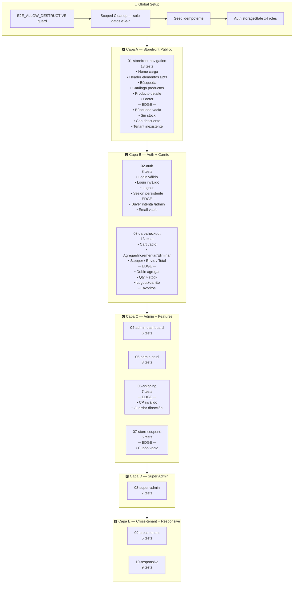
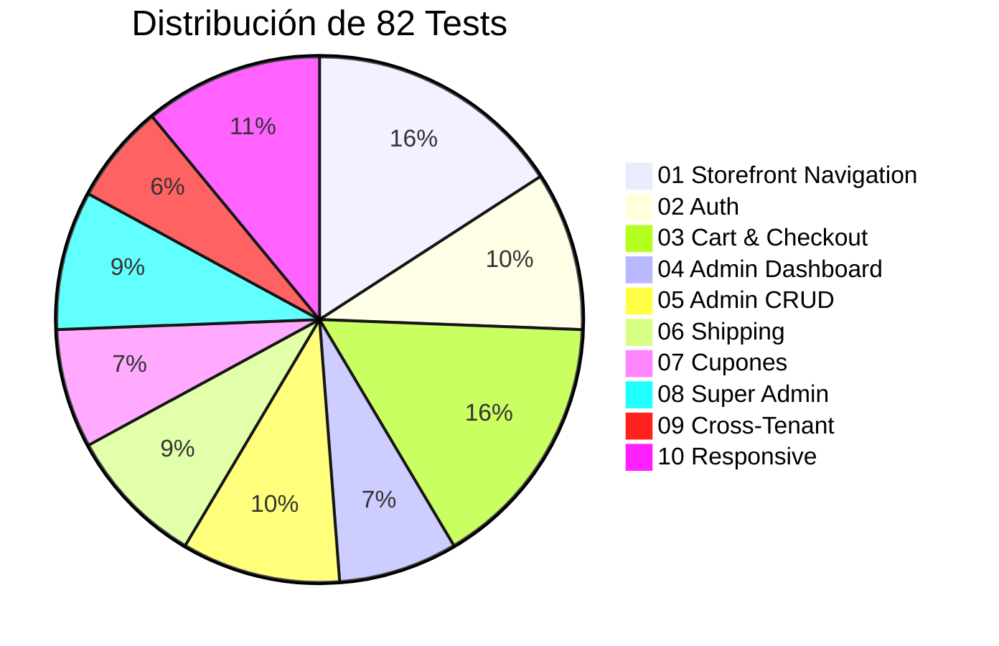
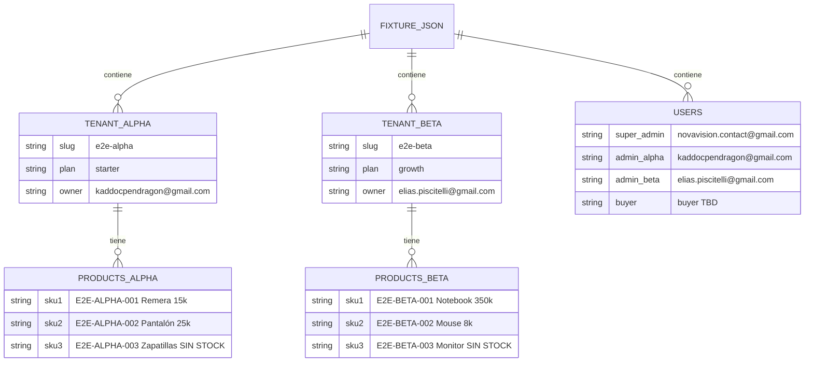
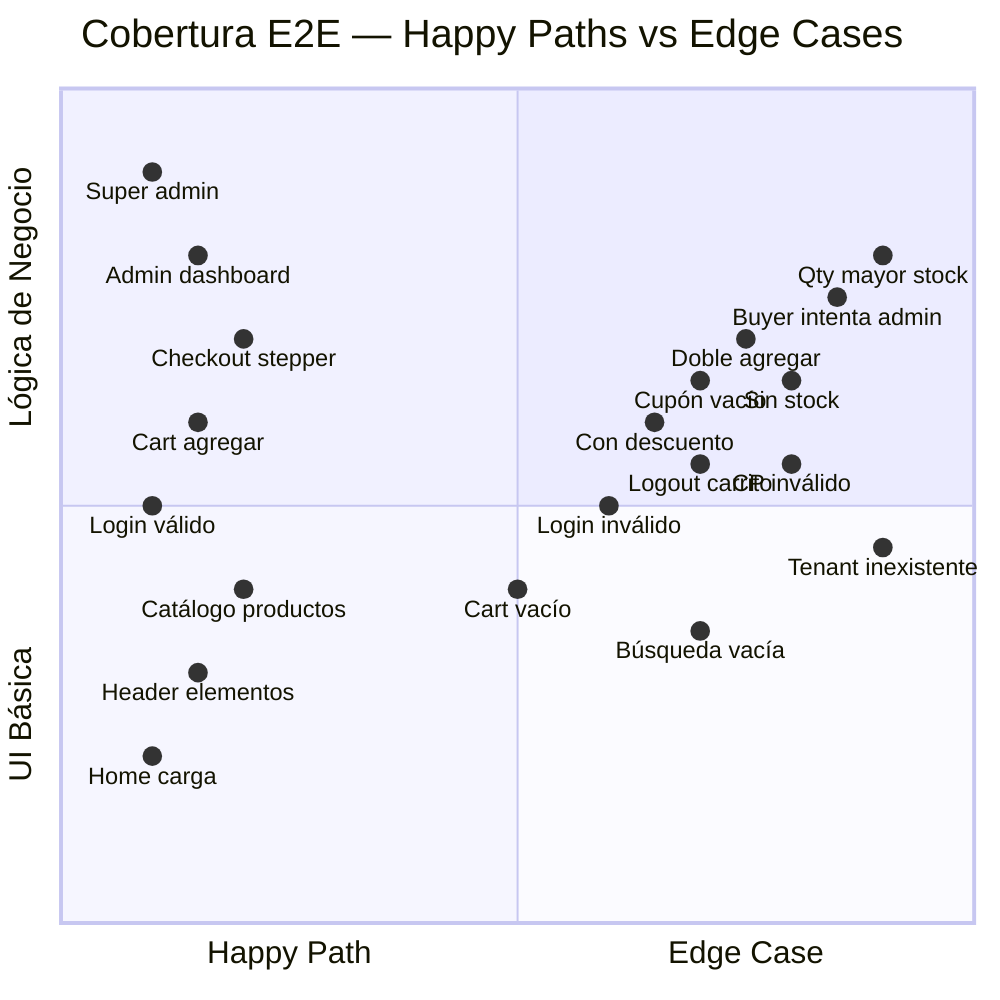

# Suite E2E v2 — Arquitectura, Diagramas y Cobertura

> Generado: 2025-02-13  
> Repo: `novavision-e2e` | Branch: `main`  
> Total: **82 tests** en **10 specs**

---

## 1. Diagrama de Flujo — Ejecución Completa



---

## 2. Distribución de Tests por Spec



---

## 3. Dataset E2E — Tenants, Usuarios y Productos



---

## 4. Análisis de Cobertura: Happy Paths vs Edge Cases



---

## 5. Flujo de Onboarding (Setup de Tenants)


### División de responsabilidades

| Paso | Quién lo hace | Método |
|------|--------------|--------|
| Steps 1-11 (Wizard completo) | **Agente (Playwright)** | Automatización UI browser |
| Step 12 (Submit) | **Agente** | Automático al completar step 11 |
| Aprobación | **TL (Manual)** | Desde admin panel |
| Pago MP en tiendas | **TL (Manual)** | Sandbox Mercado Pago |
| Seed productos | **Agente** | service_role post-provisioning |
| Seed buyer | **Agente** | Supabase auth admin |

---

## 6. Estructura de Archivos

```
novavision-e2e/
├── .env.e2e                    # Variables de entorno
├── global-setup.ts             # Guard + cleanup + seed + auth
├── playwright.config.ts        # 10 v2 projects + 2 legacy
│
├── fixtures/
│   └── e2e.fixtures.json       # Dataset determinístico (2 tenants, 4 users, 6 products)
│
├── helpers/
│   ├── seed.ts                 # Seed idempotente (productos + buyer)
│   ├── cleanup-scoped.ts       # Cleanup solo datos e2e-*
│   ├── auth-setup.ts           # Browser login → storageState
│   ├── config.ts               # URLs y credenciales desde env
│   ├── ui-helpers.ts           # 30+ funciones de ayuda UI
│   └── page-objects/
│       ├── storefront/         # HomePage, LoginPage, CartPage, SearchPage, etc.
│       └── admin/              # AdminDashboardPage, ClientsPage, etc.
│
├── scripts/
│   └── onboard-wizard.spec.ts  # Onboarding via UI (Playwright)
│
└── tests/
    └── qa-v2/
        ├── 01-storefront-navigation.spec.ts  (13 tests)
        ├── 02-auth.spec.ts                   (8 tests)
        ├── 03-cart-checkout.spec.ts          (13 tests)
        ├── 04-admin-dashboard.spec.ts        (6 tests)
        ├── 05-admin-crud.spec.ts             (8 tests)
        ├── 06-shipping.spec.ts               (7 tests)
        ├── 07-store-coupons.spec.ts          (6 tests)
        ├── 08-super-admin.spec.ts            (7 tests)
        ├── 09-cross-tenant.spec.ts           (5 tests)
        └── 10-responsive.spec.ts             (9 tests)
```

---

## 7. Tests Detallados por Spec

### 01 — Storefront Navigation (13 tests)

| # | Test | Tipo |
|---|------|------|
| 1 | Home carga correctamente (alpha) | Happy Path |
| 2 | Header tiene ≥ 2 de 3 elementos | Happy Path |
| 3 | Navegar a búsqueda | Happy Path |
| 4 | Catálogo muestra productos | Happy Path |
| 5 | Detalle de producto carga | Happy Path |
| 6 | Footer presente | Happy Path |
| 7 | Beta home carga | Happy Path |
| 8 | Beta muestra productos distintos | Happy Path |
| 9 | Beta tiene ≥ 3 productos | Happy Path |
| 10 | EDGE: Búsqueda sin resultados | Edge Case |
| 11 | EDGE: Producto sin stock | Edge Case |
| 12 | EDGE: Producto con descuento | Edge Case |
| 13 | EDGE: Tenant slug inexistente | Edge Case |

### 02 — Auth (8 tests)

| # | Test | Tipo |
|---|------|------|
| 1 | Login page carga | Happy Path |
| 2 | Login credenciales válidas | Happy Path |
| 3 | Login credenciales inválidas | Edge Case |
| 4 | Logout funciona | Happy Path |
| 5 | Login en tenant beta | Happy Path |
| 6 | Sesión persiste tras recargar | Happy Path |
| 7 | EDGE: Buyer no accede a panel admin | Edge Case |
| 8 | EDGE: Email vacío no navega | Edge Case |

### 03 — Cart & Checkout (13 tests)

| # | Test | Tipo |
|---|------|------|
| 1 | Carrito vacío muestra mensaje | Happy Path |
| 2 | Agregar producto desde catálogo | Happy Path |
| 3 | Incrementar cantidad | Happy Path |
| 4 | Eliminar producto | Happy Path |
| 5 | Buyer agrega y ve carrito | Happy Path |
| 6 | Stepper paso 0 = Carrito | Happy Path |
| 7 | Navegar a paso Envío | Happy Path |
| 8 | Total visible | Happy Path |
| 9 | Beta productos y agregar | Happy Path |
| 10 | EDGE: Doble agregar = +qty | Edge Case |
| 11 | EDGE: Qty > stock | Edge Case |
| 12 | EDGE: Logout + carrito | Edge Case |
| 13 | EDGE: Favoritos toggle | Edge Case |

### 04 — Admin Dashboard (6 tests)

| # | Test | Tipo |
|---|------|------|
| 1 | Admin login carga | Happy Path |
| 2 | Login super admin | Happy Path |
| 3 | Metrics cards visibles | Happy Path |
| 4 | Lista de clientes | Happy Path |
| 5 | Buscar e2e-alpha | Happy Path |
| 6 | Ver detalle de cliente | Happy Path |

### 05 — Admin CRUD (8 tests)

| # | Test | Tipo |
|---|------|------|
| 1 | Acceder panel admin tenant | Happy Path |
| 2 | Lista de productos | Happy Path |
| 3 | Sección FAQs | Happy Path |
| 4 | Crear FAQ | Happy Path |
| 5 | Info de contacto | Happy Path |
| 6 | Redes sociales | Happy Path |
| 7 | Beta admin accesible | Happy Path |
| 8 | Beta productos ≠ alpha | Happy Path |

### 06 — Shipping (7 tests)

| # | Test | Tipo |
|---|------|------|
| 1 | Paso envío accesible | Happy Path |
| 2 | Métodos disponibles | Happy Path |
| 3 | Cotizar con CP 1425 | Happy Path |
| 4 | Retiro en local | Happy Path |
| 5 | Beta envío accesible | Happy Path |
| 6 | EDGE: CP inválido | Edge Case |
| 7 | EDGE: Guardar dirección | Edge Case |

### 07 — Store Coupons (6 tests)

| # | Test | Tipo |
|---|------|------|
| 1 | Sección cupones accesible | Happy Path |
| 2 | Crear cupón porcentual | Happy Path |
| 3 | Lista muestra cupones | Happy Path |
| 4 | Campo cupón visible | Happy Path |
| 5 | Cupón inválido = error | Edge Case |
| 6 | EDGE: Cupón vacío | Edge Case |

### 08 — Super Admin (7 tests)

| # | Test | Tipo |
|---|------|------|
| 1 | Dashboard con métricas | Happy Path |
| 2 | Badge Super Admin | Happy Path |
| 3 | Navegar a clientes | Happy Path |
| 4 | Buscar alpha/beta | Happy Path |
| 5 | Health badges | Happy Path |
| 6 | Acciones de sync | Happy Path |
| 7 | Filtrar clientes | Happy Path |

### 09 — Cross-Tenant (5 tests)

| # | Test | Tipo |
|---|------|------|
| 1 | Alpha ≠ Beta productos | Happy Path |
| 2 | Fixtures predicen productos | Happy Path |
| 3 | Store name diferente | Happy Path |
| 4 | URLs independientes | Happy Path |
| 5 | Login alpha no filtra a beta | Happy Path |

### 10 — Responsive (9 tests)

| # | Test | Tipo |
|---|------|------|
| 1-5 | Mobile alpha (home, header, hamburger, productos, catálogo) | Happy Path |
| 6-7 | Mobile beta (home, productos) | Happy Path |
| 8-9 | Tablet alpha (layout, productos) | Happy Path |

---

## 8. Ejecución

```bash
# Suite completa v2 (requiere tenants provisioned)
E2E_ALLOW_DESTRUCTIVE=true npx playwright test --project='v2-*'

# Solo una capa
npx playwright test --project='v2-01-storefront'

# Con UI de Playwright
npx playwright test --ui --project='v2-*'

# Solo onboarding (setup inicial)
npx playwright test scripts/onboard-wizard.spec.ts
```

---

## 9. Riesgos y Limitaciones

| Riesgo | Mitigación |
|--------|-----------|
| Tenants no provisioned | globalSetup verifica y alerta; tests hacen skip |
| MP sandbox caído | Tests de pago se skipean; flujo core no depende |
| Selectores CSS cambian | Page Objects centralizan; fácil de actualizar |
| Rate limits de Supabase | Waits entre operaciones; retry implícito |
| DB sucia con datos huérfanos | Cleanup scoped solo borra `e2e-*`; no trunca |
