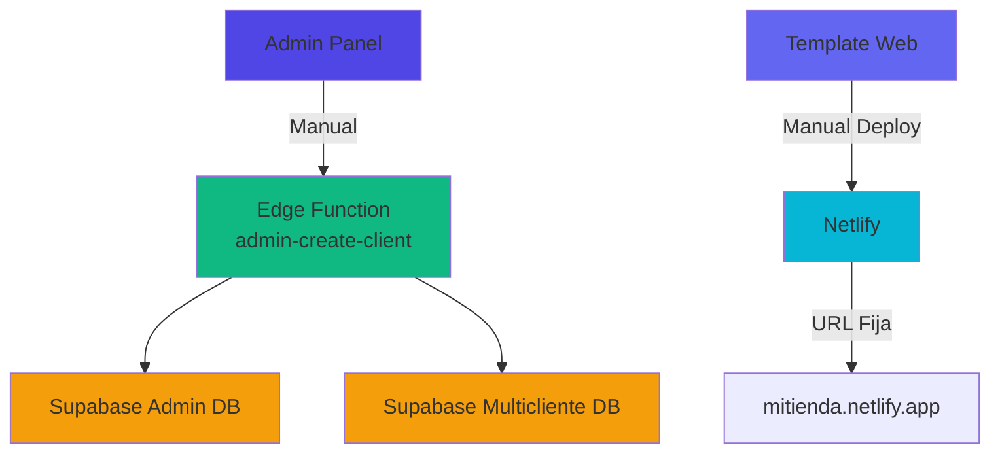
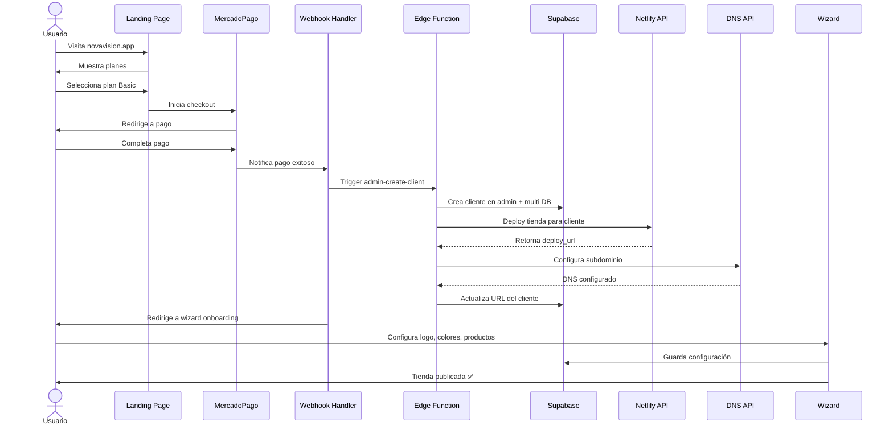
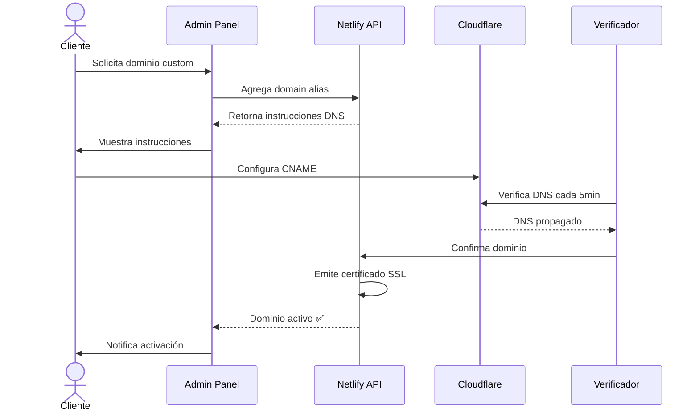
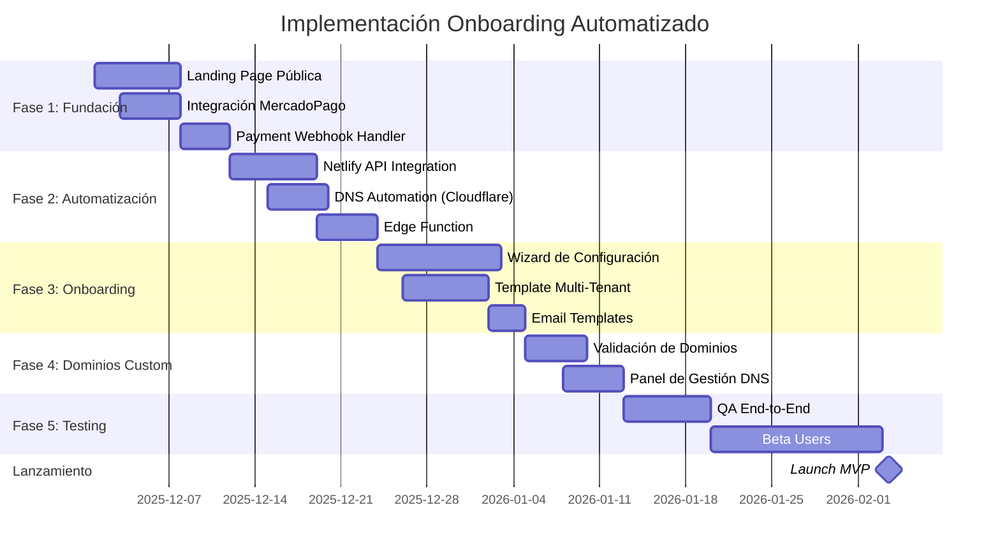
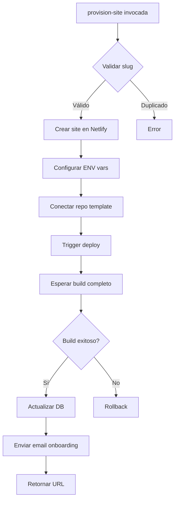
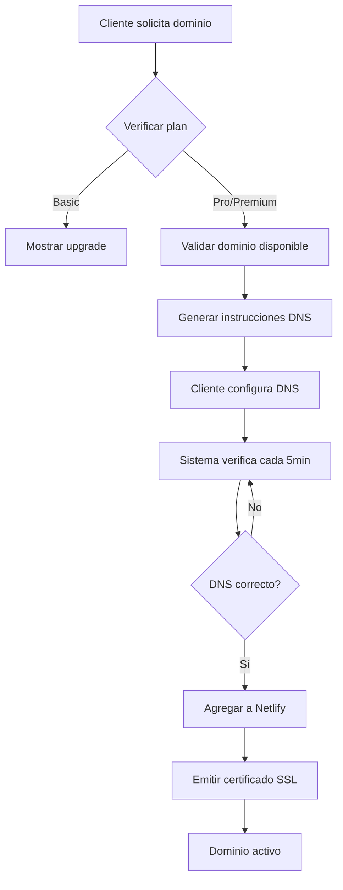

# Arquitectura de Onboarding Automatizado NovaVision
**Autor:** Elias Piscitelli  
**Fecha:** 2025-11-27  
**Versión:** 1.0  
**Objetivo:** Sistema automatizado de registro, pago y deploy tipo Tiendanube

---

## 📋 Tabla de Contenidos

1. [Resumen Ejecutivo](#1-resumen-ejecutivo)
2. [Arquitectura Actual vs Propuesta](#2-arquitectura-actual-vs-propuesta)
3. [Flujos de Usuario](#3-flujos-de-usuario)
4. [Servicios Externos Requeridos](#4-servicios-externos-requeridos)
5. [Arquitectura Técnica Detallada](#5-arquitectura-técnica-detallada)
6. [Sistema de URLs y Deploys](#6-sistema-de-urls-y-deploys)
7. [Plan de Implementación](#7-plan-de-implementación)
8. [Configuración por Servicios](#8-configuración-por-servicios)
9. [Costos Estimados](#9-costos-estimados)
10. [Riesgos y Mitigaciones](#10-riesgos-y-mitigaciones)

---

## 1. Resumen Ejecutivo

### 1.1 Objetivo del Proyecto
Transformar NovaVision de un sistema de gestión manual de clientes a una plataforma SaaS self-service donde los usuarios puedan:
- Registrarse y pagar online
- Crear su tienda automáticamente
- Configurar su tienda mediante wizard
- Tener su tienda live en minutos

### 1.2 Estado Actual
✅ **Lo que ya funciona:**
- Multi-tenancy con RLS en Supabase
- Edge Function `admin-create-client` para provisioning
- Template de tienda (apps/web) con React/Vite
- Sistema de pagos MercadoPago integrado
- Deploy manual en Netlify
- Panel admin para gestión

❌ **Lo que falta:**
- Landing page pública de registro
- Integración de pago automático
- Deploy programático por cliente
- Sistema de subdominios automáticos
- Wizard de onboarding post-registro
- Gestión de dominios custom

### 1.3 Resultado Esperado
```
Usuario visita novavision.app
  ↓
Selecciona plan y paga
  ↓
Sistema crea tienda automáticamente
  ↓
Usuario configura mediante wizard
  ↓
Tienda publicada en {cliente}.novavision.app
```

---

## 2. Arquitectura Actual vs Propuesta

### 2.1 Arquitectura Actual



**Limitaciones:**
- ✋ Alta manual desde admin panel
- ✋ Deploy manual sin automatización
- ✋ URL única, no multi-tenant por subdominio
- ✋ No hay flujo de pago integrado
- ✋ Configuración manual post-creación

### 2.2 Arquitectura Propuesta

```mermaid
graph TB
    subgraph "Frontend Público"
        A[Landing Page<br/>novavision.app] --> B[Wizard de Registro]
        B --> C[Selección de Plan]
        C --> D[MercadoPago Checkout]
    end
    
    subgraph "Backend Automatizado"
        D -->|Webhook| E[Edge Function<br/>payment-webhook]
        E --> F[Edge Function<br/>admin-create-client]
        F --> G[Netlify API<br/>Deploy Site]
        G --> H[DNS Provider API<br/>Subdomain]
    end
    
    subgraph "Bases de Datos"
        F --> I[Supabase Admin]
        F --> J[Supabase Multicliente]
    end
    
    subgraph "Post-Deploy"
        H --> K[Wizard Onboarding<br/>{cliente}.novavision.app]
        K --> L[Configuración Tienda]
        L --> M[Tienda Live]
    end
    
    style A fill:#4f46e5
    style D fill:#10b981
    style E fill:#f59e0b
    style F fill:#f59e0b
    style G fill:#06b6d4
    style K fill:#8b5cf6
    style M fill:#10b981
```

---

## 3. Flujos de Usuario

### 3.1 Flujo Completo de Onboarding



### 3.2 Flujo de Decisión de Deploy

#### **Opción A: Multi-Site (un deploy por cliente)**

```mermaid
graph LR
    A[Cliente registrado] --> B{Plan?}
    B -->|Basic| C[Deploy template básico]
    B -->|Professional| D[Deploy template pro]
    B -->|Premium| E[Deploy custom]
    C --> F[Netlify crea site]
    D --> F
    E --> G[Netlify + Custom config]
    F --> H[Asigna subdominio]
    G --> H
    H --> I[{cliente}.novavision.app]
```

**Ventajas:**
- ✅ Aislamiento total por cliente
- ✅ Fácil debug individual
- ✅ Rollback por cliente
- ✅ Configuración específica por deploy

**Desventajas:**
- ❌ Difícil actualizar todos los clientes
- ❌ Más complejo de mantener (N repos)
- ❌ Costo Netlify (pero gratis hasta 1M builds/mes en Pro)

#### **Opción B: Single-Site con Tenant Resolution (RECOMENDADA)**

```mermaid
graph LR
    A[{cliente}.novavision.app] --> B[Netlify Proxy]
    B --> C[React App único]
    C --> D{Detecta subdominio}
    D --> E[Consulta DB por slug]
    E --> F[Carga config cliente]
    F --> G[Renderiza tienda personalizada]
```

**Ventajas:**
- ✅ Un solo deploy para todos
- ✅ Actualizaciones instantáneas
- ✅ Mantenimiento simplificado
- ✅ Menor costo operativo

**Desventajas:**
- ❌ Requiere tenant resolution en frontend
- ❌ Complejidad adicional en routing

---

## 4. Servicios Externos Requeridos

### 4.1 Matriz de Servicios

| Servicio | Propósito | Plan Requerido | Costo Mensual | Alternativas |
|----------|-----------|----------------|---------------|--------------|
| **Netlify** | Deploy y hosting | Pro | $19/mes | Vercel ($20), Railway ($5+) |
| **MercadoPago** | Procesamiento de pagos | Gratis | 0% + comisión por venta | Stripe, PayPal |
| **Cloudflare** | DNS + Proxy | Free/Pro | $0-20/mes | Route53, Namecheap |
| **Supabase** | Bases de datos | Pro | $25/mes por proyecto | PostgreSQL auto-hospedado |
| **EmailJS** | Emails transaccionales | Free | $0 (hasta 200/mes) | SendGrid, Resend |

### 4.2 Netlify: Deploy Programático

#### **Configuración Necesaria**

```bash
# 1. Crear Personal Access Token
https://app.netlify.com/user/applications
# Scope: sites:create, sites:update, sites:delete

# 2. Configurar en Variables de Entorno
NETLIFY_AUTH_TOKEN=nfp_xxxxx
NETLIFY_TEAM_ID=tu-team-slug
```

#### **API Endpoints a Utilizar**

```javascript
// Crear nuevo site
POST https://api.netlify.com/api/v1/sites
Headers: {
  Authorization: `Bearer ${NETLIFY_AUTH_TOKEN}`
}
Body: {
  name: "cliente-slug-novavision",
  custom_domain: "cliente-slug.novavision.app",
  repo: {
    provider: "github",
    repo: "tu-org/novavision-template",
    branch: "main"
  }
}

// Configurar variables de entorno por site
PUT https://api.netlify.com/api/v1/sites/{site_id}/env
Body: {
  key: "VITE_CLIENT_ID",
  values: [{ value: "uuid-del-cliente", context: "all" }]
}

// Trigger deploy
POST https://api.netlify.com/api/v1/sites/{site_id}/deploys
```

### 4.3 MercadoPago: Webhooks y Suscripciones

#### **Configuración de Webhooks**

```javascript
// 1. Configurar endpoint público
https://admin.novavision.app/api/webhooks/mercadopago

// 2. Registrar webhook en MercadoPago Dashboard
https://www.mercadopago.com.ar/developers/panel/webhooks

// 3. Eventos a escuchar
{
  "events": [
    "payment.created",
    "payment.updated",
    "subscription.created"
  ]
}

// 4. Validar signature
const isValid = verifyMercadoPagoSignature(
  req.headers['x-signature'],
  req.body,
  process.env.MP_WEBHOOK_SECRET
);
```

#### **Flujo de Pago con Checkout Pro**

```javascript
// Frontend: Crear preferencia
const preference = {
  items: [{
    title: "Plan Professional NovaVision",
    unit_price: 60,
    quantity: 1
  }],
  back_urls: {
    success: "https://novavision.app/onboarding/success",
    failure: "https://novavision.app/pricing",
    pending: "https://novavision.app/onboarding/pending"
  },
  auto_return: "approved",
  metadata: {
    plan: "professional",
    email: "cliente@example.com",
    slug: "cliente-slug"
  }
};

// Backend Edge Function recibe webhook
{
  "action": "payment.created",
  "data": {
    "id": "payment_id"
  }
}

// Consulta pago
const payment = await fetch(
  `https://api.mercadopago.com/v1/payments/${payment_id}`,
  {
    headers: {
      'Authorization': `Bearer ${MP_ACCESS_TOKEN}`
    }
  }
);

// Si aprobado, crea cliente
if (payment.status === 'approved') {
  await supabase.functions.invoke('admin-create-client', {
    body: payment.metadata
  });
}
```

### 4.4 DNS: Cloudflare API

#### **Configuración de Wildcard DNS**

```bash
# 1. Crear API Token en Cloudflare
https://dash.cloudflare.com/profile/api-tokens
# Permisos: Zone.DNS:Edit

# 2. Configurar wildcard CNAME
curl -X POST "https://api.cloudflare.com/client/v4/zones/${ZONE_ID}/dns_records" \
  -H "Authorization: Bearer ${CF_API_TOKEN}" \
  -H "Content-Type: application/json" \
  --data '{
    "type": "CNAME",
    "name": "*",
    "content": "novavision.netlify.app",
    "ttl": 1,
    "proxied": true
  }'
```

#### **Dominios Custom por Plan**

```javascript
// Plan Basic: Solo subdominios
{cliente}.novavision.app

// Plan Professional+: Dominio custom
www.{cliente}.com → CNAME → {cliente}.novavision.app

// Validación de dominio custom
const addCustomDomain = async (clientId, customDomain) => {
  // 1. Crear DNS record en Netlify
  await netlify.addDomainAlias(siteId, customDomain);
  
  // 2. Generar instrucciones para cliente
  return {
    instructions: [
      `Crear CNAME: www → ${clientSlug}.novavision.app`,
      `Crear A record: @ → 75.2.60.5`
    ],
    verification: `TXT record: netlify-${verificationCode}`
  };
};
```

---

## 5. Arquitectura Técnica Detallada

### 5.1 Estructura de Repositorios

```
NovaVisionRepo/
├── apps/
│   ├── admin/              # Panel admin (existente)
│   ├── api/                # Backend NestJS (existente)
│   ├── web/                # Template tienda (existente)
│   └── landing/            # ✨ NUEVO: Landing pública
│       ├── src/
│       │   ├── pages/
│       │   │   ├── Home.jsx
│       │   │   ├── Pricing.jsx
│       │   │   ├── Checkout.jsx
│       │   │   └── Onboarding/
│       │   │       ├── Success.jsx
│       │   │       ├── Wizard.jsx
│       │   │       └── ConfigureStore.jsx
│       │   ├── components/
│       │   └── services/
│       │       └── mercadopago.js
│       └── package.json
├── packages/
│   └── deploy-automation/  # ✨ NUEVO: Lib de deploy
│       ├── src/
│       │   ├── netlify.ts
│       │   ├── dns.ts
│       │   └── provisioning.ts
│       └── package.json
└── supabase/
    └── functions/
        ├── admin-create-client/    # Existente
        ├── payment-webhook/        # ✨ NUEVO
        ├── provision-site/         # ✨ NUEVO
        └── onboarding-complete/    # ✨ NUEVO
```

### 5.2 Nuevas Edge Functions

#### **payment-webhook**

```typescript
// supabase/functions/payment-webhook/index.ts
import { serve } from "https://deno.land/std@0.168.0/http/server.ts";
import { createClient } from "https://esm.sh/@supabase/supabase-js@2";

serve(async (req) => {
  const { action, data } = await req.json();
  
  // Validar firma MercadoPago
  const isValid = await verifySignature(req);
  if (!isValid) return new Response('Invalid signature', { status: 401 });
  
  if (action === 'payment.created' || action === 'payment.updated') {
    // Obtener detalles del pago
    const payment = await fetchPaymentDetails(data.id);
    
    if (payment.status === 'approved') {
      // Extraer metadata
      const { email, plan, slug, name } = payment.metadata;
      
      // Crear cliente automáticamente
      const result = await supabase.functions.invoke('admin-create-client', {
        body: {
          name,
          slug,
          email_admin: email,
          plan,
          monthly_fee: getPlanFee(plan),
          setup_paid: true,
          base_url: `https://${slug}.novavision.app`
        }
      });
      
      if (result.data?.success) {
        // Provisionar site
        await supabase.functions.invoke('provision-site', {
          body: {
            client_id: result.data.client_id,
            slug
          }
        });
        
        // Enviar email de bienvenida con link al wizard
        await sendWelcomeEmail(email, slug);
      }
    }
  }
  
  return new Response(JSON.stringify({ received: true }), {
    headers: { 'Content-Type': 'application/json' }
  });
});
```

#### **provision-site**

```typescript
// supabase/functions/provision-site/index.ts
import { NetlifyAPI } from './netlify-api.ts';

serve(async (req) => {
  const { client_id, slug } = await req.json();
  const netlify = new NetlifyAPI(Deno.env.get('NETLIFY_TOKEN'));
  
  // OPCIÓN A: Crear site individual
  const site = await netlify.createSite({
    name: `${slug}-novavision`,
    custom_domain: `${slug}.novavision.app`,
    build_settings: {
      cmd: 'npm run build',
      dir: 'dist',
      env: {
        VITE_CLIENT_ID: client_id,
        VITE_BACKEND_URL: Deno.env.get('MULTI_SUPABASE_URL')
      }
    }
  });
  
  // Configurar deploy desde repo
  await netlify.connectRepository(site.id, {
    repo: 'tu-org/novavision-web-template',
    branch: 'main',
    build_hook: true
  });
  
  // Trigger primer deploy
  const deploy = await netlify.createDeploy(site.id);
  
  // Actualizar DB con URL del site
  await supabase.from('clients').update({
    base_url: `https://${slug}.novavision.app`,
    netlify_site_id: site.id,
    netlify_deploy_id: deploy.id,
    deploy_status: 'building'
  }).eq('id', client_id);
  
  return new Response(JSON.stringify({
    success: true,
    site_id: site.id,
    url: `https://${slug}.novavision.app`
  }));
});
```

### 5.3 Cambios en apps/web (Template)

#### **Detección de Tenant**

```javascript
// apps/web/src/utils/tenant.js
export const detectTenant = () => {
  const hostname = window.location.hostname;
  
  // Detectar subdominio
  const parts = hostname.split('.');
  if (parts.length >= 3) {
    return parts[0]; // Ej: "cliente" de "cliente.novavision.app"
  }
  
  // Fallback para desarrollo
  return localStorage.getItem('dev_client_id') || null;
};

export const loadTenantConfig = async (slug) => {
  const { data, error } = await supabase
    .from('clients')
    .select('*')
    .eq('slug', slug)
    .single();
  
  if (error) throw error;
  return data;
};
```

#### **App.jsx Modificado**

```javascript
// apps/web/src/App.jsx
import { useEffect, useState } from 'react';
import { detectTenant, loadTenantConfig } from './utils/tenant';

function App() {
  const [tenant, setTenant] = useState(null);
  const [loading, setLoading] = useState(true);
  
  useEffect(() => {
    const initTenant = async () => {
      const slug = detectTenant();
      if (!slug) {
        // Redirigir a landing si no hay subdominio
        window.location.href = 'https://novavision.app';
        return;
      }
      
      const config = await loadTenantConfig(slug);
      setTenant(config);
      setLoading(false);
      
      // Aplicar tema del cliente
      applyTheme(config.theme_config);
    };
    
    initTenant();
  }, []);
  
  if (loading) return <LoadingScreen />;
  if (!tenant) return <ErrorScreen />;
  
  return (
    <TenantProvider value={tenant}>
      <Router>
        {/* Rutas normales de la tienda */}
      </Router>
    </TenantProvider>
  );
}
```

---

## 6. Sistema de URLs y Deploys

### 6.1 Estrategia de URLs por Plan

```javascript
const URL_STRATEGY = {
  basic: {
    type: 'subdomain',
    pattern: '{slug}.novavision.app',
    ssl: 'auto', // Netlify automático
    custom_domain: false
  },
  professional: {
    type: 'subdomain_or_custom',
    pattern: '{slug}.novavision.app',
    custom_domain: true,
    custom_domain_limit: 1,
    ssl: 'auto'
  },
  premium: {
    type: 'custom',
    pattern: 'cualquier dominio',
    custom_domain: true,
    custom_domain_limit: null, // Ilimitado
    ssl: 'auto',
    cdn: true
  }
};
```

### 6.2 Configuración DNS Detallada

#### **Setup Inicial de Wildcard**

```yaml
# Cloudflare DNS Records
- type: CNAME
  name: "*"
  content: "novavision.netlify.app"
  proxied: true
  ttl: auto

- type: A
  name: "@"
  content: "75.2.60.5"  # Netlify Load Balancer
  proxied: true

- type: AAAA
  name: "@"
  content: "2600:1f18:2148:bc00:e87c:d9a7:3967:f9d8"
  proxied: true
```

#### **Proceso de Dominio Custom**



### 6.3 Deploy Strategies

#### **Estrategia 1: Netlify Multi-Site (Recomendada para MVP)**

```javascript
// packages/deploy-automation/src/netlify.ts
export class NetlifyDeployer {
  async createClientSite(client: Client) {
    // 1. Crear site en Netlify
    const site = await this.api.createSite({
      name: `${client.slug}-nv`,
      custom_domain: `${client.slug}.novavision.app`
    });
    
    // 2. Conectar con repo template
    await this.api.linkRepository(site.id, {
      repo: 'novavision/web-template',
      branch: 'main',
      install_dependencies: true
    });
    
    // 3. Configurar ENV vars
    await this.api.setEnvVars(site.id, {
      VITE_CLIENT_ID: client.id,
      VITE_BACKEND_URL: process.env.MULTI_SUPABASE_URL,
      VITE_BACKEND_KEY: process.env.MULTI_SUPABASE_ANON_KEY
    });
    
    // 4. Deploy inicial
    const deploy = await this.api.triggerDeploy(site.id);
    
    return {
      site_id: site.id,
      url: site.url,
      deploy_id: deploy.id
    };
  }
  
  async updateAllSites() {
    // Para actualizaciones globales, trigger deploy en todos los sites
    const sites = await this.api.listSites();
    const promises = sites.map(site => 
      this.api.triggerDeploy(site.id)
    );
    await Promise.all(promises);
  }
}
```

#### **Estrategia 2: Monorepo con Build por Tenant**

```javascript
// Alternativa: Build condicional en netlify.toml
[build]
  command = "npm run build:tenant"
  publish = "dist"

[build.environment]
  VITE_CLIENT_ID = "${CLIENT_ID}"

# netlify-plugin-tenant-builder
[[plugins]]
  package = "./plugins/tenant-builder"
  
  [plugins.inputs]
    clients = ["cliente-a", "cliente-b", "cliente-c"]
```

---

## 7. Plan de Implementación

### 7.1 Roadmap General



### 7.2 Fase 1: Landing y Pago (Semanas 1-2)

#### **TKT-100: Landing Page Pública**

**Objetivo:** Crear landing page en `landing.novavision.app` con información de planes y registro.

**Tareas:**
- [ ] Crear proyecto `apps/landing` con Vite + React
- [ ] Diseñar página Home con hero, features, pricing
- [ ] Implementar página `/pricing` con comparativa de planes
- [ ] Crear formulario de pre-registro
- [ ] Deploy en Netlify subdomain

**Archivos a crear:**
```
apps/landing/
├── src/
│   ├── pages/
│   │   ├── Home.jsx
│   │   ├── Pricing.jsx
│   │   └── Checkout.jsx
│   ├── components/
│   │   ├── Hero.jsx
│   │   ├── PlanCard.jsx
│   │   └── FAQ.jsx
│   └── App.jsx
└── package.json
```

**Componente PlanCard:**
```jsx
// apps/landing/src/components/PlanCard.jsx
export const PlanCard = ({ plan, onSelect }) => {
  const plans = {
    basic: {
      name: 'Plan Esencial',
      price: 20,
      setup: 110,
      features: [
        'Hasta 20 productos',
        'Panel de administración',
        'MercadoPago integrado',
        'Subdominio incluido',
        '2 horas soporte'
      ]
    },
    // ... otros planes
  };
  
  return (
    <Card>
      <h3>{plans[plan].name}</h3>
      <Price>
        <span>${plans[plan].price}</span>/mes
      </Price>
      <SetupFee>Setup: ${plans[plan].setup}</SetupFee>
      <Features>
        {plans[plan].features.map(f => (
          <li key={f}>✓ {f}</li>
        ))}
      </Features>
      <Button onClick={() => onSelect(plan)}>
        Comenzar ahora
      </Button>
    </Card>
  );
};
```

#### **TKT-101: Integración MercadoPago Checkout**

**Objetivo:** Implementar flujo de pago con MercadoPago Checkout Pro.

**Tareas:**
- [ ] Crear cuenta de producción MercadoPago
- [ ] Configurar credenciales en variables de entorno
- [ ] Implementar servicio de creación de preferencias
- [ ] Crear página de checkout con widget MP
- [ ] Configurar URLs de retorno

**Servicio MercadoPago:**
```javascript
// apps/landing/src/services/mercadopago.js
import { enviarAMercadoPago } from '@mercadopago/sdk-react';

export const createCheckoutPreference = async (planData) => {
  const response = await fetch('/api/create-preference', {
    method: 'POST',
    headers: { 'Content-Type': 'application/json' },
    body: JSON.stringify({
      plan: planData.plan,
      email: planData.email,
      name: planData.name,
      slug: planData.slug
    })
  });
  
  const { preference_id } = await response.json();
  return preference_id;
};

export const redirectToCheckout = (preferenceId) => {
  enviarAMercadoPago(preferenceId);
};
```

**Edge Function para crear preferencia:**
```typescript
// supabase/functions/create-mp-preference/index.ts
serve(async (req) => {
  const { plan, email, name, slug } = await req.json();
  
  const planPrices = {
    basic: { monthly: 20, setup: 110 },
    professional: { monthly: 60, setup: 220 },
    premium: { monthly: 120, setup: 600 }
  };
  
  const preference = {
    items: [{
      title: `Plan ${plan} - Setup Fee`,
      unit_price: planPrices[plan].setup,
      quantity: 1
    }],
    payer: { email },
    back_urls: {
      success: `https://landing.novavision.app/onboarding/success`,
      failure: `https://landing.novavision.app/pricing`,
      pending: `https://landing.novavision.app/onboarding/pending`
    },
    auto_return: 'approved',
    metadata: { plan, email, name, slug }
  };
  
  const response = await fetch('https://api.mercadopago.com/checkout/preferences', {
    method: 'POST',
    headers: {
      'Authorization': `Bearer ${Deno.env.get('MP_ACCESS_TOKEN')}`,
      'Content-Type': 'application/json'
    },
    body: JSON.stringify(preference)
  });
  
  const data = await response.json();
  
  return new Response(JSON.stringify({
    preference_id: data.id,
    init_point: data.init_point
  }));
});
```

#### **TKT-102: Payment Webhook Handler**

**Objetivo:** Procesar notificaciones de pago de MercadoPago.

**Tareas:**
- [ ] Crear Edge Function `payment-webhook`
- [ ] Implementar validación de firma
- [ ] Manejar estados de pago (approved, rejected, pending)
- [ ] Disparar creación de cliente en pago aprobado
- [ ] Logging y auditoría

**Configuración:**
```bash
# Variables de entorno necesarias
MP_WEBHOOK_SECRET=tu_secret_de_webhook
MP_ACCESS_TOKEN=APP_USR-xxxxx
ADMIN_CREATE_CLIENT_URL=https://xxx.supabase.co/functions/v1/admin-create-client
```

### 7.3 Fase 2: Deploy Automatizado (Semanas 3-4)

#### **TKT-200: Netlify API Integration**

**Objetivo:** Crear biblioteca para gestión programática de sites en Netlify.

**Tareas:**
- [ ] Crear package `@nv/deploy-automation`
- [ ] Implementar cliente de Netlify API
- [ ] Funciones: createSite, deploySite, updateEnv, deleteSite
- [ ] Tests unitarios
- [ ] Documentación de API

**Estructura del package:**
```typescript
// packages/deploy-automation/src/netlify.ts
export interface SiteConfig {
  name: string;
  customDomain: string;
  envVars: Record<string, string>;
  repo?: {
    url: string;
    branch: string;
  };
}

export class NetlifyClient {
  private token: string;
  private baseUrl = 'https://api.netlify.com/api/v1';
  
  constructor(token: string) {
    this.token = token;
  }
  
  async createSite(config: SiteConfig): Promise<Site> {
    const response = await fetch(`${this.baseUrl}/sites`, {
      method: 'POST',
      headers: {
        'Authorization': `Bearer ${this.token}`,
        'Content-Type': 'application/json'
      },
      body: JSON.stringify({
        name: config.name,
        custom_domain: config.customDomain
      })
    });
    
    return await response.json();
  }
  
  async setEnvironmentVariables(
    siteId: string, 
    vars: Record<string, string>
  ): Promise<void> {
    for (const [key, value] of Object.entries(vars)) {
      await fetch(`${this.baseUrl}/sites/${siteId}/env`, {
        method: 'PUT',
        headers: {
          'Authorization': `Bearer ${this.token}`,
          'Content-Type': 'application/json'
        },
        body: JSON.stringify({
          key,
          values: [{ value, context: 'all' }]
        })
      });
    }
  }
  
  async triggerDeploy(siteId: string): Promise<Deploy> {
    const response = await fetch(
      `${this.baseUrl}/sites/${siteId}/deploys`,
      {
        method: 'POST',
        headers: {
          'Authorization': `Bearer ${this.token}`
        }
      }
    );
    
    return await response.json();
  }
  
  async getSiteStatus(siteId: string): Promise<SiteStatus> {
    const response = await fetch(
      `${this.baseUrl}/sites/${siteId}`,
      {
        headers: {
          'Authorization': `Bearer ${this.token}`
        }
      }
    );
    
    return await response.json();
  }
}
```

#### **TKT-201: DNS Automation**

**Objetivo:** Automatizar configuración de subdominios mediante Cloudflare API.

**Tareas:**
- [ ] Configurar wildcard CNAME en Cloudflare
- [ ] Crear función para validar disponibilidad de subdominios
- [ ] Implementar creación de DNS records para custom domains
- [ ] Sistema de verificación de propagación DNS

**Implementación:**
```typescript
// packages/deploy-automation/src/dns.ts
export class CloudflareClient {
  private token: string;
  private zoneId: string;
  
  async createSubdomain(subdomain: string): Promise<void> {
    // El wildcard CNAME ya cubre esto
    // Solo validar que no esté en uso
    const exists = await this.checkSubdomainExists(subdomain);
    if (exists) throw new Error('Subdomain already in use');
  }
  
  async createCustomDomain(domain: string, target: string): Promise<DNSInstructions> {
    // Retornar instrucciones para que el cliente configure
    return {
      recordType: 'CNAME',
      name: 'www',
      value: target,
      ttl: 'Auto',
      instructions: [
        `1. Accede al panel DNS de tu proveedor`,
        `2. Crea un registro CNAME:`,
        `   Nombre: www`,
        `   Valor: ${target}`,
        `3. Espera 5-10 minutos para la propagación`
      ]
    };
  }
  
  async verifyDomain(domain: string, target: string): Promise<boolean> {
    const dns = await this.resolveCNAME(domain);
    return dns === target;
  }
  
  private async resolveCNAME(domain: string): Promise<string | null> {
    try {
      const response = await fetch(
        `https://dns.google/resolve?name=${domain}&type=CNAME`
      );
      const data = await response.json();
      return data.Answer?.[0]?.data || null;
    } catch {
      return null;
    }
  }
}
```

#### **TKT-202: Edge Function provision-site**

**Objetivo:** Orquestar creación de site, deploy y configuración DNS.

**Flujo:**


**Código:**
```typescript
// supabase/functions/provision-site/index.ts
import { NetlifyClient } from '@nv/deploy-automation';

serve(async (req) => {
  const { client_id, slug, plan } = await req.json();
  const netlify = new NetlifyClient(Deno.env.get('NETLIFY_TOKEN')!);
  
  try {
    // 1. Crear site
    const site = await netlify.createSite({
      name: `${slug}-novavision`,
      customDomain: `${slug}.novavision.app`,
      envVars: {
        VITE_CLIENT_ID: client_id,
        VITE_BACKEND_URL: Deno.env.get('MULTI_SUPABASE_URL')!,
        VITE_BACKEND_KEY: Deno.env.get('MULTI_SUPABASE_ANON_KEY')!,
        VITE_PLAN: plan
      },
      repo: {
        url: 'https://github.com/novavision/web-template',
        branch: 'main'
      }
    });
    
    // 2. Trigger deploy
    const deploy = await netlify.triggerDeploy(site.id);
    
    // 3. Guardar en DB
    await supabase.from('clients').update({
      base_url: `https://${slug}.novavision.app`,
      netlify_site_id: site.id,
      netlify_deploy_id: deploy.id,
      deploy_status: 'building',
      provisioned_at: new Date().toISOString()
    }).eq('id', client_id);
    
    // 4. Monitorear build async
    monitorDeploy(deploy.id, client_id);
    
    return new Response(JSON.stringify({
      success: true,
      site_id: site.id,
      url: `https://${slug}.novavision.app`,
      deploy_id: deploy.id
    }), {
      headers: { 'Content-Type': 'application/json' }
    });
  } catch (error) {
    console.error('Provisioning failed:', error);
    
    // Marcar como fallido en DB
    await supabase.from('clients').update({
      deploy_status: 'failed',
      deploy_error: error.message
    }).eq('id', client_id);
    
    return new Response(JSON.stringify({
      error: error.message
    }), {
      status: 500,
      headers: { 'Content-Type': 'application/json' }
    });
  }
});

async function monitorDeploy(deployId: string, clientId: string) {
  // Polling cada 10 segundos hasta que build termine
  const maxAttempts = 60; // 10 min timeout
  for (let i = 0; i < maxAttempts; i++) {
    await new Promise(resolve => setTimeout(resolve, 10000));
    
    const status = await netlify.getDeployStatus(deployId);
    
    if (status.state === 'ready') {
      await supabase.from('clients').update({
        deploy_status: 'live'
      }).eq('id', clientId);
      
      // Enviar email con link al wizard
      await sendOnboardingEmail(clientId);
      break;
    } else if (status.state === 'error') {
      await supabase.from('clients').update({
        deploy_status: 'failed',
        deploy_error: status.error_message
      }).eq('id', clientId);
      break;
    }
  }
}
```

### 7.4 Fase 3: Wizard de Onboarding (Semanas 5-6)

#### **TKT-300: Wizard de Configuración**

**Objetivo:** Interfaz guiada para que el cliente configure su tienda tras el pago.

**Pasos del wizard:**
1. Bienvenida y verificación de email
2. Subir logo
3. Elegir paleta de colores
4. Configurar información de contacto
5. Agregar primeros productos (opcional)
6. Configurar métodos de envío
7. Preview y publicación

**Estructura:**
```jsx
// apps/landing/src/pages/Onboarding/Wizard.jsx
export const OnboardingWizard = () => {
  const [step, setStep] = useState(1);
  const [config, setConfig] = useState({});
  const { clientId } = useParams();
  
  const steps = [
    { id: 1, title: 'Bienvenida', component: Welcome },
    { id: 2, title: 'Identidad Visual', component: BrandingStep },
    { id: 3, title: 'Información', component: ContactStep },
    { id: 4, title: 'Productos', component: ProductsStep },
    { id: 5, title: 'Envío', component: ShippingStep },
    { id: 6, title: 'Preview', component: PreviewStep }
  ];
  
  const CurrentStep = steps[step - 1].component;
  
  const handleNext = async (stepData) => {
    setConfig(prev => ({ ...prev, ...stepData }));
    
    if (step === steps.length) {
      // Último paso: guardar todo y publicar
      await finalizeSetup(clientId, config);
    } else {
      setStep(step + 1);
    }
  };
  
  return (
    <WizardContainer>
      <ProgressBar current={step} total={steps.length} />
      <CurrentStep
        data={config}
        onNext={handleNext}
        onBack={() => setStep(step - 1)}
      />
    </WizardContainer>
  );
};
```

**Step 2: Branding**
```jsx
// apps/landing/src/pages/Onboarding/BrandingStep.jsx
export const BrandingStep = ({ data, onNext }) => {
  const [logo, setLogo] = useState(data.logo_url);
  const [colors, setColors] = useState(data.colors || {
    primary: '#4f46e5',
    secondary: '#10b981'
  });
  
  const handleLogoUpload = async (file) => {
    // Upload a Supabase Storage
    const { data: upload } = await supabase.storage
      .from('client-assets')
      .upload(`${clientId}/logo.png`, file);
    
    const url = supabase.storage
      .from('client-assets')
      .getPublicUrl(upload.path).data.publicUrl;
    
    setLogo(url);
  };
  
  return (
    <StepContainer>
      <h2>Personaliza tu marca</h2>
      
      <LogoUploader onUpload={handleLogoUpload} current={logo} />
      
      <ColorPicker
        label="Color Principal"
        value={colors.primary}
        onChange={(c) => setColors({...colors, primary: c})}
      />
      
      <ColorPicker
        label="Color Secundario"
        value={colors.secondary}
        onChange={(c) => setColors({...colors, secondary: c})}
      />
      
      <Button onClick={() => onNext({ logo_url: logo, colors })}>
        Continuar
      </Button>
    </StepContainer>
  );
};
```

#### **TKT-301: Sistema de Templates**

**Objetivo:** Permitir selección y preview de diferentes diseños de tienda.

**Tareas:**
- [ ] Crear 3 templates base (Minimal, Modern, Classic)
- [ ] Sistema de preview en tiempo real
- [ ] Aplicar template seleccionado al cliente

**Esquema DB:**
```sql
-- Tabla de templates
CREATE TABLE store_templates (
  id uuid PRIMARY KEY DEFAULT gen_random_uuid(),
  name text NOT NULL,
  slug text UNIQUE NOT NULL,
  preview_url text,
  config jsonb NOT NULL,
  is_active boolean DEFAULT true,
  created_at timestamptz DEFAULT now()
);

-- Agregar campo en clients
ALTER TABLE clients 
ADD COLUMN template_id uuid REFERENCES store_templates(id);
```

### 7.5 Fase 4: Dominios Custom (Semanas 7-8)

#### **TKT-400: Validación y Configuración de Dominios**

**Objetivo:** Permitir a clientes Professional/Premium usar su propio dominio.

**Flujo:**


**Panel de gestión:**
```jsx
// apps/admin/src/pages/ClientDetails/CustomDomain.jsx
export const CustomDomainPanel = ({ client }) => {
  const [domain, setDomain] = useState('');
  const [status, setStatus] = useState('pending');
  
  const requestCustomDomain = async () => {
    const response = await supabase.functions.invoke('add-custom-domain', {
      body: {
        client_id: client.id,
        domain
      }
    });
    
    if (response.data.instructions) {
      setStatus('awaiting_dns');
      showInstructions(response.data.instructions);
    }
  };
  
  return (
    <Panel>
      <h3>Dominio Personalizado</h3>
      
      {client.plan === 'basic' ? (
        <UpgradeNotice>
          Los dominios custom están disponibles en planes Professional y Premium.
          <Button onClick={showUpgradeModal}>Ver planes</Button>
        </UpgradeNotice>
      ) : (
        <>
          <Input
            placeholder="www.mitienda.com"
            value={domain}
            onChange={e => setDomain(e.target.value)}
          />
          <Button onClick={requestCustomDomain}>
            Agregar dominio
          </Button>
          
          {status === 'awaiting_dns' && (
            <DNSInstructions client={client} />
          )}
          
          {status === 'active' && (
            <SuccessMessage>
              ✅ Dominio activo y certificado SSL emitido
            </SuccessMessage>
          )}
        </>
      )}
    </Panel>
  );
};
```

---

## 8. Configuración por Servicios

### 8.1 Netlify Setup Completo

```bash
# 1. Crear cuenta en Netlify (si no existe)
https://app.netlify.com/signup

# 2. Crear Team para NovaVision
https://app.netlify.com/teams/new

# 3. Generar Personal Access Token
# Ir a: https://app.netlify.com/user/applications
# Scopes necesarios:
#   - sites:create
#   - sites:update
#   - sites:delete
#   - env:read
#   - env:write
#   - deploys:create

# 4. Copiar token y team ID
NETLIFY_AUTH_TOKEN=nfp_xxxxxxxxxxxxx
NETLIFY_TEAM_ID=tu-team-slug

# 5. Configurar en Supabase Edge Functions
supabase secrets set NETLIFY_AUTH_TOKEN=nfp_xxxxx
supabase secrets set NETLIFY_TEAM_ID=tu-team-slug

# 6. Configurar build hook template
# En el repo novavision-web-template, crear netlify.toml:
cat > netlify.toml << EOF
[build]
  command = "npm run build"
  publish = "dist"
  
[build.environment]
  NODE_VERSION = "18"
  
[[redirects]]
  from = "/*"
  to = "/index.html"
  status = 200
EOF
```

### 8.2 MercadoPago Setup

```bash
# 1. Crear aplicación en MercadoPago
https://www.mercadopago.com.ar/developers/panel/app

# 2. Obtener credenciales
# Producción:
MP_PUBLIC_KEY=APP_USR-xxxxxxxx-xxxxxx
MP_ACCESS_TOKEN=APP_USR-xxxxxxxx-xxxxxx

# 3. Configurar Webhook
# URL: https://xxx.supabase.co/functions/v1/payment-webhook
# Eventos:
#   - payment.created
#   - payment.updated

# 4. Obtener webhook secret
MP_WEBHOOK_SECRET=tu_secret_aqui

# 5. Configurar en Supabase
supabase secrets set MP_PUBLIC_KEY=$MP_PUBLIC_KEY
supabase secrets set MP_ACCESS_TOKEN=$MP_ACCESS_TOKEN
supabase secrets set MP_WEBHOOK_SECRET=$MP_WEBHOOK_SECRET

# 6. Whitelist IPs de MercadoPago en Supabase
# En dashboard Supabase > Settings > API
# Agregar IP ranges de MP (consultar documentación)
```

### 8.3 Cloudflare DNS

```bash
# 1. Agregar dominio novavision.app a Cloudflare
https://dash.cloudflare.com/

# 2. Obtener Zone ID
# Ir a: Overview del dominio > API section
CLOUDFLARE_ZONE_ID=xxxxxxxxxxxxx

# 3. Crear API Token
# https://dash.cloudflare.com/profile/api-tokens
# Template: Edit zone DNS
# Permisos:
#   - Zone.DNS:Edit
#   - Zone.DNS:Read
CLOUDFLARE_API_TOKEN=xxxxxxxxxxxxx

# 4. Configurar wildcard DNS
curl -X POST "https://api.cloudflare.com/client/v4/zones/${CLOUDFLARE_ZONE_ID}/dns_records" \
  -H "Authorization: Bearer ${CLOUDFLARE_API_TOKEN}" \
  -H "Content-Type: application/json" \
  --data '{
    "type":"CNAME",
    "name":"*",
    "content":"novavision.netlify.app",
    "ttl":1,
    "proxied":true
  }'

# 5. Configurar en Supabase
supabase secrets set CLOUDFLARE_ZONE_ID=$CLOUDFLARE_ZONE_ID
supabase secrets set CLOUDFLARE_API_TOKEN=$CLOUDFLARE_API_TOKEN
```

### 8.4 Variables de Entorno Completas

#### **apps/landing (.env)**
```bash
# Supabase Admin
VITE_ADMIN_SUPABASE_URL=https://xxx.supabase.co
VITE_ADMIN_SUPABASE_ANON_KEY=eyJxxx

# MercadoPago
VITE_MP_PUBLIC_KEY=APP_USR-xxxxx

# URLs
VITE_APP_URL=https://landing.novavision.app
VITE_ONBOARDING_URL=https://onboarding.novavision.app
```

#### **Supabase Edge Functions**
```bash
# Netlify
NETLIFY_AUTH_TOKEN=nfp_xxxxx
NETLIFY_TEAM_ID=novavision

# MercadoPago
MP_PUBLIC_KEY=APP_USR-xxxxx
MP_ACCESS_TOKEN=APP_USR-xxxxx
MP_WEBHOOK_SECRET=xxxxx

# Cloudflare
CLOUDFLARE_ZONE_ID=xxxxx
CLOUDFLARE_API_TOKEN=xxxxx

# Supabase Multi
MULTI_SUPABASE_URL=https://yyy.supabase.co
MULTI_SUPABASE_SERVICE_ROLE_KEY=eyJyyy

# Email
SENDGRID_API_KEY=SG.xxxxx
FROM_EMAIL=noreply@novavision.app
```

---

## 9. Costos Estimados

### 9.1 Costos Mensuales por Servicio

| Servicio | Plan | Costo Base | Costo Variable | Notas |
|----------|------|------------|----------------|-------|
| **Netlify** | Pro | $19/mes | $0 | Incluye 1M builds/mes, 100GB bandwidth |
| **Supabase Admin** | Pro | $25/mes | Storage extra | Base centralizada |
| **Supabase Multi** | Pro | $25/mes | Storage extra | Base clientes |
| **Cloudflare** | Free | $0 | $0 | Suficiente para MVP |
| **MercadoPago** | Gratis | $0 | 3.99% + $2.59 por pago | Solo comisión |
| **EmailJS** | Free | $0 | $0 | Hasta 200 emails/mes |
| **Total Base** | - | **$69/mes** | Variables | Sin contar clientes |

### 9.2 Proyección de Costos por Escala

#### **Escenario 1: 10 clientes**
```
Netlify: $19 (deploy centralizado)
Supabase Admin: $25
Supabase Multi: $25 + $5 storage
Total: $74/mes

Ingresos:
- 5 Basic ($20) = $100
- 3 Professional ($60) = $180
- 2 Premium ($120) = $240
Total ingresos: $520/mes

Margen: $520 - $74 = $446/mes (85% margen)
```

#### **Escenario 2: 50 clientes**
```
Netlify: $19
Supabase Admin: $25
Supabase Multi: $25 + $20 storage
Total: $89/mes

Ingresos:
- 25 Basic = $500
- 15 Professional = $900
- 10 Premium = $1200
Total ingresos: $2,600/mes

Margen: $2,511/mes (96% margen)
```

#### **Escenario 3: 200 clientes**
```
Netlify: $19
Supabase Admin: $25
Supabase Multi: $50 (upgrade a Team)
Total: $94/mes

Ingresos estimado: ~$10,000/mes
Margen: 99% margen
```

### 9.3 Optimización de Costos

**Estrategias:**
1. **Single deploy** reduce costos Netlify
2. **Storage cleanup** automático para archivos antiguos
3. **CDN caching** agresivo para reducir bandwidth
4. **Free tier** de Cloudflare suficiente hasta 1000+ clientes

---

## 10. Riesgos y Mitigaciones

### 10.1 Matriz de Riesgos

| Riesgo | Probabilidad | Impacto | Mitigación |
|--------|--------------|---------|------------|
| **Fallas en deploy automático** | Media | Alto | Rollback automático, alertas, queue con retry |
| **Pagos fraudulentos** | Baja | Medio | Validación manual primeras 24h, límite de 1 cliente por email |
| **Subdominios duplicados** | Media | Alto | Validación única en DB, reserva temporal durante checkout |
| **DNS propagation lenta** | Alta | Bajo | Mostrar tiempo estimado, notificar cuando esté listo |
| **Exceso de costos Netlify** | Baja | Medio | Monitoreo de builds, alertas en 80% de límite |
| **Abuse de cuentas gratuitas** | Media | Bajo | Requiere pago upfront, validación de email |

### 10.2 Plan de Contingencia

#### **Si Netlify falla:**
```
Backup: Vercel
- API similar
- Costo comparable
- Migration script preparado
```

#### **Si MercadoPago tiene issues:**
```
Backup: Stripe
- Integración preparada
- Switch manual en variables
- Comunicar a usuarios
```

#### **Si deploy falla:**
```
Proceso:
1. Notificar al usuario vía email
2. Marcar cliente como "pending_provision"
3. Queue para reintento automático 3x
4. Escalate a soporte si falla 3 veces
5. Provisioning manual por admin
```

---

## Apéndices

### A. Glosario

- **Tenant**: Cliente individual con su tienda
- **Provisioning**: Proceso de crear y configurar infraestructura para un cliente
- **Slug**: Identificador único de URL-friendly (ej: "mi-tienda")
- **Wildcard DNS**: Record DNS que coincide con cualquier subdominio (*.example.com)
- **Edge Function**: Función serverless ejecutada en el borde de la red

### B. Referencias

- [Netlify API Docs](https://docs.netlify.com/api/get-started/)
- [MercadoPago Webhooks](https://www.mercadopago.com.ar/developers/es/docs/your-integrations/notifications/webhooks)
- [Cloudflare DNS API](https://developers.cloudflare.com/api/operations/dns-records-for-a-zone-create-dns-record)
- [Supabase Edge Functions](https://supabase.com/docs/guides/functions)

### C. Comandos Útiles

```bash
# Deploy Edge Function
supabase functions deploy payment-webhook

# Logs en tiempo real
supabase functions logs payment-webhook --follow

# Test local
supabase functions serve payment-webhook --env-file .env.local

# Listar sites en Netlify
curl https://api.netlify.com/api/v1/sites \
  -H "Authorization: Bearer $NETLIFY_TOKEN"

# Verificar DNS
dig @8.8.8.8 cliente.novavision.app CNAME +short

# Test webhook MercadoPago
curl -X POST http://localhost:54321/functions/v1/payment-webhook \
  -H "Content-Type: application/json" \
  -d '{"action":"payment.created","data":{"id":"12345"}}'
```

---

**Fin del documento**

Para preguntas o aclaraciones, contactar a: elias.piscitelli@gmail.com
