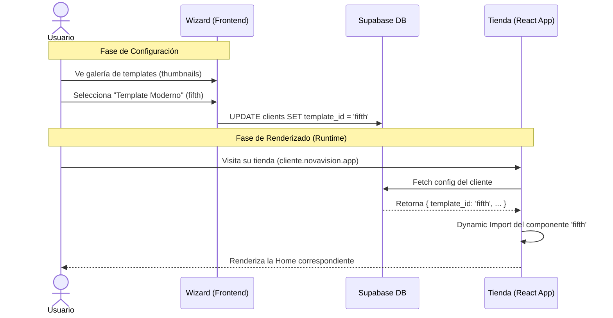

# Flujo de Templates y Publicación

**Autor:** Elias Piscitelli  
**Fecha:** 2025-11-27  
**Referencia:** [Arquitectura Onboarding Automatizado](arquitectura-onboarding-automatizado.md)

Este documento detalla específicamente cómo funciona el sistema de templates, cómo el usuario elige su diseño y el proceso técnico de publicación (deploy).

---

## 1. Estado Actual de los Templates

Actualmente, en `apps/web/src/templates`, existen 5 carpetas con diseños de Home:

- `first`
- `second`
- `third` (typo de third)
- `fourth`
- `fifth`

**Limitación Actual:**
La selección del template está **hardcodeada** en el código (`apps/web/src/routes/AppRoutes.jsx`). Para cambiar el diseño, un desarrollador debe descomentar manualmente la línea del import deseado:

```javascript
// apps/web/src/routes/AppRoutes.jsx
import Home from "../templates/fifth/pages/Home"; // <--- Hardcoded
// import HomePage from "../templates/first/pages/HomePageFirst";
```

Esto significa que hoy **todos los clientes ven el mismo template** (el "fifth").

---

## 2. Nuevo Flujo de Selección y Publicación

El objetivo es que el usuario elija su template visualmente y el sistema lo renderice dinámicamente sin tocar código.

### 2.1 Diagrama de Flujo



---

## 3. Detalle Paso a Paso

### Paso 1: El Catálogo de Templates (Wizard)

En el Wizard de Onboarding (Fase 3 del plan general), se mostrará una grilla con previsualizaciones.

**Acción del Usuario:**

1. Navega a la sección "Diseño".
2. Ve 5 tarjetas, cada una representando una carpeta de `src/templates`.
3. Clic en "Seleccionar" o "Vista Previa".

**Acción del Sistema:**

- Guarda el string identificador (`first`, `second`, etc.) en la columna `template_id` de la tabla `clients`.

### Paso 2: Renderizado Dinámico (La Magia Técnica)

Para que esto funcione sin deploys individuales por cambio de diseño, usaremos **Lazy Loading** y un mapa de componentes en el Frontend.

**Cómo implementarlo en `apps/web`:**

1. **Crear un registro de templates (`src/templates/index.js`):**

```javascript
import { lazy } from "react";

export const TEMPLATES = {
  first: lazy(() => import("./first/pages/HomePageFirst")),
  second: lazy(() => import("./second/pages/HomePage")),
  third: lazy(() => import("./third/pages/HomePageFirst")), // Nota el typo original
  fourth: lazy(() => import("./fourth/pages/Home")),
  fifth: lazy(() => import("./fifth/pages/Home")),
};
```

2. **Componente Renderizador (`src/components/TemplateRenderer.jsx`):**

```javascript
import React, { Suspense } from "react";
import { TEMPLATES } from "../templates";

export const TemplateRenderer = ({ templateId, homeData }) => {
  // Fallback al default si el ID no existe
  const SelectedHome = TEMPLATES[templateId] || TEMPLATES.fifth;

  return (
    <Suspense fallback={<div>Cargando diseño...</div>}>
      <SelectedHome homeData={homeData} />
    </Suspense>
  );
};
```

3. **Actualizar Rutas (`src/routes/AppRoutes.jsx`):**

```javascript
// En lugar de importar Home directamente:
import { TemplateRenderer } from "../components/TemplateRenderer";
import { useTenant } from "../context/TenantContext"; // Contexto con config del cliente

const AppRoutes = ({ homeData }) => {
  const { tenantConfig } = useTenant(); // Obtiene config desde DB

  return (
    <Routes>
      <Route
        path="/"
        element={
          <TemplateRenderer
            templateId={tenantConfig?.template_id}
            homeData={homeData}
          />
        }
      />
      {/* Resto de rutas iguales (Search, Cart, etc.) */}
    </Routes>
  );
};
```

### Paso 3: Publicación (Deploy)

Con la estrategia **Single-Site** (recomendada en el documento de arquitectura), el proceso de "publicación" es instantáneo.

1. **No hay build nuevo:** El código de TODOS los templates ya está en el bundle de la aplicación (o se descarga bajo demanda con lazy loading).
2. **Cambio inmediato:** En cuanto el usuario guarda su elección en la DB, la próxima vez que alguien cargue su tienda, el `TemplateRenderer` leerá el nuevo ID y mostrará el nuevo diseño.

**¿Qué pasa con Netlify?**

- Netlify solo sirve los archivos estáticos.
- No necesita enterarse de qué template usa cada cliente.
- Solo se hace deploy cuando VOS (el desarrollador) subís cambios al código (ej. arreglar un bug en el carrito).

---

## 4. Personalización del Template

Además de elegir la estructura (el template), el usuario necesita cambiar colores, logo y textos.

**Flujo de Datos:**

1. **Wizard:** Usuario sube logo y elige color primario.
2. **DB:** Se guarda en `clients.theme_config` (JSONB).
   ```json
   {
     "primaryColor": "#ff0000",
     "fontFamily": "Inter",
     "logoUrl": "..."
   }
   ```
3. **Frontend (`App.jsx`):**
   - Al cargar, lee `theme_config`.
   - Inyecta variables CSS o usa `ThemeProvider` de styled-components.

```javascript
// Ejemplo de inyección de tema
const theme = {
  ...baseTheme,
  colors: {
    primary: tenantConfig.theme_config.primaryColor || "#000",
  },
};

<ThemeProvider theme={theme}>
  <App />
</ThemeProvider>;
```

---

## 5. Resumen de Tareas para Implementar Esto

1. **Backend:**

   - [ ] Agregar columna `template_id` (text) a tabla `clients`.
   - [ ] Agregar columna `theme_config` (jsonb) a tabla `clients`.

2. **Frontend (Template Web):**

   - [ ] Crear archivo índice de templates (`src/templates/index.js`).
   - [ ] Crear componente `TemplateRenderer`.
   - [ ] Refactorizar `AppRoutes` para usar el renderer dinámico.
   - [ ] Implementar `TenantContext` para leer la config al inicio.

3. **Frontend (Wizard/Admin):**
   - [ ] Crear paso de "Selección de Diseño" en el wizard.
   - [ ] Mostrar grid de opciones.
   - [ ] Guardar selección en DB.

---

## 6. Preguntas Frecuentes

**P: ¿Si agrego un template nuevo (sixth), tengo que redeployar todo?**
R: Sí. Como es código nuevo, tenés que hacer un deploy del proyecto `apps/web`. Una vez deployado, la opción aparecerá disponible para que los usuarios la elijan (si actualizás el wizard también).

**P: ¿Puedo cobrar más por ciertos templates?**
R: Sí. En el wizard podés bloquear templates según el `plan` del cliente (Basic vs Premium). El `TemplateRenderer` podría validar esto también por seguridad.

**P: ¿Las páginas de Carrito y Search cambian?**
R: Por defecto no, son compartidas. Si quisieras que cambien drásticamente, tendrías que moverlas también dentro de la estructura de carpetas del template o parametrizar sus estilos vía `theme_config`.
