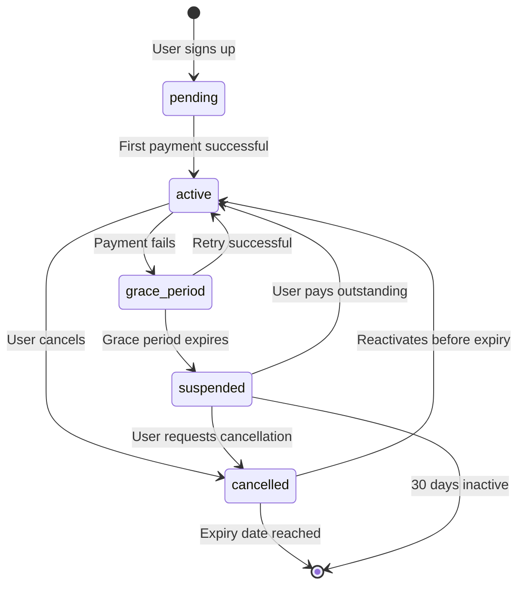

# Payment Failure & Cancellation Flows

## Overview

Manejo completo de failures de pago y cancelaciones de usuarios, con reintentos automáticos, períodos de gracia, suspensión automática, y reactivación.

---

## Payment Failure Flow

### 1. Webhook: Payment Failed

Cuando MercadoPago notifica que un pago falló:

```typescript
@Injectable()
export class SubscriptionsService {
  /**
   * Handle payment failure from webhook
   */
  async handlePaymentFailed(mpPaymentId: string, preapprovalId: string) {
    const adminClient = this.dbRouter.getAdminClient();

    // 1. Get subscription
    const { data: subscription } = await adminClient
      .from("subscriptions")
      .select("*, nv_accounts(email, slug)")
      .eq("mp_preapproval_id", preapprovalId)
      .single();

    if (!subscription) {
      this.logger.warn(
        `Subscription not found for preapproval: ${preapprovalId}`
      );
      return;
    }

    // 2. Get payment details from MP
    const payment = await this.platformMp.getPayment(mpPaymentId);

    // 3. Record failure
    const { data: failure } = await adminClient
      .from("subscription_payment_failures")
      .insert({
        subscription_id: subscription.id,
        attempted_at: new Date().toISOString(),
        attempted_amount_ars: payment.transaction_amount,
        mp_payment_id: mpPaymentId,
        failure_reason: payment.status_detail,
        mp_status: payment.status,
        retry_count: 0,
        next_retry_at: this.calculateNextRetry(0), // 3 days
      })
      .select()
      .single();

    // 4. Update subscription
    const consecutiveFailures = (subscription.consecutive_failures || 0) + 1;
    const gracePeriodDays = this.config.get<number>("GRACE_PERIOD_DAYS") || 7;
    const gracePeriodEnds = new Date();
    gracePeriodEnds.setDate(gracePeriodEnds.getDate() + gracePeriodDays);

    await adminClient
      .from("subscriptions")
      .update({
        consecutive_failures: consecutiveFailures,
        last_failure_at: new Date().toISOString(),
        grace_period_ends_at: gracePeriodEnds.toISOString(),
        auto_suspend_at: gracePeriodEnds.toISOString(),
        status: consecutiveFailures >= 3 ? "grace_period" : subscription.status,
      })
      .eq("id", subscription.id);

    // 5. Notify user
    await this.notifications.sendPaymentFailedNotification({
      email: subscription.nv_accounts.email,
      slug: subscription.nv_accounts.slug,
      failureReason: this.translateFailureReason(payment.status_detail),
      amount: payment.transaction_amount,
      retryDate: failure.next_retry_at,
      gracePeriodEnds: gracePeriodEnds,
      consecutiveFailures,
    });

    this.logger.log(
      `Payment failed for subscription ${subscription.id}: ${payment.status_detail}`
    );
  }

  /**
   * Calculate next retry date (exponential backoff)
   */
  private calculateNextRetry(retryCount: number): string {
    const daysToWait = [3, 5, 7][retryCount] || 7; // 3, 5, 7 days
    const nextRetry = new Date();
    nextRetry.setDate(nextRetry.getDate() + daysToWait);
    return nextRetry.toISOString();
  }

  /**
   * Translate MP failure codes to user-friendly messages
   */
  private translateFailureReason(statusDetail: string): string {
    const reasons = {
      cc_rejected_insufficient_amount: "Fondos insuficientes",
      cc_rejected_bad_filled_security_code: "Código de seguridad incorrecto",
      cc_rejected_call_for_authorize: "Rechazado - Contactá a tu banco",
      cc_rejected_card_disabled: "Tarjeta deshabilitada",
      cc_rejected_insufficient_balance: "Saldo insuficiente",
      cc_rejected_high_risk: "Rechazado por seguridad",
    };
    return reasons[statusDetail] || "Error al procesar el pago";
  }
}
```

---

### 2. Automatic Retries

Cron job que intenta cobrar de nuevo:

```typescript
@Cron('0 3 * * *') // 3 AM daily
async retryFailedPayments() {
  const adminClient = this.dbRouter.getAdminClient();

  // Get failures ready for retry
  const now = new Date();
  const { data: failures } = await adminClient
    .from('subscription_payment_failures')
    .select('*, subscriptions(*, nv_accounts(email))')
    .is('resolved_at', null)
    .lte('next_retry_at', now.toISOString())
    .lt('retry_count', 3); // Max 3 retries

  for (const failure of failures || []) {
    try {
      const sub = failure.subscriptions;

      // Get current price
      const currentRate = await this.getBlueDollarRate();
      const amountArs = Math.ceil(sub.plan_price_usd * currentRate);

      // Attempt manual charge via MP
      const payment = await this.platformMp.createManualCharge({
        preapproval_id: sub.mp_preapproval_id,
        amount: amountArs,
        reason: `Reintento de pago - NovaVision ${sub.plan_key}`,
      });

      if (payment.status === 'approved') {
        // Success!
        await this.handlePaymentSuccess(payment.id, sub.mp_preapproval_id);

        // Mark failure as resolved
        await adminClient
          .from('subscription_payment_failures')
          .update({
            resolved_at: new Date().toISOString(),
            resolution_type: 'retry_success',
          })
          .eq('id', failure.id);

        this.logger.log(`Retry successful for subscription ${sub.id}`);
      } else {
        //Retry failed
        const newRetryCount = failure.retry_count + 1;

        await adminClient
          .from('subscription_payment_failures')
          .update({
            retry_count: newRetryCount,
            next_retry_at: newRetryCount < 3 ? this.calculateNextRetry(newRetryCount) : null,
          })
          .eq('id', failure.id);

        // If max retries reached, suspend
        if (newRetryCount >= 3) {
          await this.suspendSubscription(sub.id, 'max_payment_retries');
        }
      }
    } catch (error) {
      this.logger.error(`Error retrying payment for failure ${failure.id}:`, error);
    }
  }
}
```

---

### 3. Grace Period & Auto-Suspension

Suspender automáticamente después del período de gracia:

```typescript
@Cron('0 4 * * *') // 4 AM daily
async checkGracePeriods() {
  const adminClient = this.dbRouter.getAdminClient();
  const now = new Date();

  // Get subscriptions with expired grace period
  const { data: subscriptions } = await adminClient
    .from('subscriptions')
    .select('*, nv_accounts(email, slug)')
    .eq('status', 'grace_period')
    .lte('grace_period_ends_at', now.toISOString());

  for (const sub of subscriptions || []) {
    await this.suspendSubscription(sub.id, 'grace_period_expired');

    // Notify user
    await this.notifications.sendSubscriptionSuspendedNotification({
      email: sub.nv_accounts.email,
      slug: sub.nv_accounts.slug,
      suspensionReason: 'Período de gracia expirado',
      outstandingAmount: sub.last_charged_ars,
    });
  }
}

private async suspendSubscription(subscriptionId: string, reason: string) {
  const adminClient = this.dbRouter.getAdminClient();

  const { data: sub } = await adminClient
    .from('subscriptions')
    .select('mp_preapproval_id, account_id')
    .eq('id', subscriptionId)
    .single();

  // Pause in MP (don't cancel, allow reactivation)
  await this.platformMp.pauseSubscription(sub.mp_preapproval_id);

  // Update DB
  await adminClient
    .from('subscriptions')
    .update({
      status: 'suspended',
      updated_at: new Date().toISOString(),
    })
    .eq('id', subscriptionId);

  // Update account status
  await adminClient
    .from('nv_accounts')
    .update({
      subscription_status: 'suspended',
      status: 'suspended', // This might disable their store access
    })
    .eq('id', sub.account_id);

  this.logger.log(`Subscription ${subscriptionId} suspended: ${reason}`);
}
```

---

## User-Initiated Cancellation Flow

### 1. Cancel Endpoint

```typescript
@Injectable()
export class SubscriptionsController {
  @UseGuards(AuthGuard)
  @Post("cancel")
  async cancelSubscription(@Req() req, @Body() body: { reason?: string }) {
    const accountId = req.account_id;

    return await this.subscriptionsService.cancelUserSubscription(
      accountId,
      body.reason || "user_requested"
    );
  }
}
```

---

### 2. Cancellation Service

```typescript
async cancelUserSubscription(accountId: string, reason: string) {
  const adminClient = this.dbRouter.getAdminClient();

  // 1. Get subscription
  const { data: sub } = await adminClient
    .from('subscriptions')
    .select('*, nv_accounts(email, slug)')
    .eq('account_id', accountId)
    .eq('status', 'active')
    .single();

  if (!sub) {
    throw new NotFoundException('No active subscription found');
  }

  // 2. Cancel in MP
  await this.platformMp.cancelSubscription(sub.mp_preapproval_id);

  // 3. Calculate end date (end of current billing period)
  const endDate = sub.next_payment_date || new Date();

  // 4. Update DB
  await adminClient
    .from('subscriptions')
    .update({
      status: 'cancelled',
      cancelled_at: new Date().toISOString(),
      cancellation_reason: reason,
      subscription_expires_at: endDate,
    })
    .eq('id', sub.id);

  // 5. Update account
  await adminClient
    .from('nv_accounts')
    .update({
      subscription_status: 'cancelled',
      subscription_expires_at: endDate,
    })
    .eq('id', accountId);

  // 6. Notify user
  await this.notifications.sendCancellationConfirmation({
    email: sub.nv_accounts.email,
    slug: sub.nv_accounts.slug,
    endDate,
  });

  return {
    message: 'Subscription cancelled successfully',
    access_until: endDate,
  };
}
```

---

## Reactivation Flow

Usuario quiere reactivar después de suspensión o cancelación:

```typescript
@Post('reactivate')
@UseGuards(AuthGuard)
async reactivateSubscription(@Req() req) {
  const accountId = req.account_id;

  return await this.subscriptionsService.reactivateSubscription(accountId);
}

// In service
async reactivateSubscription(accountId: string) {
  const adminClient = this.dbRouter.getAdminClient();

  // 1. Get subscription
  const { data: sub } = await adminClient
    .from('subscriptions')
    .select('*')
    .eq('account_id', accountId)
    .in('status', ['suspended', 'cancelled'])
    .single();

  if (!sub) {
    throw new NotFoundException('No subscription to reactivate');
  }

  // 2. Check for outstanding payments
  const { data: failures } = await adminClient
    .from('subscription_payment_failures')
    .select('*')
    .eq('subscription_id', sub.id)
    .is('resolved_at', null);

  if (failures && failures.length > 0) {
    // User must pay outstanding amount first
    const totalOwed = failures.reduce((sum, f) => sum + Number(f.attempted_amount_ars), 0);

    // Create one-time payment link
    const payment = await this.platformMp.createOneTimePayment({
      amount: totalOwed,
      description: `Pago pendiente - NovaVision`,
      external_reference: `reactivation_${sub.id}_${Date.now()}`,
    });

    return {
      message: 'Payment required to reactivate',
      amount_owed: totalOwed,
      payment_link: payment.init_point,
    };
  }

  // 3. No outstanding payments - reactivate immediately
  await this.platformMp.resumeSubscription(sub.mp_preapproval_id);

  const nextPayment = new Date();
  nextPayment.setDate(nextPayment.getDate() + 30);

  await adminClient
    .from('subscriptions')
    .update({
      status: 'active',
      consecutive_failures: 0,
      grace_period_ends_at: null,
      auto_suspend_at: null,
      next_payment_date: nextPayment.toISOString(),
    })
    .eq('id', sub.id);

  await adminClient
    .from('nv_accounts')
    .update({
      subscription_status: 'active',
      status: 'active',
    })
    .eq('id', accountId);

  return {
    message: 'Subscription reactivated successfully',
    next_payment_date: nextPayment,
  };
}
```

---

## Email Templates

### Payment Failed

```typescript
async sendPaymentFailedNotification(data: {
  email: string;
  slug: string;
  failureReason: string;
  amount: number;
  retryDate: string;
  gracePeriodEnds: Date;
  consecutiveFailures: number;
}) {
  const template = `
Hola,

No pudimos procesar el pago de tu suscripción de NovaVision (${data.slug}).

━━━━━━━━━━━━━━━━━━━━━━━━━━
Detalles del problema:
• Motivo: ${data.failureReason}
• Monto: $${data.amount.toLocaleString('es-AR')} ARS
• Próximo reintento: ${new Date(data.retryDate).toLocaleDateString('es-AR')}
━━━━━━━━━━━━━━━━━━━━━━━━━━

${data.consecutiveFailures >= 2 ? `
⚠️ ATENCIÓN: Este es tu ${data.consecutiveFailures}º pago fallido.
Tu suscripción será suspendida el ${data.gracePeriodEnds.toLocaleDateString('es-AR')} si no resolvemos el problema.
` : ''}

Podés:
1. Esperar al reintento automático
2. Actualizar tu medio de pago desde tu panel
3. Realizar un pago manual

Panel de control: ${process.env.ADMIN_URL}/dashboard

Saludos,
Equipo NovaVision
  `;

  await this.sendEmail({
    to: data.email,
    subject: `⚠️ Problema con el pago - NovaVision ${data.slug}`,
    text: template,
  });
}
```

### Suspension

```typescript
async sendSubscriptionSuspendedNotification(data: {
  email: string;
  slug: string;
  suspensionReason: string;
  outstandingAmount: number;
}) {
  const template = `
Hola,

Tu suscripción de NovaVision (${data.slug}) ha sido suspendida.

Motivo: ${data.suspensionReason}

${data.outstandingAmount ? `
Monto pendiente: $${data.outstandingAmount.toLocaleString('es-AR')} ARS
` : ''}

Para reactivar tu servicio:
1. Ingresá a ${process.env.ADMIN_URL}/dashboard
2. Actualizá tu método de pago
3. Realizá el pago pendiente
4. Tu servicio se reactivará automáticamente

¿Necesitás ayuda? Respondé este email.

Saludos,
Equipo NovaVision
  `;

  await this.sendEmail({
    to: data.email,
    subject: `🚫 Suscripción suspendida - NovaVision ${data.slug}`,
    text: template,
  });
}
```

### Cancellation Confirmation

```typescript
async sendCancellationConfirmation(data: {
  email: string;
  slug: string;
  endDate: string;
}) {
  const template = `
Hola,

Confirmamos la cancelación de tu suscripción de NovaVision (${data.slug}).

Tu servicio permanecerá activo hasta: ${new Date(data.endDate).toLocaleDateString('es-AR')}

Después de esta fecha:
• Tu tienda dejará de estar accesible
• Tus datos se conservarán por 30 días
• Podés reactivar tu suscripción cuando quieras

¿Cambiaste de opinión? Podés reactivar desde tu panel.

Gracias por haber confiado en NovaVision.

Saludos,
Equipo NovaVision
  `;

  await this.sendEmail({
    to: data.email,
    subject: `Cancelación confirmada - NovaVision ${data.slug}`,
    text: template,
  });
}
```

---

## Configuration

Add to `.env`:

```bash
# Payment Failure Handling
GRACE_PERIOD_DAYS=7          # Days before auto-suspension after failure
MAX_PAYMENT_RETRIES=3        # Max automatic retry attempts
RETRY_SCHEDULE=3,5,7         # Days between retries (comma-separated)
```

---

## Status Transitions



---

## Database Queries

### Check failing subscriptions

```sql
SELECT
  s.id,
  a.slug,
  a.email,
  s.consecutive_failures,
  s.grace_period_ends_at,
  COUNT(f.id) as total_failures
FROM subscriptions s
JOIN nv_accounts a ON a.id = s.account_id
LEFT JOIN subscription_payment_failures f ON f.subscription_id = s.id
WHERE s.status IN ('grace_period', 'suspended')
GROUP BY s.id, a.slug, a.email, s.consecutive_failures, s.grace_period_ends_at
ORDER BY s.consecutive_failures DESC;
```

### Check pending retries

```sql
SELECT
  f.*,
  s.plan_key,
  a.email
FROM subscription_payment_failures f
JOIN subscriptions s ON s.id = f.subscription_id
JOIN nv_accounts a ON a.id = s.account_id
WHERE f.resolved_at IS NULL
  AND f.retry_count < 3
  AND f.next_retry_at <= NOW()
ORDER BY f.next_retry_at ASC;
```
