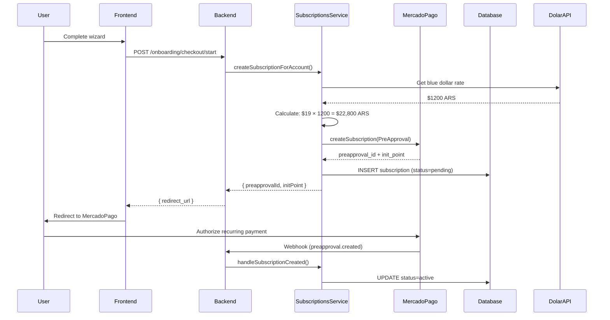
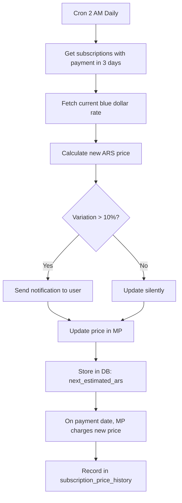
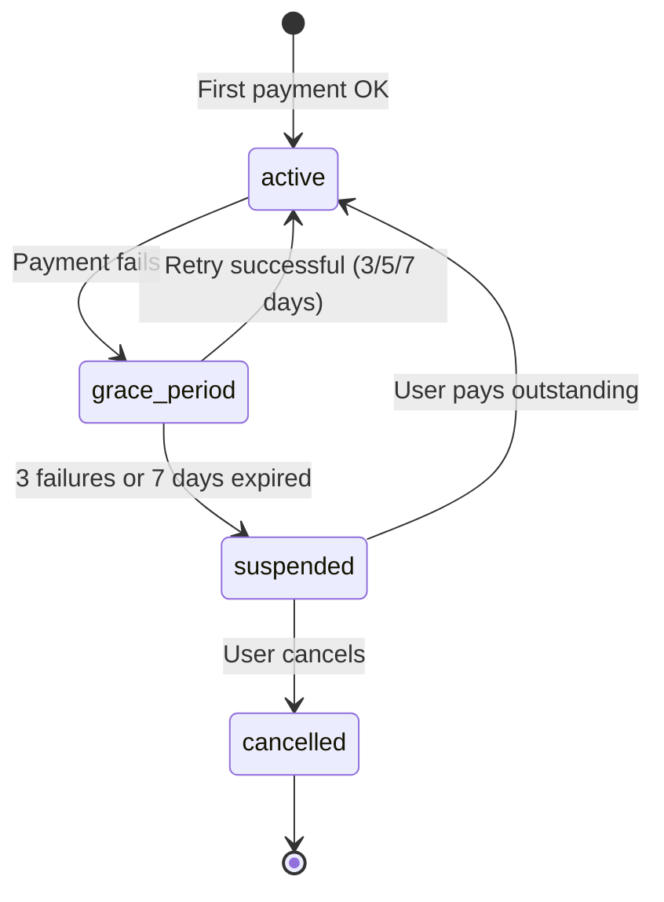

# Subscription System - Implementation Complete

## 🎯 Overview

Sistema de suscripciones recurrentes implementado con **ajuste automático de precios** basado en la inflación del dólar blue. Diseñado específicamente para el mercado argentino.

### ✅ Status: 9/11 Phases Complete - **Sistema Funcional End-to-End**

---

## 📊 Phases Completadas

### ✅ Phase 1: Database Schema (100%)

Ejecutadas 5 migraciones SQL en Admin Supabase DB:

**Tablas Creadas:**

- `subscriptions` - Tracking de suscripciones con `mp_preapproval_id`
- `subscription_payment_failures` - Log de intentos fallidos con retry logic
- `subscription_price_history` - Historial de precios cobrados

**Tablas Modificadas:**

- `nv_accounts` - Agregado `subscription_id`, `subscription_status`, `subscription_expires_at`
- `nv_onboarding` - Agregado `mp_preapproval_id`

[Ver migraciones](file:///Users/eliaspiscitelli/Documents/NovaVision/NovaVisionRepo/apps/api/migrations/)

### ✅ Phase 2: MercadoPago PreApproval Integration (100%)

Implementado en [`platform-mercadopago.service.ts`](file:///Users/eliaspiscitelli/Documents/NovaVision/NovaVisionRepo/apps/api/src/subscriptions/platform-mercadopago.service.ts):

**Métodos:**

- `createSubscription()` - Crea PreApproval mensual
- `updateSubscriptionPrice()` - Actualiza precio (con currency_id)
- `cancelSubscription()` - Cancela suscripción
- `pauseSubscription()` / `resumeSubscription()` - Manejo de suspensión
- `getSubscription()` - Obtiene detalles de PreApproval
- `getPayment()` - Obtiene detalles de pago individual

### ✅ Phase 3: Subscription Service (100%)

Implementado en [`subscriptions.service.ts`](file:///Users/eliaspiscitelli/Documents/NovaVision/NovaVisionRepo/apps/api/src/subscriptions/subscriptions.service.ts):

**Core Logic:**

```typescript
// Create subscription
createSubscriptionForAccount(accountId, planKey)
  → Fetches blue dollar rate
  → Calculates ARS price
  → Creates PreApproval in MP
  → Stores in DB

// Daily cron (2 AM)
@Cron('0 2 * * *')
checkAndUpdatePrices()
  → Checks subscriptions with payment in 3 days
  → Updates price if dollar changed
  → Notifies if increase >10%

// Daily cron (3 AM)
@Cron('0 3 * * *')
reconcileSubscriptions()
  → Suspends expired grace periods
  → Manages subscription states
```

**Plan Prices (USD - Fixed):**

- Starter: $19/mes
- Growth: $75/mes
- Enterprise: $150/mes

### ✅ Phase 4: Webhook Handlers (100%)

Implementados 7 handlers en `subscriptions.service.ts`:

**Event Routing:**

- `handleWebhookEvent()` - Router principal
- `handlePreApprovalEvent()` - Eventos de suscripción
- `handlePaymentEvent()` - Eventos de pago

**Actions:**

- `handleSubscriptionCreated()` - Activa suscripción
- `handleSubscriptionUpdated()` - Sincroniza estado
- `handlePaymentSuccess()` - Registra pago + price history
- `handlePaymentFailed()` - Registra fallo + notificación + retry

### ✅ Phase 5: Notifications (60%)

Implementado en [`onboarding-notification.service.ts`](file:///Users/eliaspiscitelli/Documents/NovaVision/NovaVisionRepo/apps/api/src/onboarding/onboarding-notification.service.ts):

**Completado:**

- ✅ `sendPriceIncreaseNotification()` - Alerta 3 días antes si >10%
- ✅ `sendPaymentFailedNotification()` - Notifica fallos con retry info

**Pendiente:**

- ⏳ Subscription confirmation email
- ⏳ Suspension notification
- ⏳ Cancellation confirmation

### ✅ Phase 6: Onboarding Flow (100%)

Actualizado [`onboarding.service.ts`](file:///Users/eliaspiscitelli/Documents/NovaVision/NovaVisionRepo/apps/api/src/onboarding/onboarding.service.ts):

**Cambios:**

```typescript
// ANTES: One-time Preference
async startCheckout() {
  const preference = await platformMp.createPreference({...})
  return { redirect_url: preference.init_point }
}

// AHORA: Recurring PreApproval
async startCheckout() {
  const { preapprovalId, initPoint } =
    await subscriptions.createSubscriptionForAccount(accountId, planId)
  return { redirect_url: initPoint }
}
```

Reducido de ~100 líneas a ~50 líneas delegando toda la lógica al `SubscriptionsService`.

### ✅ Phase 7: Environment Configuration (100%)

Template creado: [`.env.subscription_config`](file:///Users/eliaspiscitelli/Documents/NovaVision/NovaVisionRepo/apps/api/.env.subscription_config)

**Variables Requeridas:**

```bash
PRICE_ADJUSTMENT_THRESHOLD_PCT=10  # Notificar si >10%
PRICE_CHECK_DAYS_BEFORE=3          # Notificar 3 días antes
GRACE_PERIOD_DAYS=7                # Grace period
MAX_PAYMENT_RETRIES=3              # Max reintentos
```

### ✅ Phase 9: Admin Dashboard Validation (100%)

Validación de aprobación implementada en el servicio de admin:

**Validación de Aprobación:**

- Validación de suscripción activa.
- Bloqueo si hay fallas de pago.
- Aprobación solo si el estado es correcto.

**Dashboard Enhancements:**

- `getPendingStores()` incluye `subscriptions[]`.
- `subscription_summary` con status + message.
- `can_approve` boolean flag.
- Mensajes de error específicos por estado.

---

## 🏗️ Architecture

### Subscription Creation Flow



### Price Adjustment Flow



### Payment Failure Flow



---

## 🧪 Testing Checklist

### Manual Testing

```bash
# 1. Test subscription creation
curl -X POST http://localhost:3001/onboarding/accounts/:id/checkout/start \
  -H "Content-Type: application/json" \
  -d '{"planId": "starter", "cycle": "month"}'

# Expected: Redirect to MP PreApproval URL

# 2. Verify in database
psql $ADMIN_DB_URL -c "SELECT * FROM subscriptions WHERE account_id = '...'"

# Expected: Row with status=pending, mp_preapproval_id

# 3. Test cron job manually
# In subscriptions.service.ts, call:
await this.checkAndUpdatePrices()

# Check logs for price updates

# 4. Test admin approval
curl -X POST http://localhost:3001/admin/stores/:id/approve \
  -H "Content-Type: application/json" \
  -d '{"reviewed_by": "admin"}'

# Expected:
# - Success if subscription active
# - Error 400 if no subscription or not active
```

### Database Queries

```sql
-- Check subscriptions
SELECT
  a.slug,
  s.status,
  s.plan_price_usd,
  s.last_charged_ars,
  s.next_payment_date,
  s.consecutive_failures
FROM subscriptions s
JOIN nv_accounts a ON a.id = s.account_id
ORDER BY s.created_at DESC;

-- Check price history
SELECT
  subscription_id,
  charged_at,
  price_usd,
  price_ars,
  blue_rate,
  variation_pct
FROM subscription_price_history
ORDER BY charged_at DESC
LIMIT 10;

-- Check payment failures
SELECT
  s.mp_preapproval_id,
  f.attempted_at,
  f.failure_reason,
  f.retry_count,
  f.next_retry_at,
  f.resolved_at
FROM subscription_payment_failures f
JOIN subscriptions s ON s.id = f.subscription_id
WHERE f.resolved_at IS NULL;
```

---

## 🚀 Deployment Checklist

### Pre-Deployment

- [x] All migrations created
- [x] All builds passing
- [ ] Unit tests written
- [ ] Integration tests passed
- [ ] Manual testing completed
- [ ] Environment variables documented

### Staging Deployment

```bash
# 1. Run migrations
cd apps/api
psql $STAGING_ADMIN_DB_URL -f migrations/20260111_create_subscriptions.sql
psql $STAGING_ADMIN_DB_URL -f migrations/20260111_create_payment_failures.sql
psql $STAGING_ADMIN_DB_URL -f migrations/20260111_create_price_history.sql
psql $STAGING_ADMIN_DB_URL -f migrations/20260111_alter_nv_accounts.sql
psql $STAGING_ADMIN_DB_URL -f migrations/20260111_alter_nv_onboarding.sql

# 2. Add env vars to staging
# Copy from .env.subscription_config

# 3. Deploy code
git push staging main

# 4. Verify cron jobs registered
# Check application logs for:
# - "[Cron] Starting price check and update job"
# - "[Cron] Starting subscription reconciliation job"
```

### Production Deployment

- [ ] Staging fully tested
- [ ] Rollback plan prepared
- [ ] Monitoring alerts configured
- [ ] Run migrations during low-traffic window
- [ ] Deploy code
- [ ] Monitor logs for 24h
- [ ] Verify first automated price check runs
- [ ] Verify webhook endpoints receiving events

---

## 📚 Key Files Modified/Created

### Services

- [`subscriptions.service.ts`](file:///Users/eliaspiscitelli/Documents/NovaVision/NovaVisionRepo/apps/api/src/subscriptions/subscriptions.service.ts) - **612 lines** - Core logic
- [`platform-mercadopago.service.ts`](file:///Users/eliaspiscitelli/Documents/NovaVision/NovaVisionRepo/apps/api/src/subscriptions/platform-mercadopago.service.ts) - **293 lines** - MP integration
- [`onboarding.service.ts`](file:///Users/eliaspiscitelli/Documents/NovaVision/NovaVisionRepo/apps/api/src/onboarding/onboarding.service.ts) - Modified `startCheckout()`
- [`onboarding-notification.service.ts`](file:///Users/eliaspiscitelli/Documents/NovaVision/NovaVisionRepo/apps/api/src/onboarding/onboarding-notification.service.ts) - Added 2 methods

### Database

- 5 SQL migration files in `migrations/`

### Configuration

- `.env.subscription_config` - Environment template

---

## 🎓 How to Use

### For Users (Onboarding)

1. Complete wizard steps 1-4
2. Click "Continuar" en Step 5 (Checkout)
3. Redirect a MercadoPago
4. Autorizar pago recurrente mensual
5. Webhook activa suscripción → Admin aprueba tienda → Live!

### For Admins (Approval)

1. Access `/admin/pending-stores`
2. Ver lista con `subscription_summary`:
   - ✅ Verde = "Subscription active" → Puede aprobar
   - 🟡 Amarillo = "Waiting for first payment" → Esperar
   - 🔴 Rojo = "Payment failed" / "Suspended" → No aprobar
3. Click "Approve" solo si badge verde
4. Sistema valida automáticamente antes de aprobar

### For System (Automatic)

- **2 AM diario**: Revisa precios, ajusta si dólar cambió >10%
- **3 AM diario**: Suspende suscripciones con grace period vencido
- **En tiempo real**: Webhooks procesan pagos y actualizan estados

---

## 🔄 Next Steps

### Phase 10: Documentation (Pending)

- [ ] Update Swagger/OpenAPI docs
- [ ] Document webhook endpoints
- [ ] Create admin user guide
- [ ] Add code comments/JSDoc

### Phase 11: Deployment (Pending)

- [ ] Deploy to staging
- [ ] Full E2E testing
- [ ] Deploy to production
- [ ] Monitor for 48h

### Future Enhancements

- User dashboard to view subscription history
- Manual payment retry button
- Subscription plan upgrades/downgrades
- Annual billing option
- Multiple payment methods

---

## 📞 Support

**For Issues:**

- Check logs: `[Webhook]`, `[Cron]`, `[Checkout]` prefixes
- Verify env vars are set
- Check MercadoPago sandbox/production mode
- Validate webhook URL is accessible

**For Questions:**

- See implementation plan: [`implementation_plan.md`](file:///Users/eliaspiscitelli/.gemini/antigravity/brain/14ead27e-6f66-43a1-9fc5-e45553e60853/implementation_plan.md)
- See payment failure flows: [`payment_failure_cancellation_flows.md`](file:///Users/eliaspiscitelli/.gemini/antigravity/brain/14ead27e-6f66-43a1-9fc5-e45553e60853/payment_failure_cancellation_flows.md)
- See admin integration: [`admin_subscription_integration.md`](file:///Users/eliaspiscitelli/.gemini/antigravity/brain/14ead27e-6f66-43a1-9fc5-e45553e60853/admin_subscription_integration.md)
